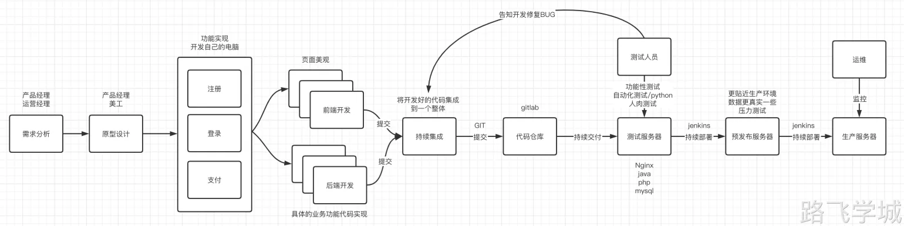

---
tags:
  - CICD/概念
---
- $ 开发流程

项目立项-->需求调研-->需求拆解-->交给不同的开发进行开发-->测试环境测试-->预发布环境-->部署生产环境。

- $ 环境解释

DEV （Development ） 开发环境：
一般开发环境是指开发人员自己的电脑环境，不同语言不通的环境，比如python,go,php,java等。

SIT（System Integration Testing ）系统集成测试环境：
在这个环境中，不同开发人员开发的代码将被整合，所有模块都会被整合起来进行测试，确保不同功能之间没有冲突。

TEST （Test）测试环境
代码整合完毕后，将会首先发布到测试环境进行功能测试，这个环境下的配置比较精简，因为主要是内部开发人员进行功能验证，而不是面向用户的功能测试。

UAT （User Acceptance Testing ）用户验收测试环境/预发布环境：
比测试环境更贴近生产环境，数据更接近真实环境，与生产环境的域名不同，主要用于最终上线前的功能验收和压力测试。

PRE（Pre Deployment） 灰度环境：
指的是新旧两个版本同时对用户提供服务，但是新版本的流量比较小，如果有问题可以将危害控制的比较小，如果灰度验证没问题，再逐步将更多的流量转给新版本，最后完全所有流量都转发到新版本。

PROD 生产环境：
真正面向用户的线上环境，一般只有运维有权限进行代码的部署和维护，其他人员一般没有权限。

- $ 手动部署的问题

1.上传方式不方便，scp rsync rz ftp等
2.手动部署效率低下，占用大量时间
3.如果服务器多，上线速度慢
4.手动部署容易误操作，不能保证准确率
5.出问题不好回滚，手忙脚乱

- $ 自动部署的优势

持续集成

1.开发的代码持续的集成到代码仓库里就是持续集成，不用等所有人都开发完毕在合并，可以多个开发人员同时工作。
2.开发将代码提交到代码仓库，由ci服务器自动将代码拉下来进行编译，测试，然后将结果返回给开发人员。
3.持续集成的目的是可以频繁的将开发的功能进行合并，提高工作效率。

持续交付

1.持续交付就是将编译开发好的代码持续的交付到测试环境进行测试。
2.在预发布环境我们可以对代码进行质量扫描和漏洞扫描，并且将测试结果返回给测试人员。
3.如果测试的代码有问题，测试人员就通知开发人员进行修复，如果没有问题则进入下一个部署环节。

持续部署

1.代码测试没有问题之后就可以进入预发布环境进行进一步测试，如果预发布环境也没有问题可以通过jenkins服务器持续的部署到生产服务器
2.如果新部署的服务发现有问题，通过jenkins服务器可以快速的回滚到正常的代码。

