---
tags:
  - CICD/Jenkins
---

> [!test]- 拆分思路分析
> 
> 
> 有了Nexus制品上传和下载之后，我们的发布脚本就可以拆解成CI和CD两部分了
> 
> CI流程:
> 
> - 下载代码
> - maven编译
> - 代码扫描
> - 制品上传
> 
> CD流程：
> 
> - 下载制品
> - Ansible部署
> 
> 拆分后流程图如下：
> 
> 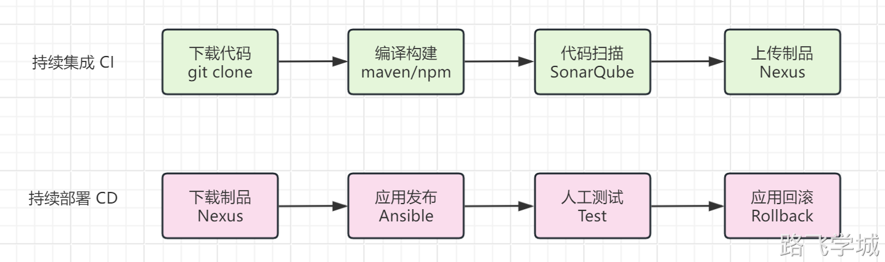
> 
> 像这样的发布脚本，我们最好单独一个仓库，和业务代码仓库分开，这样方便后续的管理
> 
> 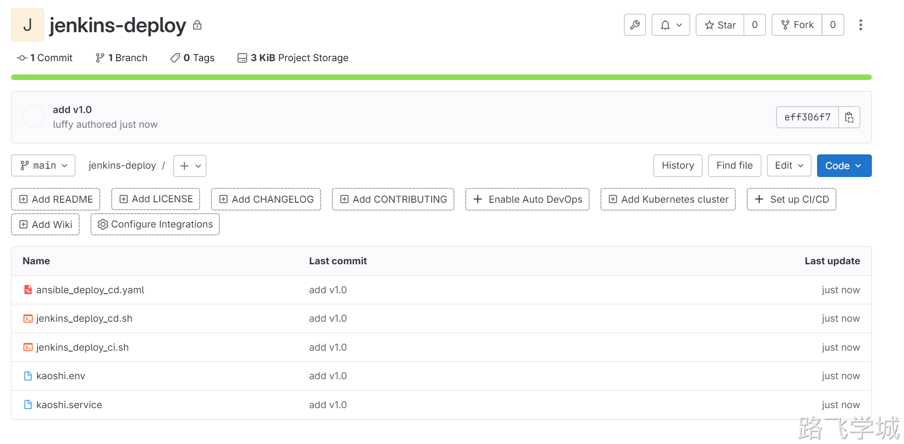
> 
> 
> 

> [!info]- 拆解CI脚本
> 
> 
> ```bash
> [root@jenkins-201 /opt/deploy]# cat jenkins_deploy_ci.sh
> #!/bin/bash
> 
> # 1.构建镜像
> export JAVA_HOME=/opt/jdk8
> /opt/maven/bin/mvn -s settings.xml clean package
> 
> # 2.代码扫描
> if [ "$sonarSkip" == "false" ];then
>   /opt/sonar-scanner/bin/sonar-scanner -Dsonar.host.url=http://10.0.0.203:9000 \
>   -Dsonar.projectKey=kaoshi-maven-service \
>   -Dsonar.projectName=kaoshi-maven-service \
>   -Dsonar.projectVersion=${releaseVersion} \
>   -Dsonar.token=${sonarToken} \
>   -Dsonar.ws.timeout=30 \
>   -Dsonar.projectDescription="my first project" \
>   -Dsonar.links.homepage=http://10.0.0.203/devops/kaoshi-maven-service \
>   -Dsonar.sources=src \
>   -Dsonar.sourceEncoding=UTF-8 \
>   -Dsonar.java.binaries=target/classes \
>   -Dsonar.java.test.binaries=target/test-classes \
>   -Dsonar.java.surefire.report=target/surefire-reports
> fi
> 
> 
> # 3.制品上传
> if [ -f "target/xzs-${releaseVersion}.jar" ];then
>   /opt/maven/bin/mvn -s settings.xml deploy:deploy-file \
>   -DgroupId=com.mindskip \
>   -DartifactId=xzs \
>   -Dversion=${releaseVersion} \
>   -Dpackaging=jar \
>   -Dfile=target/xzs-${releaseVersion}.jar \
>   -Durl=http://10.0.0.202:8081/repository/kaoshi-release/ \
>   -DrepositoryId=releases
> fi
> ```
> 

> [!info]- 拆解CD脚本
> 
> 
> jenkins调用脚本
> 
> ```bash
> [root@jenkins-201 /opt/deploy]# cat jenkins_deploy_cd.sh
> #!/bin/bash
> 
> #1.下载制品
> curl -s -u admin:admin -o /opt/deploy/xzs-${releaseVersion}.jar ${nexusUrl}
> 
> #2.替换系统变量
> if [ -f "xzs-${releaseVersion}.jar" ];then
>   sed -i "/APP_VERSION=/c APP_VERSION=$releaseVersion" kaoshi.env
>   sed -i "/APP_ENV=/c APP_ENV=${deployEnv,,}" kaoshi.env
> else
>   exit
> fi
> 
> #3.调用Ansible剧本
> ansible-playbook -l $deployHosts /opt/deploy/ansible_deploy_cd.yaml -e "app_version=$releaseVersion"
> ```
> 
> ansible发布脚本:
> 
> ```yaml
> [root@jenkins-201 /opt/deploy]# cat ansible_deploy_cd.yaml
> ---
> - name: Deploy Kaoshi Application
>   hosts: all
> 
>   tasks:
>     - name: Copy the JAR file to the server
>       copy:
>         src: "xzs-{{ app_version }}.jar"
>         dest: /opt/
> 
>     - name: Copy the environment file
>       copy:
>         src: kaoshi.env
>         dest: /etc/systemd/system/kaoshi.env
>       notify:
>         - restart kaoshi
> 
>     - name: Copy the systemd service file
>       copy:
>         src: kaoshi.service
>         dest: /etc/systemd/system/kaoshi.service
>       notify:
>         - reload systemd
>         - restart kaoshi
> 
>     - name: Start and enable the kaoshi service
>       systemd:
>         name: kaoshi
>         state: started
>         enabled: yes
> 
>   handlers:
>     - name: reload systemd
>       command: systemctl daemon-reload
> 
>     - name: restart kaoshi
>       systemd:
>         name: kaoshi
>         state: restarted
> ```
> 
> 启动脚本变量文件:
> 
> ```bash
> cat > kaoshi.env << 'EOF'
> APP_ENV=prod
> APP_VERSION=3.9.2
> EOF
> ```
> 
> 启动脚本systemd文件:
> 
> ```bash
> cat > kaoshi.service < 'EOF'
> [Unit]
> Description=Spring Boot Application
> After=network.target
> 
> [Service]
> EnvironmentFile=/etc/systemd/system/kaoshi.env
> ExecStart=/opt/jdk/bin/java -Duser.timezone=Asia/Shanghai -jar -Dspring.profiles.active=${APP_ENV} /opt/xzs-${APP_VERSION}.jar 
> SuccessExitStatus=143
> Restart=always
> RestartSec=10
> 
> [Install]
> WantedBy=multi-user.target
> EOF
> ```
> 

- ~ jenkins任务配置

> [!info]- 持续集成CI 任务配置
> 
> 
> 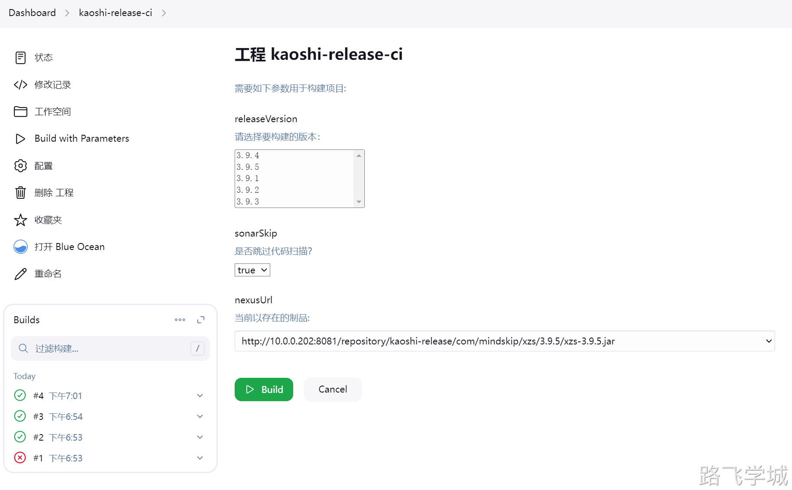
> 
> 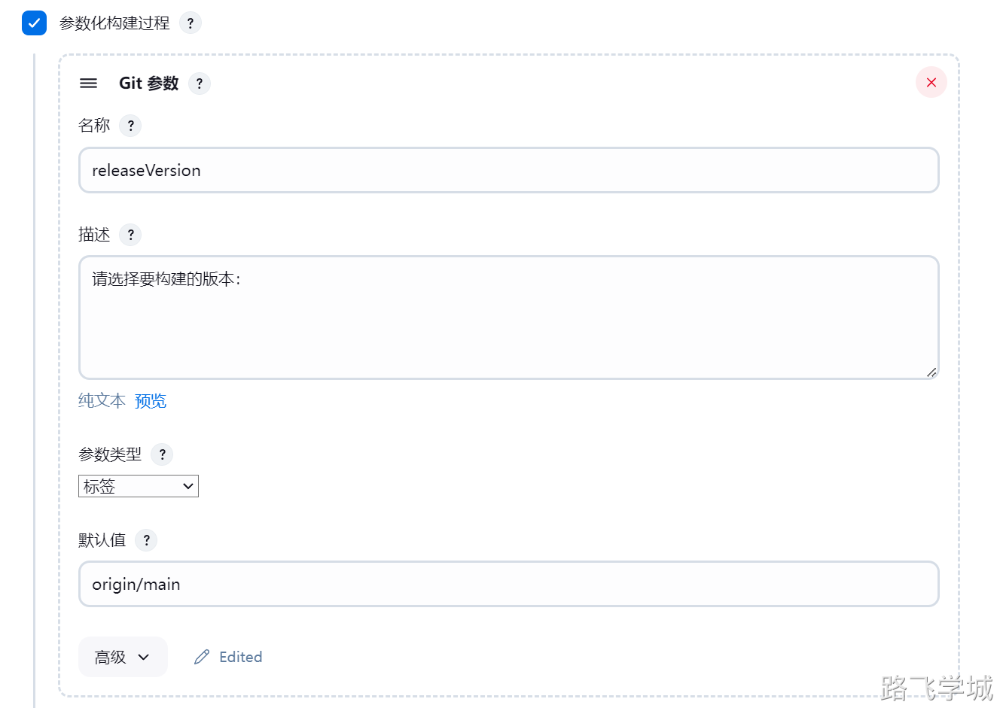
> 
> 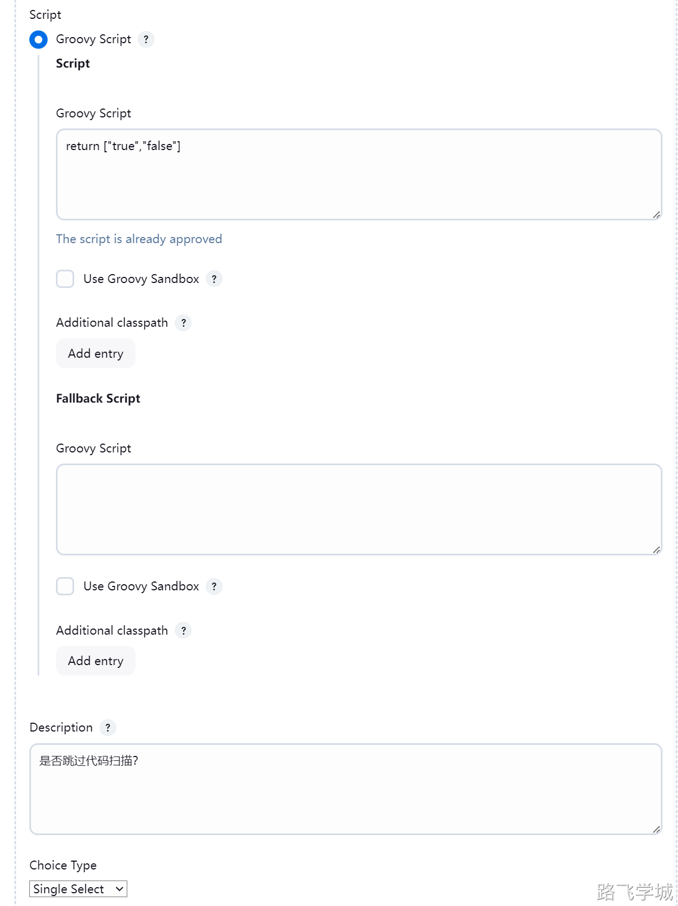
> 
> 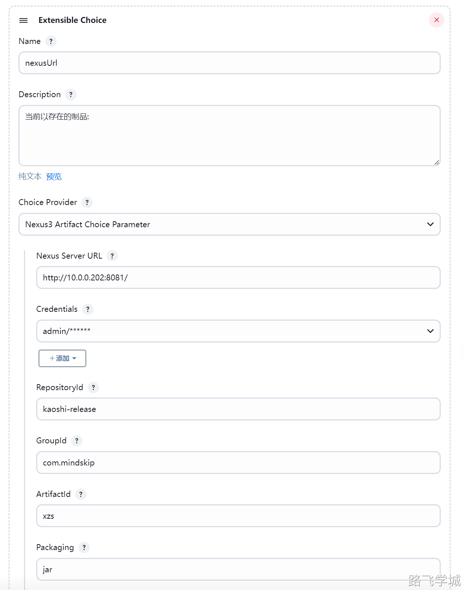
> 
> 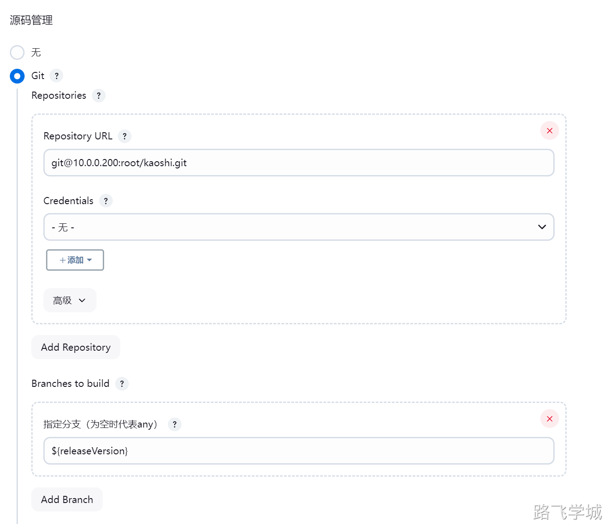
> 
> 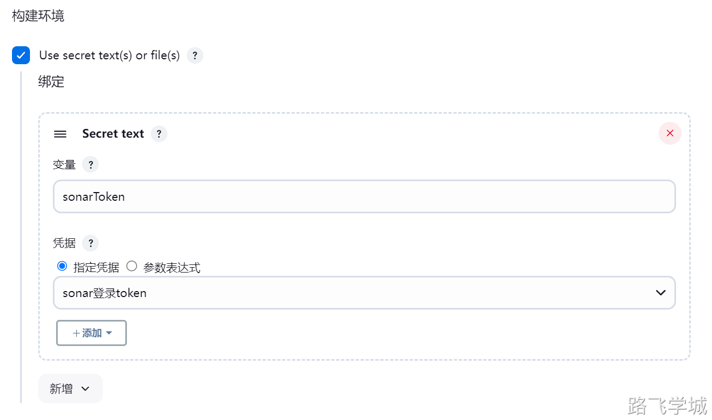
> 
> 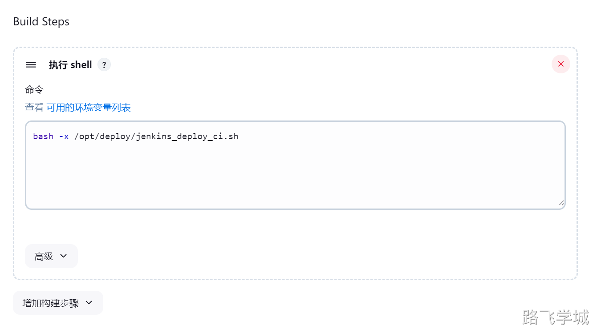
> 

> [!info]- 持续集成CD 任务配置
> 
> 
> 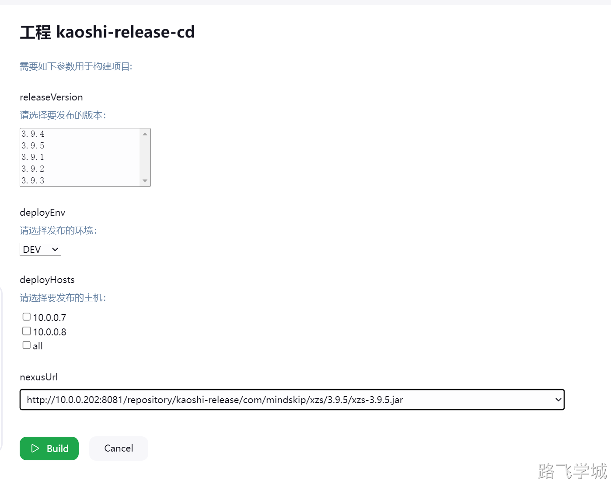
> 
> 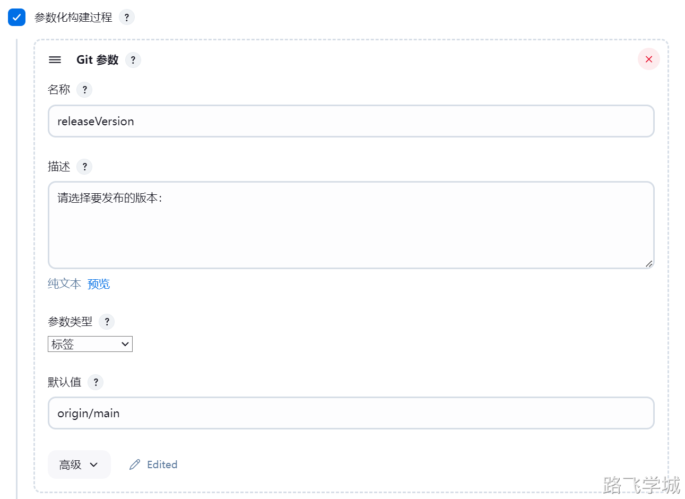
> 
> 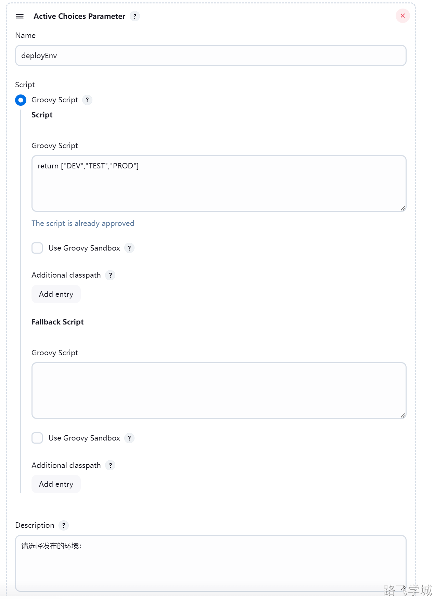
> 
> 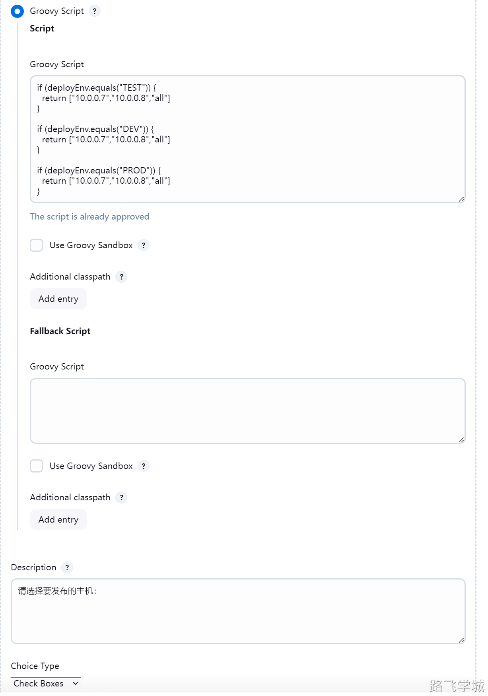
> 
> 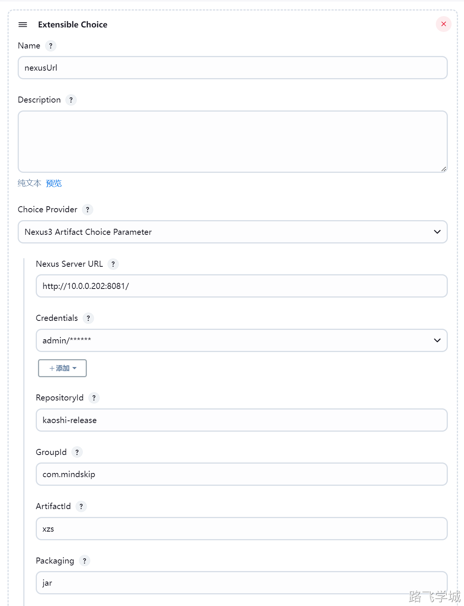
> 
> 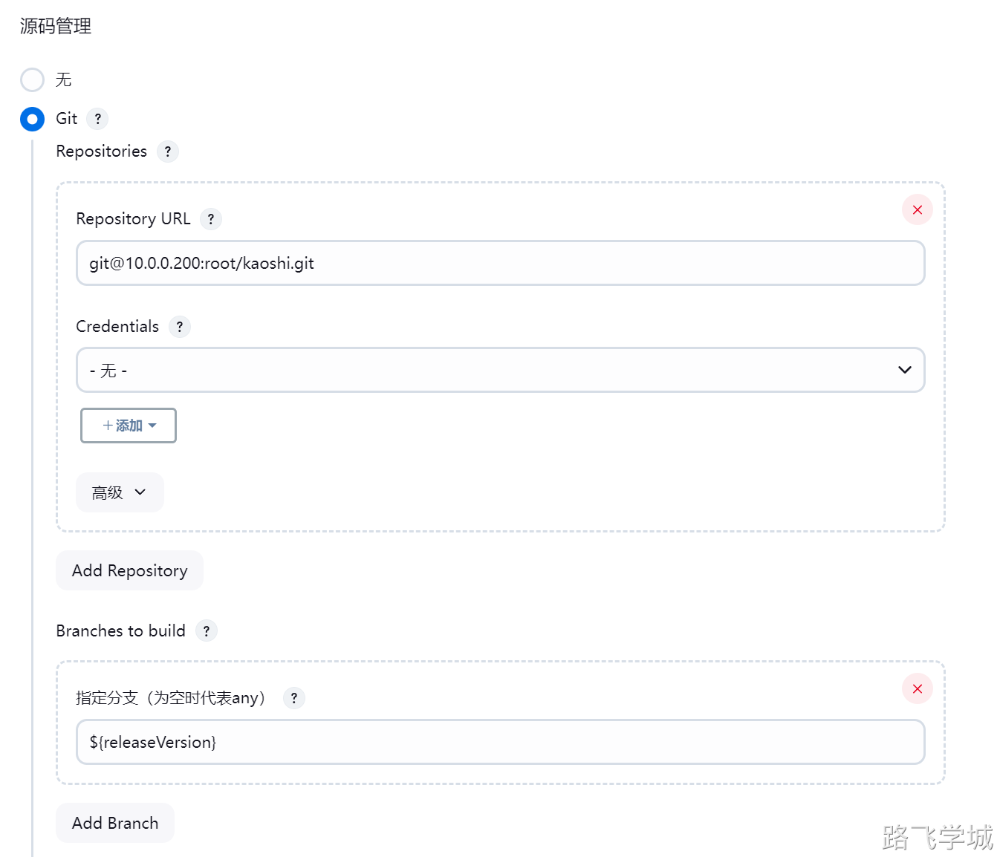
> 
> 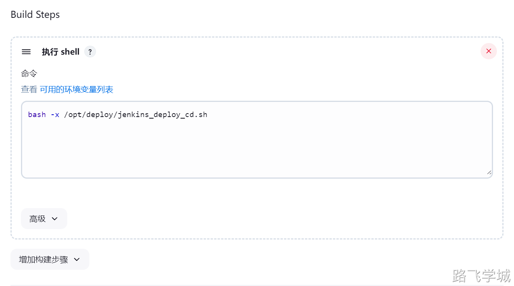
> 
> 