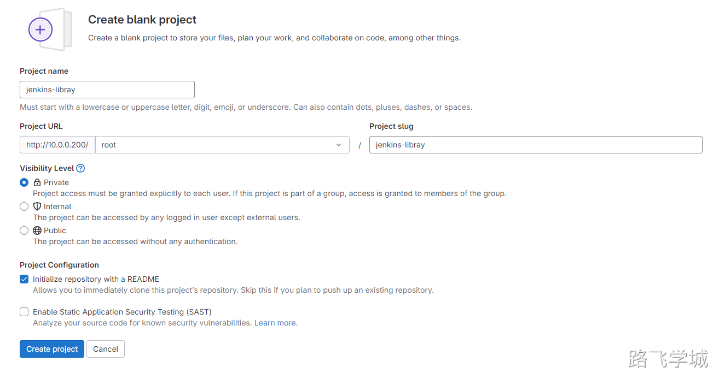
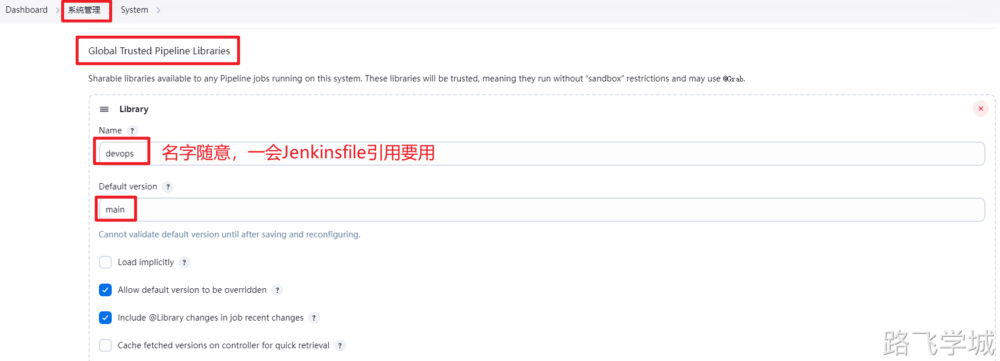
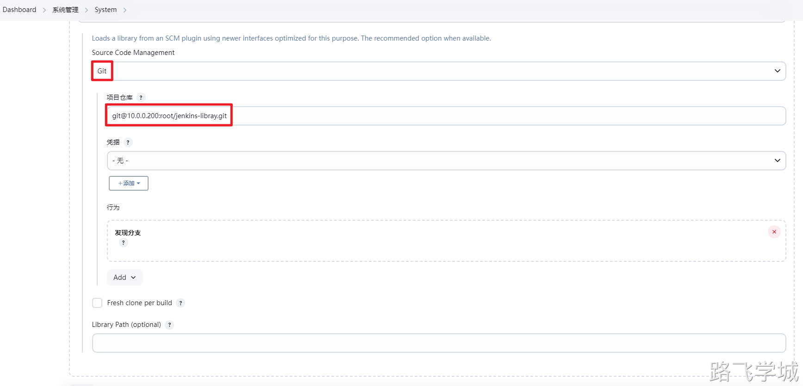
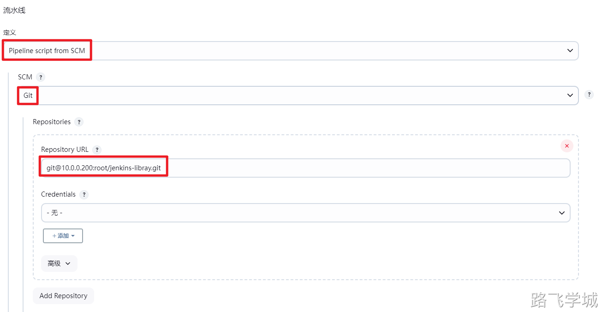
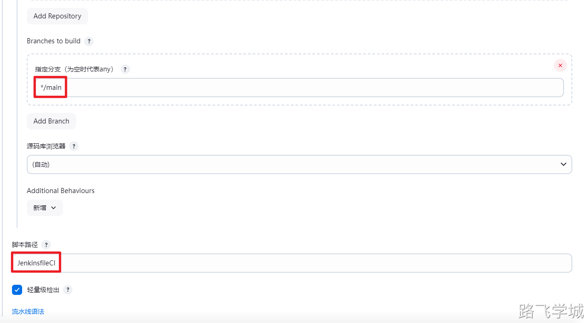

---
tags:
  - CICD/Jenkins/pipeline
---

> [!info]- 什么是共享库
> 
> 
> 
> ```
> https://www.jenkins.io/zh/doc/book/pipeline/shared-libraries/
> 
> 由于流水线被组织中越来越多的项目所采用，常见的模式很可能会出现。 在多个项目之间共享流水线有助于减少冗余并保持代码 "DRY" [[1](https://www.jenkins.io/zh/doc/book/pipeline/shared-libraries/#_footnotedef_1)]。
> 
> 流水线支持创建 "共享库" ，可以在外部源代码控制仓库中定义并加载到现有的流水线中。
> 
> ```

> [!info]- 共享库目录结构规划
> 
> 
> ```groovy
> [root@jenkins-201 ~/jenkins-libray]# tree
> .
> ├── JenkinsfileCD
> ├── JenkinsfileCI
> ├── resources
> │   └── kaoshi-service.sh
> └── src
>     └── org
>         └── devops
>             ├── Artifact.groovy
>             ├── Build.groovy
>             ├── Checkout.groovy
>             ├── Deploy.groovy
>             └── Sonar.groovy
> 
> 4 directories, 8 files
> ```
> 

> [!info]- 创建共享库
> 
> 
> 
> 

> [!info]- 编写共享库代码
> 
> 
> Checkout.groovy
> 
> ```groovy
> package org.devops
> 
> def CheckoutByTag(){
>     checkout([$class: 'GitSCM',
>                  branches: [[name: "${params.appVersion}"]],
>                  userRemoteConfigs: [[url: 'git@10.0.0.200:root/kaoshi.git']]])	
> }
> ```
如果想要在共享库将脚本也加入其中，可以创建子目录作为脚本文件
>步骤就是新建一个脚本项目，java源码项目去拉取脚本项目的代码到自己jenkinsfile_repo目录下
> - 你需要在 GitLab 创建两个项目：`maven-kaoshi` 和 `maven-jenkins-library`。
> - 当 Jenkins 拉取 `maven-kaoshi` 时，它会将代码拉取到工作空间的根目录下。
>- 当 Jenkins 拉取 `maven-jenkins-library` 时，它会使用 `RelativeTargetDirectory` 扩展将代码拉取到 `jenkinsfile_repo` 子目录中。
> ```
>         // 源码目录
>         checkout([$class: 'GitSCM',
>                 branches: [[name: "${params.appVersion}"]],
>                 userRemoteConfigs: [[url: 'git@10.0.0.200:dev/maven-kaoshi.git']]  // 源码项目
>                 ])
> 
>         // 源码目录下创建子目录
>         checkout([
>             $class: 'GitSCM',
>             branches: [[name: '*/main']],
>             userRemoteConfigs: [[url: 'git@10.0.0.200:ops/maven-jenkins-library.git']], // Jenkinsfile项目
>             extensions: [[
>                 $class: 'RelativeTargetDirectory',
>                 relativeTargetDir: 'jenkinsfile_repo'   // 子目录名
>             ]]
>         ])
> ```
> 
> 
> Artifact.groovy
> 
> ```groovy
> package org.devops
> 
> def CheckNexusArtifact(){
>     POM = readMavenPom file: 'pom.xml'
>     env.ARTIFACT_ID = "${POM.artifactId}"
>     env.PACKAGING = "${POM.packaging}"
>     env.GROUP_ID = "${POM.groupId}"
>     env.GROUP_ID_URL = "${POM.groupId}".replace('.', '/')
>     env.VERSION = "${POM.version}"
>     env.JAR_FILE = "${env.ARTIFACT_ID}-${env.VERSION}.${env.PACKAGING}"
>     
>     // 构建 Nexus REST API 的 URL
>     def artifactUrl = "${env.NEXUS_URL}/repository/${env.REPO_NAME}/${env.GROUP_ID_URL}/${env.ARTIFACT_ID}/${env.VERSION}/${env.JAR_FILE}"                    
>     env.JAR_URL = "${artifactUrl}"
> 	
>     // 发送 HTTP 请求到 Nexus
>     def status = sh(script: "curl -s -o /dev/null -w '%{http_code}' -u ${env.NEXUS_USER} -I ${artifactUrl}", returnStdout: true).trim()
> 	env.JAR_STATUS = "${status}"
> }
> 
> 
> def UploadNexusArtifact(){
> 	sh """
> 		/opt/maven/bin/mvn -s settings.xml deploy:deploy-file \
> 		-DgroupId=${env.GROUP_ID} \
> 		-DartifactId=${env.ARTIFACT_ID} \
> 		-Dversion=${env.VERSION} \
> 		-Dpackaging=${env.PACKAGING} \
> 		-Dfile=target/${env.ARTIFACT_ID}-${env.VERSION}.${env.PACKAGING} \
> 		-Durl=${NEXUS_URL}/repository/${RELEASE_NAME}/ \
> 		-DrepositoryId=releases
> 	"""
> }
> 
> def DownloadNexusArtifact(){
> 	sh "curl -s -u ${NEXUS_USER} -o ${env.JAR_NAME} ${env.JAR_URL}"
> }
> ```
> 
> Sonar.groovy
> 
> ```groovy
> package org.devops
> 
> def SonarScanner(){
> 	withCredentials([string(credentialsId: 'sonar-token', variable: 'sonarToken')]) {
> 		sh """
> 			/opt/sonar-scanner/bin/sonar-scanner -Dsonar.host.url=${SONAR_URL} \
> 			-Dsonar.login=${sonarToken} \
> 			-Dsonar.projectKey=${JOB_NAME} \
> 			-Dsonar.projectName=${JOB_NAME} \
> 			-Dsonar.projectVersion=${appVersion} \
> 			-Dsonar.ws.timeout=30 \
> 			-Dsonar.projectDescription="abc ${JOB_NAME}" \
> 			-Dsonar.links.homepage=${SONAR_URL}/${JOB_NAME} \
> 			-Dsonar.sources=src \
> 			-Dsonar.sourceEncoding=UTF-8 \
> 			-Dsonar.java.binaries=target/classes \
> 			-Dsonar.java.test.binaries=target/test-classes \
> 			-Dsonar.java.surefire.report=target/surefire-reports
> 		"""
> 	}
> }
> ```
> 
> Deploy.groovy
> 
> ```groovy
> package org.devops
> 
> def AnsibleDeploy(){
> 	sh """
> 	    ansible ${deployHost} -m file -a "path=/opt/app state=directory"
> 	    ansible ${deployHost} -m copy -a "src=${env.JAR_NAME} dest=/opt/app/"
>         ansible ${deployHost} -m copy -a "src=kaoshi-service.sh dest=/opt/app/"
>         ansible ${deployHost} -m shell -a "/bin/bash /opt/app/kaoshi-service.sh stop"
>         ansible ${deployHost} -m shell -a "/bin/bash /opt/app/kaoshi-service.sh start ${env.VERSION}"
> 	"""
> }
> ```
> 
> Build.groovy
> 
> ```groovy
> package org.devops
> 
> def Build(){
> 	sh "/opt/maven/bin/mvn -s settings.xml clean package"
> }
> ```
> 
> JenkinsfileCI
> 
> ```groovy
> @Library("devops@main") _ 
> 
> //导入模块
> def build = new org.devops.Build()
> def sonar = new org.devops.Sonar()
> def artifact = new org.devops.Artifact()
> def checkout = new org.devops.Checkout()
> 
> pipeline{
>     agent any
> 	
> 	environment{
> 		JAVA_HOME = '/opt/jdk8'
> 		SONAR_URL = 'http://10.0.0.203:9000'
> 		JOB_NAME = 'kaoshi-maven-service'
> 		RELEASE_NAME = 'kaoshi-release'
> 		NEXUS_URL = 'http://10.0.0.202:8081'
> 		NEXUS_USER = 'admin:admin'
> 		GIT_URL = 'git@10.0.0.200:root/kaoshi.git'
> 	}
> 	
> 	parameters {
> 		gitParameter name: 'appVersion', 
> 			defaultValue: 'origin/main', 
> 			description: '当前代码仓库版本:',
> 			useRepository: 'git@10.0.0.200:root/kaoshi.git',
> 			type: 'PT_TAG'
>         activeChoice choiceType: 'PT_SINGLE_SELECT', 
> 			description: '是否进行代码扫描?', 
> 			name: 'scanCode', 
> 			randomName: 'choice-parameter-29402868847477', 
> 			script: groovyScript(script: [script: 'return ["true","false"]'])			
> 	}
> 	
> 	stages{
> 		stage('checkout'){
> 			steps{
> 				script{
> 					checkout.CheckoutByTag()
> 				}
> 			}
> 		}
> 		
> 		stage('check jar'){
> 			steps{
> 				script{
> 					artifact.CheckNexusArtifact()
>                     if (env.JAR_STATUS == '200') {
>                         input message: '制品已经存在,是否继续构建？', ok: 'ok'
>                     }	
> 				}
> 			}	
> 		}
> 		
> 		stage('build'){
> 			steps{
> 				script{
> 					build.Build()
> 				}
> 			}
> 		}
> 		
> 		stage('sonar'){
>             when {
>                 environment name: 'scanCode', value: 'true'
>             }
> 			
> 			steps{
> 				script{
> 					sonar.SonarScanner()
> 				}
> 			}
> 		}
> 		
>         stage("check upload") {
>             steps {
>                 input message: '确定要上传吗？', ok: 'ok'
>             }
>         }
>         
> 		stage('upload'){
> 			steps{
> 				script{
> 					artifact.UploadNexusArtifact()
> 				}
> 			}
> 		}
> 	}
> }
> ```
> 
> JenkinsfileCD
> 
> ```groovy
> @Library("devops@main") _ 
> 
> //导入模块
> def artifact = new org.devops.Artifact()
> def checkout = new org.devops.Checkout()
> def deploy = new org.devops.Deploy()
> 
> pipeline{
>     agent any
> 	
> 	environment{
> 		JAVA_HOME = '/opt/jdk8'
> 		JOB_NAME = 'kaoshi-maven-service'
> 		RELEASE_NAME = 'kaoshi-release'
> 		NEXUS_URL = 'http://10.0.0.202:8081'
> 		NEXUS_USER = 'admin:admin'
> 
> 	}
> 	
> 	parameters {
> 		gitParameter name: 'appVersion', 
> 			defaultValue: 'origin/main', 
> 			description: '当前代码仓库版本:',
> 			useRepository: 'git@10.0.0.200:root/kaoshi.git',
> 			type: 'PT_TAG'
> 		
> 		activeChoice choiceType: 'PT_SINGLE_SELECT', 
> 			description: '请选择发布方式：',  
> 			name: 'deployType', 
> 			randomName: 	'choice-parameter-87729400405075', 
> 			script: groovyScript(script: [script: 'return ["deploy","rollback"]'])
> 		
> 		activeChoice choiceType: 'PT_SINGLE_SELECT', 
> 			description: '请选择发布环境:', 
> 			name: 'deployEnv', 
> 			randomName: 'choice-parameter-87788334328077', 
> 			script: groovyScript(script: [script: '''return ["TEST","PROD"]'''])
> 
> 		reactiveChoice choiceType: 'PT_CHECKBOX', 
> 			description: '请选择发布主机：', 
> 			name: 'deployHost',
> 			randomName: 'choice-parameter-87894284640976', 
> 			referencedParameters: 'deployEnv', 
> 			script: groovyScript(script: [script: '''
> 				if (deployEnv.equals("TEST")) {
> 					return ["10.0.0.5","10.0.0.6","TEST"]
> 				}
> 				
> 				if (deployEnv.equals("PROD")) {
> 					return ["10.0.0.7","10.0.0.8","PROD"]
> 				}
> 			'''])
> 	}
> 	
> 	stages{
> 		stage('checkout'){
> 			steps{
> 				script{
> 					checkout.CheckoutByTag()
> 				}
> 			}
> 		}
> 		
> 		stage('check jar'){
> 			steps{
> 				script{
> 					artifact.CheckNexusArtifact()
> 
>         
>                     if (env.JAR_STATUS == '200') {
>                         echo "制品存在"
>                     }
> 				}
> 			}	
> 		}
> 		
> 		stage('download'){
> 			steps{
> 				script{
> 					artifact.DownloadNexusArtifact()
> 				}			
> 			}
> 		}
> 		
> 		stage('check deploy'){
> 			steps{
> 				script{
> 					input message: '是否部署？', ok: 'ok'
> 				}			
> 			}
> 		}
> 		
> 		stage('deploy'){
> 			steps{
> 				script{
> 					deploy.AnsibleDeploy()
> 				}
> 			}
> 		}
> 	}
> }
> ```
> 

> [!info]- Jenkins加载共享库
> 
> 
> 
> 
> 
> 

> [!info]- Jenkins Pipeline SCM配置
> 
> 
> 
> 
> 
> 
