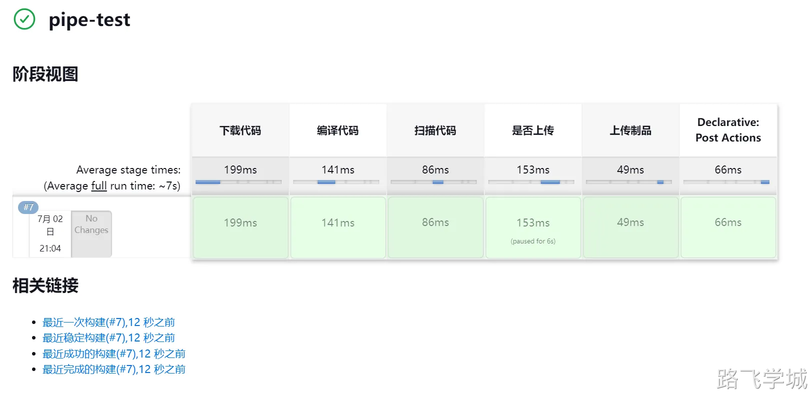

---
tags:
  - CICD/Jenkins/pipeline
---
- ~ Pipeline介绍
> [!info]- 什么是Pipeline
> 
> 
> 在 Jenkins 中，Pipeline 是一种组织和管理连续交付管道的方式，可以帮助自动化构建、测试和部署软件项目的过程。Pipeline 提供了一种复杂逻辑的可编程方式来配置整个构建过程，这是通过脚本或声明式语法来定义的。
> 
> 说人话：
> 
> 将整个CI或CD的过程细分为一个一个的阶段，然后所有阶段组合起来就是一条流水线。
> 

> [!info]- 为什么使用Pipeline
> 
> 
> 目前我们所使用的Jenkins实现发布流程是图形界面点点点加上shell或Ansible脚本。
> 
> 这样的形式存在几个问题：
> 
> 1.虽然配置好的Jenkins可以很方便的点点点，但是各种插件信息实际的配置过程却很麻烦
> 
> 2.目前的所有阶段都是在一个脚本里，没有可视化执行的过程，也就是说如果出问题，第一时间并不知道是哪个阶段出了问题，需要查看日志之后再去分析
> 
> 
> 
> 而Pipelie可以很好的解决以上两个问题：
> 
> 1.Pipeline代码可以以代码的形式描述各种插件的配置，也就是说不用每个插件去点点点的配置了
> 
> 2.Pipeline代码可以以图形化的形式清晰的展示出一条完整的流水线中每个阶段的详细信息
> 
> 
> 

> [!info]- 什么是Jenkinsfile
> 
> 
> Pipeline是实际运行的代码，而Jenkinsfile是一个文件，我们可以将Pepeline代码保存到这个文件中，再将Jenkinsfile提交到代码仓库，以后需要使用的时候Jenkins就可以直接从代码仓库中拉取Jenkinsfile并读取和运行里面保存的Pipeline代码。
> 
> 说人话：
> 
> 方式1: 直接将Pipeline代码写在Jenkins的项目配置中，但是修改不太方便
> 
> 方式2: 将Pipeline代保存到Jenkinsfile中，然后使用Git管理起来（推荐方案）
> 

> [!info]- 什么是Groovy
> 
> 
> 刚才我们说Pipeline是代码，那么这个Pipeline代码使用的语言就是Groovy。
> 
> Groovy 是一种强大的、灵活的动态语言，运行在 Java 虚拟机（JVM）上。在 Jenkins 中，Pipeline 的脚本通常是用 Groovy 语言编写的。这是因为 Groovy 与 Java 非常兼容，而 Jenkins 本身就是用 Java 开发的。Groovy 语言的动态特性使得编写 Jenkins 脚本变得更加简便。
> 

> [!info]- Pipeline，Groovy，Jenkinsfile三者之间的关系
> 
> 
> Pipeline是使用Groovy语言编写的流水线代码，我们将写好的Pipeline代码保存到文件中也就是Jenkinsfile。

> [!info]- Jenkins的Pipeline插件
> 
> 
> Jenkins要想使用Pipeline功能，需要安装以下两个插件
> 
> Pipeline
> 
> Pipeline: Stage View
> 

> [!info]- 创建流水线任务
> 
> 
> 
> 

- ~ Pipeline核心语法

> [!info]- 整体框架
> 
> 
> ```groovy
> pipeline{
>     // 选择运行节点
>     agent any 
> 
>     // 全局变量
>     environment {
>         appVersion = "1.0.0"
>     }
> 
>     // 构建参数
>     parameters {
>         choice choices: ['dev', 'test', 'prod'], description: '请选择发布环境:', name: 'deployEnv' 
>     }
> 
>     // 构建阶段
>     stages{
>         stage("下载代码"){ 
>             steps{
>                 echo "get code OK" 
>             }
>         } 
>         stage("编译代码"){
>             steps{
>                 echo "packge code OK"
>             } 
>         }
>         stage("扫描代码"){ 
>             steps{
>                 echo "scan code OK" 
>             }
>         }
>         stage("是否上传"){
>             steps{
>                 input message: "确定要上传吗?", ok: 'ok'
>             }
>         }
>         stage("上传制品"){ 
>             steps{
>                 echo "upload jar OK" 
>             }
>         }	
>     }
> 
>     // 构建后操作
>     post {
>         // 总是执行
>         always {
>             echo "post always"
>         }
>         // 成功才执行
>         success {
>             echo "post success"
>         }
>         // 失败才执行
>         failure {
>             echo "post failure"
>         }
>     }
> }
> ```
> 
> 
> 
> ```groovy
> pipeline{
>     // 选择运行节点
>     agent any 
> 
>     // 全局变量
>     environment {
>         appVersion = "1.0.0"
>     }
> 
>     // 构建参数
>     parameters {
>         choice choices: ['dev', 'test', 'prod'], description: '请选择发布环境:', name: 'deployEnv' 
>     }
> 
>     // 构建阶段
>     stages{
>         stage("下载制品"){ 
>             steps{
>                 echo "download jar OK" 
>             }
>         }
>         stage("发布制品"){ 
>             steps{
>                 echo "deploy jar OK" 
>             }
>         }
>         stage("访问测试"){ 
>             steps{
>                 echo "curl is OK" 
>             }
>         }    
>     }
> 
>     // 构建后操作
>     post {
>         // 总是执行
>         always {
>             echo "post always"
>         }
>         // 成功才执行
>         success {
>             echo "post success"
>         }
>         // 失败才执行
>         failure {
>             echo "post failure"
>         }
>     }
> }
> ```
> 
> 
> 

> [!info]- agent{} 节点
> 
> 
> agent{} 节点用于指定 Jenkins Pipeline 的执行环境。你可以在这里定义执行当前 Pipeline 或者特定阶段的具体环境，比如任何可用的节点或者特定的Docker容器。
> 
> 举例：在具有my-node标签的节点上运行
> 
> ```bash
> pipeline {
>     agent { label 'my-node' }
>     stages {
>         stage('Build') {
>             steps {
>                 echo 'Building...'
>             }
>         }
>     }
> }
> ```
> 

> [!info]- stages{} 阶段
> 
> 
> stages{} 定义了一系列的阶段（stage），每个阶段包含了一组要执行的步骤（steps）。
> 
> stages：包含了多个stage阶段
> 
> stage：包含了多个steps步骤
> 
> steps：包含了具体执行的脚本
> 
> scripts：具体执行任务的脚本（其实就是shell脚本)
> 
> 
> 
> 总结：
> 
> stages --> stage --> steps --> scripts
> 
> 
> 
> 举例：
> 
> ```groovy
> pipeline {
>     agent any
>     stages {
>         stage('Build') {
>             steps {
>                 script {
>                     // groovy code
>                     name = "abc"
>                     if (name == "abc"){
>                         println("One Piece")
>                     }
> 
>                     // shell code
>                     sh 'pwd'
>                     sh 'ls -l'
>                     sh '''
>                        id
>                        pwd
>                        java -v
>                     '''
>                 }
>             }
>         }
>         stage('Test') {
>             steps {
>                 echo 'Testing...'
>             }
>         }
>     }
> }
> ```
> 

> [!info]- environment{} 环境变量
> 
> 
> environment{} 用于声明在 Pipeline 运行期间可用的环境变量。这些变量根据在不同位置定义，可以在 Pipeline 的不同位置被使用。
> 
> pipeline { environment{} } 流水线级别变量，全局都可以使用
> 
> stage { environment{} } 阶段级别的变量，只有此阶段可以使用
> 
> 
> 
> ```bash
> pipeline{
>     agent any
> 		
> 	environment{
> 		VERSION = '1.1.0'
> 	}
> 	
> 	stages{
> 		stage('build'){
> 		environment{
> 			VERSION = '2.2.0'
> 		}
> 			steps{
> 				script{
> 					sh 'echo $VERSION'
> 				}
> 			}
> 		}
> 		stage('test'){
> 			steps{
> 				script{
> 					sh 'echo $VERSION'
> 				}
> 			}
> 		}			
> 	}
> }
> ```
> 

> [!info]- parmeters{} 参数
> 
> 
> 通过代码定义参数化构建中各种插件点点点的效果，但是必须要先构建一次之后才能生效。
> 
> 读取参数的变量也要注意，为了和环境变量区分，参数化的变量引用的时候使用${params.变量名}这样的形式。
> 
> 环境变量引用：${env.变量名}
> 
> 参数化变量引用：${params.变量名}
> 
> ```groovy
> pipeline{ 
>     agent any 
>     parameters {
>         string(name: 'VERSION', 
>                defaultValue: '1.1.0', 
>                description: '请输入发布版本')
>         choice(name: 'DEPLOYENV', 
>                choices: ['dev', 'test', 'prd'], 
>                description: '请选择发布环境')
>     }
>     stages {
>         stage("编译代码") {
>             environment {
>                 VERSION = "3.3.0"
>             }
>             steps {
>                 script {
>                     sh "echo ${params.VERSION}"
>                     sh "echo ${env.VERSION}"
>                     sh "echo ${VERSION}"
>                 }
>             }
>         }
>     }
> }
> ```
> 

> [!info]- input{} 交互
> 
> 
> 官方文档：
> 
> https://www.jenkins.io/doc/book/pipeline/syntax/#input
> 
> 
> 
> 指令作用：
> 
> 交互式输入，比如弹出确定是否继续，弹出菜单等
> 
> ```groovy
> pipeline{ 
>     agent any 
>     stages{
>         stage("拉取代码"){ 
>             steps{
>                 echo "拉取代码成功"
>             }
>         } 
>         stage("检测代码"){
>             steps{
>                 echo "检测代码成功"
>             } 
>         }
>         stage("编译代码"){
>             steps{
>                 echo "编译代码成功"
>             } 
>         }
>         stage("是否部署"){
>             steps{
>                 input message: '确定要部署吗？', ok: 'ok'
>             }
> 
>         }
>         stage("部署代码"){ 
>             steps{
>                 echo "部署成功"
>             }
>         } 
>     }
> }
> ```
> 
> 官方案例：
> 
> ```groovy
> pipeline {
>     agent any
>     stages {
>         stage('Example') {
>             input {
>                 message "Should we continue?"
>                 ok "Yes, we should."
>                 submitter "alice,bob"
>                 parameters {
>                     string(name: 'PERSON', defaultValue: 'Mr Jenkins', description: 'Who should I say hello to?')
>                 }
>             }
>             steps {
>                 echo "Hello, ${PERSON}, nice to meet you."
>             }
>         }
>     }
> }
> ```
> 

> [!info]- when{} 条件控制
> 
> 
> 根据条件判断决定是否执行此阶段任务
> 
> ```groovy
> pipeline{ 
>     agent any
>     environment {
>         VERSION = '1.1.0'
>         DEPLOYENV = 'PROD'
>     }
>     parameters {
>         choice(name: 'SCANCODE', 
>                choices: ['true', 'false'], 
>                description: '是否进行扫描')
>     }
>     stages {
>         stage("部署代码") {
>             when {
>                 environment name: 'DEPLOYENV', value: 'PROD'
>             }
>             steps {
>                 script {
>                     sh "部署成功"
>                 }
>             }
>         }
>         stage("扫描代码") {
>             when {
>                 expression { params.SCANCODE == 'true' }
>             }
>             steps {
>                 script {
>                     sh "扫描成功"
>                 }
>             }
>         }        
>     }
> }
> ```
> 

- ~ Jenkins  Pipeline语法生成器

> [!info]- Pipeline语法生成器
> 
> 
> 在Jenkins流水线任务中，在配置流水线代码的最后，有个提示叫流水线语法生成器，点开之后我们可以按照正常图形配置插件的形式生成相应的Pipeline语法。
> 
> 
> 

> [!info]- git参数选项动态获取远程仓库版本信息
> 
> 
> 参考git插件文档学习:
> 
> https://plugins.jenkins.io/git-parameter/#plugin-content-branch-tag-type
> 
> 
> 
> 
> 
> 
> 
> 
> 
> 
> 
> 生成pipeline片段:
> 
> ```groovy
> pipeline {
>     agent any
>     // 选择代码版本
>     parameters {
>         gitParameter name: 'appVersion',
>                      type: 'PT_BRANCH_TAG',
>                      defaultValue: 'main'
>     }
>     stages {
>         // 拉取指定版本的代码
>         stage('checkout') {
>             steps {
>                 checkout([$class: 'GitSCM',
>                           branches: [[name: "${params.appVersion}"]],
>                           doGenerateSubmoduleConfigurations: false,
>                           extensions: [],
>                           gitTool: 'Default',
>                           submoduleCfg: [],
>                           userRemoteConfigs: [[url: 'git@10.0.0.200:root/kaoshi.git']]
>                         ])
>             }
>         }
>     }
> }
> ```
> 

3.多项选择


4.交互输入


 
> [!info]- 执行脚本
> 
> 
> 注意 sh '''与sh """的区别
> 
> 
> 
> 
> 
> 

- ~ 改造Maven项目为Pipeline

> [!info]- CI流水线改造
> 
> 
> 
> 
> 
> 
> 通过读取pom.xml文件获取包名称
> 
> 注意，需要安装插件 Pipeline Utility Steps
> 
> ```groovy
> pipeline {
>     agent any
> 
>     // JDK环境变量
>     environment {
>         JAVA_HOME = "/opt/jdk8"
>         NEXUS_URL = "http://10.0.0.202:8081"
>         NEXUS_USER = "admin:admin"
>         REPO_NAME = "kaoshi-release"
>     }
>     
>     // 选择代码版本
>     parameters {
>         gitParameter name: 'appVersion',
>             type: 'PT_BRANCH_TAG',
>             defaultValue: 'main'
>         activeChoice choiceType: 'PT_SINGLE_SELECT',
>             description: '是否进行代码扫描：',
>             name: 'codeScan', 
>             randomName: 'choice-parameter-289420636358017',             
>             script: groovyScript(script: [script: 'return ["true","false"]'])
>     }
> 
>     stages {
>         // 拉取指定版本的代码
>         stage('checkout') {
>             steps {
>                 checkout([$class: 'GitSCM',
>                              branches: [[name: "${params.appVersion}"]],
>                              doGenerateSubmoduleConfigurations: false,
>                              extensions: [],
>                              gitTool: 'Default',
>                              submoduleCfg: [],
>                              userRemoteConfigs: [[url: 'git@10.0.0.200:root/kaoshi.git']]
>                             ])
>             }
>         }
> 
>         // 检查是否已经存在制品
>         stage("check jar") {        
>             steps {
>                 script {
>                     // 通过pom配置获取包信息
>                     POM = readMavenPom file: 'pom.xml'
>                     env.ARTIFACT_ID = "${POM.artifactId}"
>                     env.PACKAGING = "${POM.packaging}"
>                     env.GROUP_ID = "${POM.groupId}"
>                     env.GROUP_ID_URL = "${POM.groupId}".replace('.', '/')
>                     env.VERSION = "${POM.version}"
>                     env.JAR_FILE = "${env.ARTIFACT_ID}-${env.VERSION}.${env.PACKAGING}"
>                     
>                     // 构建 Nexus REST API 的 URL
>                     def artifactUrl = "${env.NEXUS_URL}/repository/${env.REPO_NAME}/${env.GROUP_ID_URL}/${env.ARTIFACT_ID}/${env.VERSION}/${env.JAR_FILE}"                    
>                     
>                     // 发送 HTTP 请求到 Nexus
>                     def status = sh(script: "curl -s -o /dev/null -w '%{http_code}' -u ${env.NEXUS_USER} -I ${artifactUrl}", returnStdout: true).trim()
>         
>                     if (status == '200') {
>                         input message: '制品已存在,确定继续构建吗?', ok: '
>                         '
>                     }
>                 }         
>             }
>         }
> 
>         // maven编译构建
>         stage('build') {
>             steps {
>                 script {
>                     sh "/opt/maven/bin/mvn -s settings.xml clean package"
>                 }
>             }
>         }
> 
>         // 代码扫描
>         stage('sonar') {
>             // 是否跳过代码扫描
>             when {
>                 environment name: 'codeScan', value: 'true'
>             }             
>             steps {
>                 script {
>                     withSonarQubeEnv(credentialsId: 'sonar') {
>                         sh """/opt/sonar-scanner/bin/sonar-scanner -Dsonar.host.url=${SONAR_HOST_URL} \
>                               -Dsonar.projectKey=kaoshi-maven-service \
>                               -Dsonar.projectName=kaoshi-maven-service \
>                               -Dsonar.projectVersion=${appVersion} \
>                               -Dsonar.login=${SONAR_AUTH_TOKEN} \
>                               -Dsonar.ws.timeout=30 \
>                               -Dsonar.sources=src \
>                               -Dsonar.sourceEncoding=UTF-8 \
>                               -Dsonar.java.binaries=target/classes \
>                               -Dsonar.java.test.binaries=target/test-classes \
>                               -Dsonar.java.surefire.report=target/surefire-reports
>                         """
>                     }
>                 }
>             }
>         }
> 
>         // 确认是否上传
>         stage("check upload") {
>             steps {
>                 input message: '确定要上传吗？', ok: 'ok'
>             }
>         }
> 
>         // 上传制品
>         stage('upload') {
>             steps {
>                 script {
>                     // 上传制品
>                     sh """/opt/maven/bin/mvn -s settings.xml deploy:deploy-file \
>                           -DgroupId=${env.GROUP_ID} \
>                           -DartifactId=${env.ARTIFACT_ID} \
>                           -Dversion=${env.VERSION} \
>                           -Dpackaging=${env.PACKAGING} \
>                           -Dfile=target/${env.ARTIFACT_ID}-${env.VERSION}.jar \
>                           -Durl=http://10.0.0.202:8081/repository/kaoshi-release/ \
>                           -DrepositoryId=releases
>                     """
>                 }
>             }
>         }
>     }
> }
> ```
> 

> [!info]- CD流水线改造
> 
> 
> 
> 
> 
> 
> ```groovy
> pipeline {
>     agent any
> 
>     // JDK环境变量
>     environment {
>         JAVA_HOME = "/opt/jdk8"
>         NEXUS_URL = "http://10.0.0.202:8081"
>         NEXUS_USER = "admin:admin"
>         REPO_NAME = "kaoshi-release"
>     }
>     
>     // 选择代码版本
>     parameters {
>         gitParameter name: 'appVersion',
>             type: 'PT_BRANCH_TAG',
>             defaultValue: 'main'
> 			
>         activeChoice choiceType: 'PT_SINGLE_SELECT', 
> 		    description: '请选择发布的环境：', 
> 		    name: 'deployEnv', 
> 		    randomName: 'choice-parameter-374455993095210', 
> 		    script: groovyScript(script: [script: 'return ["DEV","TEST","PROD"]'])
> 		
>         reactiveChoice choiceType: 'PT_CHECKBOX', 
> 		    description: '请选择要发布的主机：', 
> 		    name: 'deployHosts', 
> 		    randomName: 'choice-parameter-374455995388939', 
> 		    referencedParameters: 'deployEnv', 
> 		    script: groovyScript(script: [script: '''
> 		    if (deployEnv.equals("TEST")) {
> 		    	return ["10.0.0.7","10.0.0.8","TEST"]
>             }
>             if (deployEnv.equals("DEV")) {
>               return ["10.0.0.7","10.0.0.8","DEV"]
>             }
>             if (deployEnv.equals("PROD")) {
>               return ["10.0.0.7","10.0.0.8","PROD"]
>             }'''])		
>     }
> 
>     stages {
>         // 拉取指定版本的代码
>         stage('checkout') {
>             steps {
>                 checkout([$class: 'GitSCM',
>                              branches: [[name: "${params.appVersion}"]],
>                              doGenerateSubmoduleConfigurations: false,
>                              extensions: [],
>                              gitTool: 'Default',
>                              submoduleCfg: [],
>                              userRemoteConfigs: [[url: 'git@10.0.0.200:root/kaoshi.git']]
>                             ])
>             }
>         }
> 		
>         // 检查是否已经存在制品
>         stage("download") {        
>             steps {
>                 script {
>                     // 通过pom配置获取包信息
>                     POM = readMavenPom file: 'pom.xml'
>                     env.ARTIFACT_ID = "${POM.artifactId}"
>                     env.PACKAGING = "${POM.packaging}"
>                     env.GROUP_ID = "${POM.groupId}"
>                     env.GROUP_ID_URL = "${POM.groupId}".replace('.', '/')
>                     env.VERSION = "${POM.version}"
>                     env.JAR_FILE = "${env.ARTIFACT_ID}-${env.VERSION}.${env.PACKAGING}"
>                     
>                     // 构造Nexus REST API的URL
>                     def artifactUrl = "${env.NEXUS_URL}/repository/${env.REPO_NAME}/${env.GROUP_ID_URL}/${env.ARTIFACT_ID}/${env.VERSION}/${env.JAR_FILE}"
> 					
>                     // 检查制品是否存在
>                     def httpStatus = sh(script: "curl -s -o /dev/null -w '%{http_code}' -u ${env.NEXUS_USER} -I ${artifactUrl}", returnStdout: true).trim()
>                     
>                     if (httpStatus == '200') {
>                         echo "Artifact exists. Proceeding with download."
>                         sh "curl -s -u ${env.NEXUS_USER} -o /opt/deploy/xzs-${params.appVersion}.jar ${artifactUrl}"
>                     } else if (httpStatus == '404') {
>                         error('Artifact does not exist. Aborting deploy.')
>                         currentBuild.result = 'ABORTED'
>                     } else {
>                         error('Received unexpected HTTP status code ${httpStatus} from Nexus')
>                         currentBuild.result = 'FAILURE'
>                     }
>                 }
>             }
>         }
> 		
>         // 确认是否部署
>         stage("check") {
>             steps {
>                 input message: '确定要部署吗？', ok: 'ok'
>             }
>         }
> 		
>         // 部署制品
>         stage("deploy") {
>             steps {
>                 script {
>                     sh "ansible-playbook -l ${deployHosts} /opt/deploy/ansible_deploy_cd.yaml -e app_version=${appVersion}"
>                 }
> 			}
>         }	
>     }
> }
> ```
> 

> [!info]- Jenkinsfile
> 
> 
> 1.什么是Jenkinsfile
> 
> Jenkinsfile就是将pipeline代码存放在git版本仓库中管理起来，不用在jenkins的项目里在粘贴pipeline代码了，这样更方便修改和管理。
> 
> 2.Jenkinsfile配置
> 
> 第一步：创建jenkinsfile的代码仓库，并将pipeline代码保存成文件
> 
> 
> 
> 第二步：我们只需要将原来写pipeline代码的地方替换为从git仓库获取即可
> 
> 
> 
> 3.Jenkinsfile关于gitParameter插件的坑
> 
> 如果Jenkinsfile与业务代码不处于同一个代码仓库，默认拉取的时候会发现gitParameter获取的并不是业务代码的版本号，而是Jenkinsfile仓库的版本号。
> 
> 这里的问题原因是因为gitParameter默认会读取Jenkins的SCM配置，而不是Pipeline中定义的仓库地址。
> 
> 如果希望gitParameter读取指定的代码仓库而不是Jenkins SCM定义的配置，则需要在pipeline的gitParameter中添加一个重要的参数useRepository，使其读取指定仓库的tag标签。
> 
> 
> 
> gitParameter插件官方说明:
> 
> https://plugins.jenkins.io/git-parameter/#plugin-content-use-repository
> 
> 
> 
> Pipeline正确写法:
> 
> ```groovy
> // 选择代码版本
> parameters {
>     gitParameter name: 'appVersion',
>         type: 'PT_TAG',
>         defaultValue: 'main',
>         useRepository: 'git@10.0.0.200:root/kaoshi.git'	 //使git parameter读取指定的仓库地址
> }
> ```
> 
> 
> 
> 实现效果：
> 
> 
> 
> 4.使用Jenkinsfile拉取CI和CD流水线
> 
> 我们可以将两条流水线保存到一个仓库中：
> 
> 
> 
> JenkinsfileCI代码内容:
> 
> ```groovy
> pipeline {
>     agent any
> 
>     // JDK环境变量
>     environment {
>         JAVA_HOME = "/opt/jdk8"
>         NEXUS_URL = "http://10.0.0.202:8081"
>         NEXUS_USER = "admin:admin"
>         REPO_NAME = "kaoshi-release"
>     }
>     
>     // 选择代码版本
>     parameters {
>         gitParameter name: 'appVersion',
>             type: 'PT_TAG',
>             defaultValue: 'main',
>             useRepository: 'git@10.0.0.200:root/kaoshi.git'
>         activeChoice choiceType: 'PT_SINGLE_SELECT',
>             description: '是否进行代码扫描：',
>             name: 'codeScan', 
>             randomName: 'choice-parameter-289420636358017',             
>             script: groovyScript(script: [script: 'return ["true","false"]'])
>     }
> 
>     stages {
>         // 拉取指定版本的代码
>         stage('checkout') {
>             steps {
>                 checkout([$class: 'GitSCM',
>                              branches: [[name: "${params.appVersion}"]],
>                              doGenerateSubmoduleConfigurations: false,
>                              extensions: [],
>                              gitTool: 'Default',
>                              submoduleCfg: [],
>                              userRemoteConfigs: [[url: 'git@10.0.0.200:root/kaoshi.git']]
>                             ])
>             }
>         }
> 
>         // 检查是否已经存在制品
>         stage("check jar") {        
>             steps {
>                 script {
>                     // 通过pom配置获取包信息
>                     POM = readMavenPom file: 'pom.xml'
>                     env.ARTIFACT_ID = "${POM.artifactId}"
>                     env.PACKAGING = "${POM.packaging}"
>                     env.GROUP_ID = "${POM.groupId}"
>                     env.GROUP_ID_URL = "${POM.groupId}".replace('.', '/')
>                     env.VERSION = "${POM.version}"
>                     env.JAR_FILE = "${env.ARTIFACT_ID}-${env.VERSION}.${env.PACKAGING}"
>                     
>                     // 构建 Nexus REST API 的 URL
>                     def artifactUrl = "${env.NEXUS_URL}/repository/${env.REPO_NAME}/${env.GROUP_ID_URL}/${env.ARTIFACT_ID}/${env.VERSION}/${env.JAR_FILE}"                    
>                     
>                     // 发送 HTTP 请求到 Nexus
>                     def status = sh(script: "curl -s -o /dev/null -w '%{http_code}' -u ${env.NEXUS_USER} -I ${artifactUrl}", returnStdout: true).trim()
>         
>                     if (status == '200') {
>                         input message: '制品已存在,确定继续构建吗?', ok: 'ok'
>                     }
>                 }         
>             }
>         }
> 
>         // maven编译构建
>         stage('build') {
>             steps {
>                 script {
>                     sh "/opt/maven/bin/mvn -s settings.xml clean package"
>                 }
>             }
>         }
> 
>         // 代码扫描
>         stage('sonar') {
>             // 是否跳过代码扫描
>             when {
>                 environment name: 'codeScan', value: 'true'
>             }             
>             steps {
>                 script {
>                     withSonarQubeEnv(credentialsId: 'sonar') {
>                         sh """/opt/sonar-scanner/bin/sonar-scanner -Dsonar.host.url=${SONAR_HOST_URL} \
>                               -Dsonar.projectKey=kaoshi-maven-service \
>                               -Dsonar.projectName=kaoshi-maven-service \
>                               -Dsonar.projectVersion=${appVersion} \
>                               -Dsonar.login=${SONAR_AUTH_TOKEN} \
>                               -Dsonar.ws.timeout=30 \
>                               -Dsonar.sources=src \
>                               -Dsonar.sourceEncoding=UTF-8 \
>                               -Dsonar.java.binaries=target/classes \
>                               -Dsonar.java.test.binaries=target/test-classes \
>                               -Dsonar.java.surefire.report=target/surefire-reports
>                         """
>                     }
>                 }
>             }
>         }
> 
>         // 确认是否上传
>         stage("check upload") {
>             steps {
>                 input message: '确定要上传吗？', ok: 'ok'
>             }
>         }
> 
>         // 上传制品
>         stage('upload') {
>             steps {
>                 script {
>                     // 上传制品
>                     sh """/opt/maven/bin/mvn -s settings.xml deploy:deploy-file \
>                           -DgroupId=${env.GROUP_ID} \
>                           -DartifactId=${env.ARTIFACT_ID} \
>                           -Dversion=${env.VERSION} \
>                           -Dpackaging=${env.PACKAGING} \
>                           -Dfile=target/${env.ARTIFACT_ID}-${env.VERSION}.jar \
>                           -Durl=http://10.0.0.202:8081/repository/kaoshi-release/ \
>                           -DrepositoryId=releases
>                     """
>                 }
>             }
>         }
>     }
> }
> ```
> 
> JenkinsfileCD代码内容:
> 
> ```groovy
> pipeline {
>     agent any
> 
>     // JDK环境变量
>     environment {
>         JAVA_HOME = "/opt/jdk8"
>         NEXUS_URL = "http://10.0.0.202:8081"
>         NEXUS_USER = "admin:admin"
>         REPO_NAME = "kaoshi-release"
>     }
>     
>     // 选择代码版本
>     parameters {
>         gitParameter name: 'appVersion',
>             type: 'PT_TAG',
>             defaultValue: 'main',
>             useRepository: 'git@10.0.0.200:root/kaoshi.git'
> 			
>         activeChoice choiceType: 'PT_SINGLE_SELECT', 
> 		    description: '请选择发布的环境：', 
> 		    name: 'deployEnv', 
> 		    randomName: 'choice-parameter-374455993095210', 
> 		    script: groovyScript(script: [script: 'return ["DEV","TEST","PROD"]'])
> 		
>         reactiveChoice choiceType: 'PT_CHECKBOX', 
> 		    description: '请选择要发布的主机：', 
> 		    name: 'deployHosts', 
> 		    randomName: 'choice-parameter-374455995388939', 
> 		    referencedParameters: 'deployEnv', 
> 		    script: groovyScript(script: [script: '''
> 		    if (deployEnv.equals("TEST")) {
> 		    	return ["10.0.0.7","10.0.0.8","TEST"]
>             }
>             if (deployEnv.equals("DEV")) {
>               return ["10.0.0.7","10.0.0.8","DEV"]
>             }
>             if (deployEnv.equals("PROD")) {
>               return ["10.0.0.7","10.0.0.8","PROD"]
>             }'''])		
>     }
> 
>     stages {
>         // 拉取指定版本的代码
>         stage('checkout') {
>             steps {
>                 checkout([$class: 'GitSCM',
>                              branches: [[name: "${params.appVersion}"]],
>                              doGenerateSubmoduleConfigurations: false,
>                              extensions: [],
>                              gitTool: 'Default',
>                              submoduleCfg: [],
>                              userRemoteConfigs: [[url: 'git@10.0.0.200:root/kaoshi.git']]
>                             ])
>             }
>         }
> 		
>         // 检查是否已经存在制品
>         stage("download") {        
>             steps {
>                 script {
>                     // 通过pom配置获取包信息
>                     POM = readMavenPom file: 'pom.xml'
>                     env.ARTIFACT_ID = "${POM.artifactId}"
>                     env.PACKAGING = "${POM.packaging}"
>                     env.GROUP_ID = "${POM.groupId}"
>                     env.GROUP_ID_URL = "${POM.groupId}".replace('.', '/')
>                     env.VERSION = "${POM.version}"
>                     env.JAR_FILE = "${env.ARTIFACT_ID}-${env.VERSION}.${env.PACKAGING}"
>                     
>                     // 构造Nexus REST API的URL
>                     def artifactUrl = "${env.NEXUS_URL}/repository/${env.REPO_NAME}/${env.GROUP_ID_URL}/${env.ARTIFACT_ID}/${env.VERSION}/${env.JAR_FILE}"
> 					
>                     // 检查制品是否存在
>                     def httpStatus = sh(script: "curl -s -o /dev/null -w '%{http_code}' -u ${env.NEXUS_USER} -I ${artifactUrl}", returnStdout: true).trim()
>                     
>                     if (httpStatus == '200') {
>                         echo "Artifact exists. Proceeding with download."
>                         sh "curl -s -u ${env.NEXUS_USER} -o /opt/deploy/xzs-${params.appVersion}.jar ${artifactUrl}"
>                     } else if (httpStatus == '404') {
>                         error('Artifact does not exist. Aborting deploy.')
>                         currentBuild.result = 'ABORTED'
>                     } else {
>                         error('Received unexpected HTTP status code ${httpStatus} from Nexus')
>                         currentBuild.result = 'FAILURE'
>                     }
>                 }
>             }
>         }
> 		
>         // 确认是否部署
>         stage("check") {
>             steps {
>                 input message: '确定要部署吗？', ok: 'ok'
>             }
>         }
> 		
>         // 部署制品
>         stage("deploy") {
>             steps {
>                 script {
>                     sh "ansible-playbook -l ${deployHosts} /opt/deploy/ansible_deploy_cd.yaml -e app_version=${appVersion}"
>                 }
> 			}
>         }	
>     }
> }
> ```
> 
> 在CI和CD流水线中只需要将脚本路径修改一下即可：
> 
> 
> 
> 
> 
> 
> 
