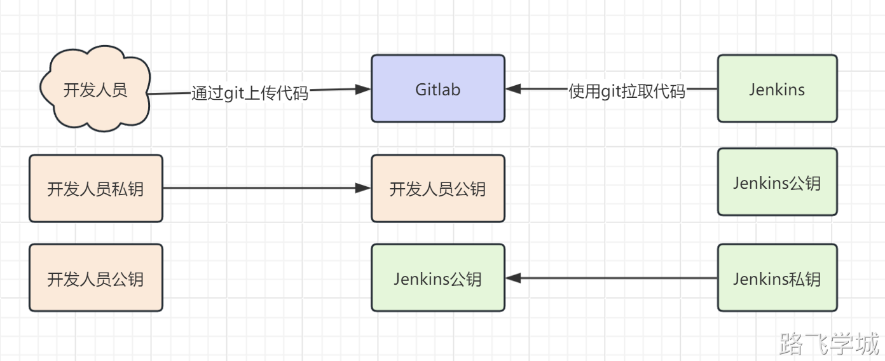
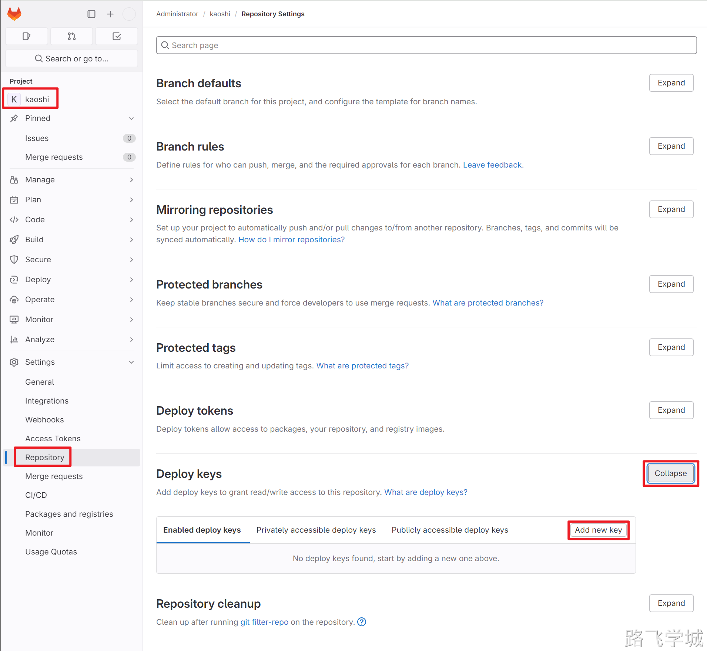
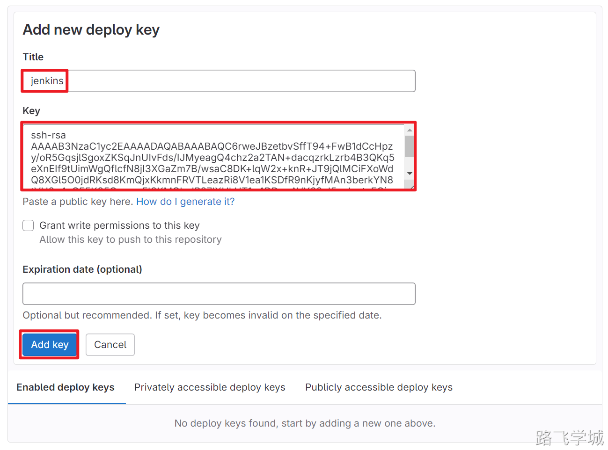
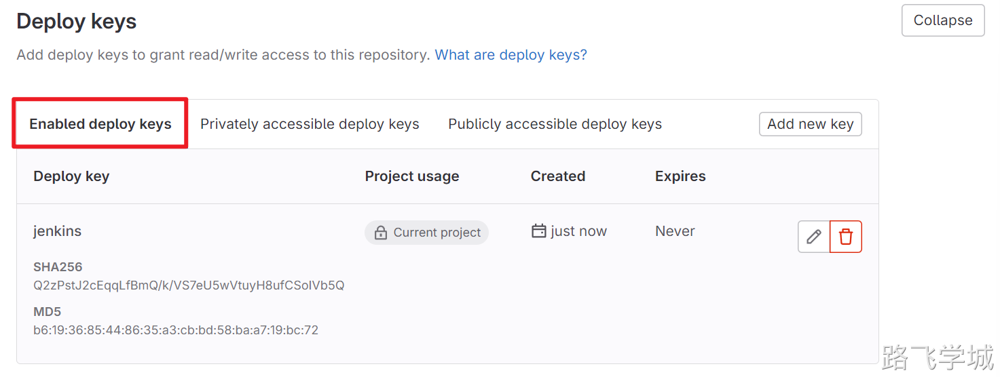
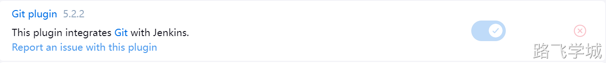
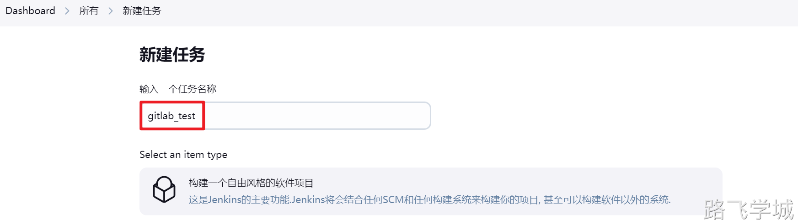
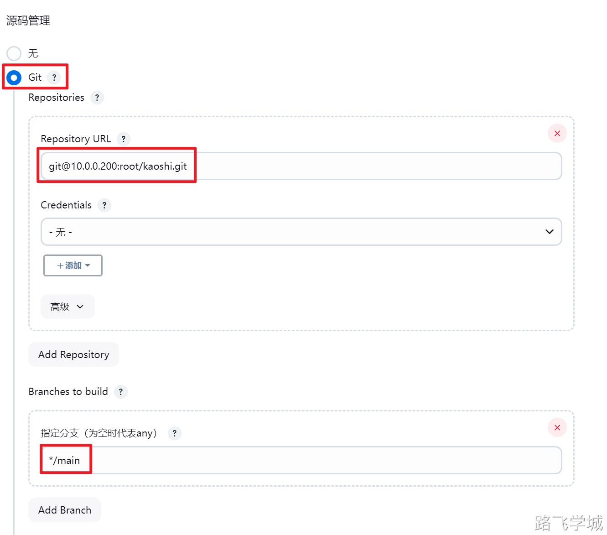
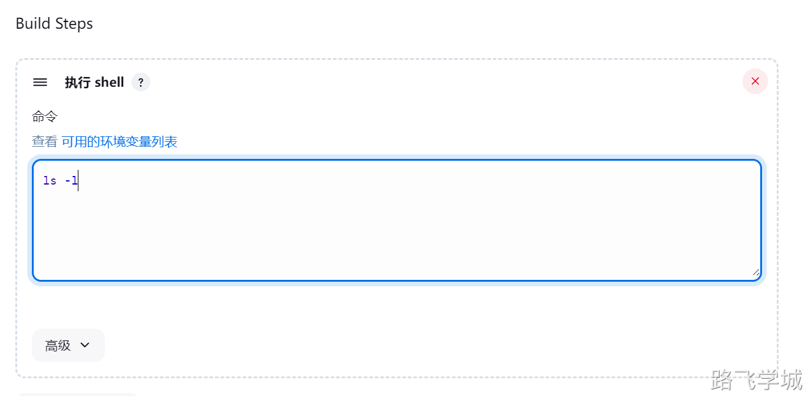
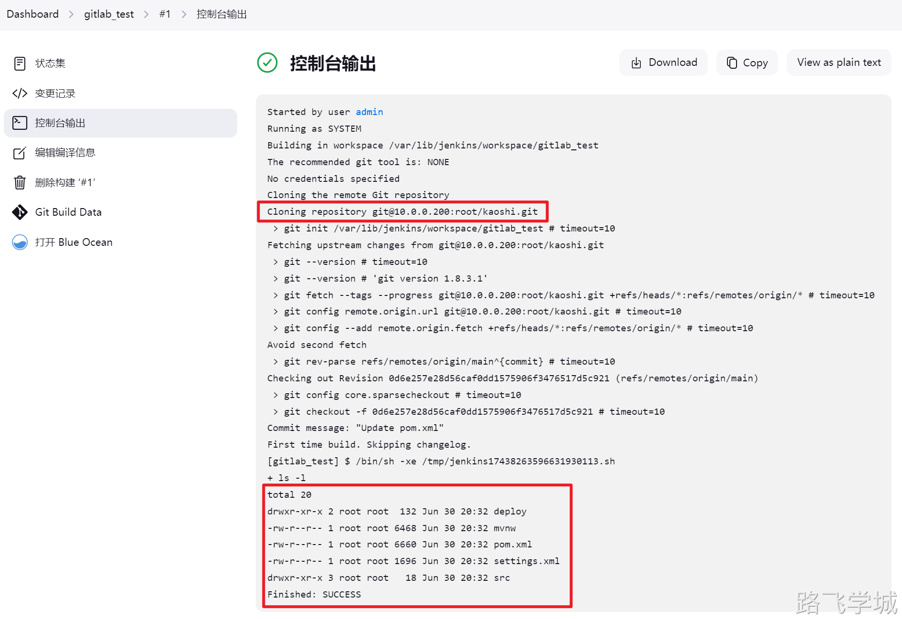

---
tags:
  - CICD/Jenkins
---

- ~ Jenkins从gitlab拉取代码

> [!info]- Jenkins与Gitlab通讯流程
> 
> 
> 开发人员将自己的公钥上传到gitlab的账户的SSH Key中
> 
> 因为Jenkins需要拉取所有代码，所以Gitlab中有一种专门的Deplay key可以用来作为部署服务器的公钥存放。
> 
> 
> 

> [!info]- Gitlab配置部署公钥
> 
> 
> 2.1 Jenkins服务器生成公钥
> 
> ```bash
> ssh-keygen
> cat .ssh/id_rsa.pub
> ```
> 
> 2.2 Gitlab添加Deploy Key
> 
> 点击项目 --> Settings --> Repository --> Deploy keys
> 
> 
> 
> 添加部署公钥
> 
> 
> 
> 查看结果
> 
> 
> 

> [!info]- Jenkins拉取代码测试
> 
> 
> 3.1 jenkins服务器手动拉取代码测试
> 
> 在jenkins服务器上执行git克隆命令
> 
> ```bash
> [root@jenkins-201 ~]# git clone git@10.0.0.200:root/kaoshi.git
> Cloning into 'kaoshi'...
> remote: Enumerating objects: 1115, done.
> remote: Counting objects: 100% (78/78), done.
> remote: Compressing objects: 100% (66/66), done.
> remote: Total 1115 (delta 33), reused 24 (delta 7), pack-reused 1037
> Receiving objects: 100% (1115/1115), 5.37 MiB | 0 bytes/s, done.
> Resolving deltas: 100% (191/191), done.
> ```
> 
> 3.2 jenkins使用git插件拉取代码
> 
> 注意，需要安装git插件
> 
> 
> 
> 
> 
> git源码管理，注意拉取分支要输入main而不是master！
> 
> 
> 
> 
> 
> 查看拉取代码结果:
> 
> 
> 

Gitlab代码提交自动触发Jnekins构建任务

新版本待测试
