---
tags:
  - CICD/Jenkins
  - Nexus
---
- ~ Nexus3安装部署


> [!install]- 二进制安装JDK
> 
> 
> [📎jdk-8u351-linux-x64.tar.gz](https://www.yuque.com/attachments/yuque/0/2024/gz/830385/1719734484968-897f7cf2-5b9c-419c-b554-526e886fcbcd.gz)
> 
> ```bash
> tar zxf jdk-8u351-linux-x64.tar.gz -C /opt/
> ln -s /opt/jdk1.8.0_351 /opt/jdk
> cp /etc/profile /etc/profile.bak
> cat >> /etc/profile << 'EOF'
> export JAVA_HOME=/opt/jdk
> export JRE_HOME=${JAVA_HOME}/jre
> export CLASSPATH=.:${JAVA_HOME}/lib:${JRE_HOME}/lib
> export PATH=$PATH:${JAVA_HOME}/bin
> EOF
> source /etc/profile
> java -version
> echo $JAVA_HOME
> echo $JRE_HOME
> ```
> 

> [!install]- 下载并安装Nexus
> 
> 
> [📎nexus-3.23.0-03-unix.tar.gz](https://www.yuque.com/attachments/yuque/0/2024/gz/830385/1719734484958-18d71e3b-1a36-4786-9dc2-319778a8cc10.gz)
> 
> 安装命令：
> 
> ```bash
> tar zxf nexus-3.23.0-03-unix.tar.gz -C /opt/
> cd /opt/
> ln -s nexus-3.23.0-03 nexus
> ```
> 

> [!run]- 创建普通用户并更改权限
> 
> 
> ```bash
> useradd nexus -s /sbin/nologin
> chown -R nexus:nexus /opt/nexus*
> chown -R nexus:nexus sonatype-work
> ```
> 

> [!systemd]- 创建systemd启动服务
> 
> 
> ```bash
> cat >/usr/lib/systemd/system/nexus.service<< EOF
> [Unit]
> Description=nexus
> 
> [Service]
> Environment=JAVA_HOME=/opt/jdk
> ExecStart=/opt/nexus/bin/nexus start
> ExecStop=/opt/nexus/bin/nexus stop
> Type=forking
> User=nexus
> Group=nexus
> 
> [Install]
> WantedBy=multi-user.target
> EOF
> ```
> 

> [!run]- 修改jvm内存使用大小
> 
> 
> 默认2G内存，我们修改为1G
> 
> ```bash
> vim /opt/nexus/bin/nexus.vmoptions
> -Xms1024m
> -Xmx1024m
> -XX:MaxDirectMemorySize=1024m
> ```

> [!systemd]- 启动并检查
> 
> 
> ```bash
> systemctl daemon-reload 
> systemctl start nexus
> netstat -lntup|grep 8081
> ps -ef|grep nexus
> ```
> 

> [!test]- 配置账户密码
> 
> 
> 打开浏览器并登陆
> 
> http://10.0.0.202:8081/
> 
> 默认账号为admin,初始密码保存在文件里：
> 
> ```bash
> cat /opt/sonatype-work/nexus3/admin.password
> ```
> 
> 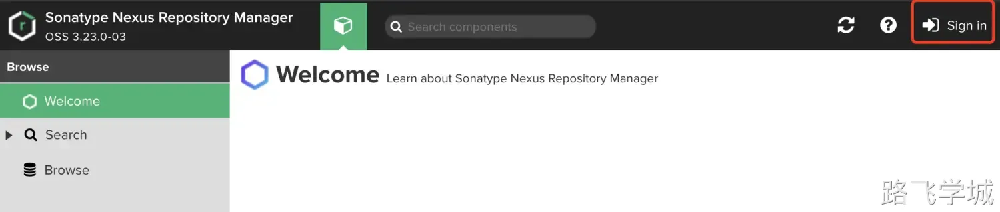
> 
> 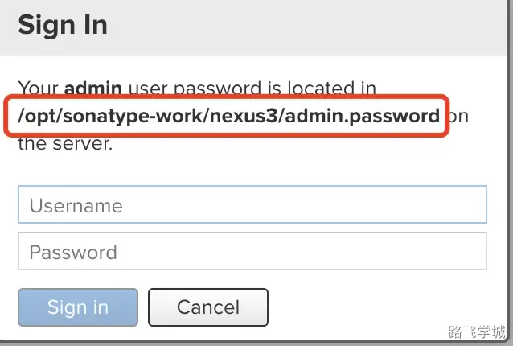
> 

> [!test]- 初始化操作
> 
> 
> 登录后需要我们修改密码:
> 
> 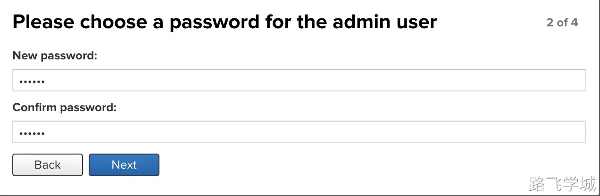
> 
> 然后禁用匿名用户访问：
> 
> 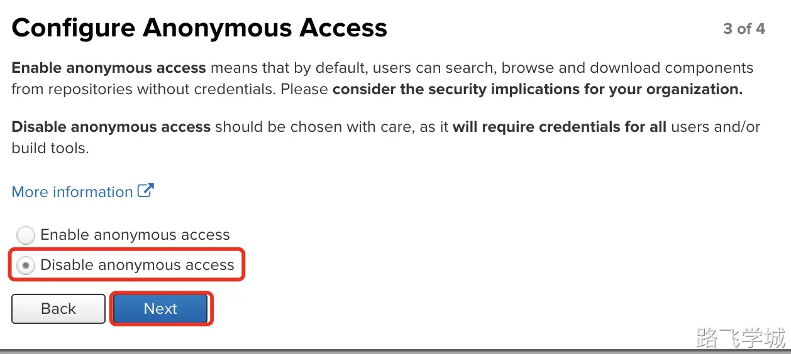
> 

> [!test]- 修改maven仓库地址
> 
> 
> 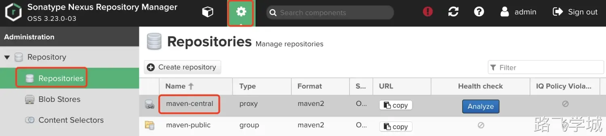
> 
> 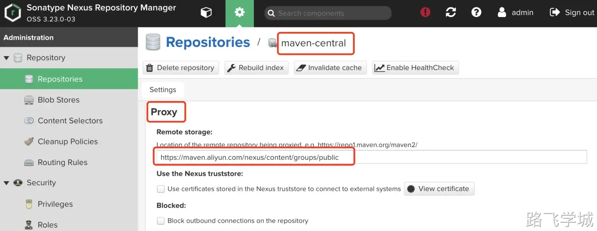
> 
> 将代理地址修改为阿里源：
> 
> https://maven.aliyun.com/nexus/content/groups/public
> 

> [!test]- 复制maven-public地址
> 
> 
> 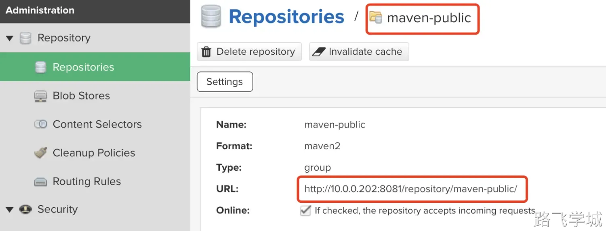
> 

将Maven配置文件提交到代码仓库里

这里我们也可以把settins.xml文件放到代码目录里，以后随着代码拉取后让mvn命令指定settings.xml文件来进行构建

```bash
[root@jenkins-201 /opt/kaoshi]# ls
mvnw  mvnw.cmd  pom.xml  README.md  settings.xml  src

[root@jenkins-201 /opt/kaoshi]# cat settings.xml
<?xml version="1.0" encoding="UTF-8"?>
<settings xmlns="http://maven.apache.org/SETTINGS/1.0.0"
  xmlns:xsi="http://www.w3.org/2001/XMLSchema-instance"
  xsi:schemaLocation="http://maven.apache.org/SETTINGS/1.0.0 http://maven.apache.org/xsd/settings-1.0.0.xsd">
  <pluginGroups>
  </pluginGroups>

  <proxies>
  </proxies>

  <servers>
    <server>   
      <id>snapshots</id>   
      <username>admin</username>   
      <password>admin</password>   
    </server>   
    <server>   
      <id>releases</id>   
      <username>admin</username>   
      <password>admin</password>   
    </server>   
    <server>   
      <id>public</id>   
      <username>admin</username>   
      <password>admin</password>   
    </server>   
  </servers>

  <mirrors>
    <mirror>
      <id>public</id>
      <mirrorOf>*</mirrorOf>
      <url>http://10.0.0.202:8081/repository/maven-public/</url>
    </mirror>
  </mirrors>

  <profiles>
    <profile>
      <id>public</id>
      <repositories>
        <repository>
          <id>public</id>
          <url>http://10.0.0.202:8081/repository/maven-public/</url>
          <releases><enabled>true</enabled></releases>
          <snapshots><enabled>true</enabled></snapshots>
        </repository>
      </repositories>
      <pluginRepositories>
        <pluginRepository>
          <id>public</id>
          <url>http://10.0.0.202:8081/repository/maven-public/</url>
          <releases><enabled>true</enabled></releases>
          <snapshots><enabled>true</enabled></snapshots>
        </pluginRepository>
      </pluginRepositories>
    </profile>
  </profiles>

  <activeProfiles>
    <activeProfile>public</activeProfile>
  </activeProfiles>
</settings>

[root@jenkins-201 /opt/kaoshi]# git add .
[root@jenkins-201 /opt/kaoshi]# git commit -m "add settings.xml"
[main 7f2df61] add settings.xml
 1 file changed, 63 insertions(+)
 create mode 100644 settings.xml
 
[root@jenkins-201 /opt/kaoshi]# git push origin
warning: push.default is unset; its implicit value is changing in
Git 2.0 from 'matching' to 'simple'. To squelch this message
and maintain the current behavior after the default changes, use:

  git config --global push.default matching

To squelch this message and adopt the new behavior now, use:

  git config --global push.default simple

See 'git help config' and search for 'push.default' for further information.
(the 'simple' mode was introduced in Git 1.7.11. Use the similar mode
'current' instead of 'simple' if you sometimes use older versions of Git)

Counting objects: 4, done.
Compressing objects: 100% (3/3), done.
Writing objects: 100% (3/3), 712 bytes | 0 bytes/s, done.
Total 3 (delta 1), reused 0 (delta 0)
To git@10.0.0.200:root/kaoshi.git
   d5cab67..7f2df61  main -> main
```

查看gitlab仓库上是否更新:

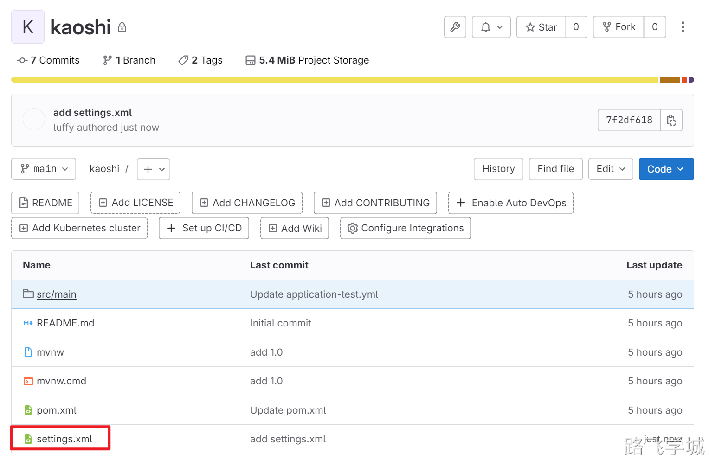
构建测试使用指定settings.xml配置

```bash
[root@jenkins-201 ~/ansible_kaoshi]# cat jenkins_deploy.sh
#!/bin/bash

# 1.构建镜像
export JAVA_HOME=/opt/jdk8
/opt/maven/bin/mvn -s settings.xml clean package

# 2.代码扫描
if [ "$sonarSkip" == "false" ];then
  /opt/sonar-scanner/bin/sonar-scanner -Dsonar.host.url=http://10.0.0.203:9000 \
  -Dsonar.projectKey=kaoshi-maven-service \
  -Dsonar.projectName=kaoshi-maven-service \
  -Dsonar.projectVersion=${releaseVersion} \
  -Dsonar.token=${sonarToken} \
  -Dsonar.ws.timeout=30 \
  -Dsonar.projectDescription="my first project" \
  -Dsonar.links.homepage=http://10.0.0.203/devops/kaoshi-maven-service \
  -Dsonar.sources=src \
  -Dsonar.sourceEncoding=UTF-8 \
  -Dsonar.java.binaries=target/classes \
  -Dsonar.java.test.binaries=target/test-classes \
  -Dsonar.java.surefire.report=target/surefire-reports
fi

# 3.替换系统变量
cd /root/ansible_kaoshi/
sed -i "/APP_VERSION=/c APP_VERSION=$releaseVersion" kaoshi.env
sed -i "/APP_ENV=/c APP_ENV=${deployEnv,,}" kaoshi.env

# 4.调用Ansible剧本
ansible-playbook -l $deployHosts ansible_kaoshi.yaml -e "app_version=$releaseVersion"
```

Jenkins验证测试:

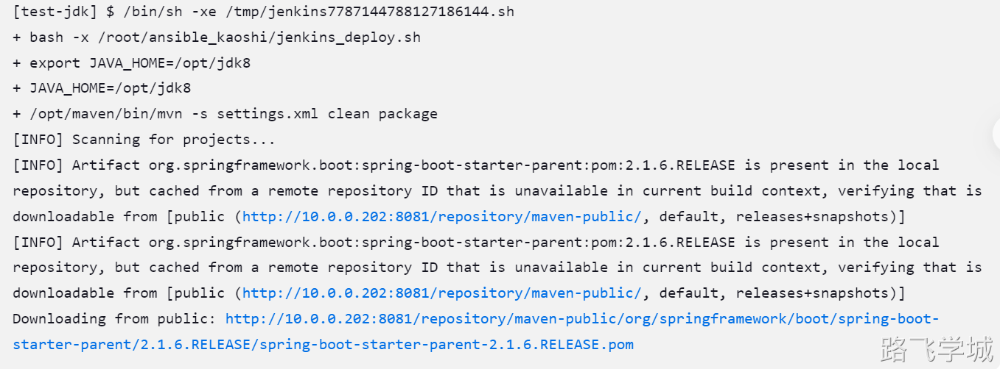


- ~ 制品库实战

> [!info]- 制品相关概念
> 
> 
> 制品 --> 编译后的代码包 --> jar包
> 
> 制品库 --> 按照一定规则存放制品的仓库 --> nexus
> 
> 
> 
> SNAPSHOT --> 还没有开发完毕，临时的版本
> 
> release  --> 已经开发完毕，可以直接对外发布
> 
> 
> 
> <version>3.9.3-SNAPSHOT</version>
> 
> <version>3.9.3-release</version>
> 
> 
> 
> xzs-3.9.0-SNAPSHOT.jar
> 
> xzs-3.9.0-release.jar
> 

> [!info]- 创建制品库
> 
> 
> 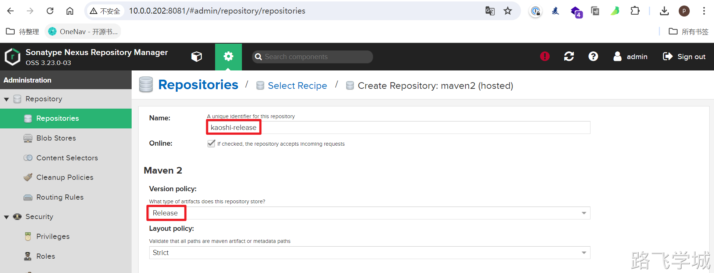
> 
> 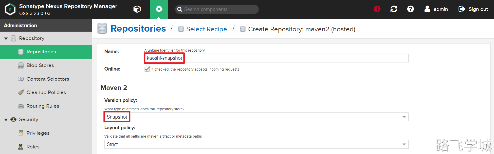
> 
> 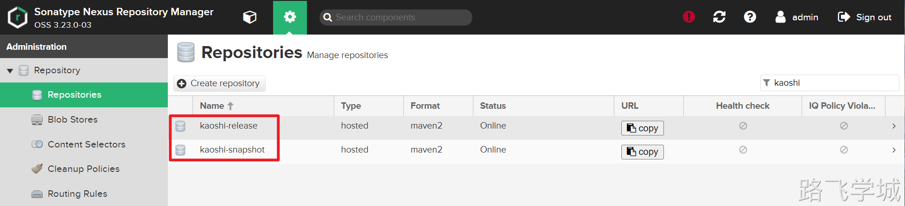
> 

- ~ 上传制品

> [!test]- SNAPSHOT版本上传
> 
> 
> 修改pom.xml文件为SNAPSHOT版本
> 
> ```bash
> [root@jenkins-201 /var/lib/jenkins/workspace/test-jdk]# cat pom.xml |grep SNAPSHOT
>     <version>3.9.2-SNAPSHOT</version>
> ```
> 
> 构建完成后查看jar包
> 
> ```bash
> [root@jenkins-201 /var/lib/jenkins/workspace/test-jdk]# ll target/
> total 48576
> drwxr-xr-x 5 root root      234 Jun 30 16:44 classes
> drwxr-xr-x 3 root root       25 Jun 30 16:44 generated-sources
> drwxr-xr-x 2 root root       28 Jun 30 16:44 maven-archiver
> drwxr-xr-x 3 root root       35 Jun 30 16:44 maven-status
> -rw-r--r-- 1 root root 40521522 Jun 30 16:44 xzs-3.9.2-SNAPSHOT.jar
> -rw-r--r-- 1 root root  9218768 Jun 30 16:44 xzs-3.9.2-SNAPSHOT.jar.original
> ```
> 
> maven上传制品命令：
> 
> ```bash
> mvn -s settings.xml deploy:deploy-file \
> -DgroupId=com.mindskip \
> -DartifactId=xzs \
> -Dversion=3.9.2-SNAPSHOT \
> -Dpackaging=jar \
> -Dfile=target/xzs-3.9.2-SNAPSHOT.jar \
> -Durl=http://10.0.0.202:8081/repository/kaoshi-snapshot/ \
> -DrepositoryId=snapshots
> ```
> 
> 查看制品库中上传后的制品
> 
> 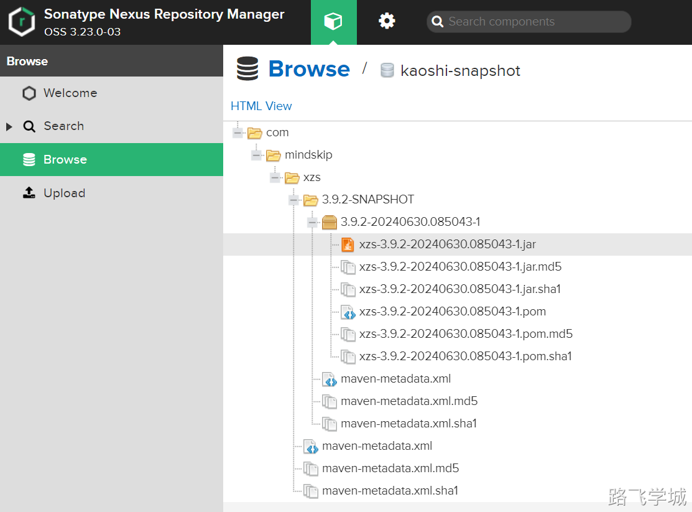
> 

> [!test]- RELEASE版本上传
> 
> 
> 查看版本信息
> 
> ```bash
> [root@jenkins-201 /var/lib/jenkins/workspace/test-jdk]# cat pom.xml |grep "3.9.2"
>     <version>3.9.2</version>
> ```
> 
> maven构建
> 
> ```bash
> mvn -s settings.xml clean package
> ```
> 
> 查看构建后制品
> 
> ```bash
> [root@jenkins-201 /var/lib/jenkins/workspace/test-jdk]# ll target/
> total 48576
> drwxr-xr-x 5 root root      234 Jun 30 16:59 classes
> drwxr-xr-x 3 root root       25 Jun 30 16:59 generated-sources
> drwxr-xr-x 2 root root       28 Jun 30 16:59 maven-archiver
> drwxr-xr-x 3 root root       35 Jun 30 16:59 maven-status
> -rw-r--r-- 1 root root 40521496 Jun 30 16:59 xzs-3.9.2.jar
> -rw-r--r-- 1 root root  9218741 Jun 30 16:59 xzs-3.9.2.jar.original
> ```
> 
> 制品上传命令
> 
> ```bash
> mvn -s settings.xml deploy:deploy-file \
> -DgroupId=com.mindskip \
> -DartifactId=xzs \
> -Dversion=3.9.2 \
> -Dpackaging=jar \
> -Dfile=target/xzs-3.9.2.jar \
> -Durl=http://10.0.0.202:8081/repository/kaoshi-release/ \
> -DrepositoryId=releases
> ```
> 
> 查看制品库的效果：
> 
> 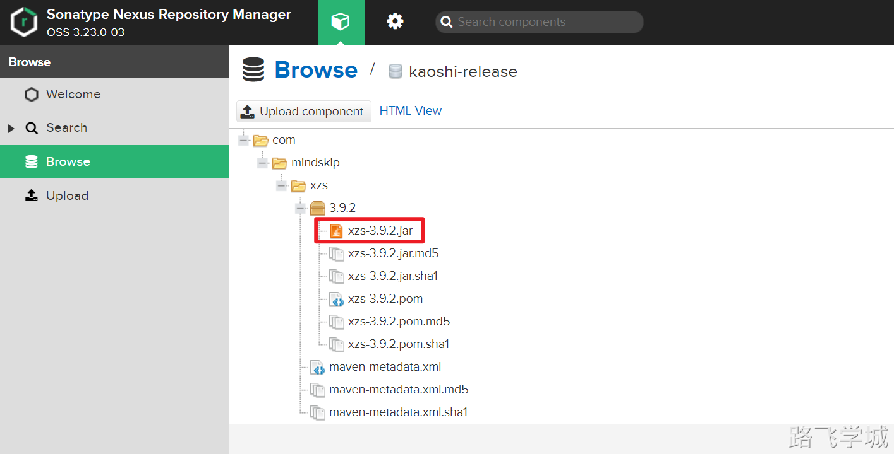
> 

- ~ 下载制品

> [!run]- 下载SNAPSHOT版本制品
> 
> 
> 因为SNAPSHOT制品有时间戳，所以需要先查询
> 
> ```bash
> curl -u admin:admin -X GET "http://10.0.0.202:8081/service/rest/v1/search/assets?repository=kaoshi-snapshot&maven.groupId=com.mindskip&maven.artifactId=xzs&maven.baseVersion=3.9.2-SNAPSHOT"
> ```
> 
> 使用jq结构化解析查询结果:
> 
> ```bash
> [root@jenkins-201 ~/test]# curl -s -u admin:admin -X GET "http://10.0.0.202:8081/service/rest/v1/search/assets?repository=kaoshi-snapshot&maven.groupId=com.mindskip&maven.artifactId=xzs&maven.baseVersion=3.9.2-SNAPSHOT" | jq '.items[] | .downloadUrl'
> "http://10.0.0.202:8081/repository/kaoshi-snapshot/com/mindskip/xzs/3.9.2-SNAPSHOT/xzs-3.9.2-20240630.085043-1.jar"
> "http://10.0.0.202:8081/repository/kaoshi-snapshot/com/mindskip/xzs/3.9.2-SNAPSHOT/xzs-3.9.2-20240630.085043-1.jar.md5"
> "http://10.0.0.202:8081/repository/kaoshi-snapshot/com/mindskip/xzs/3.9.2-SNAPSHOT/xzs-3.9.2-20240630.085043-1.jar.sha1"
> "http://10.0.0.202:8081/repository/kaoshi-snapshot/com/mindskip/xzs/3.9.2-SNAPSHOT/xzs-3.9.2-20240630.085043-1.pom"
> "http://10.0.0.202:8081/repository/kaoshi-snapshot/com/mindskip/xzs/3.9.2-SNAPSHOT/xzs-3.9.2-20240630.085043-1.pom.md5"
> "http://10.0.0.202:8081/repository/kaoshi-snapshot/com/mindskip/xzs/3.9.2-SNAPSHOT/xzs-3.9.2-20240630.085043-1.pom.sha1"
> ```
> 
> 获取到jar包地址后就可以下载了:
> 
> ```bash
> curl -s -u admin:admin -o xzs-3.9.2-SNAPSHOT.jar http://10.0.0.202:8081/repository/kaoshi-snapshot/com/mindskip/xzs/3.9.2-SNAPSHOT/xzs-3.9.2-20240630.085043-1.jar
> ```
> 

> [!run]- 下载release版本制品
> 
> 
> ```bash
> curl -s -u admin:admin -o xzs-3.9.2.jar http://10.0.0.202:8081/repository/kaoshi-release/com/mindskip/xzs/3.9.2/xzs-3.9.2.jar
> ```
> 

> [!info]- 使用插件获取版本信息
> 
> 
> 安装插件Maven Artifact ChoiceListProvider (Nexus)可以动态列出nexus上的包列表
> 
> 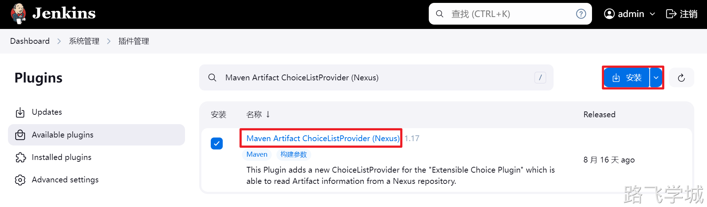
> 
> 在任务中，选择添加参数：Extensible Choice
> 
> 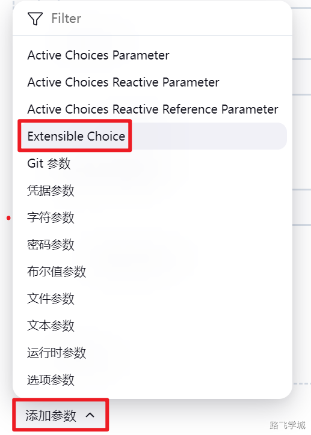
> 
> 然后在Choice Provider中选择Nexus3
> 
> 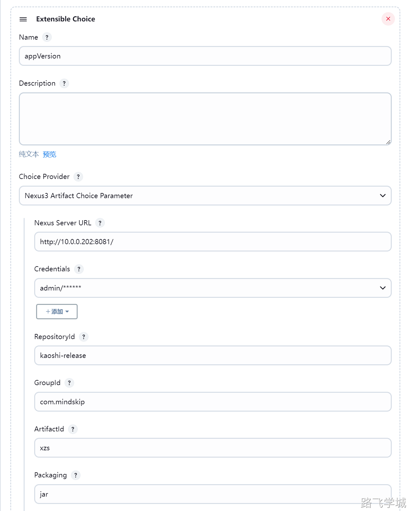
> 
> 最终执行时的效果:
> 
> 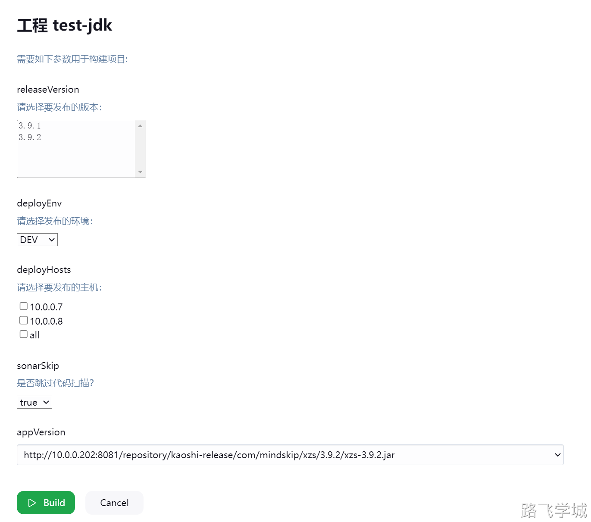
> 
> 