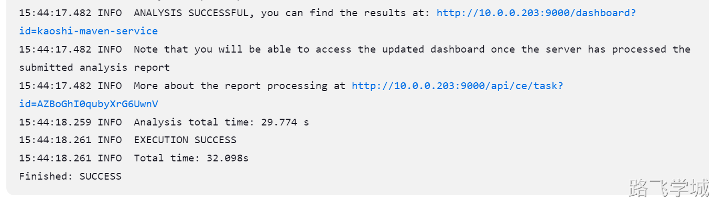

---
tags:
  - CICD/Jenkins
---
- ~ SonarQube 9.9安装部署

> [!install]- 安装依赖并修改系统内核参数
> 
> 
> SonarQube依赖ES数据库，如果不修改系统参数，ES启动失败，也会导致SonarQube启动失败
> 
> https://docs.sonarsource.com/sonarqube/latest/setup-and-upgrade/pre-installation/linux/
> 
> ```bash
> #安装常用工具
> yum install wget unzip -y
> 
> #写入内核参数
> echo "vm.max_map_count=524288" >> /etc/sysctl.conf
> echo "fs.file-max = 13107" >> /etc/sysctl.conf
> sysctl -p
> ```

> [!install]- 安装和配置PostgreSQL数据库
> 
> 
> 安装PostgreSQL 12：
> 
> ```bash
> yum install -y https://download.postgresql.org/pub/repos/yum/reporpms/EL-7-x86_64/pgdg-redhat-repo-latest.noarch.rpm
> yum install -y postgresql12 postgresql12-server
> /usr/pgsql-12/bin/postgresql-12-setup initdb
> systemctl enable postgresql-12
> systemctl start postgresql-12
> systemctl status postgresql-12
> ```
> 
> 为SonarQube创建数据库和用户：
> 
> ```bash
> sudo -i -u postgres
> createuser sonar
> createdb sonarqube -O sonar
> psql
> ALTER USER sonar WITH PASSWORD 'sonar';
> \q
> exit
> ```
> 
> 修改用户认证方式，不然web服务会启动失败
> 
> ```bash
> vim /var/lib/pgsql/12/data/pg_hba.conf
> 
> # IPv4 local connections:
> host    all             all             127.0.0.1/32            md5
> # IPv6 local connections:
> host    all             all             ::1/128                 md5
> ```
> 
> 修改重新加载配置
> 
> ```bash
> systemctl reload postgresql-12
> systemctl restart postgresql-12
> ```
> 

> [!install]- 安装Java17
> 
> [📎jdk-17_linux-x64_bin.rpm](https://www.yuque.com/attachments/yuque/0/2024/rpm/830385/1719722991912-ee3efe11-b535-45f7-9746-f28bdfe872ef.rpm)
> 
> ```bash
> rpm -ivh jdk-17_linux-x64_bin.rpm
> java -version
> ```
> 
 
> [!config]- 下载并配置SonarQube
> 
> 
> 下载SonarQube：
> 
> [📎sonarqube-9.9.6.92038.zip](https://www.yuque.com/attachments/yuque/0/2024/zip/830385/1719726518431-fa11843f-cf46-4fc6-a73f-67b84f0291ae.zip)
> 
> ```bash
> cd /opt
> unzip sonarqube-9.9.6.92038.zip
> mv sonarqube-9.9.6.92038 sonarqube
> ```
> 
> 创建Sonar用户：
> 
> ```bash
> useradd sonar -M -s /sbin/nologin
> chown -R sonar:sonar /opt/sonarqube*
> ```
> 
> 编辑SonarQube配置文件：
> 
> ```bash
> vim /opt/sonarqube/conf/sonar.properties
> ```
> 
> 在文件中设置数据库连接信息(追加，不是清空)：
> 
> ```bash
> sonar.jdbc.username=sonar
> sonar.jdbc.password=sonar
> sonar.jdbc.url=jdbc:postgresql://localhost/sonarqube
> ```
> 
> 配置SonarQube服务
> 
> ```bash
> cat > /etc/systemd/system/sonarqube.service << 'EOF'
> [Unit]
> Description=SonarQube service
> After=syslog.target network.target
> 
> [Service]
> Type=forking
> ExecStart=/opt/sonarqube/bin/linux-x86-64/sonar.sh start
> ExecStop=/opt/sonarqube/bin/linux-x86-64/sonar.sh stop
> User=sonar
> Group=sonar
> Restart=always
> LimitNOFILE=131072
> LimitNPROC=8192
> 
> [Install]
> WantedBy=multi-user.target
> EOF
> ```
> 

> [!systemd]- 启动并启用SonarQube服务
> 
> 
> ```bash
> systemctl enable sonarqube
> systemctl start sonarqube
> ```
> 

> [!test]- 访问SonarQube
> 
> 
> 打开浏览器，访问 http://10.0.0.203:9000。默认管理员账户是 admin，密码也是 admin。
> 
> 
> 
> 修改密码
> 
> 旧密码与新密码不能一样
> 
> 
> 
> 
> 
> 安装中文插件
> 
> 
> 
> 
> 
> 
> 
> 
> 
> 
> 

- ~ Sonar Scanner管理
 
Scanner是安装在jenkins服务器的,在需要扫描的代码目录下执行扫描的命令后会将结果 发送到sonarQube服务器

> [!install]- 安装Scanner
> 
> 
> 官方文档：
> 
> https://docs.sonarsource.com/sonarqube/latest/analyzing-source-code/scanners/sonarscanner/
> 
> 安装步骤：
> 
> [📎sonar-scanner-cli-6.1.0.4477-linux-x64.zip](https://www.yuque.com/attachments/yuque/0/2024/zip/830385/1719728380908-f3684246-1090-4550-9415-55875af7a33f.zip)
> 
> ```bash
> #下载安装包
> cd /opt/
> #wget https://binaries.sonarsource.com/Distribution/sonar-scanner-cli/sonar-scanner-cli-6.1.0.4477-linux-x64.zip
> 
> #解压
> unzip sonar-scanner-cli-6.1.0.4477-linux-x64.zip
> mv sonar-scanner-6.1.0.4477-linux-x64 sonar-scanner
> 
> #配置环境变量
> vim /etc/profile
> export SONAR_SCANNER_HOME=/opt/sonar-scanner
> export PATH=/usr/local/sbin:/usr/local/bin:/usr/sbin:/usr/bin:/root/bin:/opt/maven/bin:/opt/sonar-scanner/bin
> 
> #生效华景变量
> source /etc/profile
> 
> #测试生效
> sonar-scanner -v
> ```
> 
> 版本信息：
> 
> ```bash
> [root@jenkins-201 /opt]# sonar-scanner -v
> 14:25:15.725 INFO  Scanner configuration file: /opt/sonar-scanner/conf/sonar-scanner.properties
> 14:25:15.728 INFO  Project root configuration file: NONE
> 14:25:15.762 INFO  SonarScanner CLI 6.1.0.4477
> 14:25:15.764 INFO  Java 17.0.11 Eclipse Adoptium (64-bit)
> 14:25:15.764 INFO  Linux 3.10.0-957.el7.x86_64 amd64
> ```
> 

- ~ 扫描参数配置

> [!run]- java项目扫描
> 
> 
> 命令行形式：
> 
> ```bash
> #进入已经编译后的java代码目录
> cd /var/lib/jenkins/workspace/test-jdk/
> 
> #执行扫描命令
> sonar-scanner -Dsonar.host.url=http://10.0.0.203:9000 \
> -Dsonar.projectKey=kaoshi-maven-service \
> -Dsonar.projectName=kaoshi-maven-service \
> -Dsonar.projectVersion=3.9.0 \
> -Dsonar.login=admin \
> -Dsonar.password=admin123 \
> -Dsonar.ws.timeout=30 \
> -Dsonar.projectDescription="my first project" \
> -Dsonar.links.homepage=http://10.0.0.203/devops/kaoshi-maven-service \
> -Dsonar.sources=src \
> -Dsonar.sourceEncoding=UTF-8 \
> -Dsonar.java.binaries=target/classes \
> -Dsonar.java.test.binaries=target/test-classes \
> -Dsonar.java.surefire.report=target/surefire-reports
> ```
> 
> 配置文件形式：
> 
> ```bash
> vim sonar-project.properties
> #定义唯一的关键字
> sonar.projectKey=kaoshi-maven-service
> 
> #定义项目名称名称
> sonar.projectName=kaoshi-maven-service
> 
> #定义项目的版本信息
> sonar.projectVersion=3.9.0
> 
> #执行项目编码
> sonar.sourceEncoding=UTF-8
> 
> #项目描述信息
> sonar.projectDescription="my first project"
> 
> #定义扫描代码的目录位置
> sonar.sources=src
> sonar.java.binaries=target/classes
> sonar.java.test.binaries=target/test-classes
> sonar.java.surefire.report=target/surefire-reports
> 
> #服务器及认证信息
> sonar.host.url=http://10.0.0.203:9000 
> sonar.login=admin
> sonar.password=admin123
> 
> #项目首页
> sonar.links.homepage=http://10.0.0.203/devops/kaoshi-maven-service
> ```
> 
> 配置文件形式执行命令:
> 
> ```bash
> sonar-scanner -Dproject.settings=sonar-project.properties
> ```
> 
> 扫描结果：
> 
> 
> 
> 
> 

> [!info]- 前端项目扫描
> 
> 
> 扫描命令：
> 
> ```bash
> cd ~/xzs-mysql-master/source/vue/xzs-student
> sonar-scanner \
>   -Dsonar.projectKey=kaoshi-vue \
>   -Dsonar.projectName=kaoshi-vue \
>   -Dsonar.sources=src \
>   -Dsonar.host.url=http://10.0.0.203:9000 \
>   -Dsonar.login=admin \
>   -Dsonar.password=admin123 \
>   -Dsonar.projectVersion=1.0 \
>   -Dsonar.ws.timeout=30 \
>   -Dsonar.projectDescription="my first project" \
>   -Dsonar.sourceEncoding=UTF-8
> ```
> 
> 扫描结果;
> 
> 
> 
> 
> 

- ~ Jenkins与SonarQube集成
  
> [!test]- SonarQube登录密码优化
> 
> 
> 扫描任务中有一条警告是说使用密码形式不安全，以后不会在支持
> 
> 
> 
> 
> 
> 安全的做法应该是使用用户的Token作为登录凭证，而不是帐号密码，我们可以在用户信息中生成口令，注意保存，刷新就不会显示了
> 
> 
> 
> 有了令牌之后，我们就可以将原来扫描命令中的帐号密码替换成令牌
> 
> ```bash
> #进入已经编译后的java代码目录
> cd /var/lib/jenkins/workspace/test-jdk/
> 
> #执行扫描命令
> sonar-scanner -Dsonar.host.url=http://10.0.0.203:9000 \
> -Dsonar.projectKey=kaoshi-maven-service \
> -Dsonar.projectName=kaoshi-maven-service \
> -Dsonar.projectVersion=3.9.0 \
> -Dsonar.login=sqa_48b270cb5f1c1df6a8b5bda7c1b2805728e10ff7 \
> -Dsonar.ws.timeout=30 \
> -Dsonar.projectDescription="my first project" \
> -Dsonar.links.homepage=http://10.0.0.203/devops/kaoshi-maven-service \
> -Dsonar.sources=src \
> -Dsonar.sourceEncoding=UTF-8 \
> -Dsonar.java.binaries=target/classes \
> -Dsonar.java.test.binaries=target/test-classes \
> -Dsonar.java.surefire.report=target/surefire-reports
> ```
 
> [!info]- 将token保存在Jenkins凭证中
> 
> 
> 
> 
> 
> 
> 接下来我们可以在项目中添加构建环境，然后我们的任务中就可以使用变量来读取token的值。
> 
> 
> 
> 接下来在构建步骤中测试一下是否可以读取 
> 
> 
> 
> 执行后查看构建信息我们可以发现这个token默认是不显示的
> 
> 
> 
> 我们将这个变量打印到日志里再观察发现确实是可以直接使用的
> 
> 
> 
> 
> 
> 接下来我们带入扫描参数实测一下是否可以正常扫描，记得要使用绝对路径，否则jenkins会提示命令找不到:
> 
> ```bash
> /opt/sonar-scanner/bin/sonar-scanner -Dsonar.host.url=http://10.0.0.203:9000 \
> -Dsonar.projectKey=kaoshi-maven-service \
> -Dsonar.projectName=kaoshi-maven-service \
> -Dsonar.projectVersion=3.9.0 \
> -Dsonar.login=${sonarToken} \
> -Dsonar.ws.timeout=30 \
> -Dsonar.projectDescription="my first project" \
> -Dsonar.links.homepage=http://10.0.0.203/devops/kaoshi-maven-service \
> -Dsonar.sources=src \
> -Dsonar.sourceEncoding=UTF-8 \
> -Dsonar.java.binaries=target/classes \
> -Dsonar.java.test.binaries=target/test-classes \
> -Dsonar.java.surefire.report=target/surefire-reports
> ```
> 
> 
> 
> 最终构建完成：
> 
> 
> 集成在发布脚本中
> 
> ```bash
> [root@jenkins-201 ~/ansible_kaoshi]# cat jenkins_deploy.sh
> #!/bin/bash
> 
> 
> # 1.构建镜像
> export JAVA_HOME=/opt/jdk8
> /opt/maven/bin/mvn clean package
> 
> # 2.代码扫描
> /opt/sonar-scanner/bin/sonar-scanner -Dsonar.host.url=http://10.0.0.203:9000 \
> -Dsonar.projectKey=kaoshi-maven-service \
> -Dsonar.projectName=kaoshi-maven-service \
> -Dsonar.projectVersion=${releaseVersion} \
> -Dsonar.login=${sonarToken} \
> -Dsonar.ws.timeout=30 \
> -Dsonar.projectDescription="my first project" \
> -Dsonar.links.homepage=http://10.0.0.203/devops/kaoshi-maven-service \
> -Dsonar.sources=src \
> -Dsonar.sourceEncoding=UTF-8 \
> -Dsonar.java.binaries=target/classes \
> -Dsonar.java.test.binaries=target/test-classes \
> -Dsonar.java.surefire.report=target/surefire-reports
> 
> # 3.替换系统变量
> cd /root/ansible_kaoshi/
> sed -i "/APP_VERSION=/c APP_VERSION=$releaseVersion" kaoshi.env
> sed -i "/APP_ENV=/c APP_ENV=${deployEnv,,}" kaoshi.env
> 
> # 4.调用Ansible剧本
> ansible-playbook -l $deployHosts ansible_kaoshi.yaml -e "app_version=$releaseVersion"
> ```
> 
> 发布结果：
> 
> 
> 
> 

> [!test]- 添加跳过扫描步骤
> 
> 
> 新增加一个选项，已提供是否跳过代码扫描
> 
> 
> 
> 
> 
> 
> 
> 修改发布脚本，添加判断逻辑:
> 
> ```bash
> #!/bin/bash
> 
> # 1.构建镜像
> export JAVA_HOME=/opt/jdk8
> /opt/maven/bin/mvn clean package
> 
> # 2.代码扫描
> if [ "$sonarSkip" == "false" ];then
>   /opt/sonar-scanner/bin/sonar-scanner -Dsonar.host.url=http://10.0.0.203:9000 \
>   -Dsonar.projectKey=kaoshi-maven-service \
>   -Dsonar.projectName=kaoshi-maven-service \
>   -Dsonar.projectVersion=${releaseVersion} \
>   -Dsonar.token=${sonarToken} \
>   -Dsonar.ws.timeout=30 \
>   -Dsonar.projectDescription="my first project" \
>   -Dsonar.links.homepage=http://10.0.0.203/devops/kaoshi-maven-service \
>   -Dsonar.sources=src \
>   -Dsonar.sourceEncoding=UTF-8 \
>   -Dsonar.java.binaries=target/classes \
>   -Dsonar.java.test.binaries=target/test-classes \
>   -Dsonar.java.surefire.report=target/surefire-reports
> fi
> 
> # 3.替换系统变量
> cd /root/ansible_kaoshi/
> sed -i "/APP_VERSION=/c APP_VERSION=$releaseVersion" kaoshi.env
> sed -i "/APP_ENV=/c APP_ENV=${deployEnv,,}" kaoshi.env
> 
> # 4.调用Ansible剧本
> ansible-playbook -l $deployHosts ansible_kaoshi.yaml -e "app_version=$releaseVersion"
> ```
> 
> 执行后可以发现确实跳过了代码扫描
> 
> 
> 

> [!test]- Jenkins使用SonarQube插件
> 
> 
> 插件名称：sonarqube scanner
> 
> 
> 
> 我们可以在这个插件中，将sonarqube的一些信息写进去
> 
> 
> 


