---
tags:
  - CICD/Jenkins
---

> [!info]- git参数-选择代码版本
> 
> 
> 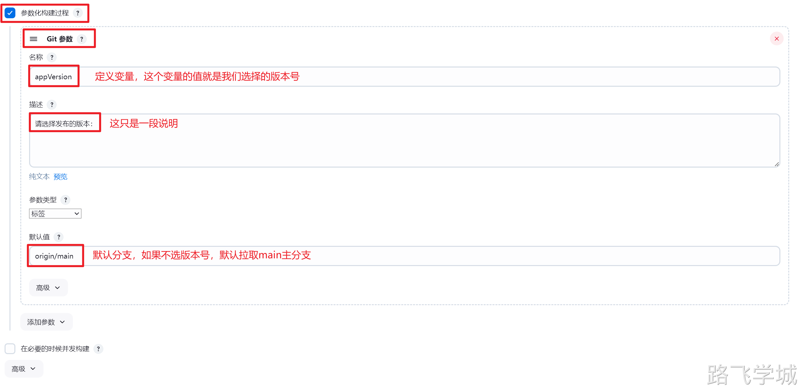
> 
> 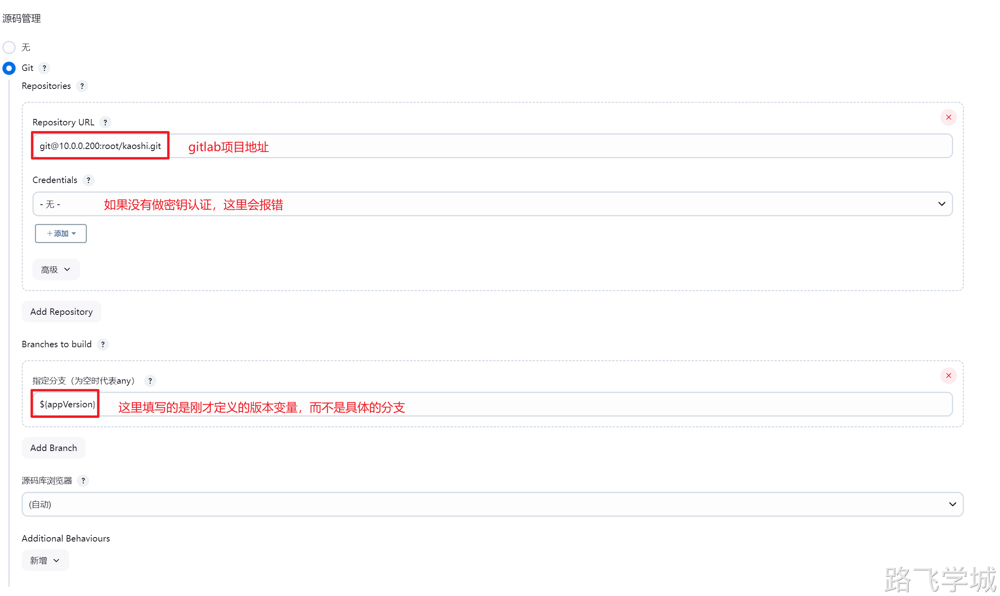
> 
> 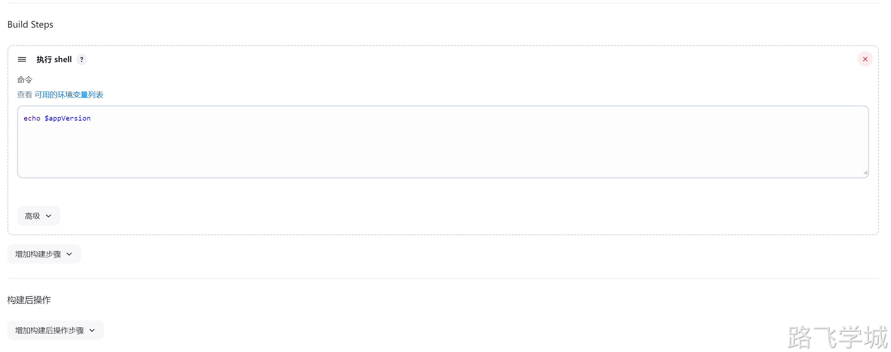
> 
> 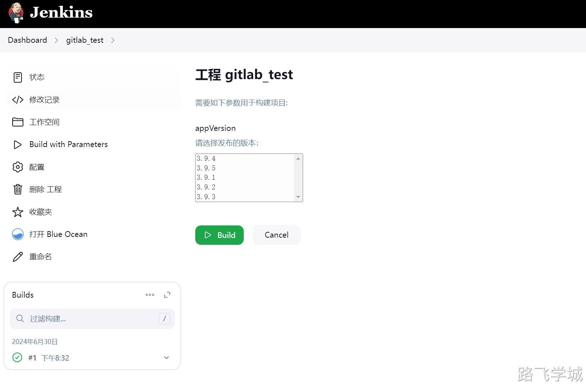
> 
> 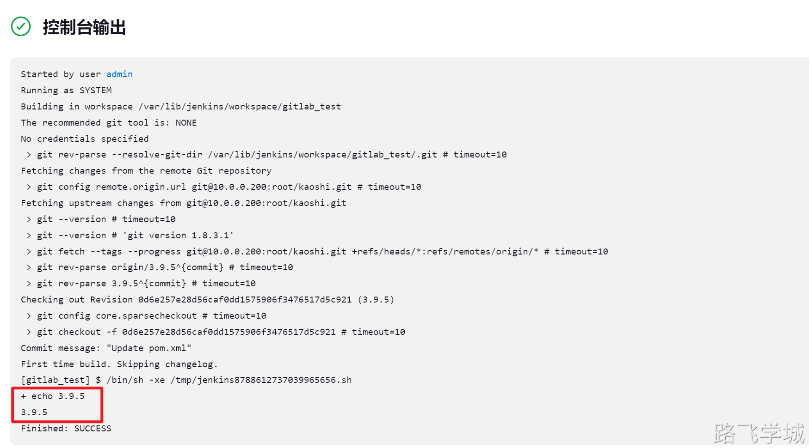
> 
> 查看拉取下来的代码版本信息：
> 
> ```bash
> [root@jenkins-201 /var/lib/jenkins/workspace/gitlab_test]# sed -n '8p' pom.xml
>     <version>3.9.5</version>
> ```
> 
> 单项选择-发布环境
> 
> 需要安装Active Choices Parameter插件
> 
> 此插件提供了单项选择，多项选择和动态选择
> 
> 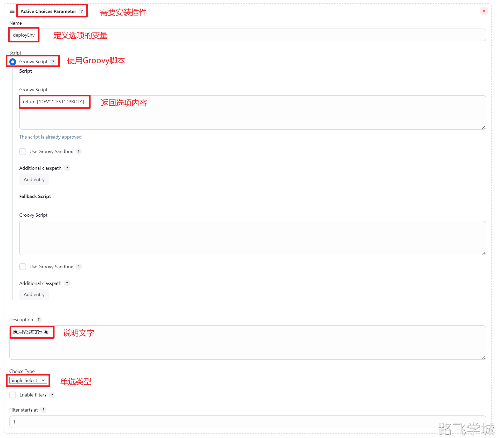
> 
> 多项选择-发布主机
> 
> Active Choices Parameter插件除了提供多项选择以外，还具有根据其他选项动态返回不同内容的能力
> 
> 这里我们可以根据选择的发布环境不同，返回不同的主机列表清单
> 
> 
> 
> 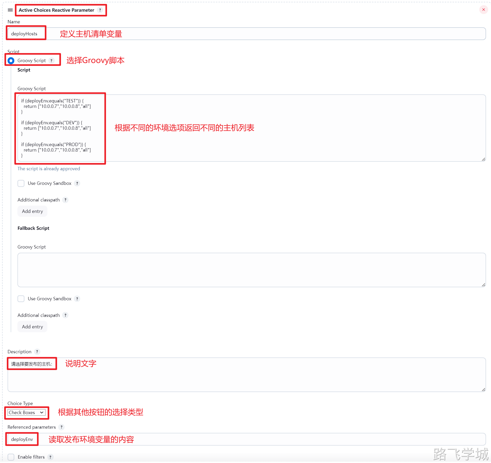
> 
> 单项选择-发布方式
> 
> 
> 
> 调用Ansible进行发布任务
> 
> 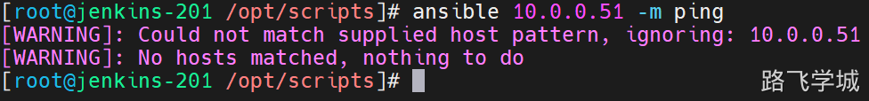
> 
> 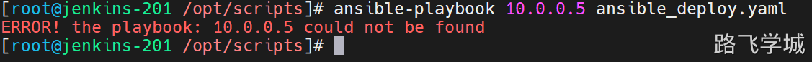
> 
> 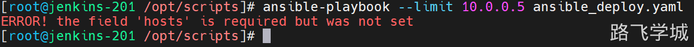
> 
> 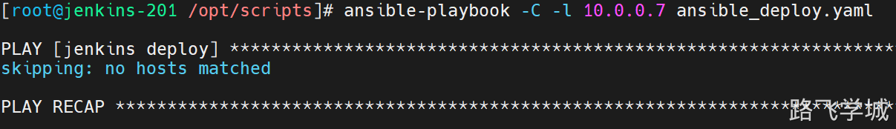
> 
> 
> 
> 如果结合动态返回主机IP地址列表，而Ansible正好支持以逗号分隔的主机列表
> 
> ansible-playbook -l 10.0.0.7,10.0.0.8 -e "version=v1.0" deploy.yaml 
> 
> ```bash
> [root@jenkins-201 /opt/scripts]# cat deploy.sh
> #!/bin/bash
> deploy(){
>   tar zcf ${appVersion}.tar.gz *
>   ansible-playbook -l ${deployHost} -e "version=${appVersion} workspace=${WORKSPACE}" /opt/scripts/ansible_deploy.yaml
>   rm -rf ${appVersion}.tar.gz
> }
> 
> rollback(){
>   ansible-playbook -l ${deployHost} -e "version=${appVersion}" /opt/scripts/ansible_rollback.yaml
> }
> 
> #发布流程
> if [ "${deployType}" == "deploy" ];then
>   deploy
> else
>   rollback
> fi
> 
> [root@jenkins-201 /opt/scripts]# cat ansible_deploy.yaml
> - name: jenkins deploy
>   hosts: TEST,PROD
>   tasks:
>   - name: mkdir code
>     file:
>       path: "/code/{{ version }}"
>       state: directory
> 
>   - name: unarchive code
>     unarchive:
>       src: "{{ workspace }}/{{ version }}.tar.gz"
>       dest: "/code/{{ version }}"
> 
>   - name: rm old link
>     file:
>       path: /code/www
>       state: absent
> 
>   - name: create new link
>     file:
>       src: "/code/{{ version }}"
>       dest: /code/www
>       state: link
> 
> [root@jenkins-201 /opt/scripts]# cat ansible_rollback.yaml
> - name: jenkins deploy
>   hosts: TEST,PROD
>   tasks:
>   - name: rm old link
>     file:
>       path: /code/www
>       state: absent
> 
>   - name: create new link
>     file:
>       src: "/code/{{ version }}"
>       dest: /code/www
>       state: link
> ```
> 
> 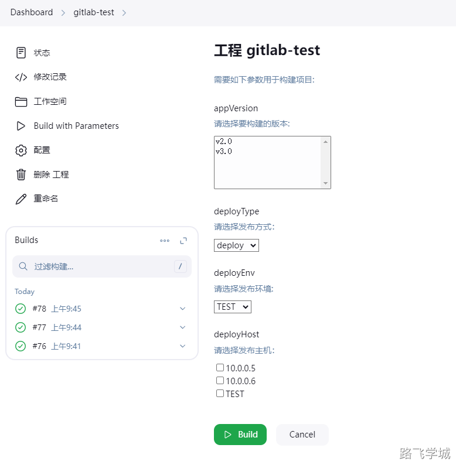
> 
> 综合练习-参数化构建静态页面
> 
> ```bash
> #!/bin/bash
> 
> deploy(){
>   tar zcf ${appVersion}.tar.gz *
>   scp ${appVersion}.tar.gz ${i}:/code/
>   ssh ${i} "mkdir -p /code/${appVersion}"
>   ssh ${i} "tar zxf /code/${appVersion}.tar.gz -C /code/${appVersion}"
>   ssh ${i} "rm -rf /code/www && ln -s /code/${appVersion} /code/www"
>   ssh ${i} "rm -rf /code/${appVersion}.tar.gz"
>   rm -rf ${appVersion}.tar.gz
> }
> 
> rollback(){
>   ssh ${i} "rm -rf /code/www && ln -s /code/${appVersion} /code/www"
> }
> 
> #处理IP地址
> host=$(echo $deployHost|sed 's#,# #g')
> 
> #发布流程
> if [ "${deployType}" == "deploy" ];then
>   for i in $host
>   do
>     deploy
>   done
> fi
> 
> #回滚流程
> if [ "${deployType}" == "rollback" ];then
>   for i in $host
>   do
>     rollback
>   done
> fi
> [root@jenkins-201 /opt/scripts]# cat deploy.sh
> #!/bin/bash
> deploy(){
>   tar zcf ${appVersion}.tar.gz *
>   ansible-playbook -l ${deployHost} -e "version=${appVersion} workspace=${WORKSPACE}" /opt/scripts/ansible_deploy.yaml
>   rm -rf ${appVersion}.tar.gz
> }
> 
> rollback(){
>   ansible-playbook -l ${deployHost} -e "version=${appVersion}" /opt/scripts/ansible_rollback.yaml
> }
> 
> #发布流程
> if [ "${deployType}" == "deploy" ];then
>   deploy
> else
>   rollback
> fi
> ```
> 