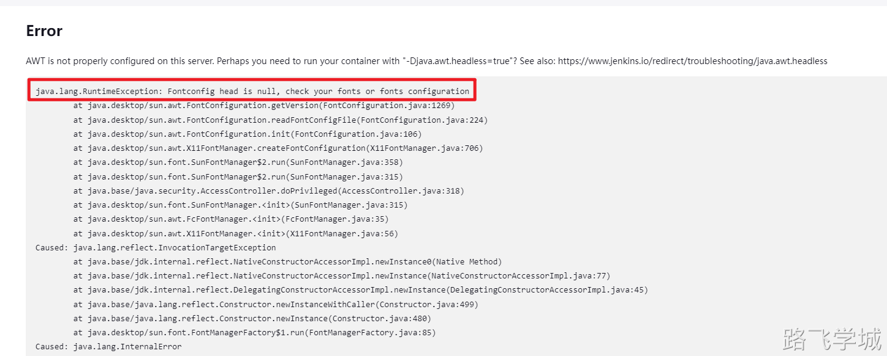
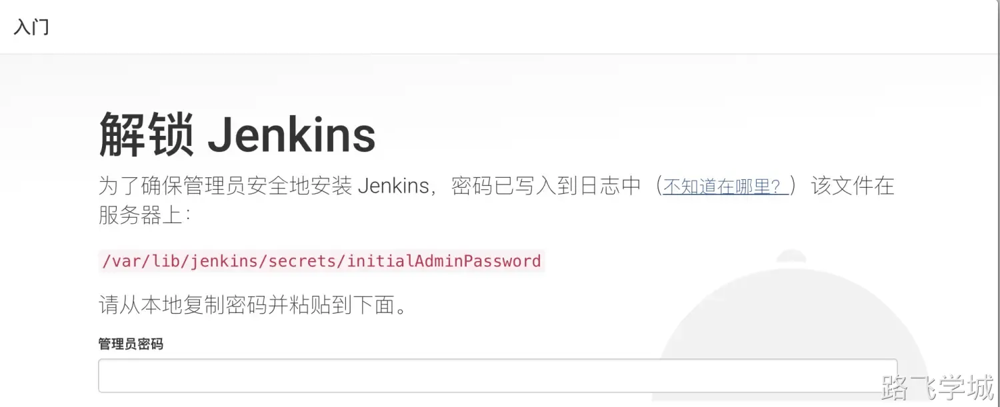
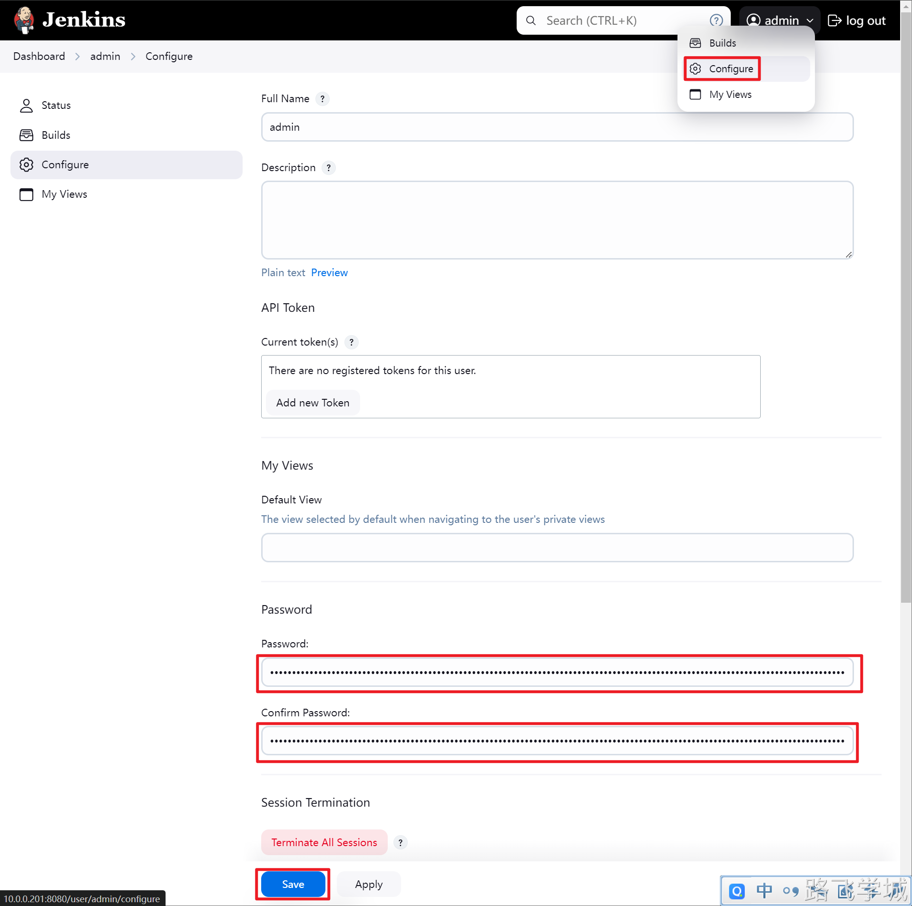

---
tags:
  - CICD/Jenkins
---

> [!info]- 官方网站
> 
> 
> https://www.jenkins.io/zh/doc/
> 

> [!install]- 安装部署
> 
> 
> 截止到2024年6月26日，目前Jenkins的最新版是2.464
> 
> 而最新版的jenkins需要JDK 17，需要注意版本对应
> 
> jdk-17_linux-x64_bin.rpm
> 
jenkins-2.464-1.1.noarch.rpm
> 
> ```bash
> #安装依赖，不然启动会报错
> [root@jenkins-201 ~]# yum install fontconfig -y
> 
> #下载并安装jdk-17
> [root@jenkins-201 ~]# wget https://download.oracle.com/java/17/latest/jdk-17_linux-x64_bin.rpm
> [root@jenkins-201 ~]# rpm -ivh jdk-17_linux-x64_bin.rpm
> 
> #下载并安装jenkins
> [root@jenkins-201 ~]# wget https://mirrors.tuna.tsinghua.edu.cn/jenkins/redhat/jenkins-2.464-1.1.noarch.rpm
> [root@jenkins-201 ~]# rpm -ivh /jenkins-2.452-1.1.noarch.rpm
> ```
> 
> 如果没有安装依赖则会提示以下错误:
> 
> 
> 

> [!info]- 目录文件说明
> 
> 
> ```bash
> [root@jenkins-201 ~]# rpm -ql jenkins
> /usr/bin/jenkins												 #启动命令
> /usr/lib/systemd/system/jenkins.service  #启动配置文件
> /usr/lib/tmpfiles.d/jenkins.conf  			 #配置文件
> /usr/share/java/jenkins.war 			       #启动war包
> /usr/share/jenkins/migrate 
> /var/cache/jenkins
> /var/lib/jenkins 									       #数据目录
> ```

> [!run]- 修改启动配置以使用root账户运行
> 
> 
> ```bash
> [root@jenkins-201 ~]# vim /usr/lib/systemd/system/jenkins.service
> User=root
> Group=root
> ```

> [!systemd]- 启动jenkins
> 
> 
> ```bash
> [root@jenkins-201 ~]# systemctl daemon-reload
> [root@jenkins-201 ~]# systemctl start jenkins
> ```

> [!info]- 解锁Jenkins
> 
> 
> 登陆地址为：http://10.0.0.201:8080/
> 
> 
> 

> [!info]- 修改admin密码
> 
> 
> 
> 
