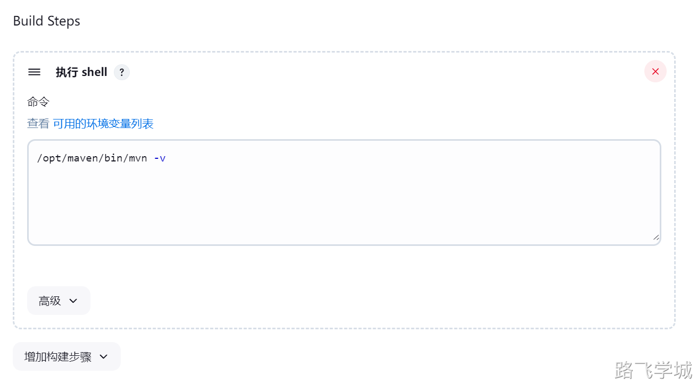
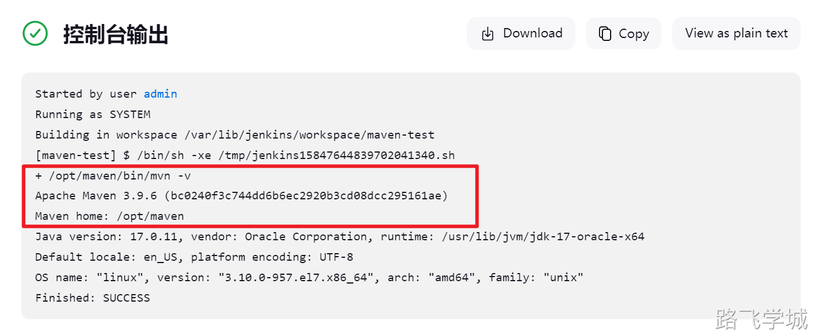
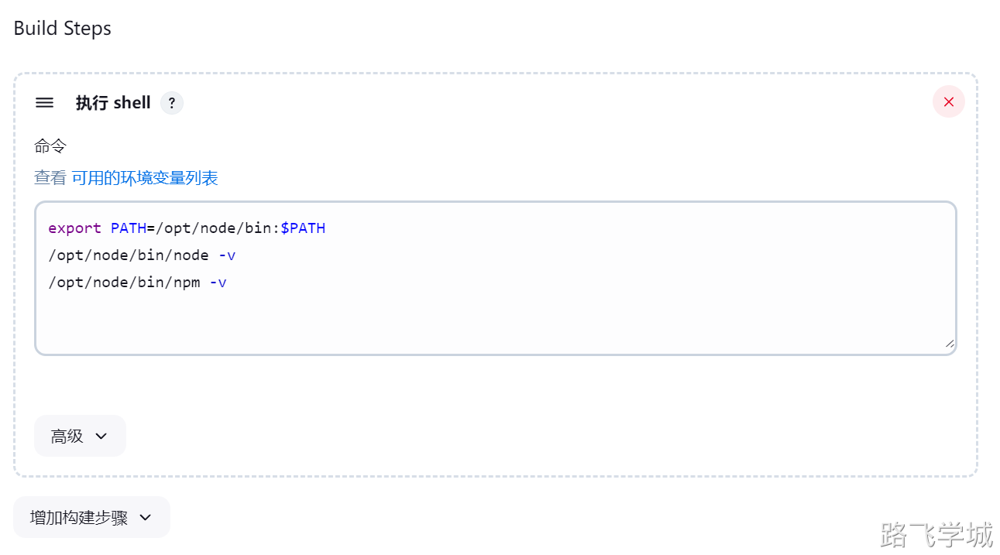

---
tags:
  - CICD/Jenkins
---
Jenkins与Maven集成

> [!install]- 安装JDK
> 
> ```bash
> tar zxf jdk-8u351-linux-x64.tar.gz -C /opt/
> ln -s /opt/jdk1.8.0_351 /opt/jdk
> cp /etc/profile /etc/profile.bak
> cat >> /etc/profile << 'EOF'
> export JAVA_HOME=/opt/jdk
> export JRE_HOME=${JAVA_HOME}/jre
> export CLASSPATH=.:${JAVA_HOME}/lib:${JRE_HOME}/lib
> export PATH=$PATH:${JAVA_HOME}/bin
> EOF
> source /etc/profile
> java -version
> echo $JAVA_HOME
> echo $JRE_HOME
> ```
> 

> [!install]- 安装maven
> 
> 
> ```bash
> tar zxf apache-maven-3.9.6-bin.tar.gz -C /opt/
> mv /opt/apache-maven-3.9.6 /opt/maven-3.9.6/
> ln -s /opt/maven-3.9.6 /opt/maven
> echo "export PATH=$PATH:/opt/maven/bin" >> /etc/profile
> source /etc/profile
> mvn -v
> ```
> 

> [!config]- maven设置阿里源
> 
> 
> ```bash
> vim /opt/maven/conf/settings.xml
> < mirror >
>     <id>aliyunmaven</id>
>     <mirrorOf>*</mirrorOf>
>     <name>阿里云公共仓库</name>
>     <url>https://maven.aliyun.com/repository/public</url>
> </mirror>
> ```

> [!run]- maven常用命令
> 
> 
> ```bash
> mvn -v
> mvn clean
> mvn package
> mvn clean package
> ```

> [!test]- 任务测试
> 
> 
> 
> 
> 
> 
> 构建测试后发现失败，提示命令找不到
> 
> 
> 
> 我们只需要将构建中的mvn命令使用绝对路径即可，这也是推荐做法
> 
> 
> 
> 再次构建成功显示了maven版本号
> 
> 
> 

> [!test]- Jenkins多JDK版本选择
> 
> 
> 
> 1.目前存在的问题
> 
> 构建任务是由Jenkins所在的服务器负责的，但是Jenkins最新版使用的JDK是17，那么如果我们需要构建的任务如果是JDK8，那应该如何处理呢？
> 
> 其实并不复杂，我们只需要在Jenkins服务器上将不同版本的JDK使用二进制安装，但是不配置JAVA_HOME环境变量，等到构建的时候，在shell脚本里再定义JAVA_HOME变量指向对应的jdk目录，这样这个临时的环境变量就只对当前的任务生效。
> 
> 2.多JDK部署实战
> 
> 在shell终端中查看当前的jdk版本:
> 
> ```bash
> [root@jenkins-201 ~]# java -version
> java version "17.0.11" 2024-04-16 LTS
> Java(TM) SE Runtime Environment (build 17.0.11+7-LTS-207)
> Java HotSpot(TM) 64-Bit Server VM (build 17.0.11+7-LTS-207, mixed mode, sharing)
> ```
> 
> 这个结果也和上面mvn -v打印的jdk版本一样：
> 
> 
> 
> 接下来我们在Jenkins服务器使用二进制部署一个JDK8,但是不配置环境变量
> 
> ```bash
> tar zxf jdk-8u351-linux-x64.tar.gz -C /opt/
> mv /opt/jdk1.8.0_351 /opt/jdk8
> ```
> 
> 我们使用绝对路径执行java -version
> 
> ```bash
> [root@jenkins-201 ~]# java -version
> java version "17.0.11" 2024-04-16 LTS
> Java(TM) SE Runtime Environment (build 17.0.11+7-LTS-207)
> Java HotSpot(TM) 64-Bit Server VM (build 17.0.11+7-LTS-207, mixed mode, sharing)
> 
> [root@jenkins-201 ~]# /opt/jdk8/bin/java -version
> java version "1.8.0_351"
> Java(TM) SE Runtime Environment (build 1.8.0_351-b10)
> Java HotSpot(TM) 64-Bit Server VM (build 25.351-b10, mixed mode)
> ```
> 
> 可以正常显示，接下来我们返回Jenkins的任务里，在mvn命令前添加jdk的环境变量
> 
> export JAVA_HOME=/opt/jdk8
> 
> /opt/maven/bin/mvn -v
> 
> 再次构建测试，我们可以发现maven确实识别了JDK8的环境变量
> 
> 
> 
> 后续我们可以结合参数化构建，提供不同的JDK选项，然后根据选项来动态选择JDK版本
> 

 - ~ Jenkins与NPM集成

> [!run]- 部署Npm工具
> 
> 
> 部署命令
> 
> ```bash
> tar xf  node-v14.21.3-linux-x64.tar.xz -C /opt/node
> ln -s node-v14.21.3-linux-x64 node
> echo 'export PATH=/opt/node/bin:$PATH' >> /etc/profile
> source /etc/profile
> npm -v
> node -v
> ```
> 
> 常用命令
> 
> ```bash
> npm -v
> node -v
> npm cache clean --force
> npm install --registry https://registry.npmmirror.com
> npm config set registry https://registry.npmmirror.com
> npm run env-name -- --host 0.0.0.0
> ```
> 

> [!run]- 任务测试
> 
> 
> 我们尝试使用绝对路径去测试
> 
> /opt/node/bin/node -v 
> /opt/node/bin/npm -v  
> 
> 
> 
> 结果发现node可以识别，npm识别不了
> 
> 
> 
> 这里我们不去研究具体原因了，直接在调用前生效一下PATH环境变量即可
> 
> export PATH=/opt/node/bin:$PATH
> /opt/node/bin/node -v 
> /opt/node/bin/npm -v  
> 
> 
> 
> 再次执行任务，发现都可以正确识别了
> 
> 
> 
