---
tags:
  - CICD/Jenkins
---
 
> [!info]- 插件管理
> 
> 
> 在线安装
> 
> jenkins具有丰富的插件，我们可以在插件管理里去选择常用的插件，这里推荐的插件列表如下：
> 
> ```bash
> Git
> Git Parameter
> Pipeline
> Pipeline: Stage View
> Blue Ocean
> Generic Webhook Trigger
> Role-based Authorization Strategy
> Nexus Artifact Uploader
> Active Choices
> Localization: Chinese (Simplified)
> Maven Artifact ChoiceListProvider (Nexus)
> ```
> 
> 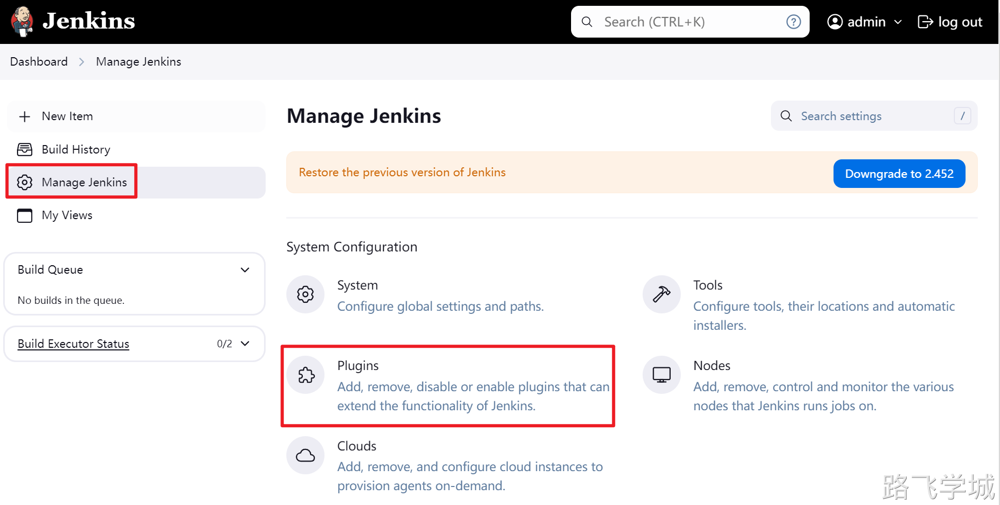
> 
> 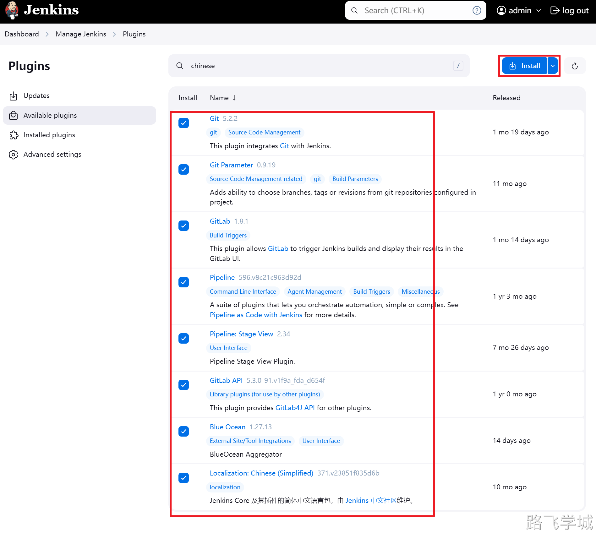
> 
> 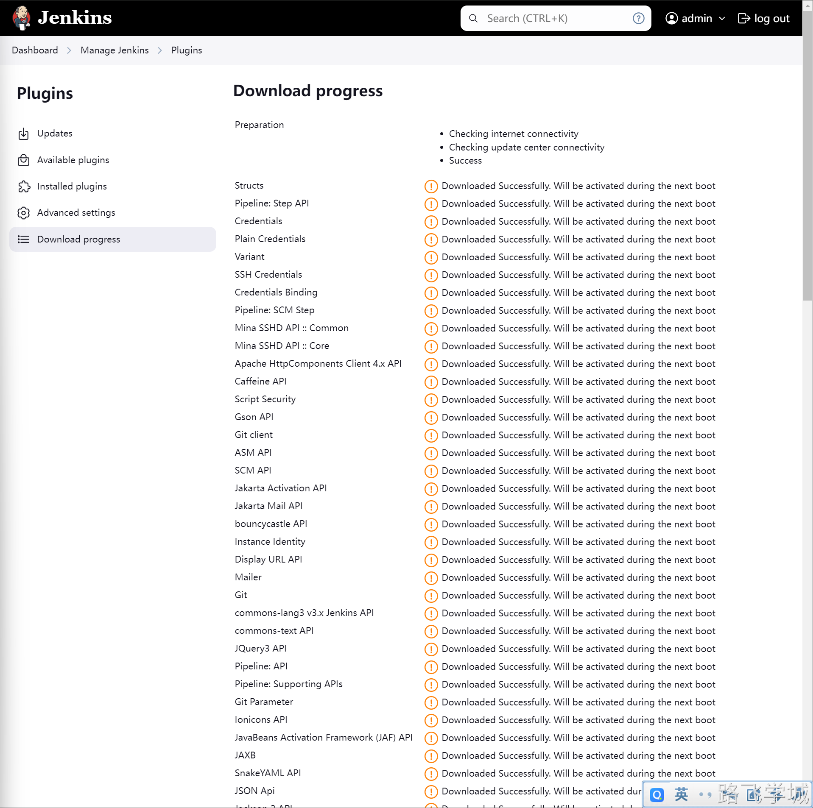
> 
> 插件安装完成后可以直接重启jenkins，再次来到登陆页面发现已经变成中文了。
> 
> 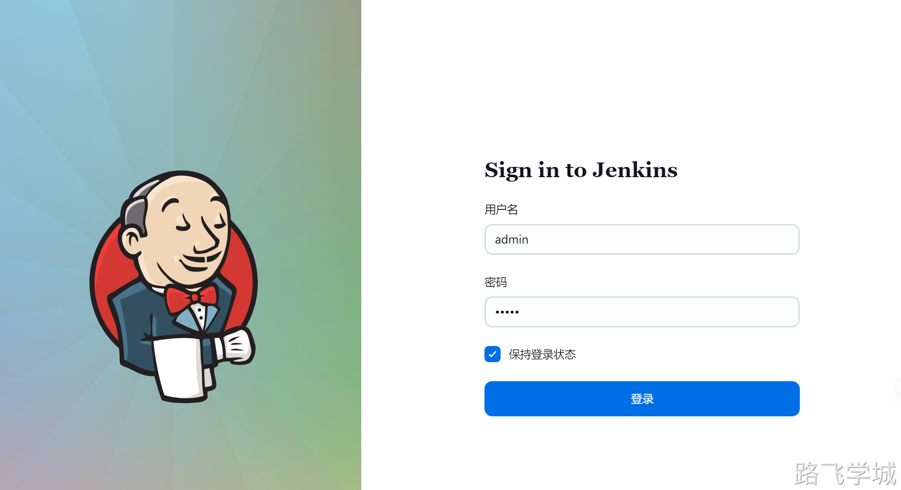
> 

> [!info]- 离线安装
> 
> 在线下载的时间可能会比较长，我们也可以将插件提前下好后打个压缩包，以后要用的时候直接解压到jenkins对应的插件目录即可
> 
> [📎jenkins_plugin_20240630.tar.gz](https://www.yuque.com/attachments/yuque/0/2024/gz/830385/1719748700209-ecd9db57-ca63-469e-a555-2dc26b2251a9.gz)
> 
> 打包命令:
> 
> ```plain
> cd /var/lib/jenkins/
> tar zcf jenkins_2464_plugin.tar.gz plugins
> ```
> 
> 解压命令:
> 
> ```plain
> tar zxf jenkins_2464_plugin.tar.gz -C /var/lib/jenkins/
> systemctl restart jenkins
> ```

> [!info]- 权限角色管理
> 
> 
> 1.角色规划
> 
> | **用户**          | **角色**          | **项目**                                           | **权限**               |
> | ----------------- | ----------------- | -------------------------------------------------- | ---------------------- |
> | jenkins_user_dev  | jenkins_role_dev  | mall-service_DEV                                   | 可查看，可运行         |
> | jenkins_user_test | jenkins_role_test | mall-service_TEST                                  | 可查看，可运行         |
> | jenkins_user_ops  | jenkins_role_ops  | mall-service_DEVmall-service_TESTmall-service_PROD | 可查看，可运行，可修改 |
> 
> 2.创建项目
> 
> mall-service_DEV
> 
> mall-service_TEST
> 
> mall-service_PROD
> 
> 
> 
> 3.创建用户
> 
> jenkins_user_dev
> 
> jenkins_user_test
> 
> jenkins_user_ops
> 
> 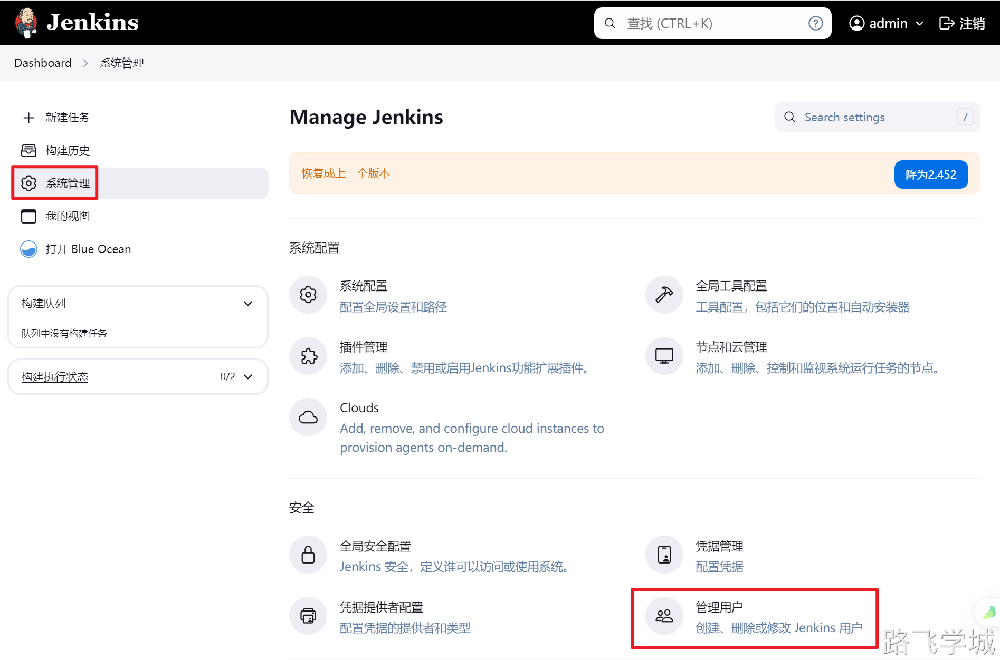
> 
> 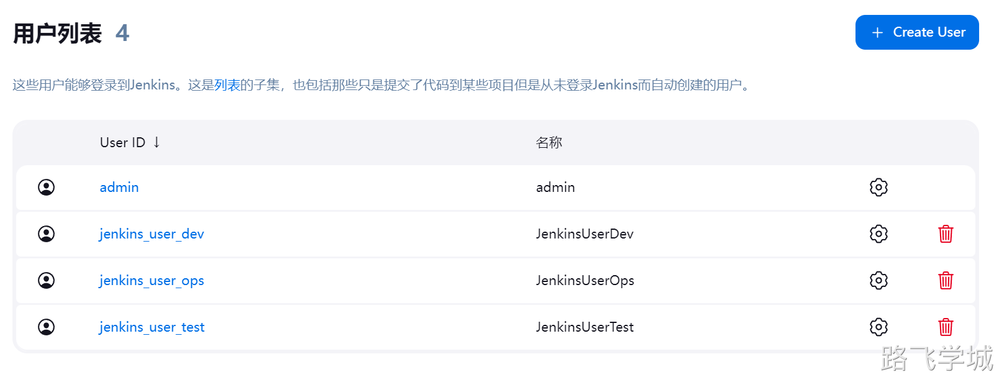
> 
> 4.启用权限插件
> 
> 
> 
> 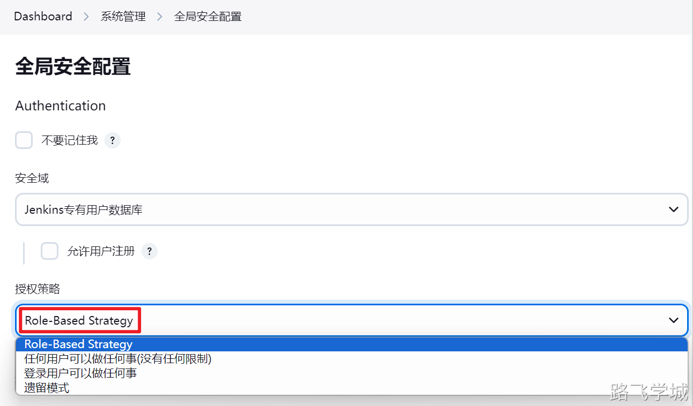
> 
> 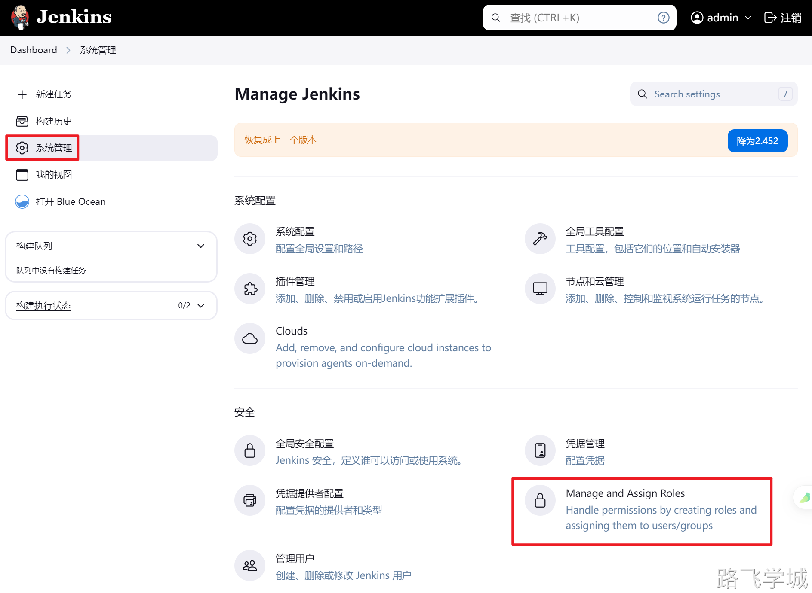
> 
> 5.创建角色
> 
> 5.1 创建Global roles
> 
> 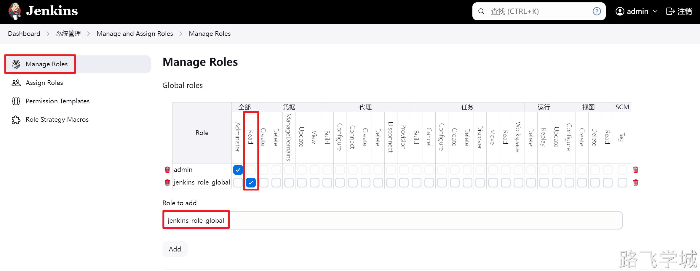
> 
> 5.2 创建Item roles
> 
> 
> 
> 6.授权角色
> 
> 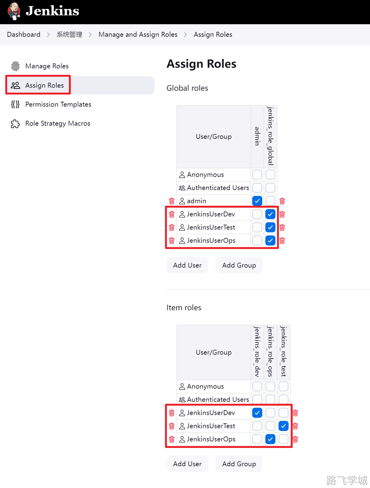
> 
> 7.验证权限
> 
> 7.1 jenkins_user_dev用户测试
> 
> 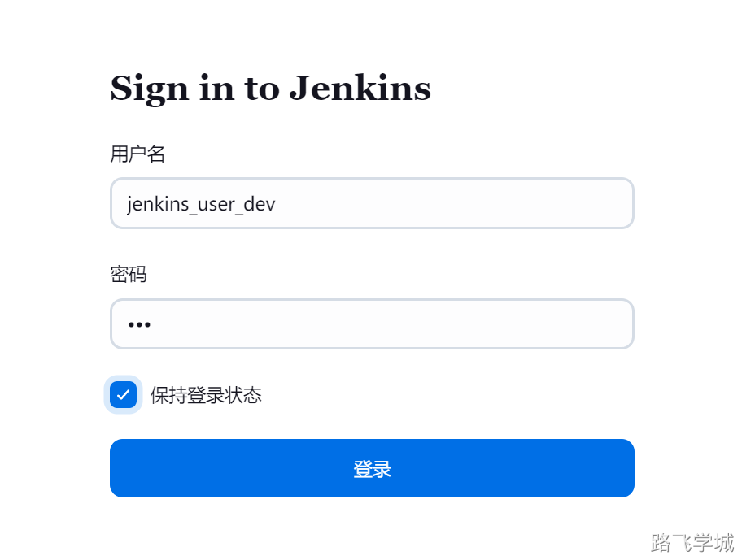
> 
> 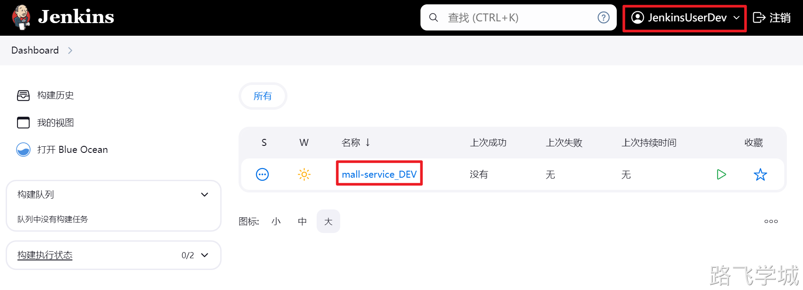
> 
> 
> 
> 7.2 jenkins_user_test用户测试
> 
> 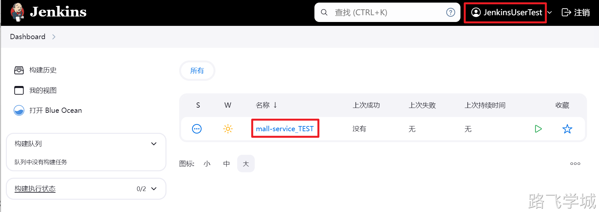
> 
> 
> 
> 7.3 jenkins_user_ops用户测试
> 
> 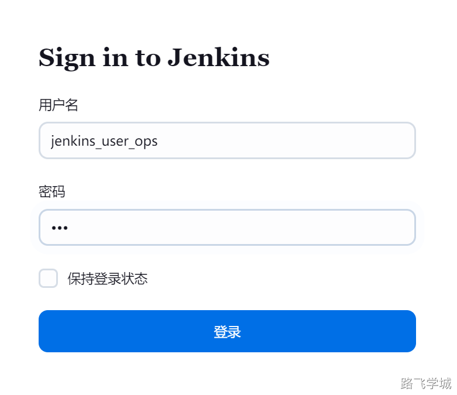
> 
> 
> 
> 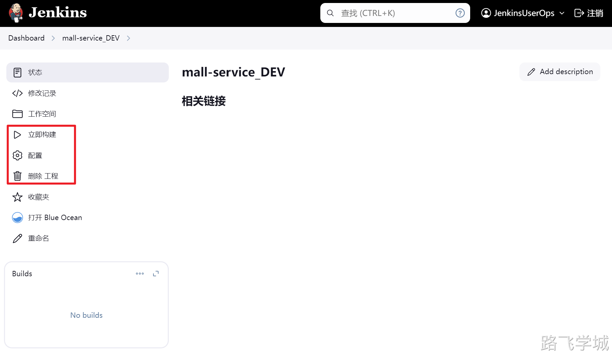
> 
> 
> 
> 
> 

> [!info]- 数据备份
> 
> 
> 1.Jenins备份方式
> 
> Jenkins的备份非常简单，只需要将整个数据目录备份即可，可以结合定时任务定时备份
> 
> ```bash
> cd /var/lib/
> tar zcvf jenkins_backup_20240630.tr.gz jenkins
> ```
> 
> [📎jenkins_backup_20240630.tr.gz](https://www.yuque.com/attachments/yuque/0/2024/gz/830385/1719749116745-07e7ef2c-e3a5-41a1-b931-6a18883dce59.gz)
> 
> 2.Jenkins数据恢复
> 
> 只需要将备份文件恢复到数据目录即可
> 
> ```bash
> tar zxvf jenkins_backup_20240630.tr.gz -C /var/lib/
> ```
> 