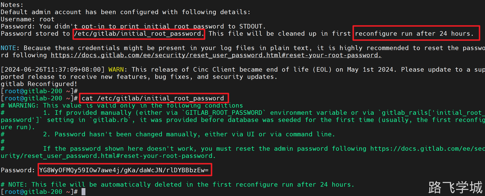
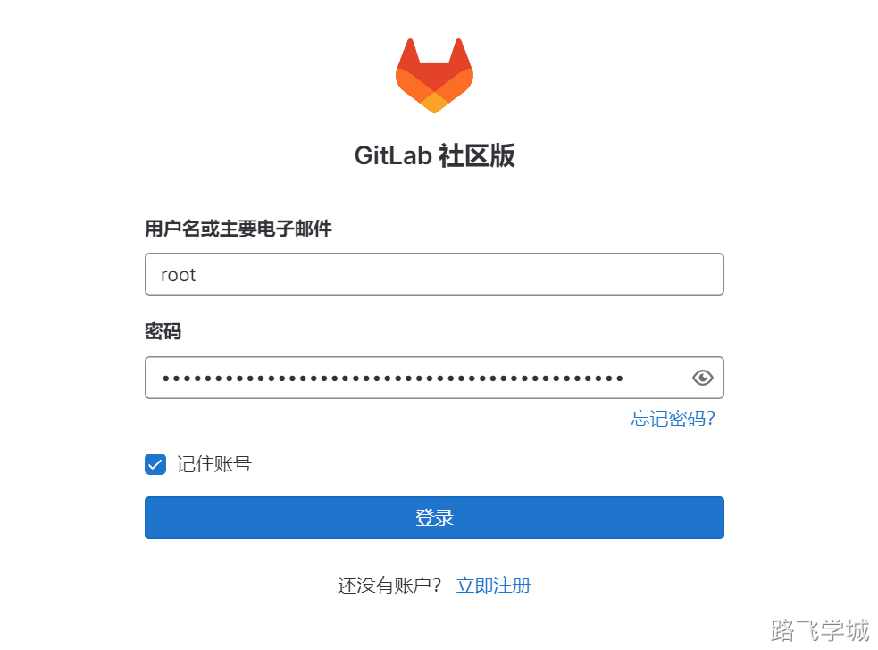
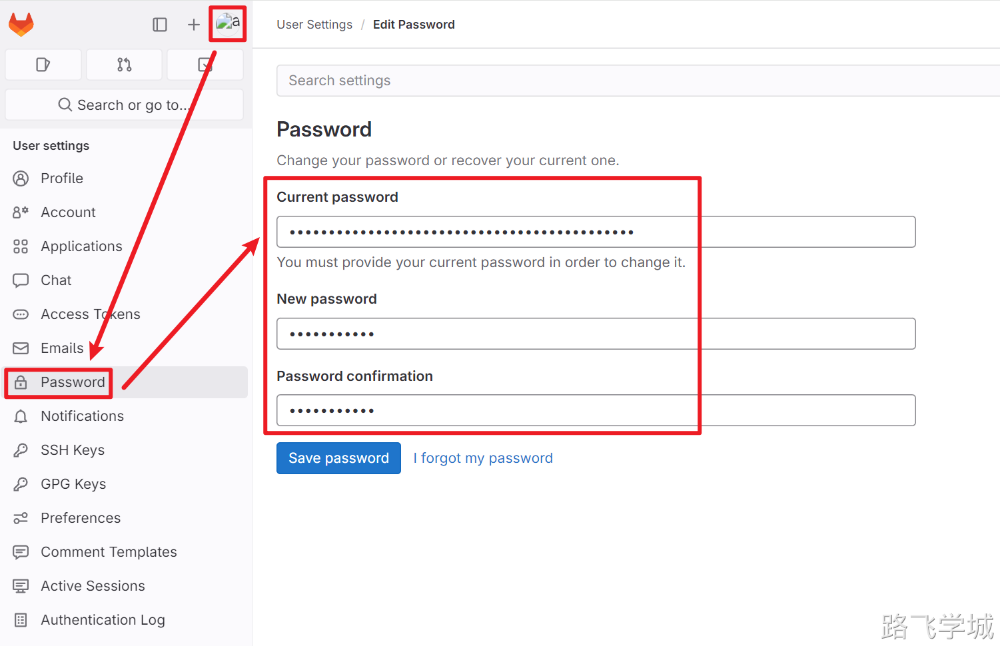
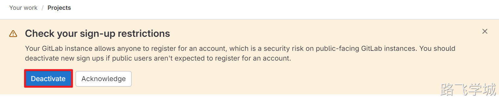
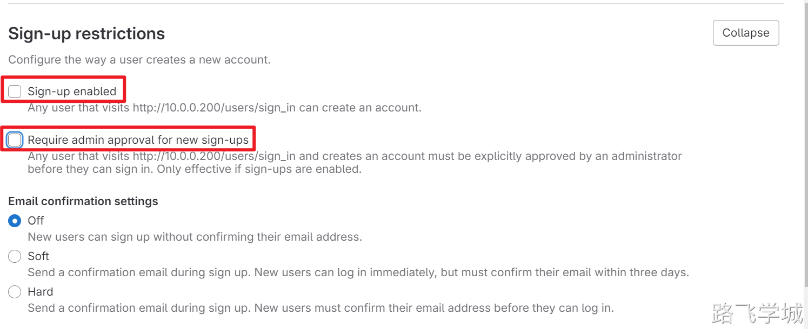
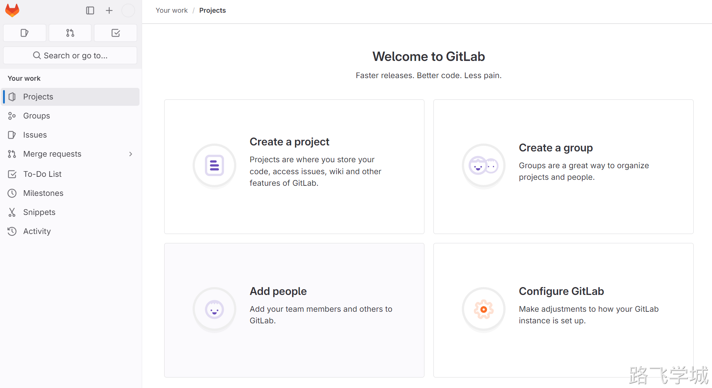

---
tags:
  - CICD/gitlab
---

> [!info]- 官方网站
> 
> 
> https://about.gitlab.com/install/#centos-7
> 

> [!install]- 安装gitlab
> 
> 
> ###方法1:直接从清华源下载指定版本的rpm包(推荐)^_^
> 
> 下载地址：
> 
> https://mirrors.tuna.tsinghua.edu.cn/gitlab-ce/yum/el7/gitlab-ce-16.9.8-ce.0.el7.x86_64.rpm
> 
> 安装命令：
> 
> ```plain
> yum localinstall gitlab-ce-16.9.8-ce.0.el7.x86_64.rpm -y
> ```
> 
> ###方法2:添加清华源在线安装,网速慢的话会很难受T_T
> 
> 官网地址:
> 
> https://mirrors.tuna.tsinghua.edu.cn/help/gitlab-ce/
> 
> 配置YUM源：
> 
> ```bash
> cat > /etc/yum.repos.d/gitlab-ce.repo << 'EOF'
> [gitlab-ce]
> name=Gitlab CE Repository
> baseurl=https://mirrors.tuna.tsinghua.edu.cn/gitlab-ce/yum/el$releasever/
> gpgcheck=0
> enabled=1
> EOF
> ```
> 
> 安装命令
> 
> ```bash
> [root@gitlab-200 ~]# yum install gitlab-ce -y
> ```
> 

> [!config]- 修改配置文件
> 
> 
> 修改external_url为本机IP
> 
> ```bash
> [root@gitlab-200 ~]# vim /etc/gitlab/gitlab.rb
> external_url 'http://10.0.0.200'
> ```

> [!systemd]- 重新加载配置并启动
> 
> 
> 这一步耗时比较长，耐心等待，取决于系统内存大小在1-3分钟内启动完都正常
> 
> ```bash
> [root@gitlab-200 ~]# gitlab-ctl reconfigure
> ```

> [!info]- web页面访问
> 
> 
> 初次安装gitlab会生成随机密码，需要我们查看一下，注意密码只保留24小时
> 
> 
> 
> 帐号为 root 
> 密码为刚才查看的随机密码 
> 
> 
> 
> 登陆后我们可以在图形界面上修改初始密码
> 
> 
> 
> 登陆后提示我们关闭用户注册功能，我们选关闭即可
> 
> 
> 
> 
> 
> 
> 

> [!run]- gitlab常用命令
> 
> 
> 查看当前状态
> 
> gitlab-ctl status
> 
> 启动服务
> 
> gitlab-ctl start
> 
> 停止服务
> 
> gitlab-ctl stop
> 
> 停止单个服务
> 
> gitlab-ctl stop nginx
> 
> 启动单个服务
> 
> gitlab-ctl start nginx
> 
> 查看服务日志
> 
> gitlab-ctl tail
> 

> [!warn]-  gitlab重置密码命令
>（此处不用，忘记密码的时候才用）
> 
> 如果使用yum在线安装比较新版本的gitlab，安装完成后直接会进入输入账号密码的界面，这个时候很多同学不知道密码是什么，gitlab会将随机密码保存在文件里，并且会把路径打印到安装的输出信息里，如果这个文件被删除了也没关系，我们可以使用控制命令直接重置密码。
> 
> ```plain
> gitlab-rails console
> >> user = User.where(username: 'root').first
> >> user.password = '12345678'
> >> user.save!
> >> exit
> systemctl restart gitlab-runsvdir.service
> ```
