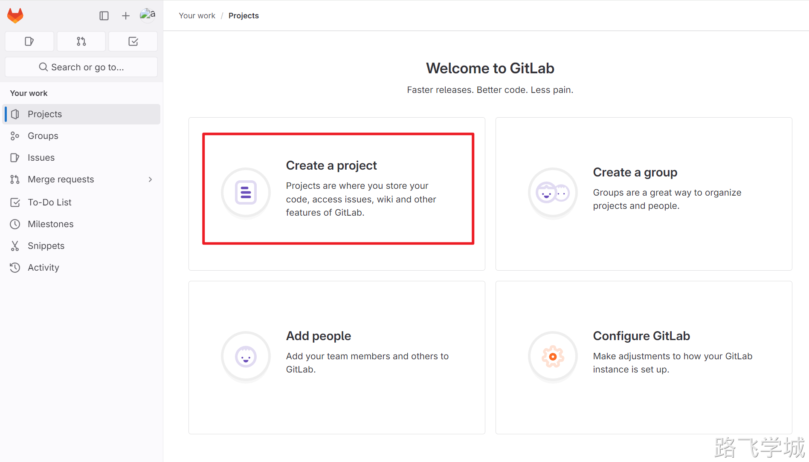
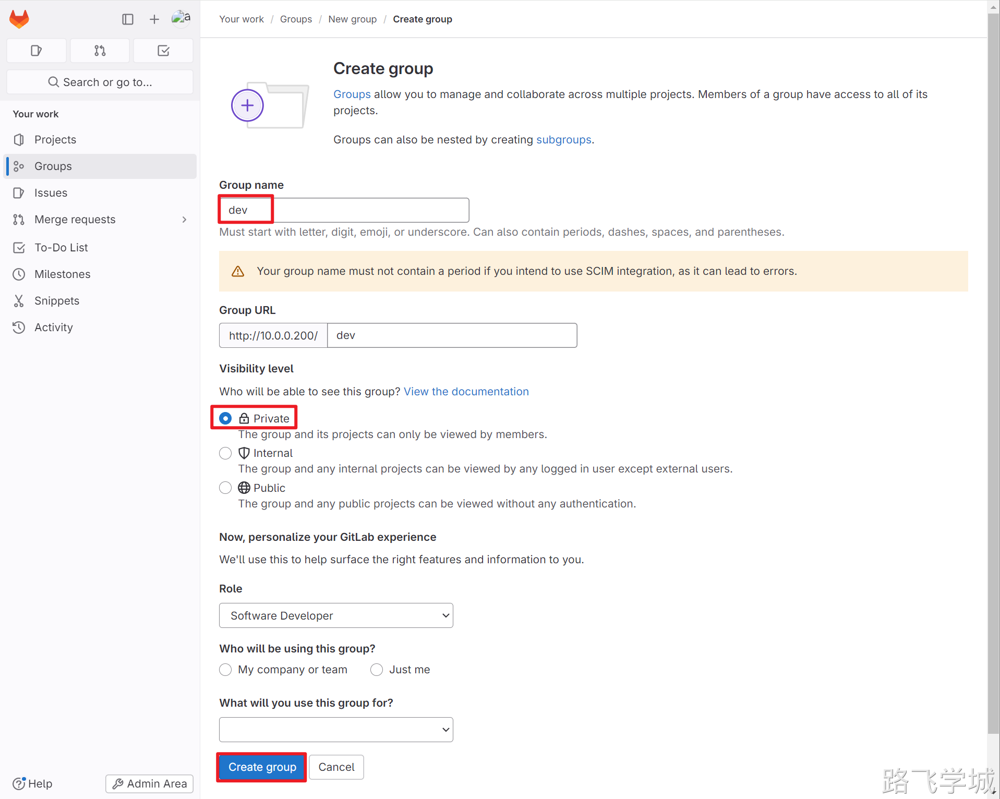
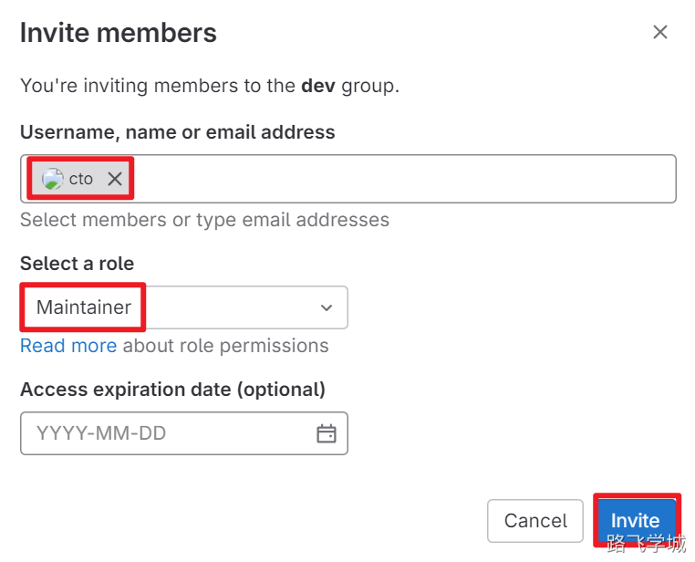

---
tags:
  - CICD/gitlab
---
> [!test]- gitlab小试身手
> 
> 
> ##1.关闭Auto DevOps功能
> 
> 这个功能是gitlab自己的流水线功能，我们使用jenkins就不需要开启它，开启后会很不方便，所以我们先关闭它
> 
> 
> 
> ##2.创建一个简单项目
> 
> 
> 
> 
> 
> 
> 
> ##3.添加公钥
> 
> gitlab使用SSH协议来传输代码，所以我们需要将开发者电脑的SSH公钥提前配置在项目里，这样开发者才可以将代码上传到gitlab上。当我们创建好一个项目，但是没有配置公钥时，gitlab页面上会提醒我们去添加公钥。
> 
> 
> 
> 
> 
> ##4.克隆代码
> 
> 现在我们项目已经创建好了，并且也将开发的公钥上传到了gitlab上，接下来可以在开发的电脑上下载代码仓库上的代码了。克隆地址在项目的首页上。
> 
> 
> 
> 安装并配置git；
> 
> ```bash
> [root@m-61 ~]# yum install git -y
> [root@m-61 ~]# git config --global user.email "admin@qq.com"
> [root@m-61 ~]# git config --global user.name "zhangya"
> [root@m-61 ~]# git config --global color.ui true
> [root@m-61 ~]#
> ```
> 
> 克隆代码：
> 
> ```bash
> [root@m-61 ~]# cd /opt/
> [root@m-61 /opt]# git clone git@10.0.0.200:root/game.git
> Cloning into 'game'...
> The authenticity of host '10.0.0.200 (10.0.0.200)' can't be established.
> ECDSA key fingerprint is SHA256:4bnum+vhLl+fHDM+WUxdjAs9Jf48mKwMHvpxkKT+FEY.
> ECDSA key fingerprint is MD5:8b:cc:8c:66:84:af:09:b7:5c:67:40:17:69:50:3a:73.
> Are you sure you want to continue connecting (yes/no)? yes
> Warning: Permanently added '10.0.0.200' (ECDSA) to the list of known hosts.
> remote: Enumerating objects: 3, done.
> remote: Counting objects: 100% (3/3), done.
> remote: Compressing objects: 100% (2/2), done.
> remote: Total 3 (delta 0), reused 0 (delta 0), pack-reused 0
> Receiving objects: 100% (3/3), done.
> ```
> 
> 克隆完成后查看一下：
> 
> ```bash
> [root@m-61 /opt]# ll game/
> total 8
> -rw-r--r-- 1 root root 6144 Jun 26 12:32 README.md
> ```
> 
> ##5.git本地开发新代码
> 
> 进入代码目录并查看当前的状态：
> 
> ```bash
> [root@m-61 /opt]# cd game/
> [root@m-61 /opt/game]# git status
> # On branch main
> nothing to commit, working directory clean
> ```
> 
> 创建新的代码文件：
> 
> ```shell
> [root@m-61 /opt/game]# echo "hello Linux" > index.html
> [root@m-61 /opt/game]# git status
> # On branch main
> # Untracked files:
> #   (use "git add < file >..." to include in what will be committed)
> #
> #       index.html
> nothing added to commit but untracked files present (use "git add" to track)
> ```
> 
> 提交代码到本地仓库
> 
> ```bash
> [root@m-61 /opt/game]# git add .
> [root@m-61 /opt/game]# git commit -m "add v1.0"
> [main bd4b03e] add v1.0
>  1 file changed, 1 insertion(+)
>  create mode 100644 index.html
> ```
> 
> 查看状态：
> 
> ```bash
> [root@m-61 /opt/game]# git status
> # On branch main
> # Your branch is ahead of 'origin/main' by 1 commit.
> #   (use "git push" to publish your local commits)
> #
> nothing to commit, working directory clean
> ```
> 
> 注意⚠️此时我们只是提交到了本地的版本仓库，而gitlab远程仓库上的master分支还是旧的版本，所以这里我们还需要将本地的代码提交到远程仓库上，提交命令如下：
> 
> ```bash
> [root@m-61 /opt/game]# git push origin
> warning: push.default is unset; its implicit value is changing in
> Git 2.0 from 'matching' to 'simple'. To squelch this message
> and maintain the current behavior after the default changes, use:
> 
>   git config --global push.default matching
> 
> To squelch this message and adopt the new behavior now, use:
> 
>   git config --global push.default simple
> 
> See 'git help config' and search for 'push.default' for further information.
> (the 'simple' mode was introduced in Git 1.7.11. Use the similar mode
> 'current' instead of 'simple' if you sometimes use older versions of Git)
> 
> Counting objects: 4, done.
> Compressing objects: 100% (2/2), done.
> Writing objects: 100% (3/3), 280 bytes | 0 bytes/s, done.
> Total 3 (delta 0), reused 0 (delta 0)
> To git@10.0.0.200:root/game.git
>    780a1f1..bd4b03e  main -> main
> ```
> 
> 命令解释：
> 
> ```plain
> git push origin  main
> git 推送  远程   远程分支名
> ```
> 
> 这里我们是直接推送到远程的main分支，工作中我们并不会这么操作，因为如果谁都有权限提交到main分支这样风险很大，所以工作中我们一般不会给开发配置推送到main的权限，而是在开发分支开发，然后提交到远程的开发分支，最后由管理员审核并合并到main分支。
> 
> 此时我们查看gitlab上的代码库可以发现，已经提交成功了。
> 
> 
> 

> [!test]- Gitlab权限实战
> 
> 
> ##1.实验说明
> 
> 用户-项目组-项目的关系
> 
> 1.项目由项目组来创建，而不是由用户创建
> 2.用户通过加入到不同的组，来实现对项目的访问或者提交
> 3.项目可以设置为只有项目组可以查看，所有登陆用户可以查看和谁都可以看三种
> 
> 建议的操作流程:
> 
> 第一步：创建组 Group
> 第二步：基于组创建项目 Project
> 第三步：创建用户，分配组，分配权限
> 
> 实验需求分析:
> 
> 1.创建2个组   
> dev
> ops
> 
> 2.创建2个项目  
> ansible
> game
> 
> 3.创建3个用户  
> cto
> abc_ops
> abc_dev
> 
> 4.分配权限
> cto        对所有组都有权限，拥有合并分支的权限
> abc_ops 对dev组有所有权限,可以推h拉代码
> abc_dev 对ops组有所有权限，可以推拉代码，对dev组有拉取代码的权限
> 
> 图表版
> 
> 
> 
> ##2.创建组
> 
> ###2.1 创建dev组
> 
> 
> 
> 
> 
> 
> 
> ###2.2 创建ops组
> 
> 
> 
> ###2.3 检查
> 
> 
> 
> ##3.创建项目
> 
> ###3.1 创建game项目
> 
> 
> 
> 
> 
> ###3.2 创建ansible项目
> 
> 
> 
> 
> 
> ##4.创建用户
> 
> ###4.1 创建cto用户
> 
> 
> 
> 
> 
> 修改密码
> 
> 
> 
> 
> 
> ###4.2 创建man_dev用户
> 
> 
> 
> 修改密码
> 
> 
> 
> 
> 
> 
> 
> ###4.3 创建man_ops用户
> 
> 
> 
> 修改密码
> 
> 
> 
> ###4.4 检查
> 
> 
> 
> ##5.授权
> 
> ###5.1 dev组添加用户
> 
> 
> 
> 添加cto账户
> 
> 
> 
> 添加man_dev用户
> 
> 
> 
> 添加man_ops用户
> 
> 
> 
> 检查
> 
> 
> 
> ###5.2 ops组添加用户
> 
> 
> 
> ##6.dev用户拉取上传测试
> 
> ###6.1 dev用户登陆并修改密码
> 
> 
> 
> 
> 
> 
> 
> ###6.2 添加SSH公匙
> 
> 要想dev用户能免密克隆上传项目，需要将开发者电脑的ssh公钥上传到项目的仓库中
> 
> 我们在m-61机器上创建两个普通用户来模拟
> 
> ```plain
> [root@m-61 ~]# useradd dev
> [root@m-61 ~]# useradd ops
> ```
> 
> 切换到dev用户并生成SSH密钥对
> 
> ```plain
> [dev@m-61 ~]$ ssh-keygen
> Generating public/private rsa key pair.
> Enter file in which to save the key (/home/dev/.ssh/id_rsa):
> Created directory '/home/dev/.ssh'.
> Enter passphrase (empty for no passphrase):
> Enter same passphrase again:
> Your identification has been saved in /home/dev/.ssh/id_rsa.
> Your public key has been saved in /home/dev/.ssh/id_rsa.pub.
> The key fingerprint is:
> SHA256:0/dFTV6uMwOkXZyv/XICFxRWEckdjLBigW6rXkgI/cM dev@m-61
> The key's randomart image is:
> +---[RSA 2048]----+
> |        .. .o.BBX|
> |  .    .  .+.++B+|
> | . .  .  o..o. .=|
> |  . +  o...  ..o.|
> |   . E. S . . =+.|
> |    . o. . ...o=.|
> |     ...     o. .|
> |     ..       o o|
> |    ..         + |
> +----[SHA256]-----+
> [dev@m-61 ~]$
> ```
> 
> 复制公钥
> 
> ```plain
> [dev@m-61 ~]$ cat .ssh/id_rsa.pub
> ssh-rsa AAAAB3NzaC1yc2EAAAADAQABAAABAQDAuEIKkorb5uBuUpGuwRMGDLG9sEnLCnMHQkeKzXqCNfmBgboPulxnA9t3SAZunetT86F7lSg2YuzFO5BzTnw/C5D85+jBhmEJFpwv0tK3AhDQVm8U9AL54pWyjT2Hzfvrj5Vr+gMa6hdIApmCfraOvnwlucTzf/v5ry872NStPiuT7H26nikM816L9lEG2LyoU8ctX2JP/o3Py0ES2mA+qd6xODyyMmb+WVtuKrjEx21hMsX5E/O3wXwKV9kWccHcbwIjCwEkfrFiUPHX3M+BQYb7pZKf0SWyr1YZDLSmERYSVEDrc8drflymfuso2AqLpkfRtjEjRIRP4nyyzgqN dev@m-61
> ```
> 
> 将公钥信息添加到项目里
> 
> 
> 
> ###6.3 克隆项目
> 
> 
> 
> git克隆命令
> 
> ```bash
> [dev@m-61 ~/game]$ git config --global user.email "dev@qq.com"
> [dev@m-61 ~/game]$ git config --global user.name "dev"
> [dev@m-61 ~]$ git clone git@10.0.0.200:dev/game.git
> Cloning into 'game'...
> The authenticity of host '10.0.0.200 (10.0.0.200)' can't be established.
> ECDSA key fingerprint is SHA256:4bnum+vhLl+fHDM+WUxdjAs9Jf48mKwMHvpxkKT+FEY.
> ECDSA key fingerprint is MD5:8b:cc:8c:66:84:af:09:b7:5c:67:40:17:69:50:3a:73.
> Are you sure you want to continue connecting (yes/no)? yes
> Warning: Permanently added '10.0.0.200' (ECDSA) to the list of known hosts.
> remote: Enumerating objects: 3, done.
> remote: Counting objects: 100% (3/3), done.
> remote: Compressing objects: 100% (2/2), done.
> remote: Total 3 (delta 0), reused 0 (delta 0), pack-reused 0
> Receiving objects: 100% (3/3), done.
> ```
> 
> ###6.4 创建新分支并修改代码提交
> 
> ```bash
> [root@web-7 ~]# cd game/
> #创建新分支
> [dev@m-61 ~]$ cd game/
> [dev@m-61 ~/game]$ git checkout -b dev
> Switched to a new branch 'dev'
> 
> #创建首页文件
> [dev@m-61 ~/game]$ echo v1 > index.html
> 
> #提交修改的文件到暂存区
> [dev@m-61 ~/game]$ git add .
> 
> #提交暂存区记录到本地仓库
> [dev@m-61 ~/game]$ git commit -m "add v1"
> [dev 4baad00] add v1
>  1 file changed, 1 insertion(+)
>  create mode 100644 index.html
> 
>  #推送到远程仓库的分支
> [dev@m-61 ~/game]$ git push origin dev
> Counting objects: 4, done.
> Compressing objects: 100% (2/2), done.
> Writing objects: 100% (3/3), 263 bytes | 0 bytes/s, done.
> Total 3 (delta 0), reused 0 (delta 0)
> remote:
> remote: To create a merge request for dev, visit:
> remote:   http://10.0.0.200/dev/game/-/merge_requests/new?merge_request%5Bsource_branch%5D=dev
> remote:
> To git@10.0.0.200:dev/game.git
>  * [new branch]      dev -> dev
> ```
> 
> ###6.5 gitlab创建合并请求
> 
> 
> 
> 
> 
> 
> 
> ###6.6 cto用户合并分支
> 
> 使用cto用户登陆，然后将分支合并到master主干
> 
> 
> 
> 
> 
> 
> 
> ###6.7 检查合并结果
> 
> 
> 
> ##7.ops用户拉取上传测试
> 
> ###7.1man_ops用户创建SSH密钥对
> 
> ```bash
> #切换用户
> [root@m-61 ~]# su - ops
> 
> #创建密钥对
> [ops@m-61 ~]$ ssh-keygen
> Generating public/private rsa key pair.
> Enter file in which to save the key (/home/ops/.ssh/id_rsa):
> Created directory '/home/ops/.ssh'.
> Enter passphrase (empty for no passphrase):
> Enter same passphrase again:
> Your identification has been saved in /home/ops/.ssh/id_rsa.
> Your public key has been saved in /home/ops/.ssh/id_rsa.pub.
> The key fingerprint is:
> SHA256:UjH19Fr9xEhxIQoG9JhAPwRvXNIYOfwEm8QxkvOec7E ops@m-61
> The key's randomart image is:
> +---[RSA 2048]----+
> |    .=*@@=. ..ooo|
> |     oO*@=.o.o.= |
> |      o@=. .. + +|
> |      .o.o   o ..|
> |      o S o .   .|
> |       = E       |
> |        o        |
> |                 |
> |                 |
> +----[SHA256]-----+
> 
> #查看公钥
> [ops@m-61 ~]$ cat .ssh/id_rsa.pub
> ssh-rsa AAAAB3NzaC1yc2EAAAADAQABAAABAQDEWJpC3ke3ZXEmGwc693DvnLDlqnZI/fBIuuZHATjzkwvZ0r652CmvgZegndWII30DW7lsdbn+2+zBeSGBE+M9nQFLUCPb3eIPYXjtny+2OIuc68mXd4wjp7wYNBFzhG+1yHg1TZkqelr1e1cIODgzHu/MhI67D4elEwP9W6F+JBDjE+C2WnMo+dC+Wb9e0jPQL+T/0IPx+PTtOCV2ACRQhmUE4gcp7yqmdrITcKMMjoidnfcCyUop3FEb+cVUL+kdRYEiFXT48Xtfpk+TobqJ/+gdnR+eynKhN/+8eEqdDdeofKXCGcFjtbZgbeqgrDY9gScsoWGzt+Zb5Pdasc/j ops@m-61
> ```
> 
> ###7.2 添加公钥信息
> 
> 
> 
> 
> 
> ###7.3 克隆项目
> 
> 克隆代码
> 
> 
> 
> ```bash
> [ops@m-61 ~]$ git clone git@10.0.0.200:ops/ansible.git
> Cloning into 'ansible'...
> The authenticity of host '10.0.0.200 (10.0.0.200)' can't be established.
> ECDSA key fingerprint is SHA256:4bnum+vhLl+fHDM+WUxdjAs9Jf48mKwMHvpxkKT+FEY.
> ECDSA key fingerprint is MD5:8b:cc:8c:66:84:af:09:b7:5c:67:40:17:69:50:3a:73.
> Are you sure you want to continue connecting (yes/no)? yes
> Warning: Permanently added '10.0.0.200' (ECDSA) to the list of known hosts.
> remote: Enumerating objects: 3, done.
> remote: Counting objects: 100% (3/3), done.
> remote: Compressing objects: 100% (2/2), done.
> remote: Total 3 (delta 0), reused 0 (delta 0), pack-reused 0
> Receiving objects: 100% (3/3), done.
> ```
> 
> ###7.4 创建新分支并修改代码提交
> 
> ```plain
> [ops@m-61 ~/ansible]$ git config --global user.email "ops@qq.com"
> [ops@m-61 ~/ansible]$ git config --global user.name "ops"
> [ops@m-61 ~]$ cd ansible/
> [ops@m-61 ~/ansible]$ git checkout -b ops
> Switched to a new branch 'ops'
> [ops@m-61 ~/ansible]$ echo "v1" > init.yaml
> [ops@m-61 ~/ansible]$ git add .
> [ops@m-61 ~/ansible]$ git commit -m "add v1"
> [ops 360d9c2] add v1
>  1 file changed, 1 insertion(+)
>  create mode 100644 init.yaml
> [ops@m-61 ~/ansible]$ git push origin ops
> Counting objects: 4, done.
> Compressing objects: 100% (2/2), done.
> Writing objects: 100% (3/3), 264 bytes | 0 bytes/s, done.
> Total 3 (delta 0), reused 0 (delta 0)
> remote:
> remote: To create a merge request for ops, visit:
> remote:   http://10.0.0.200/ops/ansible/-/merge_requests/new?merge_request%5Bsource_branch%5D=ops
> remote:
> To git@10.0.0.200:ops/ansible.git
>  * [new branch]      ops -> ops
> ```
> 
> ###7.5 登陆gitlab创建合并请求
> 
> 
> 
> 
> 
> ###7.6 cto用户合并分支
> 
> 
> 
> 
> 
> 
> 
> 
> 
> ###7.7 检查
> 
> 
> 
> ###7.8 man_ops测试能否修改上传game代码
> 
> ```bash
> #ops用户可以正常克隆代码
> [ops@m-61 ~]$ git clone git@10.0.0.200:dev/game.git
> Cloning into 'game'...
> remote: Enumerating objects: 7, done.
> remote: Counting objects: 100% (7/7), done.
> remote: Compressing objects: 100% (5/5), done.
> remote: Total 7 (delta 0), reused 0 (delta 0), pack-reused 0
> Receiving objects: 100% (7/7), done.
> 
> #进入项目目录
> [ops@m-61 ~]$ cd game/
> 
> #切换新分支
> [ops@m-61 ~/game]$ git checkout -b dev
> Switched to a new branch 'dev'
> 
> #创建新文件
> [ops@m-61 ~/game]$ echo v2 > index.html
> 
> #提交暂存区文件到本地仓库
> [ops@m-61 ~/game]$ git add .
> [ops@m-61 ~/game]$ git commit -m "add v2"
> [dev 2848d8b] add v2
>  1 file changed, 1 insertion(+), 1 deletion(-)
> 
> #提交到远程分支提示报错，没有提交权限
> [ops@m-61 ~/game]$ git push origin dev
> remote:
> remote: ========================================================================
> remote:
> remote: You are not allowed to push code to this project.
> remote:
> remote: ========================================================================
> remote:
> fatal: Could not read from remote repository.
> 
> Please make sure you have the correct access rights
> and the repository exists.
> ```

备份与恢复

##1.Gitlab数据备份


##2.Gitlab数据恢复


> [!info]- 优化启动速度
> 
> 
> 默认开启了很多组件，但是有很多我们并不需要
> 
> ```bash
> [root@gitlab ~]# gitlab-ctl status
> run: alertmanager: (pid 9622) 11s; run: log: (pid 9621) 11s
> run: gitaly: (pid 9601) 11s; run: log: (pid 9600) 11s
> run: gitlab-monitor: (pid 9604) 11s; run: log: (pid 9603) 11s
> run: gitlab-workhorse: (pid 9599) 11s; run: log: (pid 9598) 11s
> run: grafana: (pid 9619) 11s; run: log: (pid 9618) 11s
> run: logrotate: (pid 9616) 11s; run: log: (pid 9605) 11s
> run: nginx: (pid 9602) 11s; run: log: (pid 9596) 11s
> run: node-exporter: (pid 9617) 11s; run: log: (pid 9606) 11s
> run: postgres-exporter: (pid 9624) 11s; run: log: (pid 9623) 11s
> run: postgresql: (pid 9614) 11s; run: log: (pid 9613) 11s
> run: prometheus: (pid 9612) 11s; run: log: (pid 9611) 11s
> run: redis: (pid 9594) 11s; run: log: (pid 9593) 11s
> run: redis-exporter: (pid 9610) 11s; run: log: (pid 9609) 11s
> run: sidekiq: (pid 9607) 11s; run: log: (pid 9597) 11s
> run: unicorn: (pid 9615) 11s; run: log: (pid 9608) 11s
> ```
> 
> 精简之后的配置
> 
> ```bash
> [root@gitlab ~]# grep "^[a-Z]" /etc/gitlab/gitlab.rb 
> external_url 'http://10.0.0.200'
> grafana['enable'] = false
> prometheus['enable'] = false
> node_exporter['enable'] = false
> redis_exporter['enable'] = false
> postgres_exporter['enable'] = false
> pgbouncer_exporter['enable'] = false
> gitlab_exporter['enable'] = false
> ```
> 