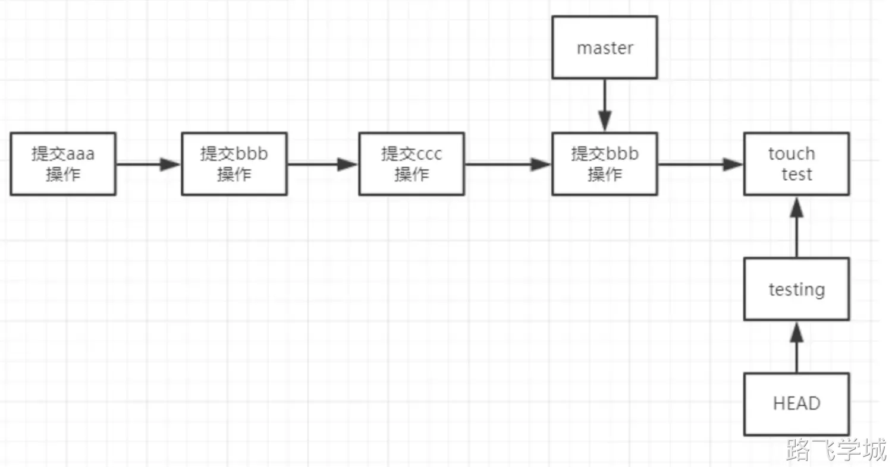

---
tags:
  - CICD/git
---

> [!run]- 查看当前属于什么分支
> 
> 
> ```plain
> [root@gitlab /git_data]# git branch 
> * master
> ```

> [!run]- 创建分支
> 
> 
> 创建新分支
> 
> ```
> [root@gitlab /git_data]# git branch testing
> ```
> 
> 创建新分支并切换到指定分支
> 
> ```plain
> [root@gitlab /git_data]# git checkout -b testing        
> 切换到一个新分支 'testing'
> [root@gitlab /git_data]# git branch 
>   master
> * testing
> ```
> 
> 图解：
> 
> 
> 

> [!run]- 查看分支指向
> 
> 
> ```plain
> [root@gitlab /git_data]# git log --oneline --decorate
> b11e0b2 (HEAD, testing, master) add bbb
> 8203c87 modified a
> 5c3ddba rename a.txt a
> 42ede9c commit a.txt
> 1153f56 commit a
> ```

> [!run]- 切换到指定分支
> 
> 
> 切换到testing分支
> 
> ```plain
> [root@gitlab /git_data]# git checkout testing 
> 切换到分支 'testing'
> [root@gitlab /git_data]# git branch 
>   master
> * testing
> ```
> 
> 图解：
> 
> 
> 
> 在当前分支创建文件并提交到本地仓库
> 
> ```plain
> [root@gitlab /git_data]# touch test
> [root@gitlab /git_data]# git add .
> [root@gitlab /git_data]# git commit -m "commit test"
> [testing d50853d] commit test
>  1 file changed, 0 insertions(+), 0 deletions(-)
>  create mode 100644 test
> [root@gitlab /git_data]# ll
> 总用量 4
> -rw-r--r-- 1 root root 9 5月  11 15:51 a
> -rw-r--r-- 1 root root 0 5月  11 16:02 test
> ```
> 
> 图解：
> 
> 
> 
> 切换到master分支查看文件
> 
> ```plain
> [root@gitlab /git_data]# git checkout master
> 切换到分支 'master'
> [root@gitlab /git_data]# git branch 
> * master
>   testing
> [root@gitlab /git_data]# ll
> 总用量 4
> -rw-r--r-- 1 root root 9 5月  11 15:51 a
> ```
> 
> 图解：
> 
> 
> 
> 在master分支下创建文件
> 
> ```plain
> [root@gitlab /git_data]# touch master
> [root@gitlab /git_data]# git add .
> [root@gitlab /git_data]# git commit -m "commit master"
> [master 6f9e2f0] commit master
>  1 file changed, 0 insertions(+), 0 deletions(-)
>  create mode 100644 master
> [root@gitlab /git_data]# ll
> 总用量 4
> -rw-r--r-- 1 root root 9 5月  11 15:51 a
> -rw-r--r-- 1 root root 0 5月  11 16:10 master
> ```
> 
> 图解：
> 
> 
> 

> [!run]- 合并分支
> 
> 
> 将test和master分支合并
> 
> ```plain
> [root@gitlab /git_data]# git branch 
> * master
>   testing
> [root@gitlab /git_data]# git merge testing 
> Merge made by the 'recursive' strategy.
>  test | 0
>  1 file changed, 0 insertions(+), 0 deletions(-)
>  create mode 100644 test
> ```
> 
> 查看提交日志
> 
> ```plain
> [root@gitlab /git_data]# git log --oneline --decorate
> 6f38df1 (HEAD, master) Merge branch 'testing'
> 6f9e2f0 commit master
> d50853d (testing) commit test
> b11e0b2 add bbb
> 8203c87 modified a
> 5c3ddba rename a.txt a
> 42ede9c commit a.txt
> 1153f56 commit a
> ```
> 
> 查看文件
> 
> ```plain
> [root@gitlab /git_data]# ll
> 总用量 4
> -rw-r--r-- 1 root root 9 5月  11 15:51 a
> -rw-r--r-- 1 root root 0 5月  11 16:10 master
> -rw-r--r-- 1 root root 0 5月  11 16:11 test
> ```
> 
> 图解
> 
> 
> 

> [!run]-  冲突合并
> 
> 在master分支下编辑a文件并提交
> 
> ```plain
> [root@gitlab /git_data]# echo "master" >> a
> [root@gitlab /git_data]# git commit -am "modified a master"
> [master 38fd841] modified a master
>  1 file changed, 1 insertion(+)
> [root@gitlab /git_data]# cat a
> aaaa
> bbb
> master
> ```
> 
> 切换到test分支下编辑文件并提交
> 
> ```plain
> [root@gitlab /git_data]# git checkout testing 
> 切换到分支 'testing'
> [root@gitlab /git_data]# echo "testing" >> a
> [root@gitlab /git_data]# git commit -am "modified a on testing branch"
> [testing 71c50c8] modified a on testing branch
>  1 file changed, 1 insertion(+)
>  [root@gitlab /git_data]# cat a 
> aaaa
> bbb
> testing
> ```
> 
> 切换到master分支并合并test分支，此时两个分支的文件内容是有冲突的
> 
> ```plain
> [root@gitlab /git_data]# git checkout master 
> 切换到分支 'master'
> [root@gitlab /git_data]# git merge testing 
> 自动合并 a
> 冲突（内容）：合并冲突于 a
> 自动合并失败，修正冲突然后提交修正的结果。
> ```
> 
> 此时冲突内容会自动写到文件里
> 
> ```plain
> [root@gitlab /git_data]# cat a
> aaaa
> bbb
> <<<<<<< HEAD
> master
> =======
> testing
> >>>>>>> testing
> ```
> 
> 要想解决冲突，我们需要手动修改文件，保留最终的文件,然后重新提交
> 
> ```plain
> [root@gitlab /git_data]# vim a 
> [root@gitlab /git_data]# cat a    
> aaaa
> bbb
> master
> [root@gitlab /git_data]# git commit -am "merge testing to master"
> [master 921d88e] merge testing to master
> ```
> 
> 查看提交日志
> 
> ```plain
> [root@gitlab /git_data]# git log --oneline --decorate
> 921d88e (HEAD, master) merge testing to master
> 71c50c8 (testing) modified a on testing branch
> 38fd841 modified a master
> 6f38df1 Merge branch 'testing'
> 6f9e2f0 commit master
> d50853d commit test
> b11e0b2 add bbb
> 8203c87 modified a
> 5c3ddba rename a.txt a
> 42ede9c commit a.txt
> 1153f56 commit a
> ```

> [!run]- 删除指定分支
> 
> 
> ```plain
> [root@gitlab /git_data]# git branch -d testing 
> 已删除分支 testing（曾为 71c50c8）。
> [root@gitlab /git_data]# git branch 
> * master
> ```
