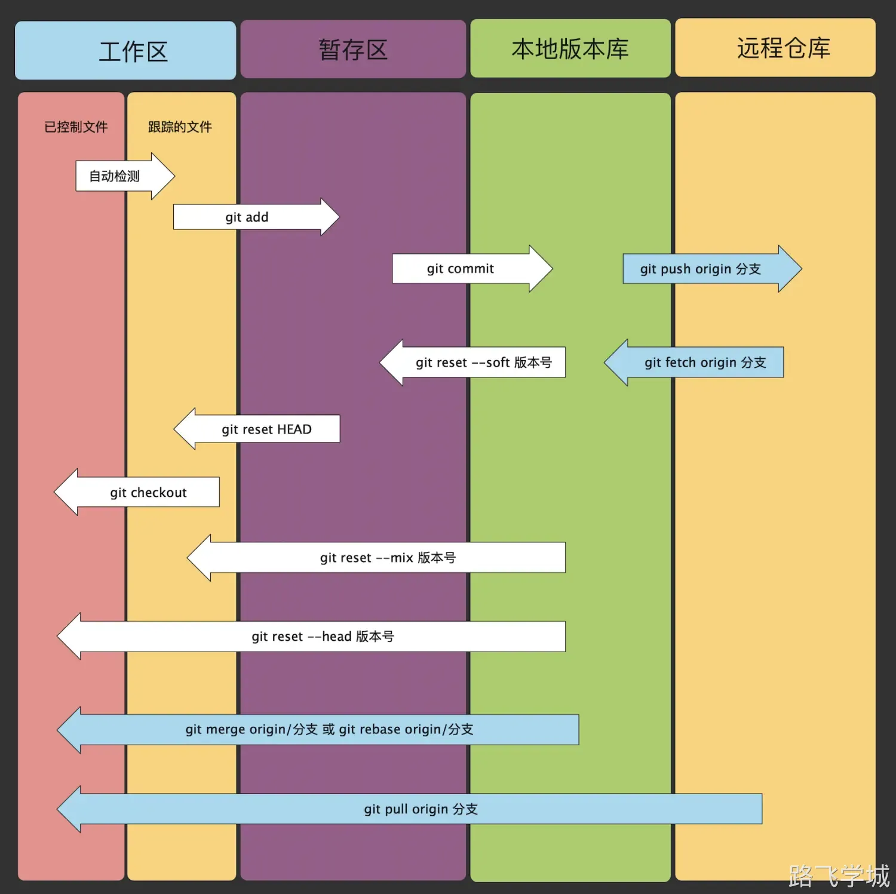

---
tags:
  - CICD/git
---

> [!run]- 命令总结
> 
> 
> ```plain
> git init		 					#初始化一个目录为git版本库
> git add .							#将没有被管理的文件，加入git管理，添加到暂存区
> git commit -m "描述"	#将暂存区的文件提交到版本库中，进行版本的管理
> git log								#查看提交的历史记录
> git reflog						#查看git提交的所有历史记录
> git status						#查看当前的文件管理状态（已提交|未提交）
> gi tag -a 版本号 -m "版本说明"  #给代码打标签
> git reset --hard  commitID	#回退到指定的提交版本记录
> git remote add origin 远程仓库地址  #添加远程仓库地址
> git clone git@项目地址      #克隆代码
> git push origin 分支名称    #提交代码
> git pull origin 分支名称    #拉取代码
> git fetch origin dev 			 #拉取代码
> git merge origin/dev       #合并代码
> ```
图解


