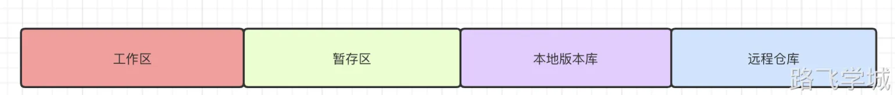

---
tags:
  - CICD/git
---

> [!info]- 文件状态
> 
> 
> git中文件的状态大概分为3种：已修改，已暂存，已提交
> 
> 已修改(modified): 
> git可以自动检测工作目录中哪些文件发生了变化，然后把修改后的文件添加到已修改(modified)区域
> 
> 已暂存(staged):
> 通过使用add命令可以将已修改的文件添加到暂存区，暂存区的文件只有被commit提交后才会保存到本地的代码库里
> 
> 已提交(committed):
> 将暂存区的文件commit到本地仓库永久保存

> [!info]- 位置区域
> 
> 
> 工作区：顾名思义，就是编写新功能的时候在这个区
> 暂存区：编写好的代码阶段性的暂存起来，就是说还没最终完成，但是保存一下
> 本地版本库：本地已经开发好的代码最终保存下来
> 远程仓库：将本地仓库的代码上传到远程仓库上
> 
> 
> 

> [!info]- 分支和主分支
> 
> 
> 分支是git中非常重要的概念，类似于科幻电影里的平行世界。
> 一般工作中我们会有一个主分支，主分支的内容都是经过严格测试后代码，一旦发布就不会再改动。
> 但是我们还要版本更新或者修复BUG，那怎么办呢？答案就是创建一个平行世界，完成后再合并到目前的世界。
> 
> 
> 

> [!info]- HEAD
> 
> 
> 工作区：
> 暂存区：
> 本地版本库：
> 远程仓库：
