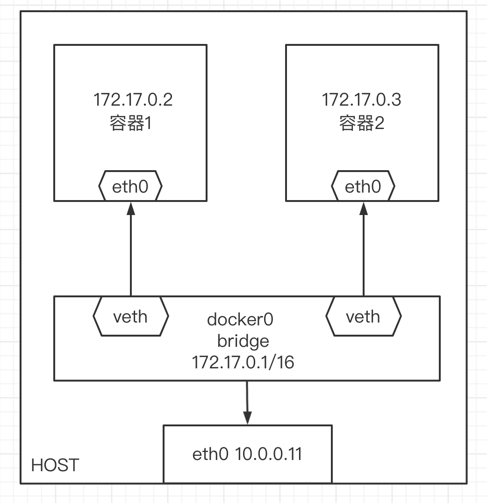
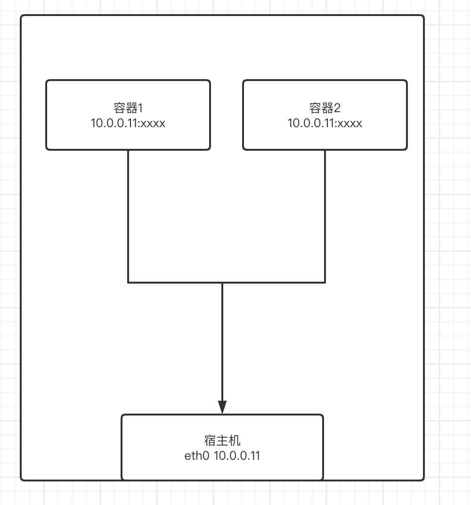
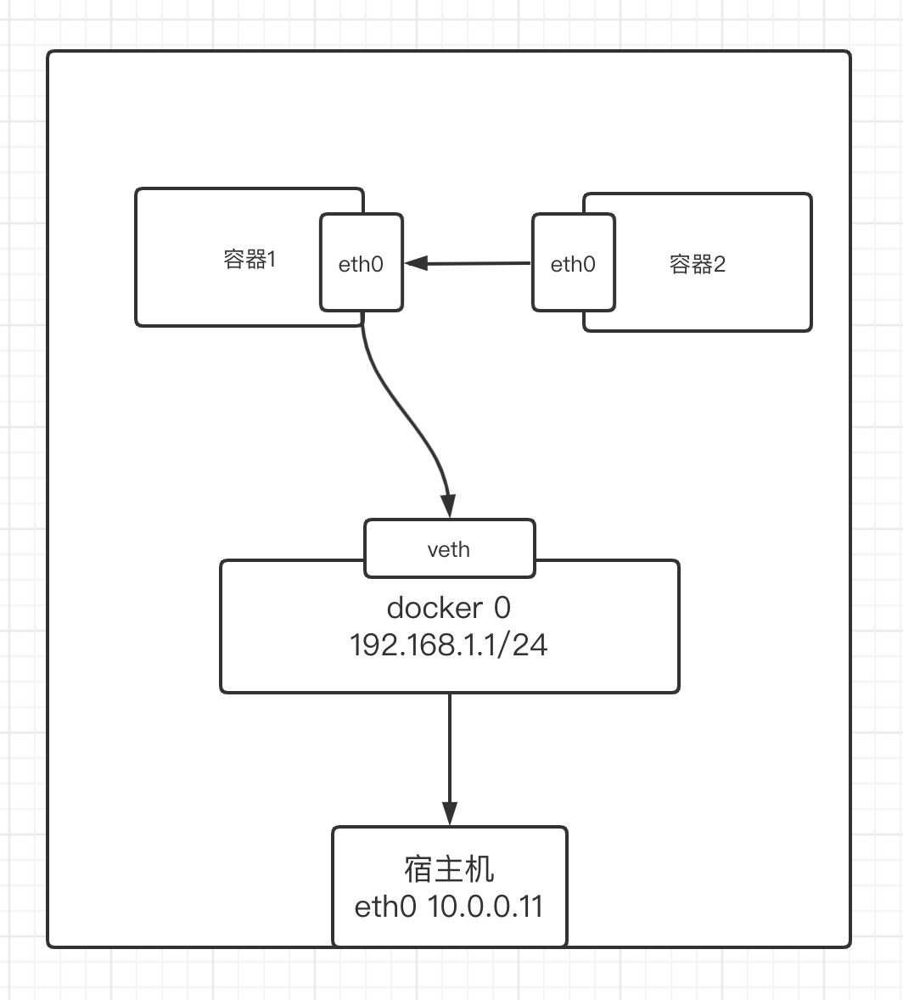

Docker网络的四种模式

```
Host		  容器将不会虚拟出自己的网卡，配置自己的IP等，而是使用宿主机的IP和端口。
Bridge	      此模式会为每一个容器分配、设置IP等，并将容器连接到一个docker0虚拟网桥，通过docker0网桥以及Iptables nat表配置与宿主机通信。
None		  此模式关闭了容器的网络功能。
Container	  创建的容器不会创建自己的网卡，配置自己的IP，而是和一个指定的容器共享IP、端口范围。
```

查看网络模式命令:
```
docker network ls
```

查看桥接网卡命令

```
yum install bridge-utils -y
brctl show
```

 
> [!info]- 桥接模式
> 
> Bridge模式介绍
> 
> ```
> 1.当Docker Daemon第一次启动时会创建一个虚拟的网桥，默认名称是Docker0
> 2.创建完后会给这个网桥分配一个子网,默认是172.17.0.1/16
> 3.由Docker创建的每一个容器,都会创建一个一个Veth设备对,其中一端关联到网桥上,另一端放在容器里映射为eth0,然后从网桥的地址段内给容器内的eth0分配一个IP地址,这样容器之间就可以互通了。
> ```
> 
> 桥接网络模式特点：
> 
> ```
> 1.同一宿主机的容器之间可以互相通信，不同宿主机之间不能互相通信
> 2.桥接模式的容器可以自动获取172.17.0.0/16网段的IP地址
> 3.其他机器不能直接访问容器，可以通过映射端口的形式访问
> 4.每个容器映射到宿主机的端口不能重复
> 5.容器可以借助宿主机的网络访问其他机器
> ```
> 
> 
> 
> 查看Bridge的详细信息
> 
> 查看桥接模式的详细信息：
> 
> ```
> [root@docker-11 ~]# docker network inspect bridge
> ```
> 
> 容器内查看：
> 
> ```
> [root@docker-11 ~]# docker run -it busybox /bin/sh    
> / # cd
> ~ # ip a
> 1: lo: <LOOPBACK,UP,LOWER_UP> mtu 65536 qdisc noqueue qlen 1000
>     link/loopback 00:00:00:00:00:00 brd 00:00:00:00:00:00
>     inet 127.0.0.1/8 scope host lo
>        valid_lft forever preferred_lft forever
> 14: eth0@if15: <BROADCAST,MULTICAST,UP,LOWER_UP,M-DOWN> mtu 1500 qdisc noqueue 
>     link/ether 02:42:ac:11:00:05 brd ff:ff:ff:ff:ff:ff
>     inet 172.17.0.5/16 brd 172.17.255.255 scope global eth0
>        valid_lft forever preferred_lft forever
> ~ #  
> ~ # route -n
> Kernel IP routing table
> Destination     Gateway         Genmask         Flags Metric Ref    Use Iface
> 0.0.0.0         172.17.0.1      0.0.0.0         UG    0      0        0 eth0
> 172.17.0.0      0.0.0.0         255.255.0.0     U     0      0        0 eth0
> 
> ~ # ping 10.0.0.12 -c 1
> PING 10.0.0.12 (10.0.0.12): 56 data bytes
> 64 bytes from 10.0.0.12: seq=0 ttl=63 time=0.471 ms
> 
> --- 10.0.0.12 ping statistics ---
> 1 packets transmitted, 1 packets received, 0% packet loss
> round-trip min/avg/max = 0.471/0.471/0.471 ms
> 
> ~ # traceroute 10.0.0.12
> traceroute to 10.0.0.12 (10.0.0.12), 30 hops max, 46 byte packets
>  1  172.17.0.1 (172.17.0.1)  0.010 ms  0.005 ms  0.005 ms
>  2  10.0.0.12 (10.0.0.12)  0.257 ms  0.246 ms  0.192 ms
> ```
> 
> 修改桥接模式默认的网络配置
> 
> 方法1：修改systemd文件添加bip参数
> 
> ```
> [root@docker-11 ~]# vim /lib/systemd/system/docker.service
> ExecStart=/usr/bin/dockerd -H fd:// --containerd=/run/containerd/containerd.sock --bip=192.168.100.1/24
> [root@docker-11 ~]# systemctl daemon-reload 
> [root@docker-11 ~]# systemctl restart docker.service 
> [root@docker-11 ~]# ip a
> 1: lo: <LOOPBACK,UP,LOWER_UP> mtu 65536 qdisc noqueue state UNKNOWN group default qlen 1000
>     link/loopback 00:00:00:00:00:00 brd 00:00:00:00:00:00
>     inet 127.0.0.1/8 scope host lo
>        valid_lft forever preferred_lft forever
>     inet6 ::1/128 scope host 
>        valid_lft forever preferred_lft forever
> 2: eth0: <BROADCAST,MULTICAST,UP,LOWER_UP> mtu 1500 qdisc pfifo_fast state UP group default qlen 1000
>     link/ether 00:0c:29:9a:74:d9 brd ff:ff:ff:ff:ff:ff
>     inet 10.0.0.11/24 brd 10.0.0.255 scope global eth0
>        valid_lft forever preferred_lft forever
>     inet6 fe80::20c:29ff:fe9a:74d9/64 scope link 
>        valid_lft forever preferred_lft forever
> 3: docker0: <NO-CARRIER,BROADCAST,MULTICAST,UP> mtu 1500 qdisc noqueue state DOWN group default 
>     link/ether 02:42:ed:fc:67:1f brd ff:ff:ff:ff:ff:ff
>     inet 192.168.1.1/24 brd 192.168.1.255 scope global docker0
>        valid_lft forever preferred_lft forever
>     inet6 fe80::42:edff:fefc:671f/64 scope link 
>        valid_lft forever preferred_lft forever
> 
> [root@docker-11 ~]# docker run -it busybox /bin/sh
> / # ip a
> 1: lo: <LOOPBACK,UP,LOWER_UP> mtu 65536 qdisc noqueue qlen 1000
>     link/loopback 00:00:00:00:00:00 brd 00:00:00:00:00:00
>     inet 127.0.0.1/8 scope host lo
>        valid_lft forever preferred_lft forever
> 18: eth0@if19: <BROADCAST,MULTICAST,UP,LOWER_UP,M-DOWN> mtu 1500 qdisc noqueue 
>     link/ether 02:42:c0:a8:01:02 brd ff:ff:ff:ff:ff:ff
>     inet 192.168.1.2/24 brd 192.168.1.255 scope global eth0
>        valid_lft forever preferred_lft forever
> ```
> 
> 方法2：修改daemon.json文件
> 
> ```
> [root@docker-11 ~]# cat /etc/docker/daemon.json 
> {
>   "bip": "192.168.2.1/24",
>   "registry-mirrors": ["https://ig2l319y.mirror.aliyuncs.com"]
> }
> ```
> 
> 
> 
> 创建一个自定义桥接网络
> ```
> docker network create -d bridge --subnet 172.30.0.0/16 --gateway 172.30.0.1 abc-net
> ```
> 
> 启动容器
> ```
> docker run --name box1 -it --network abc-net -d abc.com/base/busybox /bin/sh
> docker run --name box2 -it --network abc-net -d abc.com/base/busybox /bin/sh
> ```
> 
> 测试
> ```
> docker exec box1 ping box2
> docker exec box2 ping box1
> ```


> [!info]- Host网络模式
> 
> 
> Host模式说明
> 
> ```
> 1.Host模式启动的容器不会虚拟出自己的网卡和IP，而是使用宿主机的IP和端口。
> 2.但是其他的资源比如文件系统和进程列表还是和宿主机隔离的。
> 3.启动容器需要使用指定的参数 --network host
> 4.Host模式不支持端口映射
> 5.因为直接使用宿主机的网络资源，所以性能较好
> ```
> 
> 特点
> 直接使用宿主机的网卡，容器自己本身没有IP地址
> 如果容器内有端口则会占用宿主机的端口
> 
> 启动命令
> ```
> docker run --name my-nginx -it --network host -d abc.com/base/nginx
> ```
> 
> 
> 
> Host模式演示
> 
> ```
> #查看当前宿主机的端口和容器运行情况
> [root@docker-11 ~]# netstat -lntup|grep 80
> [root@docker-11 ~]# docker ps
> CONTAINER ID   IMAGE     COMMAND   CREATED   STATUS    PORTS     NAMES
> 
> #运行一个nginx容器
> [root@docker-11 ~]# docker run -d --network host nginx
> f6f44b316317f1727d648801836653866fe25f2ad8c24bf6fe9e7e2e8ee1b6ea
> [root@docker-11 ~]# docker ps
> CONTAINER ID   IMAGE     COMMAND                  CREATED         STATUS         PORTS     NAMES
> f6f44b316317   nginx     "/docker-entrypoint.…"   5 seconds ago   Up 4 seconds             charming_blackwell
> 
> #再次查看宿主机端口情况
> [root@docker-11 ~]# netstat -lntup|grep 80            
> tcp        0      0 0.0.0.0:80              0.0.0.0:*               LISTEN      20842/nginx: master 
> tcp6       0      0 :::80                   :::*                    LISTEN      20842/nginx: master 
> 
> #进入容器后配置源信息
> [root@docker-11 ~]# docker exec -it f6f44b316317 /bin/bash
> root@docker-11:/# cat >/etc/apt/sources.list << 'EOF'
> > deb https://mirrors.tuna.tsinghua.edu.cn/debian/ buster main contrib non-free
> > deb https://mirrors.tuna.tsinghua.edu.cn/debian/ buster-updates main contrib non-free
> > deb https://mirrors.tuna.tsinghua.edu.cn/debian/ buster-backports main contrib non-free
> > deb https://mirrors.tuna.tsinghua.edu.cn/debian-security buster/updates main contrib non-free
> > EOF
> root@docker-11:/# apt update
> 
> #在容器内安装网络命令
> root@docker-11:/# apt install iproute2 net-tools -y
> 
> #查看网络信息
> root@docker-11:/# ifconfig                 
> docker0: flags=4099<UP,BROADCAST,MULTICAST>  mtu 1500
>         inet 192.168.1.1  netmask 255.255.255.0  broadcast 192.168.1.255
>         inet6 fe80::42:edff:fefc:671f  prefixlen 64  scopeid 0x20<link>
>         ether 02:42:ed:fc:67:1f  txqueuelen 0  (Ethernet)
>         RX packets 22  bytes 1106 (1.0 KiB)
>         RX errors 0  dropped 0  overruns 0  frame 0
>         TX packets 26  bytes 2154 (2.1 KiB)
>         TX errors 0  dropped 0 overruns 0  carrier 0  collisions 0
> 
> eth0: flags=4163<UP,BROADCAST,RUNNING,MULTICAST>  mtu 1500
>         inet 10.0.0.11  netmask 255.255.255.0  broadcast 10.0.0.255
>         inet6 fe80::20c:29ff:fe9a:74d9  prefixlen 64  scopeid 0x20<link>
>         ether 00:0c:29:9a:74:d9  txqueuelen 1000  (Ethernet)
>         RX packets 208690  bytes 293033849 (279.4 MiB)
>         RX errors 0  dropped 0  overruns 0  frame 0
>         TX packets 67922  bytes 4640476 (4.4 MiB)
>         TX errors 0  dropped 0 overruns 0  carrier 0  collisions 0
> 
> lo: flags=73<UP,LOOPBACK,RUNNING>  mtu 65536
>         inet 127.0.0.1  netmask 255.0.0.0
>         inet6 ::1  prefixlen 128  scopeid 0x10< host>
>         loop  txqueuelen 1000  (Local Loopback)
>         RX packets 12  bytes 1563 (1.5 KiB)
>         RX errors 0  dropped 0  overruns 0  frame 0
>         TX packets 12  bytes 1563 (1.5 KiB)
>         TX errors 0  dropped 0 overruns 0  carrier 0  collisions 0
> ```

> [!info]- Host模式注意
> 
> 
> 不能端口映射
> 
> ```
> [root@docker-11 ~]# docker run -p 8080:80 --network host -d nginx   
> WARNING: Published ports are discarded when using host network mode
> e4fc457b171fa488db1c2bb0293d2eaaf8948b5ecbac339feb92f943aa565bf1
> ```
> 
> host模式下端口不能重复.如果再次启动相同端口的虚拟机就会失败
> 
> ```
> #启动多个host模式的容器
> [root@docker-11 ~]# docker run -d --network host nginx
> 638c60c90e5d17f75de1805f81e8b064c4e144616e186b57a8170fc789f1a71b
> [root@docker-11 ~]# docker run -d --network host nginx
> 9866a4ac70f4a08bd91e3a0f820ee796f1353d3fbf93f5f8ff48a52fb84850e7
> 
> #查看容器发现并没有启动成功
> [root@docker-11 ~]# docker ps
> CONTAINER ID   IMAGE     COMMAND                  CREATED          STATUS          PORTS     NAMES
> f6f44b316317   nginx     "/docker-entrypoint.…"   11 minutes ago   Up 11 minutes             charming_blackwell
> 
> #通过查看失败的容器日志发现是端口冲突了
> [root@docker-11 ~]# docker logs -f 638c60c90e5d
> /docker-entrypoint.sh: /docker-entrypoint.d/ is not empty, will attempt to perform configuration
> /docker-entrypoint.sh: Looking for shell scripts in /docker-entrypoint.d/
> /docker-entrypoint.sh: Launching /docker-entrypoint.d/10-listen-on-ipv6-by-default.sh
> 10-listen-on-ipv6-by-default.sh: info: Getting the checksum of /etc/nginx/conf.d/default.conf
> 10-listen-on-ipv6-by-default.sh: info: Enabled listen on IPv6 in /etc/nginx/conf.d/default.conf
> /docker-entrypoint.sh: Launching /docker-entrypoint.d/20-envsubst-on-templates.sh
> /docker-entrypoint.sh: Launching /docker-entrypoint.d/30-tune-worker-processes.sh
> /docker-entrypoint.sh: Configuration complete; ready for start up
> 2021/07/21 13:21:17 [emerg] 1#1: bind() to 0.0.0.0:80 failed (98: Address already in use)
> nginx: [emerg] bind() to 0.0.0.0:80 failed (98: Address already in use)
> ```


> [!info]- container网络模式
> 
> 
> Container模式说明
> 
> ```
> 1.Container模式创建的容器不会创建自己的网卡和IP，而是和一个已经存在的容器共享同一个网络空间
> 2.Container模式的容器和宿主机网络空间互相隔离。
> ```
> 
> 
> 
> 特点
> 容器自己没有网卡，必须依赖于另一个有网卡的容器
> 
> 启动命令
> ```
> docker run --name my-nginx -it -d abc.com/base/nginx
> docker run --name my-box -it --network container:my-nginx -d abc.com/base/busybox
> ```
> ```
> #运行第一个容器没有nginx服务
> docker run -it --name web1 -p 80:80 nginx
> docker exec -it web1 /bin/bash
> curl 127.0.0.1
> 
> #运行第二个容器拥有nginx服务
> docker run -d --name web2 --network container:web1 nginx
> curl 127.0.0.1
> ```


> [!info]- None网络模式
> 
> 
> 在需要特别安全不通过网络访问的情况下可以使用none模式
> 
> 
> ```
> [root@docker-11 ~]# docker run --network none -it busybox:latest /bin/sh
> / # 
> / # ip a
> / # ping 10.0.0.11
> PING 10.0.0.11 (10.0.0.11): 56 data bytes
> ping: sendto: Network is unreachable
> / # route -n
> Kernel IP routing table
> Destination     Gateway         Genmask         Flags Metric Ref    Use Iface
> ```

> [!info]- 自定义网络模式
> 
> 
> 自定义网络模式特点
> 
> ```
> 自定义网络可以独立设置容器的使用的网段，而且在同一网络里的虚拟机不需要link就可以直接使用容器名进行互相访问
> ```
> 
> 自定义网络模式语法 
> 
> ```
> #创建自定义网络
> docker network create -d < mode> --subnet < CIDR> --gateway < 网关> < 自定义网络名称>
> 
> #引用自定义网络
> docker run --network <自定义网络名称> <镜像名称>
> 
> #删除自定义网络
> docker network rm <自定义网络名称或网络ID>
> ```
> 
> 自定义网络模式
> 
> ```
> #创建自定义网络
> docker network create -d bridge --subnet 192.168.100.0/24 --gateway 192.168.100.1 sz-net
> 
> #查看信息
> docker inspect my-net
> 
> #查看网卡
> ip a
> 
> #查看网桥
> brctl show
> 
> #利用自定义的网络创建容器
> ##运行第一个容器
> docker run --name busybox_1 -it --network my-net busybox /bin/sh
> ip a
> route -n
> 
> ##运行第二个容器
> docker run --name busybox_2 -it --network my-net busybox /bin/sh
> ip a
> route -n
> ping busybox_1
> ```
> 
> 
