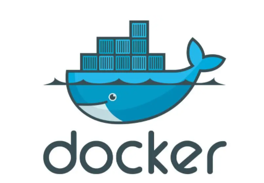

Docker是什么



```
Docker是Docker.Inc 公司开源的一个基于LXC技术之上构建的Container容器引擎,源代码托管在 GitHub 上,基于Go语言并遵从Apache2.0协议开源。
Docker是通过内核虚拟化技术（namespaces及cgroups等）来提供容器的资源隔离与安全保障等。
由于Docker通过操作系统层的虚拟化实现隔离，所以Docker容器在运行时，不需要类似虚拟机（VM）额外的操作系统开销，提高资源利用率。
```
Docker是一个软件，运行在linux上

```
容器有效的将由单个操作系统挂管理的资源划分到孤立的组中，以便更好的在组之间平衡有冲突的资源使用需求。可简单理解为一种沙盒 。每个容器内运行一个应用，不同的容器之间相互隔离，容器之间也可以建立通信机制。容器的创建和停止都十分快速，资源需求远远低于虚拟机。
```
namespace可以资源隔离
- kernel提供了namespace的机制用来隔离相关资源。namespace设计之初就是为了实现轻量级的系统资源隔离。

- 可以让容器中的进程仿佛置身于一个独立的系统环境中。

| namespace |     隔离内容      |
| --------- | :-----------: |
| UTC       |    主机名和域名     |
| IPC       | 信号量、消息队列和共享内存 |
| PID       |     进程编号      |
| Network   | 网络设备、网络栈、端口等  |
| Mount     |     文件系统      |
| User      |    用户和用户组     |


cgroups资源限制

```
cgroup的作用主要是用来控制资源的使用，比如限制CPU内存和磁盘的使用等
```

cgroups的四大作用：

```
资源限制： 比如设定任务内存使用的上限。
优先级分配： 比如给任务分配CPU的时间片数量和磁盘IO的带宽大小来控制任务运行的优先级。
资源统计：比如统计CPU的使用时长、内存用量等。这个功能非常适用于计费。
任务控制：cgroups可以对任务执行挂起、恢复等操作。
```


