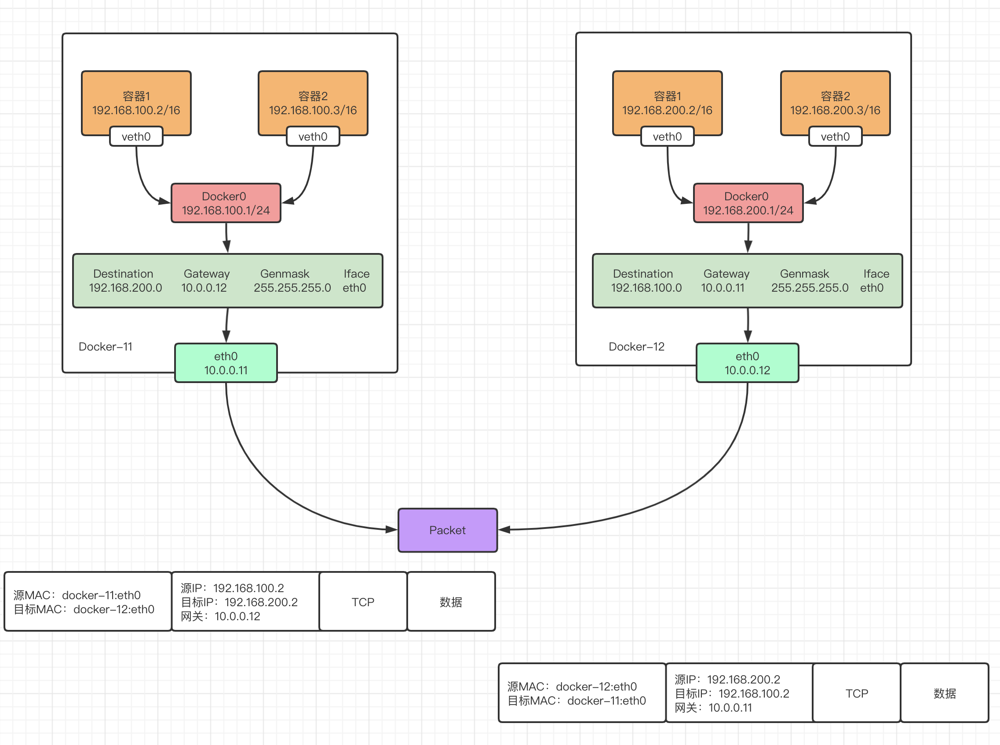

## 1.Docker跨主机网络类型

```
静态路由
flannel
Overlay
macvlan
calico
```

## 2.静态路由模式

### 2.1 静态路由模式说明

```
https://www.processon.com/view/link/621c6c3c7d9c0865b2e17e67
```



配置说明：

```
1.两台宿主机的容器IP处于不同的网段
2.两台宿主机都配置了静态路由，发给对方的网段的数据包通过eth0网卡，网关指向对方的eth0地址
3.防火墙开发内网转发规则
```

### 2.2 两台主机创建不同的docker0网段

docker-11配置

```
cat > /etc/docker/daemon.json << 'EOF'
{
  "bip": "192.168.100.1/24",
  "registry-mirrors": ["https://ig2l319y.mirror.aliyuncs.com"]
}
EOF
systemctl daemon-reload 
systemctl restart docker
ip a|grep 192.168.100
```

docker-12配置

```
cat > /etc/docker/daemon.json << 'EOF' 
{
  "bip": "192.168.200.1/24",
  "registry-mirrors": ["https://ig2l319y.mirror.aliyuncs.com"]
}
EOF
systemctl daemon-reload 
systemctl restart docker
ip a|grep 192.168.200
```

### 2.3 添加静态路由和iptables规则

docker-11配置

```
route add -net 192.168.200.0/24 gw 10.0.0.12
iptables -A FORWARD -s 10.0.0.0/24 -j ACCEPT
```

docker-12配置

```
route add -net 192.168.100.0/24 gw 10.0.0.11
iptables -A FORWARD -s 10.0.0.0/24 -j ACCEPT
```

### 2.4 跨主机容器通信测试

docker-11启动容器

```
[root@docker-11 ~]# docker run -it busybox /bin/sh
/ # ip a
1: lo: <LOOPBACK,UP,LOWER_UP> mtu 65536 qdisc noqueue qlen 1000
    link/loopback 00:00:00:00:00:00 brd 00:00:00:00:00:00
    inet 127.0.0.1/8 scope host lo
       valid_lft forever preferred_lft forever
13: eth0@if14: <BROADCAST,MULTICAST,UP,LOWER_UP,M-DOWN> mtu 1500 qdisc noqueue 
    link/ether 02:42:c0:a8:64:02 brd ff:ff:ff:ff:ff:ff
    inet 192.168.100.2/24 brd 192.168.100.255 scope global eth0
       valid_lft forever preferred_lft forever
```

docker-12启动容器

```
[root@docker-12 ~]# docker run -it busybox /bin/sh
/ # ip a
1: lo: <LOOPBACK,UP,LOWER_UP> mtu 65536 qdisc noqueue qlen 1000
    link/loopback 00:00:00:00:00:00 brd 00:00:00:00:00:00
    inet 127.0.0.1/8 scope host lo
       valid_lft forever preferred_lft forever
10: eth0@if11: <BROADCAST,MULTICAST,UP,LOWER_UP,M-DOWN> mtu 1500 qdisc noqueue 
    link/ether 02:42:c0:a8:c8:02 brd ff:ff:ff:ff:ff:ff
    inet 192.168.200.2/24 brd 192.168.200.255 scope global eth0
       valid_lft forever preferred_lft forever
```

docker-11启动容器访问docker-12容器测试

```
/ # ping -c 1 192.168.200.2
PING 192.168.200.2 (192.168.200.2): 56 data bytes
64 bytes from 192.168.200.2: seq=0 ttl=62 time=0.531 ms
```

docker-12启动容器访问docker-11容器测试

```
/ # ping -c 1 192.168.100.2
PING 192.168.100.2 (192.168.100.2): 56 data bytes
64 bytes from 192.168.100.2: seq=0 ttl=62 time=0.631 ms
```

### 2.5 抓包查看

docker-11抓包

```
[root@docker-11 ~]# yum install tcpdump -y
[root@docker-11 ~]# tcpdump -i eth0 -nn icmp
tcpdump: verbose output suppressed, use -v or -vv for full protocol decode
listening on eth0, link-type EN10MB (Ethernet), capture size 262144 bytes
19:59:41.665444 IP 10.0.0.11 > 192.168.200.2: ICMP echo request, id 7, seq 0, length 64
19:59:41.665791 IP 192.168.200.2 > 10.0.0.11: ICMP echo reply, id 7, seq 0, length 64
```

docker-12抓包

```
[root@docker-12 ~]# yum install tcpdump -y
[root@docker-12 ~]# tcpdump -i eth0 -nn icmp
tcpdump: verbose output suppressed, use -v or -vv for full protocol decode
listening on eth0, link-type EN10MB (Ethernet), capture size 262144 bytes
20:01:20.616844 IP 10.0.0.12 > 192.168.100.2: ICMP echo request, id 7, seq 0, length 64
20:01:20.617351 IP 192.168.100.2 > 10.0.0.12: ICMP echo reply, id 7, seq 0, length 64
```

### 2.6 删除路由规则

```
route del -net 192.168.100.0 netmask 255.255.255.0
route del -net 192.168.200.0 netmask 255.255.255.0
```

## 3.跨主机通信-flannel实现

### 3.1 flannel介绍

```
Flannel是一种基于overlay网络的跨主机容器网络解决方案，即将TCP数据包封装在另一种网络包里面进行路由转发和通信，Flannel是CoreOS开发,专门用于docker多机互联的一个工具,让集群中的不同节点主机创建的容器都具有全集群唯一的虚拟ip地址
```

### 3.2 flannel通信原理

流程图解


文字说明

```
1.数据从源容器中发出后，经由所在主机的docker0虚拟网卡转发到flannel0虚拟网卡。

2.源主机的flanneld服务将原本的数据内容UDP封装后根据自己的路由表投递给目的节点的flanneld服务，数据到达目标主机后被解包，然后直接进入目的节点的flannel0虚拟网卡，然后被转发到目的主机的docker0虚拟网卡，最后就像本机容器通信一样由docker0路由到达目标容器。 

3.使每个结点上的容器分配的地址不冲突。Flannel通过Etcd分配了每个节点可用的IP地址段后，再修改Docker的启动参数。“--bip=X.X.X.X/X”这个参数，它限制了所在节点容器获得的IP范围。
```

### 3.3 实验环境

```
10.0.0.11  etcd,flannel,docker
10.0.0.12  flannel,docker
```

### 3.4 docker-11安装配置etcd

单节点安装etcd

```
yum install etcd -y
```

编辑配置文件

```
cat > /etc/etcd/etcd.conf << 'EOF'
# [member]
ETCD_NAME=default
ETCD_DATA_DIR="/var/lib/etcd/default.etcd"
ETCD_LISTEN_CLIENT_URLS="http://10.0.0.11:2379,http://127.0.0.1:2379"

# #[cluster]
ETCD_INITIAL_CLUSTER_STATE="new"
ETCD_INITIAL_CLUSTER_TOKEN="etcd-cluster"
ETCD_ADVERTISE_CLIENT_URLS="http://10.0.0.11:2379"
EOF
```

启动etcd

```
systemctl start etcd
systemctl enable etcd
```

测试etcd功能

```
etcdctl -C http://10.0.0.11:2379 cluster-health
etcdctl -C http://10.0.0.11:2379 set /testdir/testkey "Hello world"   
etcdctl -C http://10.0.0.11:2379 get /testdir/testkey
```

防火墙

```
iptables -A INPUT -p tcp -m tcp --dport 2379 -m state --state NEW,ESTABLISHED -j ACCEPT
iptables -A INPUT -p tcp -m tcp --dport 2380 -m state --state NEW,ESTABLISHED -j ACCEPT
```

### 3.5 安装配置Flannel-两台机器都操作

安装Flannel

```
yum install flannel -y
```

配置Flannel

```
cp /etc/sysconfig/flanneld /opt/flanneld.bak
cat > /etc/sysconfig/flanneld << 'EOF'
# Flanneld configuration options  

# etcd url location.  Point this to the server where etcd runs
FLANNEL_ETCD_ENDPOINTS="http://10.0.0.11:2379"

# etcd config key.  This is the configuration key that flannel queries
# For address range assignment
FLANNEL_ETCD_PREFIX="/atomic.io/network"

# Any additional options that you want to pass
#FLANNEL_OPTIONS=""
EOF
```

配置etcd数据库

```
etcdctl mk /atomic.io/network/config '{ "Network": "192.168.0.0/16" }'
```

启动flanneld

```
systemctl start flanneld.service
systemctl enable flanneld.service
```

检查端口

```
netstat -lntup|grep flannel
```

### 3.6 配置Docker关联Flannel网络

修改docker配置文件:

```
vim /usr/lib/systemd/system/docker.service
.................
EnvironmentFile=/run/flannel/docker
ExecStart=/usr/bin/dockerd -H fd:// $DOCKER_NETWORK_OPTIONS
.................
systemctl daemon-reload 
systemctl restart docker
```

### 3.7 创建防火墙规则

```
iptables -P FORWARD ACCEPT
```

### 3.8 创建容器测试

docker-11创建容器:

```
docker run -it busybox /bin/sh
```

查看IP地址:

```
/ # ip a
1: lo: <LOOPBACK,UP,LOWER_UP> mtu 65536 qdisc noqueue qlen 1000
    link/loopback 00:00:00:00:00:00 brd 00:00:00:00:00:00
    inet 127.0.0.1/8 scope host lo
       valid_lft forever preferred_lft forever
11: eth0@if12: <BROADCAST,MULTICAST,UP,LOWER_UP,M-DOWN> mtu 1472 qdisc noqueue 
    link/ether 02:42:c0:a8:38:02 brd ff:ff:ff:ff:ff:ff
    inet 192.168.56.2/24 brd 192.168.56.255 scope global eth0
       valid_lft forever preferred_lft forever
```

docker-12创建容器:

```
docker run -it busybox /bin/sh
```

查看IP地址:

```
/ # ip a
1: lo: <LOOPBACK,UP,LOWER_UP> mtu 65536 qdisc noqueue qlen 1000
    link/loopback 00:00:00:00:00:00 brd 00:00:00:00:00:00
    inet 127.0.0.1/8 scope host lo
       valid_lft forever preferred_lft forever
8: eth0@if9: <BROADCAST,MULTICAST,UP,LOWER_UP,M-DOWN> mtu 1472 qdisc noqueue 
    link/ether 02:42:c0:a8:24:02 brd ff:ff:ff:ff:ff:ff
    inet 192.168.36.2/24 brd 192.168.36.255 scope global eth0
       valid_lft forever preferred_lft forever 
```

测试容器间可否通讯:

```
ping 192.168.56.2
ping 192.168.36.2
```

## 4.macvlan模式

### 4.0 macvlan介绍

```
https://docs.docker.com/network/macvlan/
简单来说，macvlan就是将在物理网虚拟出一个网卡，这个网卡有自己的mac地址，从而让容器可以直接使用物理网卡
```

### 4.1 创建网络-所有机器都要配置

```
docker network create -d macvlan --subnet 10.0.0.0/24 --gateway 10.0.0.254 -o parent=eth0 macvlan_1
```

### 4.2 启动容器

docker-11启动容器

```
docker run -it --network macvlan_1 --ip 10.0.0.100 busybox /bin/sh
```

docker-12启动容器

```
docker run -it --network macvlan_1 --ip 10.0.0.200 busybox /bin/sh
```

启动后互相ping发现可以正常通讯

```
ping 10.0.0.100
ping 10.0.0.200
```

## 5.跨主机通信-Consul实现

### 5.1 Consul介绍

```
Consul是一个服务网格（微服务间的 TCP/IP，负责服务之间的网络调用、限流、熔断和监控）解决方案，它是一个一个分布式的，高度可用的系统，而且开发使用都很简便。
它提供了一个功能齐全的控制平面，主要特点是：服务发现、健康检查、键值存储、安全服务通信、多数据中心。
```

### 5.2 二进制安装步骤

```
wget https://releases.hashicorp.com/consul/1.4.4/consul_1.4.4_linux_amd64.zip 
unzip consul_1.4.4_linux_amd64.zip 
mv consul /usr/bin/
chmod +x /usr/bin/consul
nohup consul agent -server -bootstrap -ui -data-dir /var/lib/consul -client=10.0.0.11 -bind=10.0.0.11 &> /var/log/consul.log &
tail -f /var/log/consul.log
```

### 5.3 修改docker-11启动文件

```
[root@docker-11 ~]# vim /lib/systemd/system/docker.service
#ExecStart=/usr/bin/dockerd -H fd:// --containerd=/run/containerd/containerd.sock
ExecStart=/usr/bin/dockerd -H tcp://0.0.0.0:2375 -H unix:///var/run/docker.sock --cluster-store consul://10.0.0.11:8500 --cluster-advertise 10.0.0.11:2375
```

### 5.4 重启docker-11

```
systemctl daemon-reload     
systemctl restart docker.service
```

### 5.5 同样方法修改docker-12的配置

```
[root@docker-12 ~]# vim /lib/systemd/system/docker.service
#ExecStart=/usr/bin/dockerd -H fd:// --containerd=/run/containerd/containerd.sock
ExecStart=/usr/bin/dockerd -H tcp://0.0.0.0:2375 -H unix:///var/run/docker.sock --cluster-store consul://10.0.0.11:8500 --cluster-advertise 10.0.0.12:2375
```

### 5.6 重启docker2

```
systemctl daemon-reload     
systemctl restart docker.service
```

### 5.7 在docker主机上创建overlay网络

在docker1上创建网络，然后会自动同步到docker2上

```
docker network create -d overlay overlay_net
```

### 5.8 分别在两个节点上创建容器

docker1上运行命令

```
docker run -it --net=overlay_net --name busybox01 busybox:latest
```

docker2上运行命令

```
docker run -it --net=overlay_net --name busybox02 busybox:latest
```

### 5.9 测试联通性

```
docker run -it --net=overlay_net --name busybox01 busybox:latest
#ping 10.0.0.3
```
