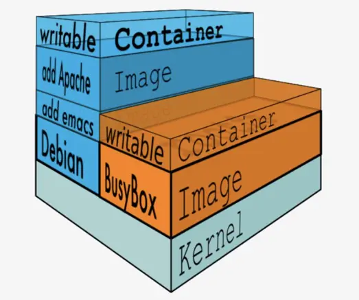

Image(镜像):

```
那么镜像到底是什么呢？Docker 镜像可以看作是一个特殊的文件系统，除了提供容器运行时所需的程序、库、资源、配置等文件外，还包含了一些为运行时准备的一些配置参数（如匿名卷、环境变量、用户等）。
```

Container(容器):

```
容器(Container)的定义和镜像(Image)几乎一模一样，也是一堆层的统一视角，唯一区别在于容器的最上面那一层是可读可写的。
```

Repository(仓库):

```
镜像仓库是 Docker 用来集中存放镜像文件的地方，类似于我们之前常用的代码仓库。
通常，一个仓库会包含同一个软件不同版本的镜像，而标签就常用于对应该软件的各个版本 。
我们可以通过<仓库名>:<标签>的格式来指定具体是这个软件哪个版本的镜像。如果不给出标签，将以 Latest 作为默认标签。
```

镜像和容器图解:

 
