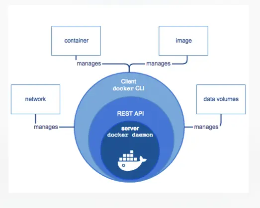

```
Docker是传统的C/S架构分为docker client和docker server
Docker 客户端是 Docker 用户与 Docker 交互的主要方式。
当您使用 Docker 命令行运行命令时，Docker 客户端将这些命令发送给服务器端，服务端将执行这些命令。
Docker 命令使用 Docker API 。
Docker 客户端可以与多个服务端进行通信。
```


