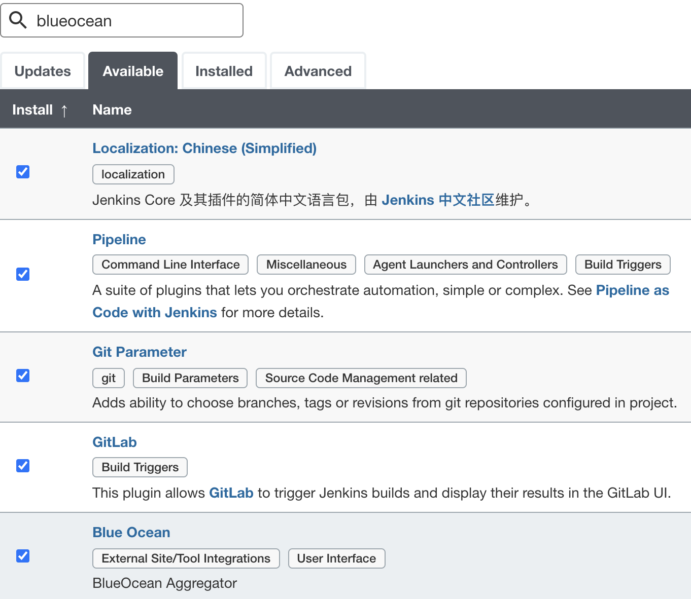
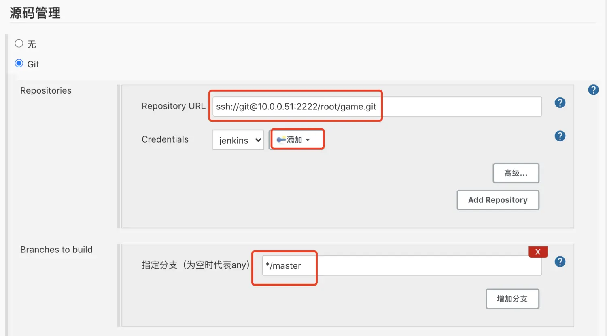

## 1.部署流程

部署流程：

```
1.下载代码
2.编译镜像
3.推送镜像
4.停止正在运行的容器
5.启动新容器
6.清理jenkins主机上的镜像
```

回滚流程：

```
1.选择需要回滚的版本
2.停止正在运行的容器
3.启动新容器
```

## 2.jenkins Docker in Docker

```
docker run -p 8888:8080 -p 50000:50000 \
-v /data/jenkins_home:/var/jenkins_home \
-v /var/run/docker.sock:/var/run/docker.sock \
-v /usr/bin/docker:/usr/bin/docker \
-v '/root/.ssh:/root/.ssh' \
--name jenkins \
--privileged=true  \
-u root \
-d jenkins/jenkins:latest
```

## 3.编写dockerfile

还需要做什么？

```
设置容器内的时区
将创建的ssh私钥加入（使用git拉代码是要用，配对的公钥配置在gitlab中）
加入了登陆自建harbor仓库的config文件
修改了ssh客户端的配置，不做指纹验证
```

## 4.登陆docker

```
cat > /etc/docker/daemon.json << 'EOF'
{
  "registry-mirrors": ["https://ig2l319y.mirror.aliyuncs.com"],
  "insecure-registries": ["http://10.0.0.11"]
}
EOF
docker login 10.0.0.11
```

## 5.准备文件

```
cd /data/dockerfile/jenkins/
cp /root/.ssh/id_rsa .
cp /root/.docker/config.json .
wget get.docker.com -O get-docker.sh
chmod +x get-docker.sh 
```

## 6.构建镜像

```
cd /data/dockerfile/jenkins/
docker build . -t 10.0.0.11/linux6/jenkins:latest
```

## 7.上传镜像

```
docker push 10.0.0.11/linux6/jenkins:latest
```

## 8.准备docker-compose文件

```
version: '3'
services:
  jenkins:
    image: jenkins/jenkins:latest
    container_name: jenkins
    restart: always
    privileged: true
    user: root
    ports:
      - '8888:8080'
      - '50000:50000'
    volumes:
      - '/etc/localtime:/etc/localtime'
      - '/data/jenkins_home:/var/jenkins_home'
      - '/var/run/docker.sock:/var/run/docker.sock'
      - '/usr/bin/docker:/usr/bin/docker'
      - '/root/.ssh:/root/.ssh'
```

## 9.安装插件



## 11.jenkins配置



## 13.pipeline配置

新版本插件的pipeline配置

```
pipeline{ 
    agent any 
    parameters {
        gitParameter name: 'git_version', 
                     type: 'PT_TAG',
                     description: '请选择版本：', 
                     defaultValue: 'v1.0'
        choice(name: 'base_image', choices: ['nginx:1.17','nginx:1.18'],description: '请选择基础镜像版本')
        choice(name: 'deploy_env', choices: ['deploy','rollback'],description: 'deploy: 发布版本\nrollback: 回滚版本') 
    }

    stages{
        stage("下载代码"){ 
            when {
                environment name: 'deploy_env', value: 'deploy'
            } 
            steps{
                dir("game"){
                    checkout([$class: 'GitSCM', 
                          branches: [[name: "${params.git_version}"]], 
                          doGenerateSubmoduleConfigurations: false, 
                          extensions: [], 
                          gitTool: 'Default', 
                          submoduleCfg: [], 
                          userRemoteConfigs: [[url: 'ssh://git@10.0.0.11:2222/root/game.git']]
                        ])
                }
            }
        } 

        stage("编译镜像"){
            when {
                environment name: 'deploy_env', value: 'deploy'
            }
            steps{
                writeFile file: "Dockerfile", text: """FROM 10.0.0.11/base_image/${params.base_image}\nADD game /usr/share/nginx/html/"""
                sh "docker build -t 10.0.0.11/image/game:${params.git_version} . && docker push 10.0.0.11/image/game:${params.git_version}"               
            } 
        }

        stage("推送镜像"){
            when {
                environment name: 'deploy_env', value: 'deploy'
            }
            steps{
                sh "docker build -t 10.0.0.11/image/game:${params.git_version} . && docker push 10.0.0.11/image/game:${params.git_version}"               
            }         
        }

        stage("部署容器"){
            when {
                environment name: 'deploy_env', value: 'deploy'
            }         
            steps{
                sh 'ssh 10.0.0.12 "docker stop game && docker rm game && docker run --name game -p 80:80 -d 10.0.0.11/image/game:${git_version} && docker ps"'
            }
        } 

        stage("清理构建镜像"){
            when {
                environment name: 'deploy_env', value: 'deploy'
            }        
            steps{
                sh "docker rmi 10.0.0.11/image/game:${params.git_version}"
            }
        }

        stage("回滚容器"){
            when {
                environment name: 'deploy_env', value: 'rollback'
            }

            steps{
                sh 'ssh 10.0.0.12 "docker stop game && docker rm game && docker run --name game -p 80:80 -d 10.0.0.11/image/game:${git_version} && docker ps"'
            }         
        }
    }  
}
```

旧版本插件的pipeline配置

```
pipeline{ 
    agent any 

    parameters {
        gitParameter name: 'git_version', 
                     branchFilter: 'origin/(.*)',
                     type: 'PT_TAG',
                     defaultValue: 'v1.0',
                     description: '发布新版本'
        choice(name: 'base_image', choices: ['nginx:1.17','nginx:1.18'],description: '请选择基础镜像版本')
        choice(name: 'deploy_env', choices: ['deploy','rollback'],description: 'deploy: 发布版本\nrollback: 回滚版本')               
             
    }

    stages{
        stage("下载代码"){ 
            steps{
                  checkout([$class: 'GitSCM', 
                                     branches: [[name: '*/master']], 
                                     doGenerateSubmoduleConfigurations: false, 
                                     extensions: [[$class: 'RelativeTargetDirectory', 
                                     relativeTargetDir: 'game']], 
                                     submoduleCfg: [], 
                                     userRemoteConfigs: [[credentialsId: '9a68705c-be54-4579-8814-69e132a3ee9d', 
                                     url: 'ssh://git@10.0.0.11:2222/root/game.git']]])
            }
        } 

        stage("编译镜像"){
            when {
                environment name: 'deploy_env', value: 'deploy'
            }
            steps{
                writeFile file: "Dockerfile", text: """FROM 10.0.0.11/base_image/${params.base_image}\nADD game /usr/share/nginx/html/"""
                sh "docker build -t 10.0.0.11/image/game:${params.git_version} . && docker push 10.0.0.11/image/game:${params.git_version}"               
            } 
        }

        stage("推送镜像"){
            when {
                environment name: 'deploy_env', value: 'deploy'
            }
            steps{
                sh "docker build -t 10.0.0.11/image/game:${params.git_version} . && docker push 10.0.0.11/image/game:${params.git_version}"               
            }         
        }

        stage("部署容器"){
            when {
                environment name: 'deploy_env', value: 'deploy'
            }         
            steps{
                sh 'ssh 10.0.0.12 "docker stop game && docker rm game && docker run --name game -p 80:80 -d 10.0.0.11/image/game:${git_version} && docker ps"'
            }
        } 

        stage("清理构建镜像"){
            when {
                environment name: 'deploy_env', value: 'deploy'
            }        
            steps{
                sh "docker rmi 10.0.0.11/image/game:${params.git_version}"
            }
        }

        stage("回滚容器"){
            when {
                environment name: 'deploy_env', value: 'rollback'
            }

            steps{
                sh 'ssh 10.0.0.12 "docker stop game && docker rm game && docker run --name game -p 80:80 -d 10.0.0.11/image/game:${git_version} && docker ps"'
            }         
        }         
    }
}
```

