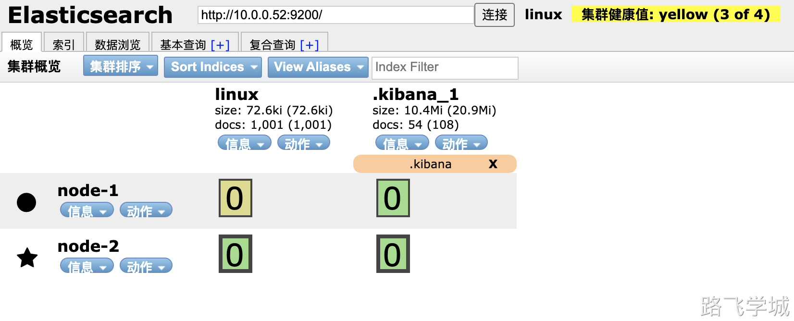
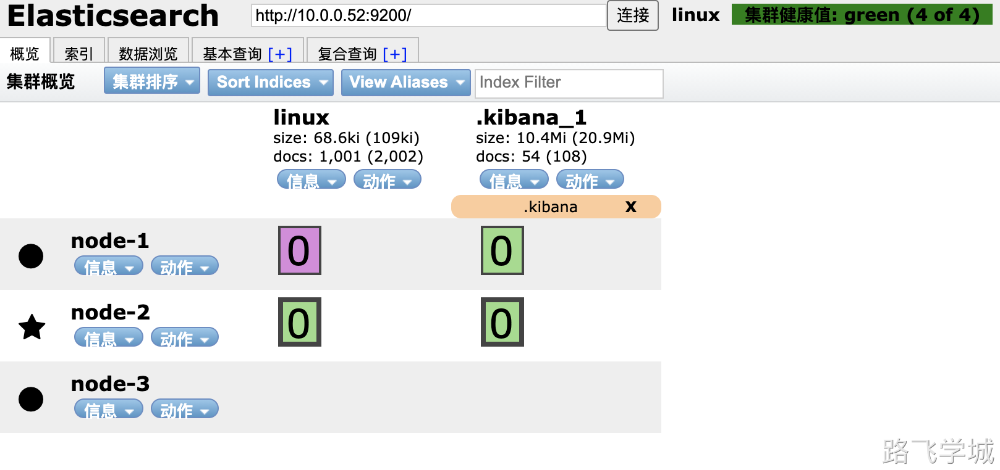

- ! 7.0版本之后不需要单独安装JDK

> [!install]- 安装ES
> 
> ```
> rpm -ivh elasticsearch-7.9.1-x86_64.rpm
> ```

> [!config]- 配置内存锁定
> 
> ```
> systemctl edit elasticsearch.service
> [Service]
> LimitMEMLOCK=infinity
> ```

> [!config]- 集群配置文件
> 
> 
> ```
> cat> /etc/elasticsearch/elasticsearch.yml << EOF
> cluster.name: man_linux
> node.name: node-3
> path.data: /var/lib/elasticsearch
> path.logs: /var/log/elasticsearch
> bootstrap.memory_lock: true
> network.host: 127.0.0.1,10.0.0.53
> http.port: 9200
> discovery.seed_hosts: ["10.0.0.51","10.0.0.53"]
> cluster.initial_master_nodes: ["10.0.0.51"]
> EOF
> ```

> [!warn]- 添加节点注意
> 
> 
> ```
> 对于新添加的节点来说:  
> 只需要直到集群内任意一个节点的IP和他自己本身的IP即可
> discovery.seed_hosts: ["10.0.0.51","10.0.0.53"]
> 
> 对于以前的节点来说:
> 什么都不需要更改
> ```

> [!info]- 数据分片颜色解释
> 
> 
> ```
> 紫色: 正在迁移
> 黄色: 正在复制
> 绿色: 正常
> ```

> [!test]- 集群故障转移实验
> 
> 
> ```
> 1.停掉主节点，观察集群是否正常
> 2.停掉主节点，是否还会选举出新的主节点
> 3.停掉主节点，数据分片的分布会不会发生变化，分片状态会不会发生变化
> 4.停掉主节点，然后在持续的写入数据，等节点恢复之后，会如何处理落后的数据
> 5.3个节点的Elasticsearch集群，极限情况下最多允许坏几台?
> 6.主节点故障，集群健康状态发生什么变化？
> ```

> [!info]- 结论
> 
> 
> ```
> 1.如果主节点坏掉了，会从活着的数据节点中选出一台新的主节点
> 2.如果主分片坏掉了，副本分片会升级为主分片
> 3.如果副本数不满足，会尝试在其他的节点上重新复制一份数据
> 4.修复上线只需要正常启动故障的节点即会自动加入到集群里，并且自动同步数据
> 5.7.x版本之后则必须至少2个节点存活集群才能正常工作
> ```
> 
> 
> 
> 
> 
> 
> 
> 