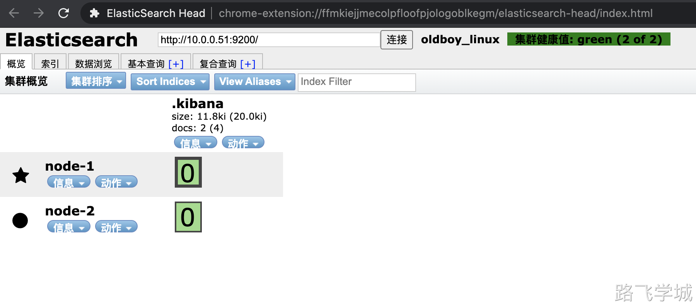

> [!warn]- 部署集群前注意事项
> 
> ```
> 最好是使用干净的环境部署集群，如果以前有单节点的数据，最好备份出来，然后再清空集群数据。
> ```

> [!info]- 新节点安装java
> 
> ```
> 7.x版本之后不需要单独的安装JDK，软件包自带了JDK
> ```

> [!install]- 新节点安装Elasticsearch
> 
> 
> ```
> rpm -ivh elasticsearch-7.9.1-x86_64.rpm
> ```

> [!config]- 配置内存锁定
> 
> 
> ```
> systemctl edit elasticsearch.service
> [Service]
> LimitMEMLOCK=infinity
> ```

> [!config]- 集群配置文件
> 
> 
> 配置文件解释
> 
> ```
> cluster.name: man_linux		#集群名称
> node.name: node-1							#节点名称		
> path.data: /var/lib/elasticsearch			#数据目录
> path.logs: /var/log/elasticsearch			#日志目录
> bootstrap.memory_lock: true						#设置内存锁定
> network.host: 127.0.0.1,10.0.0.51			#本地监听地址
> http.port: 9200												#本地端口
> discovery.seed_hosts: ["10.0.0.51","10.0.0.52"]		#集群节点互相发现的地址，不需要把所有节点IP都写上。
> cluster.initial_master_nodes: ["10.0.0.51"]				#集群初始化节点，只有创建集群的第一次有用，集群创建后参数失效。
> ```
> 
> node1配置文件:
> 
> ```
> cat > /etc/elasticsearch/elasticsearch.yml << EOF
> cluster.name: man_linux
> node.name: node-1
> path.data: /var/lib/elasticsearch
> path.logs: /var/log/elasticsearch
> bootstrap.memory_lock: true
> network.host: 127.0.0.1,10.0.0.51
> http.port: 9200
> discovery.seed_hosts: ["10.0.0.51","10.0.0.52"]
> cluster.initial_master_nodes: ["10.0.0.51"]
> EOF
> ```
> 
> node2配置文件:
> 
> ```
> cat> /etc/elasticsearch/elasticsearch.yml << EOF
> cluster.name: man_linux
> node.name: node-2
> path.data: /var/lib/elasticsearch
> path.logs: /var/log/elasticsearch
> bootstrap.memory_lock: true
> network.host: 127.0.0.1,10.0.0.52
> http.port: 9200
> discovery.seed_hosts: ["10.0.0.51","10.0.0.52"]
> cluster.initial_master_nodes: ["10.0.0.51"]
> EOF
> ```

> [!systemd]- 启动
> 
> 
> > [!warn]- 注意：如果以前单节点有数据，那么先停止运行，然后清空数据
> > 
> > 
> > ```
> > systemctl stop elasticsearch.service 
> > rm -rf /var/lib/elasticsearch/*
> > ```
> 
> 重启命令：
> 
> ```
> systemctl daemon-reload
> systemctl restart elasticsearch
> ```

> [!log]- 查看日志
> 
> 
> ```
> tail -f /var/log/elasticsearch/man_linux.log
> ```

> [!test]- 检查集群
> 
> 
> ```
> ES-head查看是否有2个节点
> ```
> 
> 
> 

> [!warn]- 集群注意事项
> 
> 
> ```
> 1.插入和读取数据在任意节点都可以执行,效果一样
> 2.es-head可以连接集群内任一台服务
> 
> 3.主节点负责读写
> 如果主分片所在的节点坏掉了,副本分片会升为主分片
> 
> 4.主节点负责调度
> 如果主节点坏掉了,数据节点会自动升为主节点
> 
> 5.通讯端口
> 默认会有2个通讯端口：9200和9300
> 9300并没有在配置文件里配置过
> 如果开启了防火墙并且没有放开9300端口，那么集群通讯就会失败
> ```

