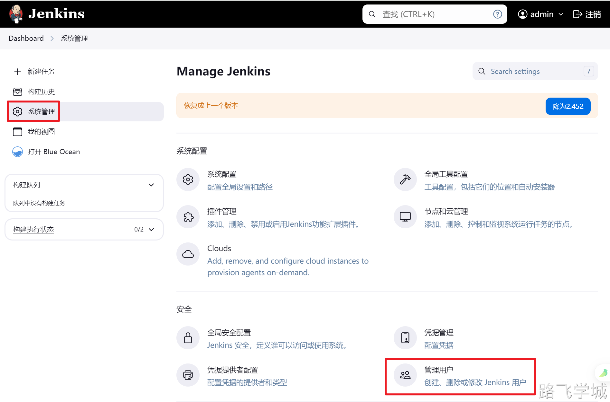
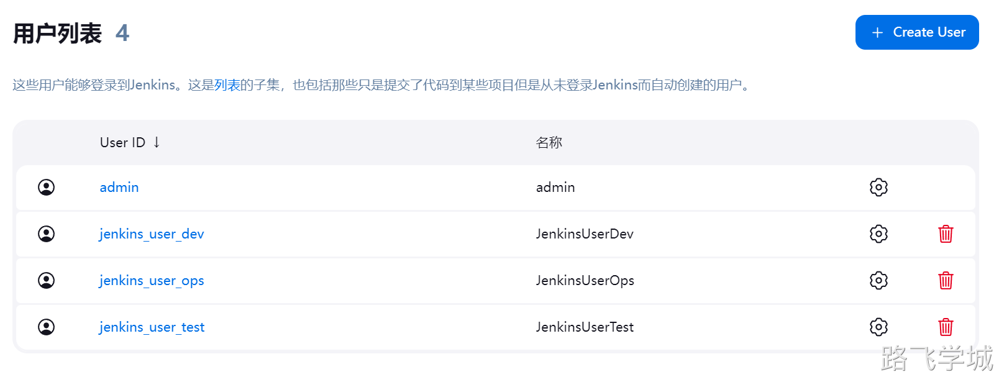
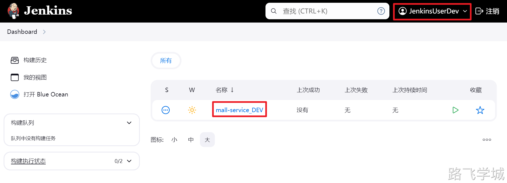
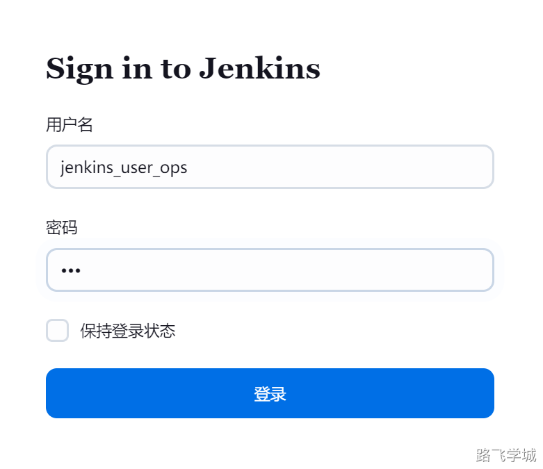
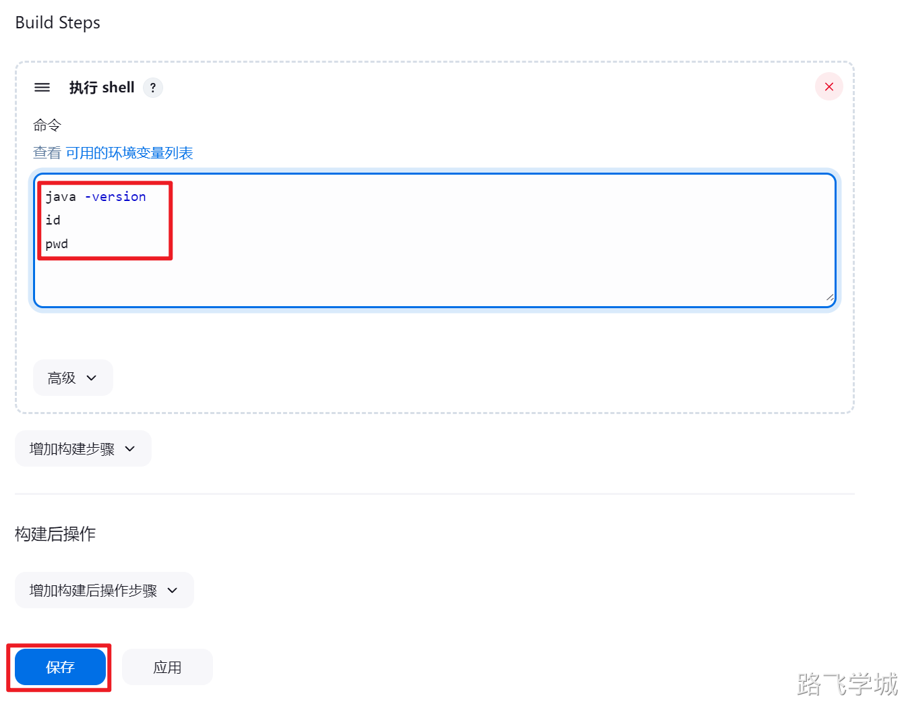
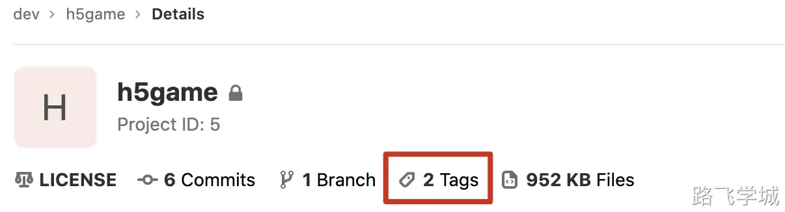

# 第0章 Jenkins介绍

jenkins是一个开源的持续集成工具，由java语言开发
jenkins是一个调度平台，拥有众多的插件，绝大部分功能都是由插件来完成的

# 第1章 Jenkins安装

## 1.官方网站

https://www.jenkins.io/zh/doc/

## 2.安装部署

截止到2024年6月26日，目前Jenkins的最新版是2.464

而最新版的jenkins需要JDK 17，需要注意版本对应

jdk-17_linux-x64_bin.rpm

jenkins-2.464-1.1.noarch.rpm

```bash
#安装依赖，不然启动会报错
[root@jenkins-201 ~]# yum install fontconfig -y

#下载并安装jdk-17
[root@jenkins-201 ~]# wget https://download.oracle.com/java/17/latest/jdk-17_linux-x64_bin.rpm
[root@jenkins-201 ~]# rpm -ivh jdk-17_linux-x64_bin.rpm

#下载并安装jenkins
[root@jenkins-201 ~]# wget https://mirrors.tuna.tsinghua.edu.cn/jenkins/redhat/jenkins-2.464-1.1.noarch.rpm
[root@jenkins-201 ~]# rpm -ivh /jenkins-2.452-1.1.noarch.rpm
```

## 3.目录文件说明

```bash
[root@jenkins-201 ~]# rpm -ql jenkins
/usr/bin/jenkins												 #启动命令
/usr/lib/systemd/system/jenkins.service  #启动配置文件
/usr/lib/tmpfiles.d/jenkins.conf  			 #配置文件
/usr/share/java/jenkins.war 			       #启动war包
/usr/share/jenkins/migrate 
/var/cache/jenkins
/var/lib/jenkins 									       #数据目录
```

## 4.修改启动配置以使用root账户运行

```bash
[root@jenkins-201 ~]# vim /usr/lib/systemd/system/jenkins.service
User=root
Group=root
```

## 5.启动jenkins

```bash
[root@jenkins-201 ~]# systemctl daemon-reload
[root@jenkins-201 ~]# systemctl start jenkins
```

## 6.解锁Jenkins

登陆地址为：http://10.0.0.201:8080/


## 7.修改admin密码


## 8.安装常用插件

jenkins具有丰富的插件，我们可以在插件管理里去选择常用的插件，这里推荐的插件列表如下：

```bash
Git
Git Parameter
Pipeline
Pipeline: Stage View
Blue Ocean
Generic Webhook Trigger
Role-based Authorization Strategy
Nexus Artifact Uploader
Active Choices
Localization: Chinese (Simplified)
Maven Artifact ChoiceListProvider (Nexus)
```


插件安装完成后可以直接重启jenkins，再次来到登陆页面发现已经变成中文了。


## 9.使用离线安装插件

在线下载的时间可能会比较长，我们也可以将插件提前下好后打个压缩包，以后要用的时候直接解压到jenkins对应的插件目录即可

[📎jenkins_2464_plugin.tar.gz](https://www.yuque.com/attachments/yuque/0/2024/gz/830385/1719649967354-58d3e0cd-2823-4a7a-adf9-6a14659c092e.gz)

打包命令:

```plain
cd /var/lib/jenkins/
tar zcf jenkins_2464_plugin.tar.gz plugins
```

解压命令:

```plain
tar zxf jenkins_2464_plugin.tar.gz -C /var/lib/jenkins/
systemctl restart jenkins
```

# 第2章 Jenkins系统管理

## x.用户权限管理

### 用户权限角色规划

| **用户**          | **角色**          | **项目**                                           | **权限**               |
| ----------------- | ----------------- | -------------------------------------------------- | ---------------------- |
| jenkins_user_dev  | jenkins_role_dev  | mall-service_DEV                                   | 可查看，可运行         |
| jenkins_user_test | jenkins_role_test | mall-service_TEST                                  | 可查看，可运行         |
| jenkins_user_ops  | jenkins_role_ops  | mall-service_DEVmall-service_TESTmall-service_PROD | 可查看，可运行，可修改 |

### 创建项目

mall-service_DEV

mall-service_TEST

mall-service_PROD


### 创建用户

jenkins_user_dev

jenkins_user_test

jenkins_user_ops





### 启用权限插件


### 创建角色

#### 创建Global roles


#### 创建Item roles


### 授权角色


### 验证权限

#### jenkins_user_dev用户测试





#### jenkins_user_test用户测试


#### jenkins_user_ops用户测试




## x.节点管理


# 第2章 构建自由风格的项目

## 1.创建新任务


## 2.添加构建步骤




## 3.点击立即构建


## 4.查看控制台输出


# 第3章 发布gitlab中的静态页面项目

## 1.gitlab导入工程

这是一个h5小游戏的项目，项目地址：

https://gitee.com/skips/game.git

使用gitlab直接导入项目：


## 2.在jenkins中关联gitlab的h5game项目

### 2.1 创建新项目


### 2.2 填写仓库地址

选择源码管理，然后填写gitlab仓库信息，但是我们发现报错了，因为jenkins没有拉取gitlab项目的权限。


## 3.配置jenkins访问gitlab的权限

### 3.1 部署公钥解释和步骤

解释

1.如果我们想让jenkins从gitlab上拉取代码，那么需要将jenkins的公钥信息放在gitlab上。
2.gitlab针对这种情况有一个专门的功能，叫做部署部署公钥。
3.部署公钥的作用是不需要创建虚拟用户和组，直接在需要拉取的项目里关联部署公钥即可。

步骤

1.获取jenkins公钥信息
2.将jenkins公钥信息填写到gitlab的部署公钥里
3.由项目管理员操作，在需要jenkins拉取的项目里关联部署公钥
4.jenkins配置私钥凭证，部署项目时关联凭证

### 3.2 获取jenkins服务器的SSH公钥信息

```bash
[root@jenkins-201 ~]# cat .ssh/id_rsa.pub 
ssh-rsa AAAAB3NzaC1yc2EAAAADAQABAAABAQCg8+DQFOjR+gl1Xw83CIyGJ50vI4DBeTaMRFdu5+5pT/IMnYq1iS7/lRS6JxXLYvVeNMDUfDxA1sOL70okyA3npjASXgJPGE1FsbpqzWjsN0TAGoZkR1VWuP9Yn0CrH7dA4lhZQfUUVjvqzFBZK8N9iZMzIu6KOiSY/aD4Ol59vbDS4kO0rTG1DYQNnjZzMPNlIiJ+0EVkfuYRwABRFA8fmL+6btqZqhjGY29EHuIfzIMTDTysrtCTGxQn2ql1zwjReGiNXzmFncwvyy92DAuMbnOQiE1YNn72wThy2oWSHsCwKdIvcNHqY2xBvFnkZ9Ltga7PgR33kbJ7Gl8tjiZF root@jenkins-201
```

### 3.3 gitlab添加部署公钥


### 3.4 gitlab项目关联部署公钥


### 3.5 jenkins配置私钥凭证


### 3.6 测试获取代码


查看拉取的代码：

```plain
[root@jenkins-201 ~]# ll /var/lib/jenkins/workspace/h5game
总用量 16
drwxr-xr-x 4 jenkins jenkins   47 8月   6 09:37 game
-rw-r--r-- 1 jenkins jenkins 9349 8月   6 09:37 LICENSE
-rw-r--r-- 1 jenkins jenkins  937 8月   6 09:37 README.md
```

## 4.编写部署脚本

```plain
#创建目录
mkdir -p /scripts/jenkins/

#编写脚本
cat > /scripts/jenkins/deploy.sh << 'EOF'
#!/bin/bash

PATH_CODE=/var/lib/jenkins/workspace/h5game/
PATH_WEB=/usr/share/nginx
TIME=$(date +%Y%m%d-%H%M)
IP=10.0.0.7

#打包代码
cd ${PATH_CODE} 
tar zcf /opt/${TIME}-web.tar.gz ./*

#拷贝打包好的代码发送到web服务器代码目录
ssh ${IP} "mkdir ${PATH_WEB}/${TIME}-web -p"
scp /opt/${TIME}-web.tar.gz ${IP}:${PATH_WEB}/${TIME}-web

#web服务器解压代码
ssh ${IP} "cd ${PATH_WEB}/${TIME}-web && tar xf ${TIME}-web.tar.gz && rm -rf ${TIME}-web.tar.gz"
ssh ${IP} "cd ${PATH_WEB} && rm -rf html && ln -s ${TIME}-web html"
EOF

#添加可执行权限
chmod +x /scripts/jenkins/deploy.sh
```

也可以使用jenkins内置的变量来代替自定义变量，查看jenkins内置变量的地址如下：

http://10.0.0.201:8080/env-vars.html

## 4.jenkins调用构建脚本

在构建的位置填写执行shell脚本的命令


然后立即构建，发现报错了，提示权限不足：


报错原因是因为jenkins是以jenkins用户运行的，所以提示权限不足，我们可以修改jenkins为root用户运行。

```plain
[root@jenkins-201 ~]# vim /etc/sysconfig/jenkins 
[root@jenkins-201 ~]# grep "USER" /etc/sysconfig/jenkins 
JENKINS_USER="root"
[root@jenkins-201 ~]# systemctl restart jenkins
```

重启好之后我们重新构建一下：


查看一下web服务器的代码目录

```plain
[root@web-7 ~]# ll /usr/share/nginx/
总用量 0
drwxr-xr-x 3 root root 50 8月   6 10:13 20200806-1013-web
lrwxrwxrwx 1 root root 17 8月   6 10:13 html -> 20200806-1013-web
```

# 第4章 监听gitlab自动触发构建

## 1.jenkins项目里添加构建触发器


## 2.gitlab添加webhook

将刚才jenkins里配置的token和URL地址复制进去


较新版本的gitlab此时点击添加会提示报错：


解决方法：进入admin area区域，然后点击setting-->network进行设置


正常添加成功之后，会在下方出现测试的选项


选择push事件来测试是否可以正常出发，如果可以，会在页面上方显示200状态码


此时我们去查看jenkins项目页面，就会发现以及出发了来自gitlab的构建任务


# 第5章 返回构建状态给gitlab

## 1.gitlab生成access token


点击创建之后会生成一串token,注意及时保存，因为刷新就没有了


## 2.jenkins配置gitlab的token

点击jenkins的系统管理-->系统设置，然后找到gitlab选项


填写gitlab的信息：


点击添加后返回上一层页面，然后选中刚才添加的gitlab凭证


## 3.设置项目构建后将结果通知给gitlab


## 4.合并分支然后检查gitlab能否收到消息


## 5.防止重复构建

jenkins具有很多内置变量，点击项目-->构建--> 查看 可用的环境变量列表

http://10.0.0.201:8080/env-vars.html/

这里我们使用两个变量，一个是此次提交的commit的hash，另一个是上一次提交成功的commit的hash

我们可以在部署脚本里添加一行判断，如果这两个变量一样，那么就不用再次提交了

这些变量不需要在脚本里定义，直接引用即可


# 第6章 tag方式发布版本

## 1.给代码打标签

首先我们先给代码打上标签，然后提交2个版本

v1.0版本：修改代码，然后发布v1.0版本

```plain
git commit -am 'v1.0'
git tag -a v1.0 -m "v1.0 稳定版"
git push -u origin v1.0
git tag
```

v2.0版本：修改代码，然后发布v2.0版本

```plain
git commit -am 'v2.0'
git tag -a v2.0 -m "v2.0 稳定版"
git push -u origin v2.0
git tag
```

## 2.gitlab查看标签

此时gitlab上可以看到2个标签



点进去之后可以看到具体标签名称


## 3.jenkins配置参数化构建

jenkins上我们新建一个参数化构建项目


然后配置git的标签参数:


最后还需要配置一下git仓库地址,注意需要修改拉取的版本的变量为 $git_version


此时点击项目的build with parameters就会看到对应的版本号：


然后去jenkins工作目录下查看是否拉取了对应版本:

/var/lib/jenkins/workspace/my-deploy-rollback

## 4.优化部署脚本

```plain
cat >/scripts/jenkins/deploy_rollback.sh<<'EOF'
#!/bin/bash

PATH_CODE=/var/lib/jenkins/workspace/my-deploy-rollback/
PATH_WEB=/usr/share/nginx
IP=10.0.0.7

#打包代码
cd ${PATH_CODE} 
tar zcf /opt/web-${git_version}.tar.gz ./*

#拷贝打包好的代码发送到web服务器代码目录
ssh ${IP} "mkdir ${PATH_WEB}/web-${git_version} -p"
scp /opt/web-${git_version}.tar.gz ${IP}:${PATH_WEB}/web-${git_version}

#web服务器解压代码
ssh ${IP} "cd ${PATH_WEB}/web-${git_version} && tar xf web-${git_version}.tar.gz && rm -rf web-${git_version}.tar.gz"
ssh ${IP} "cd ${PATH_WEB} && rm -rf html && ln -s web-${git_version} html"
EOF
```

## 5.jenkins添加执行脚本动作并测试


## 6.测试发布


然后去web服务器上查看发现已经发布了

```plain
[root@web-7 ~]# ll /usr/share/nginx/
总用量 0
lrwxrwxrwx 1 root root  8 8月   6 15:59 html -> web-v2.0
drwxr-xr-x 3 root root 68 8月   6 15:59 web-v2.0
```

# 第7章 tag方式回滚版本

## 1.jenkins配置回滚选项参数

在工程配置里添加选项参数:


在参数化构建里添加2个选项：发布和回滚


此时查看构建页面就会发现多了选项卡:


## 2.修改发布脚本增加条件判断

```plain
cat >/scripts/jenkins/deploy_rollback.sh <<'EOF'
#!/bin/bash

PATH_CODE=/var/lib/jenkins/workspace/my-deploy-rollback/
PATH_WEB=/usr/share/nginx
IP=10.0.0.7

#打包代码
code_tar(){
        cd ${PATH_CODE} 
        tar zcf /opt/web-${git_version}.tar.gz ./*
}

#拷贝打包好的代码发送到web服务器代码目录
code_scp(){
        ssh ${IP} "mkdir ${PATH_WEB}/web-${git_version} -p"
        scp /opt/web-${git_version}.tar.gz ${IP}:${PATH_WEB}/web-${git_version}
}

#web服务器解压代码
code_xf(){
        ssh ${IP} "cd ${PATH_WEB}/web-${git_version} && tar xf web-${git_version}.tar.gz && rm -rf web-${git_version}.tar.gz"
}

#创建代码软链接
code_ln(){
        ssh ${IP} "cd ${PATH_WEB} && rm -rf html && ln -s web-${git_version} html"
}

main(){
        code_tar
        code_scp
        code_xf
        code_ln
}

#选择发布还是回滚
if [ "${deploy_env}" == "deploy" ]
then
        ssh ${IP} "ls ${PATH_WEB}/web-${git_version}" >/dev/null 2>&1
        if [ $? == 0 -a ${GIT_COMMIT} == ${GIT_PREVIOUS_SUCCESSFUL_COMMIT} ] 
        then
                echo "web-${git_version} 已部署,不允许重复构建"
                exit
        else 
                main
        fi
elif [ "${deploy_env}" == "rollback" ]
then
        code_ln
fi
EOF
```

## 3.测试回滚功能

部署v1.0版本


部署v2.0版本：


检查web服务器当前的版本

```plain
[root@web-7 ~]# ll /usr/share/nginx/
总用量 0
lrwxrwxrwx 1 root root  8 8月   6 16:52 html -> web-v2.0
drwxr-xr-x 3 root root 68 8月   6 16:51 web-v1.0
drwxr-xr-x 3 root root 68 8月   6 16:52 web-v2.0
```

然后我们选择v1.0版本并且选择回滚操作：


查看控制台显示回滚成功：


在web服务器上查看发现已经回滚成功：

```plain
[root@web-7 ~]# ll /usr/share/nginx/
总用量 0
lrwxrwxrwx 1 root root  8 8月   6 16:56 html -> web-v1.0
drwxr-xr-x 3 root root 68 8月   6 16:51 web-v1.0
drwxr-xr-x 3 root root 68 8月   6 16:52 web-v2.0
```

## 4.发布新代码并打标签测试

修改代码并发布v3.0:

```plain
cd h5game/
echo v3.0 >> index.html
git commit -am 'v3.0'
git tag -a v3.0 -m 'v3.0 稳定版'       
git push -u origin v3.0
git tag
```

jenkins查看并发布3.0版本:

web服务器查看发布情况：

```plain
[root@web-7 ~]# ll /usr/share/nginx/
总用量 0
lrwxrwxrwx 1 root root  8 8月   6 16:58 html -> web-v3.0
drwxr-xr-x 3 root root 68 8月   6 16:51 web-v1.0
drwxr-xr-x 3 root root 68 8月   6 16:52 web-v2.0
drwxr-xr-x 3 root root 68 8月   6 16:58 web-v3.0
```

然后工程选择回滚到v2.0版本:


再次在web服务器上查看:

```plain
[root@web-7 ~]# ll /usr/share/nginx/
总用量 0
lrwxrwxrwx 1 root root  8 8月   6 16:59 html -> web-v2.0
drwxr-xr-x 3 root root 68 8月   6 16:51 web-v1.0
drwxr-xr-x 3 root root 68 8月   6 16:52 web-v2.0
drwxr-xr-x 3 root root 68 8月   6 16:58 web-v3.0
```