jenkins服务器

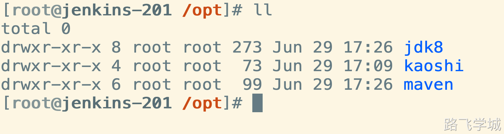

```plain
export JAVA_HOME=/opt/jdk8
/opt/maven/bin/mvn -v
```

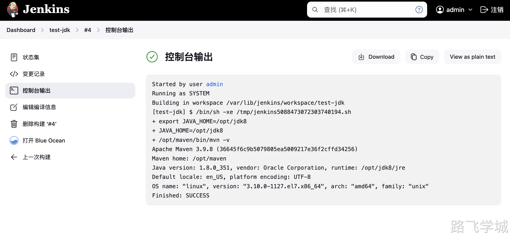

```plain
export JAVA_HOME=/opt/jdk8
/opt/maven/bin/mvn clean package
```


# Ansible指定IP

ansible 10.0.0.7,10.0.0.8 -m ping


# Ansible调试完成脚本


```bash
[root@jenkins-201 ~/ansible_kaoshi]# cat jenkins_deploy.sh 
#!/bin/bash

# 1.构建镜像
export JAVA_HOME=/opt/jdk8
/opt/maven/bin/mvn clean package

# 2.替换变量
cd /root/ansible_kaoshi/
sed -i "/APP_VERSION=/c APP_VERSION=$releaseVersion" kaoshi.env
sed -i "/APP_ENV=/c APP_ENV=${deployEnv,,}" kaoshi.env

# 3.调用Ansible剧本
ansible-playbook -l $deployHosts ansible_kaoshi.yaml -e "app_version=$releaseVersion"


[root@jenkins-201 ~/ansible_kaoshi]# cat kaoshi.env 
APP_ENV=prod
APP_VERSION=3.9.0
[root@jenkins-201 ~/ansible_kaoshi]# cat kaoshi.service 
[Unit]
Description=Spring Boot Application
After=network.target

[Service]
EnvironmentFile=/etc/systemd/system/kaoshi.env
ExecStart=/opt/jdk/bin/java -Duser.timezone=Asia/Shanghai -jar -Dspring.profiles.active=${APP_ENV} /opt/xzs-${APP_VERSION}.jar 
SuccessExitStatus=143
Restart=always
RestartSec=10

[Install]
WantedBy=multi-user.target


[root@jenkins-201 ~/ansible_kaoshi]# cat kaoshi.sh 
#!/bin/bash

# 项目名称
APP_NAME="xzs"
# 项目版本
APP_VERSION="3.9.0"
# Spring Boot 配置文件
SPRING_PROFILES_ACTIVE="prod"
# JAR 文件路径
JAR_PATH="/opt/${APP_NAME}-${APP_VERSION}.jar"
# Java 选项
JAVA_OPTS="-Duser.timezone=Asia/Shanghai -Dspring.profiles.active=${SPRING_PROFILES_ACTIVE}"

# PID 文件路径
PID_FILE="/var/run/${APP_NAME}.pid"

start() {
  if [ -f "$PID_FILE" ]; then
    echo "Application is already running."
  else
    echo "Starting application..."
    nohup java $JAVA_OPTS -jar $JAR_PATH > /dev/null 2>&1 &
    echo $! > $PID_FILE
    echo "Application started."
  fi
}

stop() {
  if [ -f "$PID_FILE" ]; then
    PID=$(cat $PID_FILE)
    echo "Stopping application..."
    kill $PID
    rm -f $PID_FILE
    echo "Application stopped."
  else
    echo "Application is not running."
  fi
}

restart() {
  stop
  start
}

status() {
  if [ -f "$PID_FILE" ]; then
    PID=$(cat $PID_FILE)
    if ps -p $PID > /dev/null; then
      echo "Application is running (PID: $PID)."
    else
      echo "PID file exists but application is not running."
    fi
  else
    echo "Application is not running."
  fi
}

case "$1" in
  start)
    start
    ;;
  stop)
    stop
    ;;
  restart)
    restart
    ;;
  status)
    status
    ;;
  *)
    echo "Usage: $0 {start|stop|restart|status}"
esac
```

# Jar包启动管理脚本

运行命令：

```bash
java -Duser.timezone=Asia/Shanghai -jar -Dspring.profiles.active=prod  xzs-3.9.0.jar
```

创建环境变量配置：

```bash
cat > /opt/kaoshi.env << 'EOF'
PROFILES_ACTIVE=prod
JAR_PATH=/opt/xzs-3.9.0.jar
EOF
```

systemd脚本：

```bash
cat > /etc/systemd/system/kaoshi.service << 'EOF'
[Unit]
Description=Spring Boot Application
After=network.target

[Service]
EnvironmentFile=/opt/kaoshi.env
ExecStart=/opt/jdk/bin/java -Duser.timezone=Asia/Shanghai -jar -Dspring.profiles.active=${PROFILES_ACTIVE} ${JAR_PATH}
SuccessExitStatus=143
Restart=always
RestartSec=10

[Install]
WantedBy=multi-user.target
EOF
```

shell脚本：

```bash
#!/bin/bash

# 项目名称
APP_NAME="xzs"
# 项目版本
APP_VERSION="3.9.0"
# Spring Boot 配置文件
SPRING_PROFILES_ACTIVE="prod"
# JAR 文件路径
JAR_PATH="/opt/${APP_NAME}-${APP_VERSION}.jar"
# Java 选项
JAVA_OPTS="-Duser.timezone=Asia/Shanghai -Dspring.profiles.active=${SPRING_PROFILES_ACTIVE}"

# PID 文件路径
PID_FILE="/var/run/${APP_NAME}.pid"

start() {
  if [ -f "$PID_FILE" ]; then
    echo "Application is already running."
  else
    echo "Starting application..."
    nohup java $JAVA_OPTS -jar $JAR_PATH > /dev/null 2>&1 &
    echo $! > $PID_FILE
    echo "Application started."
  fi
}

stop() {
  if [ -f "$PID_FILE" ]; then
    PID=$(cat $PID_FILE)
    echo "Stopping application..."
    kill $PID
    rm -f $PID_FILE
    echo "Application stopped."
  else
    echo "Application is not running."
  fi
}

restart() {
  stop
  start
}

status() {
  if [ -f "$PID_FILE" ]; then
    PID=$(cat $PID_FILE)
    if ps -p $PID > /dev/null; then
      echo "Application is running (PID: $PID)."
    else
      echo "PID file exists but application is not running."
    fi
  else
    echo "Application is not running."
  fi
}

case "$1" in
  start)
    start
    ;;
  stop)
    stop
    ;;
  restart)
    restart
    ;;
  status)
    status
    ;;
  *)
    echo "Usage: $0 {start|stop|restart|status}"
esac
```

# 备份：

[📎jenkins_20240630.tar.gz](https://www.yuque.com/attachments/yuque/0/2024/gz/830385/1719679146245-6b33e28d-e2bd-4696-93ed-445e0db09e52.gz)

# 环境准备：

gitlab创建项目

jenkins导入项目


jenkins服务器准备

\- jdk17

\- jdk8

\- maven3.9

\- ansible


数据库准备

\- mysql 8.0

\- xzs.sql


java服务器准备

\- nginx

\- jdk


# 制品管理

制品版本命名：版本号-CommitID


# 实验环境要求（强制一样）:

| 服务器        | 软件版本                     | 安装方式   | 安装路径      |
| ------------- | ---------------------------- | ---------- | ------------- |
| gitlab-200    | gitlab-16.9.8                | rpm        | 默认          |
| jenkins-201   | git                          | yum        | 默认          |
| ansible       | yum                          | 默认       |               |
| jenkins-2.464 | rpm                          | 默认       |               |
| jdk-17        | rpm                          | 默认       |               |
| jdk-8u351     | 二进制                       | /opt/jdk8  |               |
| maven-3.9.6   | 二进制                       | /opt/maven |               |
| node-14.21.3  | 二进制                       | /opt/node  |               |
|               | sonar-scanner-cli-6.1.0.4477 | 二进制     | sonar-scanner |
| nexus-202     | jdk-8u351                    | 二进制     | /opt/jdk      |
|               | nexus-3.23                   | 二进制     | /opt/nexus    |
| wbe-7/8       | jdk-8u351                    | 二进制     | /opt/jdk      |
| db-51         | mysql-8.0                    | 二进制     | /opt/mysql    |

# 代码扫描**SonarQube**


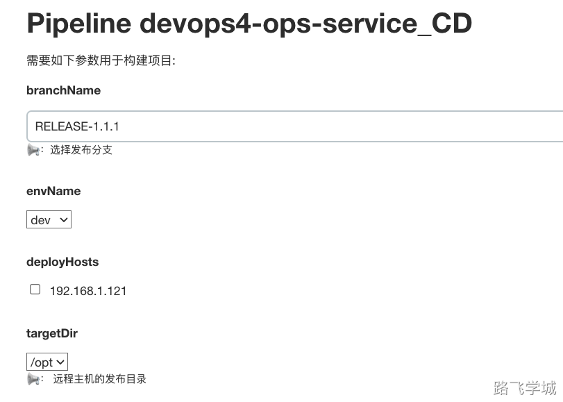


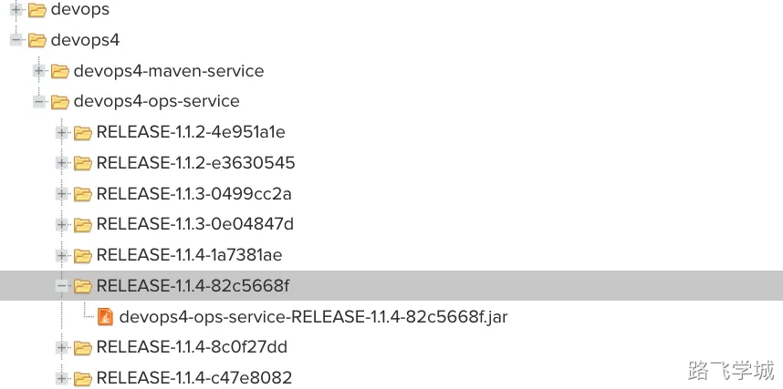


# Jenkins用户权限管理


# 角色插件

项目：

mall-service_DEV

mall-service_TEST

mall-service_PROD


用户：

jenkins_user_dev

jenkins_user_test

jenkins_user_ops


角色：

jenkins_role_dev 

jenkins_role_test

jenkins_role_ops


| **用户**          | **角色**          | **项目**                                           | **权限**               |
| ----------------- | ----------------- | -------------------------------------------------- | ---------------------- |
| jenkins_user_dev  | jenkins_role_dev  | mall-service_DEV                                   | 可查看，可运行         |
| jenkins_user_test | jenkins_role_test | mall-service_TEST                                  | 可查看，可运行         |
| jenkins_user_ops  | jenkins_role_ops  | mall-service_DEVmall-service_TESTmall-service_PROD | 可查看，可运行，可修改 |

## 创建用户：

jenkins_user_dev

jenkins_user_test

jenkins_user_ops


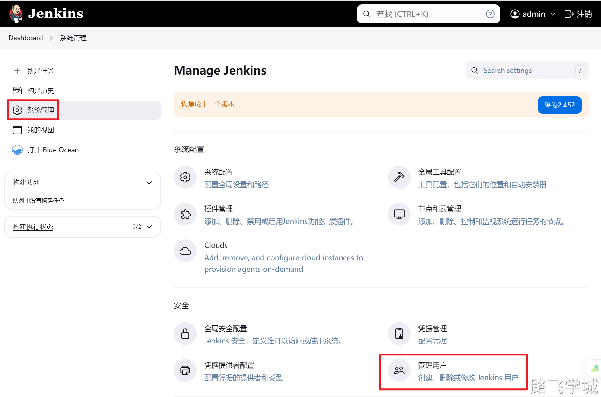


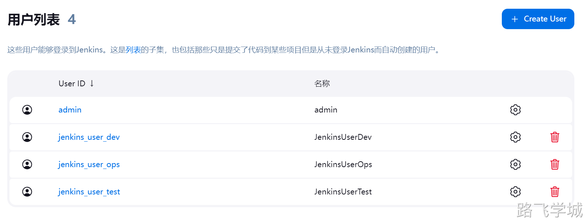

## 创建环境：

mall-service_DEV

mall-service_TEST

mall-service_PROD

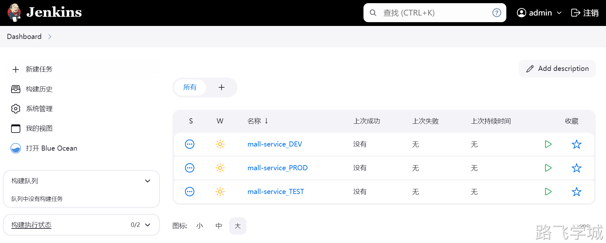

## 启用安全角色插件


## 创建角色

### 创建Global roles

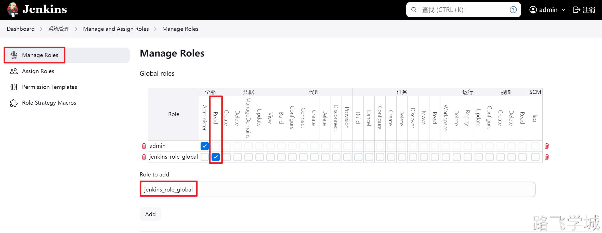

### 创建Item roles

jenkins_role_dev 

jenkins_role_test

jenkins_role_ops

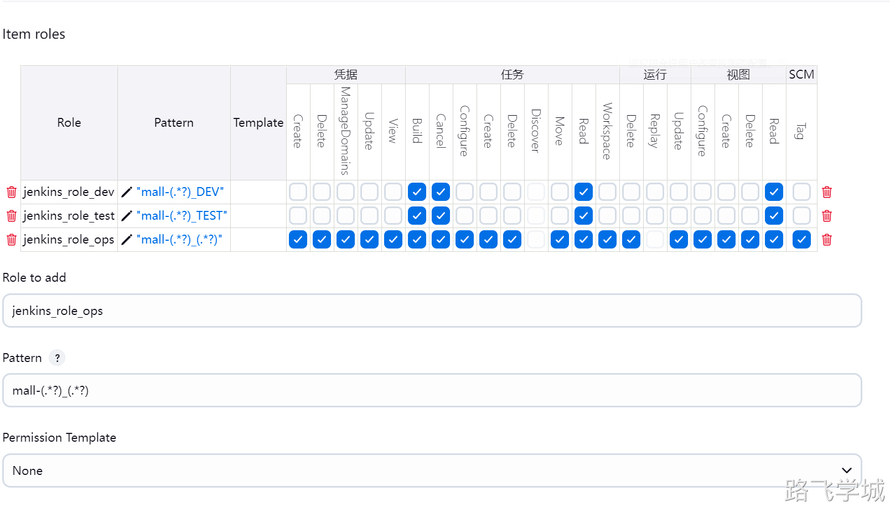

## 授权角色


## 测试权限

## jenkins_dev用户测试


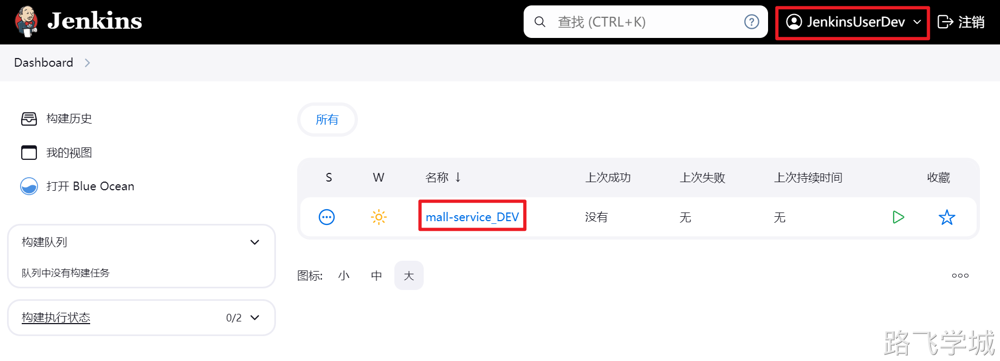

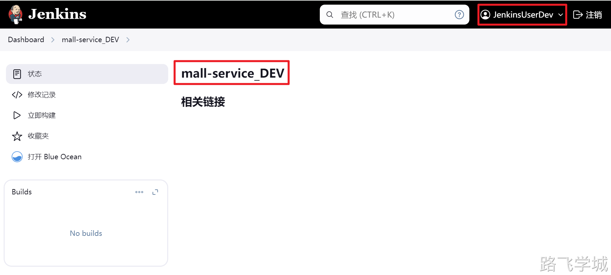


## jenkins_test用户测试


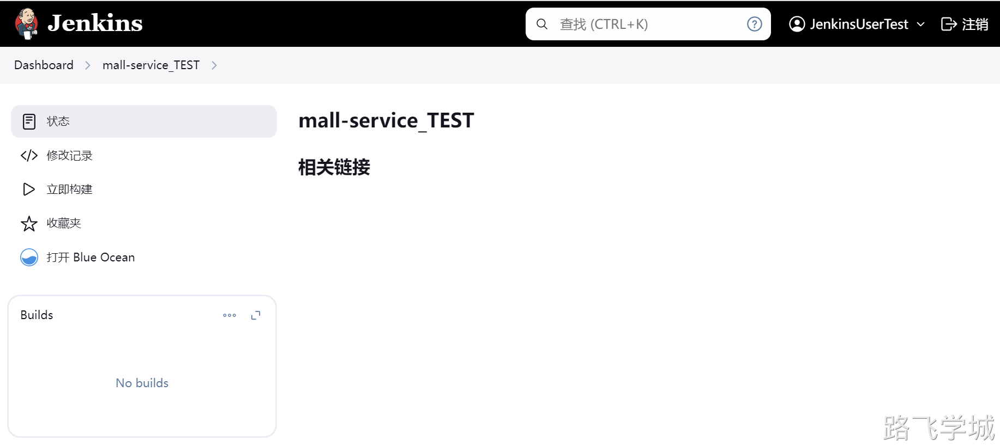

## jenkins_ops用户测试


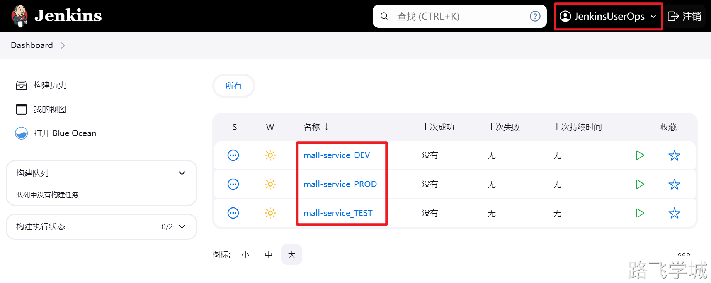

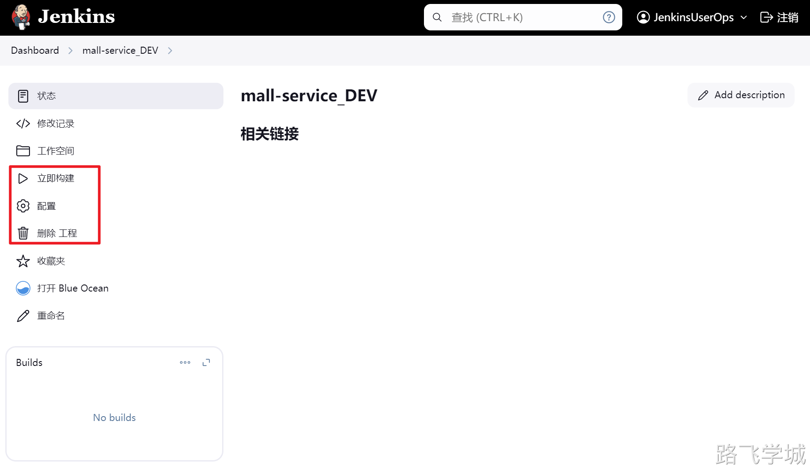


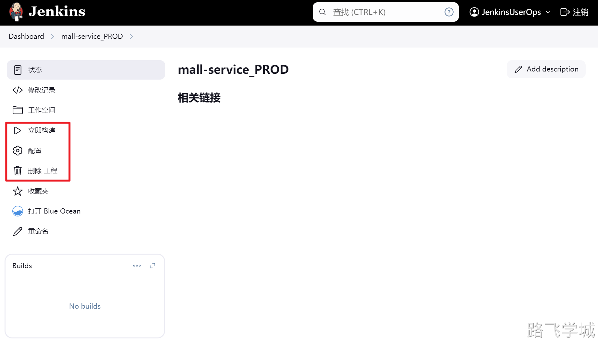