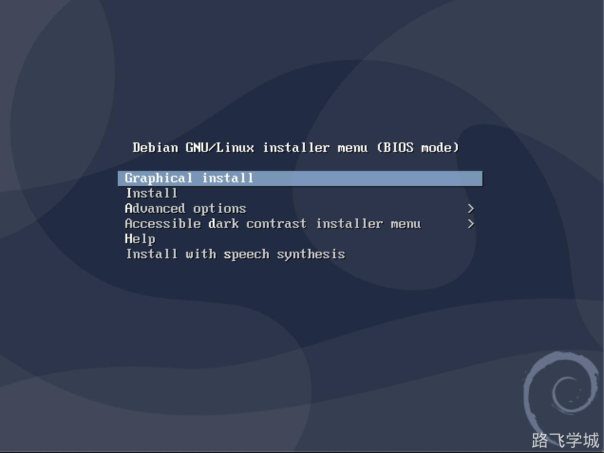

# 第1章 Debian10安装




```plain
net.ifnames=0 biosdev
```


# 第2章 Debian10基本配置

## 1.网卡配置

debian所有的网卡都在一个配置文件里，这点和Centos7不一样

```plain
root@debian:~# grep "^[a-Z]" /etc/network/interfaces  
source /etc/network/interfaces.d/*
auto lo
iface lo inet loopback
allow-hotplug eth0

auto eth0
iface eth0 inet static
address 10.0.0.20
netmask 255.255.255.0
gateway 10.0.0.2
```

重启网卡命令

```plain
systemctl restart  networking.service
```

## 2.SSH配置

默认Debian不允许root远程登录，必须通过修改SSH配置文件才可以使用root远程登录。

```plain
root@debian:~# grep "PermitRootLogin" /etc/ssh/sshd_config     
#PermitRootLogin prohibit-password
PermitRootLogin yes
```

重启sshd

```plain
systemctl restart sshd
```

## 3.配置APT源

Debian10直有清华源，阿里源只提供到Debian9

```plain
https://mirrors.tuna.tsinghua.edu.cn/help/debian/
```

配置命令

```plain
cp /etc/apt/sources.list /opt/
cat > /etc/apt/sources.list << 'EOF'
deb https://mirrors.tuna.tsinghua.edu.cn/debian/ buster main contrib non-free
deb https://mirrors.tuna.tsinghua.edu.cn/debian/ buster-updates main contrib non-free
deb https://mirrors.tuna.tsinghua.edu.cn/debian/ buster-backports main contrib non-free
deb https://mirrors.tuna.tsinghua.edu.cn/debian-security buster/updates main contrib non-free
EOF
```

更新缓存

注意: 在Centos7里update是更新系统，在Debian里是更新软件源

```plain
apt update
```

## 4.命令别名

Debian默认没有配置常用的命令别名，rm也不会有提示，需要的话可以手动打开注释

```plain
root@debian:~# cat ~/.bashrc 
# ~/.bashrc: executed by bash(1) for non-login shells.

# Note: PS1 and umask are already set in /etc/profile. You should not
# need this unless you want different defaults for root.
# PS1='${debian_chroot:+($debian_chroot)}\h:\w\$ '
# umask 022

# You may uncomment the following lines if you want `ls' to be colorized:
# export LS_OPTIONS='--color=auto'
# eval "`dircolors`"
alias ls='ls $LS_OPTIONS'
alias ll='ls $LS_OPTIONS -l'
alias l='ls $LS_OPTIONS -lA'

# Some more alias to avoid making mistakes:
alias rm='rm -i'
alias cp='cp -i'
alias mv='mv -i'
```

# 第3章 Debian10软件操作

## 1.apt-get和apt命令

```plain
等同于Centos7的yum命令
apt-get是第一代的包管理工具，最稳定
apt是改进的包管理工具，比apt-get要先进
官方推荐使用apt来管理软件
```

## 2.常用命令汇总

```plain
apt install package
apt remove package
apt --reinstall install package
```

## 3.查找软件

```plain
apt-cache search nginx
```

## 4.本地软件包管理

等同于Centos7的RPM命令

```plain
dpkg -S sshd
dpkg -s sshd
dpkg -l ssh
dpkg -s *.deb
dpkg -i *.deb
dpkg -r package
dpkg -P package
```

# 第4章 Debian10用户管理

## 1.创建用户

Centos7和Debian使用useradd命令的区别，以下面的命令举例：

```plain
useradd zhangya
```

这条命令在Debian下不会做如下几件事

```plain
1.不会创建家目录
2.默认shell是/bin/sh
3.而/bin/sh默认是软连接到/bin/dash解释器
/bin/sh -> dash
```

如果需要创建这些内容则必须指定参数

```plain
useradd -m -s /bin/bash zhangya
```

## 2.免交互创建密码

Debian的passwd命令没有--stdin选项，要想免交互，使用chpasswd

```plain
echo "root:123456"|chpasswd
```

# 第5章 应用举例

## 1.Debian10安装Docker环境

清华源网址

```plain
https://mirrors.tuna.tsinghua.edu.cn/help/docker-ce/
```

安装命令

```plain
apt-get remove docker docker-engine docker.io
apt-get install apt-transport-https ca-certificates curl gnupg2 software-properties-common -y
curl -fsSL https://download.docker.com/linux/debian/gpg |apt-key add -
add-apt-repository \
   "deb [arch=amd64] https://mirrors.tuna.tsinghua.edu.cn/docker-ce/linux/debian \
   $(lsb_release -cs) \
   stable"
apt-get update
apt-get install docker-ce
```

## 2.Debian10使用kubeadm安装k8s

```plain
#使用iptables
update-alternatives --set iptables /usr/sbin/iptables-legacy
update-alternatives --set ip6tables /usr/sbin/ip6tables-legacy
update-alternatives --set arptables /usr/sbin/arptables-legacy
update-alternatives --set ebtables /usr/sbin/ebtables-legacy

#设置仓库源
cat > /etc/apt/sources.list.d/kubernetes.list <<EOF
deb https://mirrors.aliyun.com/kubernetes/apt/ kubernetes-xenial main
EOF
curl -s https://mirrors.aliyun.com/kubernetes/apt/doc/apt-key.gpg | apt-key add -
apt-get update

#安装kubeadm
apt-get install -y kubelet kubeadm kubectl ipvsadm

#配置参数
cat > /etc/default/kubelet <<'EOF'
KUBELET_CGROUP_ARGS="--cgroup-driver=systemd"
KUBELET_EXTRA_ARGS="--fail-swap-on=false"
EOF

#设置内核参数
cat >  /etc/sysctl.d/k8s.conf <<EOF
net.bridge.bridge-nf-call-ip6tables = 1
net.bridge.bridge-nf-call-iptables = 1
net.ipv4.ip_forward = 1
EOF
sysctl --system

#启动服务
systemctl enable kubelet && systemctl start kubelet

#加载ipvs模块
modprobe -- ip_vs
modprobe -- ip_vs_rr
modprobe -- ip_vs_wrr
modprobe -- ip_vs_sh
modprobe -- nf_conntrack

#查看模块
lsmod | grep -e ip_vs -e nf_conntrack_ipv

#初始化安装master节点
kubeadm init \
--apiserver-advertise-address=10.0.0.20 \
--image-repository registry.aliyuncs.com/google_containers \
--kubernetes-version v1.20.0 \
--service-cidr=10.1.0.0/16 \
--pod-network-cidr=10.2.0.0/16 \
--service-dns-domain=cluster.local \
--ignore-preflight-errors=Swap \
--ignore-preflight-errors=NumCPU
```