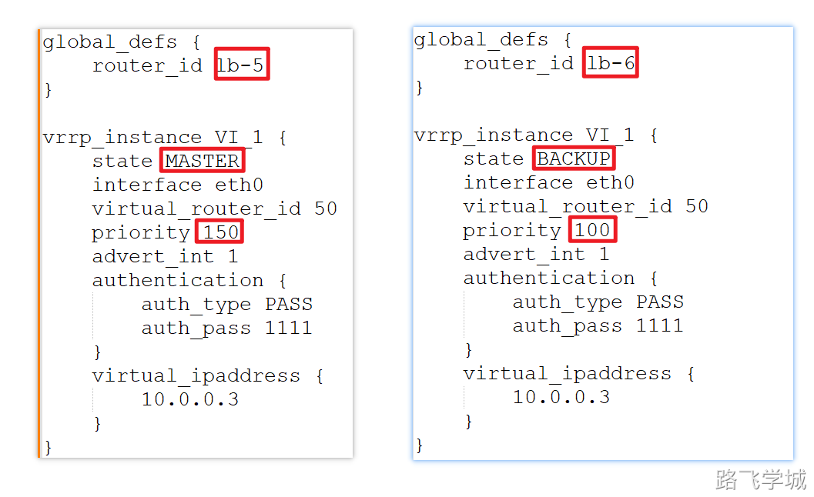

---
tags:
  - Keepalived
---
> [!info]- 环境说明
> 
> 
> ```plain
> lb-5    10.0.0.5    Keepalived主服务器(Nginx主负载均衡器)
> lb-6    10.0.0.6    Keepalived备服务器(Nginx备负载均衡器)
> web-7   10.0.0.7    web服务器
> web-8   10.0.0.8    web服务器
> ```

> [!install]
> 安装keepalived
> 
> ```plain
> yum install keepalived -y
> ```
> 

> [!config]- 配置文件解释
> 
> 
> ```plain
> global_defs {				
>     router_id lb-5					  #设置路由ID，每个主机不一样
> }	
> 
> vrrp_instance VI_1 {				  #设置VRRP组名，同一组组名相同
>         state MASTER			    #设置角色状态，分为MASTER BACKUP
>         interface eth0				#VIP绑定的网卡
>         virtual_router_id 50		#虚拟路由id，同一组一样
>         priority 150				  #权重，权重越高，优先级越高
>         advert_int 1				  #发送组播间隔
>         authentication {			#设置验证，密码为明文
>             auth_type PASS	
>             auth_pass 1111	
>         }
>         virtual_ipaddress {		#设定的虚拟IP，这个虚拟IP必须是存在且合法且没有被使用的。
>             10.0.0.3
>         }
> }
> ```
> 
> lb-5配置
> 
> ```plain
> [root@lb-5 ~]# cat /etc/keepalived/keepalived.conf 
> global_defs {
>     router_id lb-5
> }
> 
> vrrp_instance VI_1 {
>     state MASTER
>         interface eth0
>         virtual_router_id 50
>         priority 150
>         advert_int 1
>         authentication {
>             auth_type PASS
>             auth_pass 1111
>         }
>         virtual_ipaddress {
>             10.0.0.3
>         }
> }
> ```
> 
> lb-6配置
> 
> ```plain
> [root@lb-6 ~]# cat /etc/keepalived/keepalived.conf 
> global_defs {
>     router_id lb-6
> }
> 
> vrrp_instance VI_1 {
>     state BACKUP 
>         interface eth0
>         virtual_router_id 50
>         priority 100
>         advert_int 1
>         authentication {
>             auth_type PASS
>             auth_pass 1111
>         }
>         virtual_ipaddress {
>             10.0.0.3
>         }
> }
> ```
> 
> 
> 

> [!systemd]- 启动服务
> 
> 
> ```plain
> systemctl start keepalived
> ```
> 

> [!info]- 访问测试
> 
> 
> 关掉任意一台，观察VIP是否会漂移
> 恢复MASTER观察BACKUP的VIP是否会消失
> 