# 1章 Ubuntu系统介绍

## 1.Ubuntu是什么

```plain
Ubuntu Linux是基于Debian Linux的操作系统。
Ubuntu适用于笔记本电脑、桌面电脑和服务器，特别是为桌面用户提供尽善尽美的使用体验。
```

## 2.Ubuntu版本选择

```plain
Ubuntu官方网站提供了丰富的Ubuntu版本及衍生版本，主要分为两大类。
Ubuntu Desktop   图形化桌面，适合新手使用
Ubuntu Server	 内核比较新，对容器支持较好，适合生产服务器使用
LTS				 长期支持版，无论什么版本，都应该选择长期支持版
```

## 3.如何学习Ubuntu使用

```plain
1.如果有过其他Linux的使用经验可以很快上手。
2.学习官网的文档说明，但是对于新手来说官网文档比较晦涩难懂。
```

# 第2章 Ubuntu安装

## 0.修改网卡名称为eth0(可选)

出现logo后按F5键，然后按ESC键下方就会出BOOT的内容，添加如下内容即可修改网卡名称为传统的eth0,修改完后按回车键。

```plain
net.ifnames=0 biosdevname=0
```

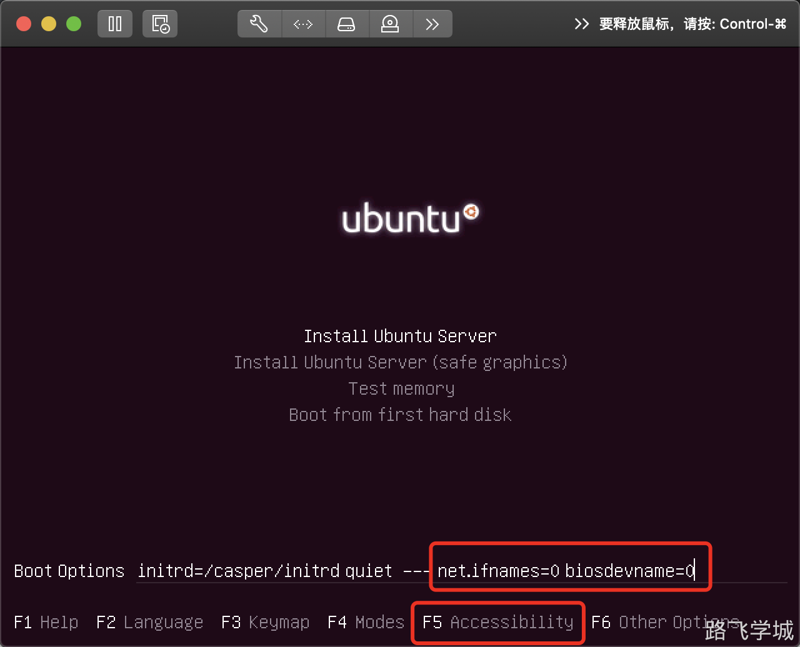

## 1.选择语言

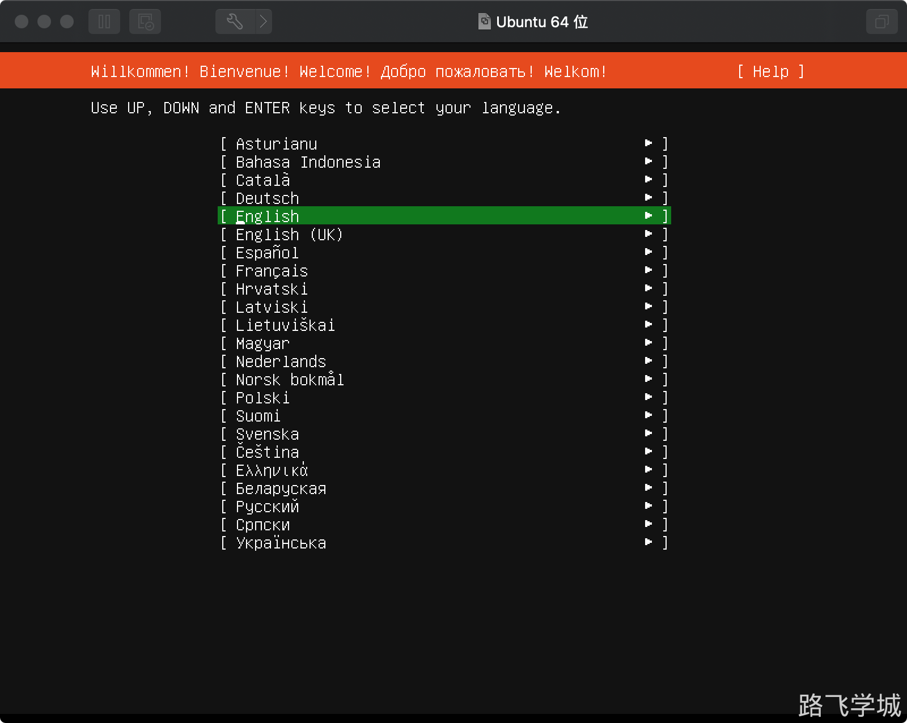

## 2.选择更新

这里我们选择不更新

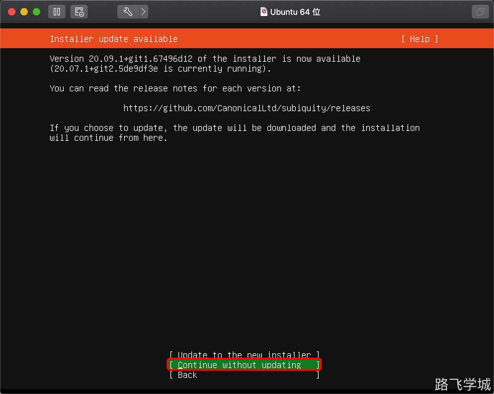

## 3.选择键盘

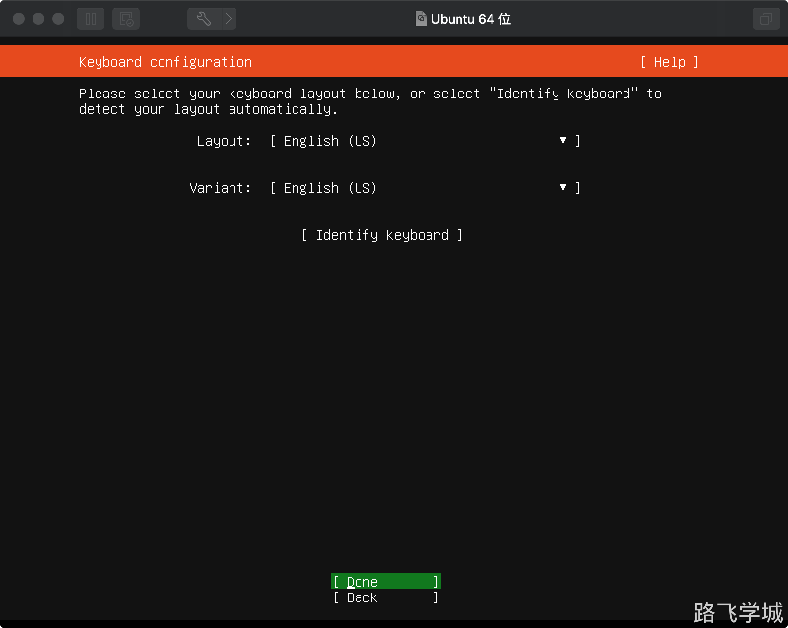

## 4.配置网络

注意：如果这里配置网络，一会安装速度可能会较慢，因为ubuntu会从网络上下载更新。

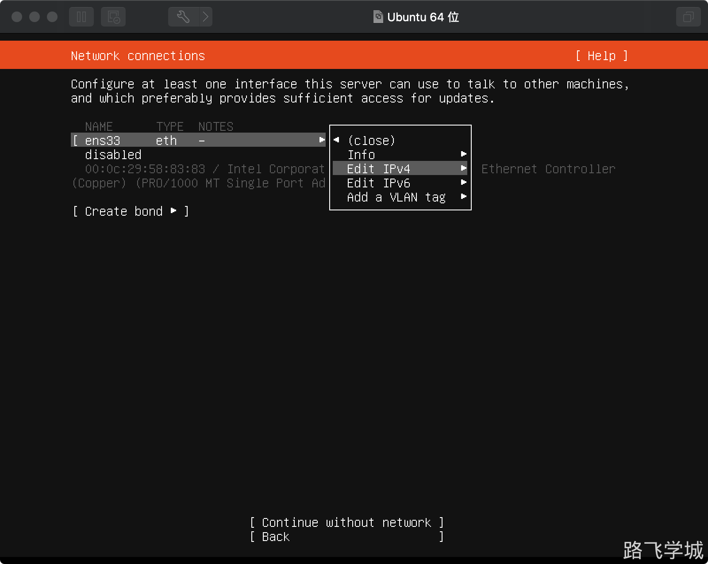

如果前面第一步修改了网卡名称，那么这里就会显示eth0，如下图：

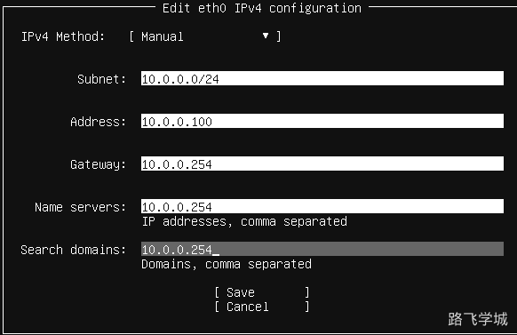

## 5.选择代理

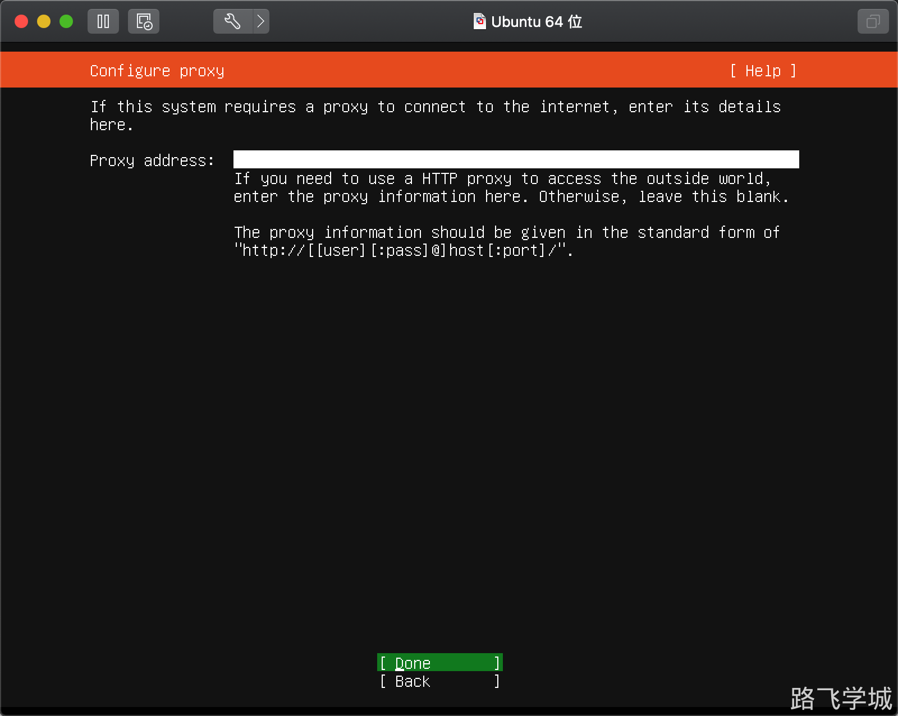

## 6.配置软件源

如果需要联网更新这里也可以配置清华源的地址：

```plain
http://mirrors.tuna.tsinghua.edu.cn/ubuntu
```

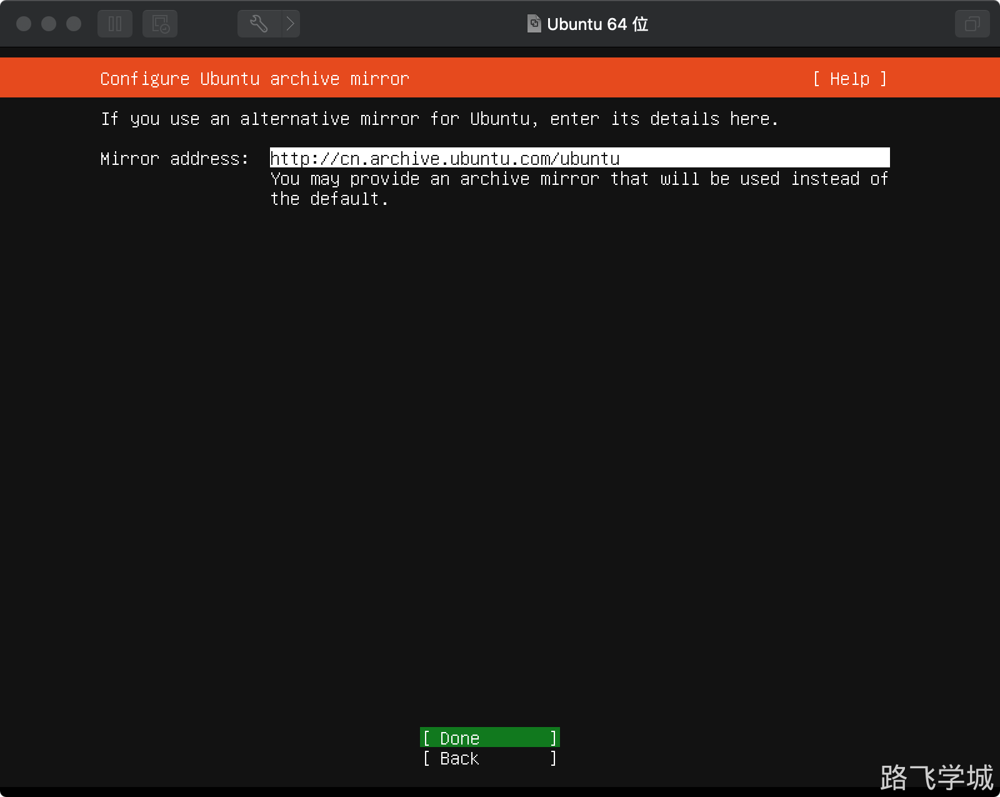


## 7.配置磁盘

这里就选择默认的使用整块磁盘自动分区。

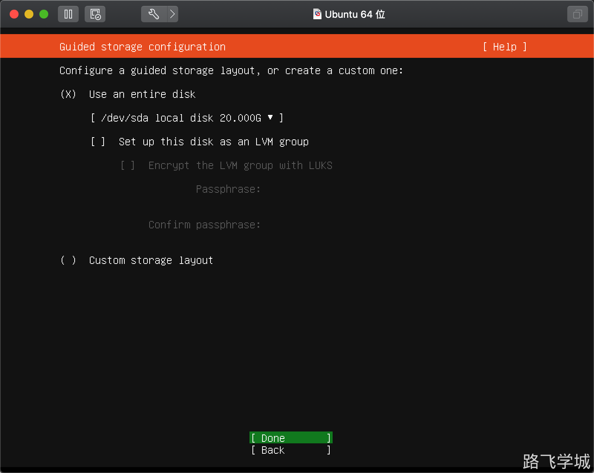

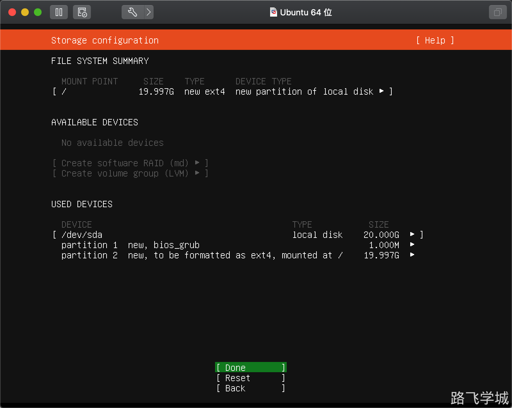

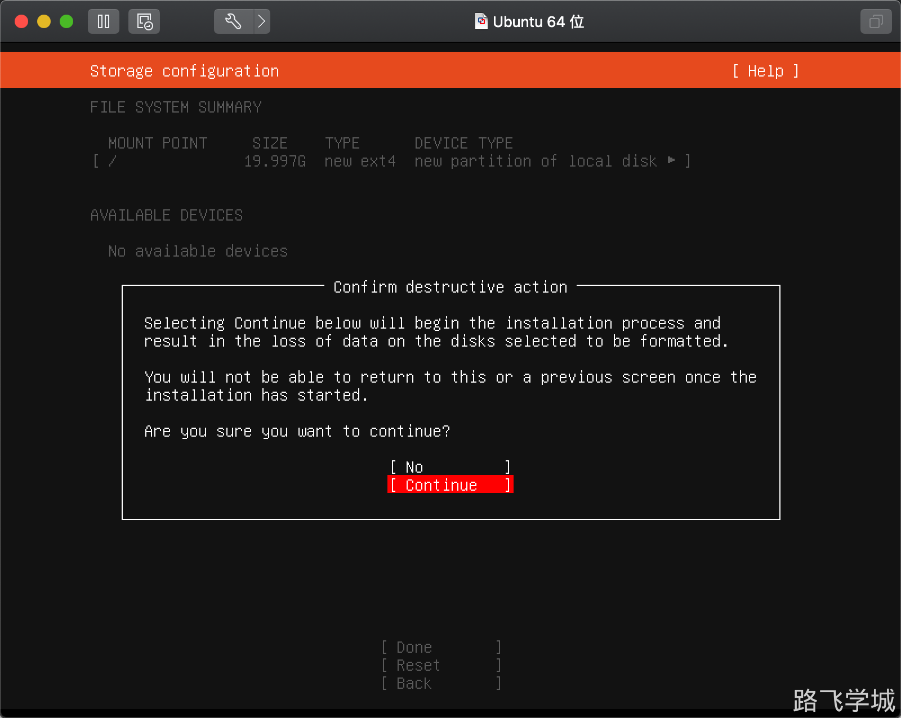

## 8.配置系统信息


## 9.安装openssh

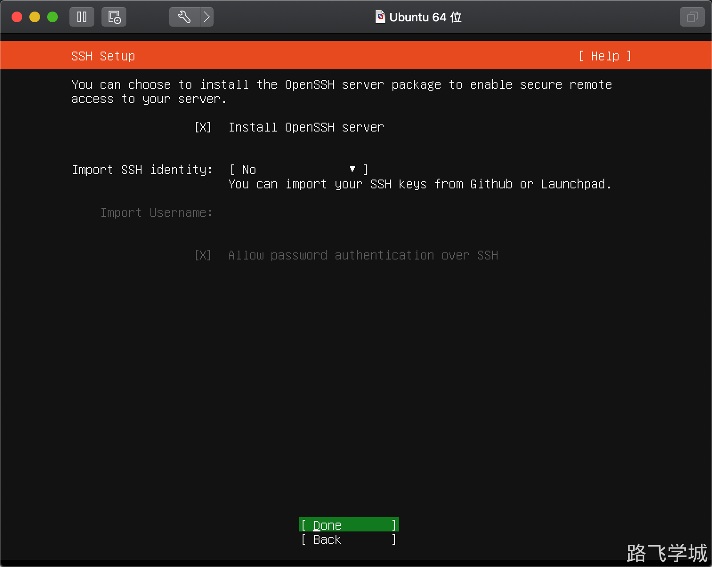

## 10,安装完成


# 第3章 Ubuntu初始化配置

## 1.配置网卡

修改网卡配置注意事项

```plain
1.ubuntu从17.10开始，已放弃在/etc/network/interfaces里固定IP的配置，即使配置也不会生效，而是改成netplan方式。
2.配置写在/etc/netplan/01-netcfg.yaml或者类似名称的yaml文件里。
3.修改配置以后不用重启，执行 netplan apply 命令可以让配置直接生效。
```

修改命令如下：

```plain
$ sudo vim /etc/netplan/00-installer-config.yaml 
# This is the network config written by 'subiquity'
network:
  ethernets:
     ens33:
        addresses:
        - 10.0.0.100/24
        gateway4: 10.0.0.2
        nameservers:
          addresses:
          - 10.0.0.2
          search:
          - 10.0.0.2
  version: 2
```

使配置生效命令如下：

```plain
sudo netplan apply
```

## 2.SSH配置

默认Ubuntu不允许root远程登录，后期如果想通过root登陆系统则必须修改SSH配置文件中的相关参数才行。

```plain
sudo vim /etc/ssh/sshd_config 
PermitRootLogin yes
```

修改后记得重启sshd进程

```plain
sudo systemctl restart sshd
```

## 3.root用户管理

切换root账户

```plain
sudo su -
```

修改root密码

```plain
sudo passwd root
```

## 4.配置apt源

ubuntu下的软件源可以在阿里源或者清华源上找到相应的配置方法:

```plain
https://mirrors.tuna.tsinghua.edu.cn/help/ubuntu/
```

配置命令:

```plain
deb http://mirrors.tuna.tsinghua.edu.cn/ubuntu/ focal main restricted universe multiverse
deb http://mirrors.tuna.tsinghua.edu.cn/ubuntu/ focal-updates main restricted universe multiverse
deb http://mirrors.tuna.tsinghua.edu.cn/ubuntu/ focal-backports main restricted universe multiverse
deb http://mirrors.tuna.tsinghua.edu.cn/ubuntu/ focal-security main restricted universe multiverse
~  
```

更新缓存:

```plain
sudo apt update
```

# 第4章 Ubuntu软件包管理工具使用

## 1.apt-get和apt命令介绍

```plain
1.apt等同于Centos7的yum命令
2.apt-get是第一代的包管理工具，最稳定
3.apt是改进的包管理工具，比apt-get要先进，官方推荐使用apt来管理软件
```

## 2.Ubuntu和CentOS7包管理工具区别

| 操作内容             | Centos 6/7          | Debian/Ubuntu         |
| -------------------- | ------------------- | --------------------- |
| 1.软件包后缀         | *.rpm               | *.deb                 |
| 2.软件源配置文件     | /etc/yum.conf       | /etc/apt/sources.list |
| 3.更新软件包列表     | yum makecache fast  | apt update            |
| 4.从软件仓库安装软件 | yum install package | apt install package   |
| 5.安装本地软件包     | rpm -i pkg.rpm      | dpkg -i pkg.deb       |
| 6.删除软件包         | yum remove package  | apt remove package    |
| 7.获取某软件包的信息 | yum search package  | apt search package    |

# 第5章 Ubuntu演示案例-云盘

## 1.环境说明

```plain
Ubunutu+php7.4+nginx
```

## 2.安装php7.4和nginx

```plain
sudo apt install php7.4 php7.4-fpm php7.4-gd php7.4-curl php7.4-mbstring nginx unzip net-tools -y
```

## 3.创建nginx配置文件

```plain
sudo su - 
cat > /etc/nginx/conf.d/kod.conf <<'EOF'
server {
    listen 80;
    server_name kod.man.com;
    root /code;
    index index.php index.html;

    location ~ \.php$ {
        root /code;
        fastcgi_pass 127.0.0.1:9000;
        fastcgi_index index.php;
        fastcgi_param SCRIPT_FILENAME $document_root$fastcgi_script_name;
        include fastcgi_params;
    }
}
EOF
```

由于apt安装的nginx自带了一个默认的站点配置，为了避免和我们自定义配置冲突，这里我们可以把默认配置移走。

```plain
sudo mv /etc/nginx/sites-enabled/default /tmp/
```

## 4.修改php-fpm监听方式

默认php-fpm是采用socket的监听方式，我们可以通过修改php-fpm的配置文件修改为监听端口的形式：

```plain
sudo vim /etc/php/7.4/fpm/pool.d/www.conf
listen = 127.0.0.1:9000
```

如果对VIM不熟悉的同学可以复制粘贴下面的命令实现一键替换:

```plain
sudo sed -i 's#listen = /run/php/php7.4-fpm.sock#listen = 127.0.0.1:9000#' /etc/php/7.4/fpm/pool.d/www.conf
```

## 5.下载并解压代码

```plain
sudo mkdir /code/ && cd /code/
sudo wget http://static.kodcloud.com/update/download/kodexplorer4.40.zip
sudo unzip kodexplorer4.40.zip -d /code/
sudo chown -R www-data:www-data /code/
```

## 6.启动并测试

```plain
sudo systemctl stop apache2.service 
sudo systemctl restart nginx php7.4-fpm
```

## 7.网页访问

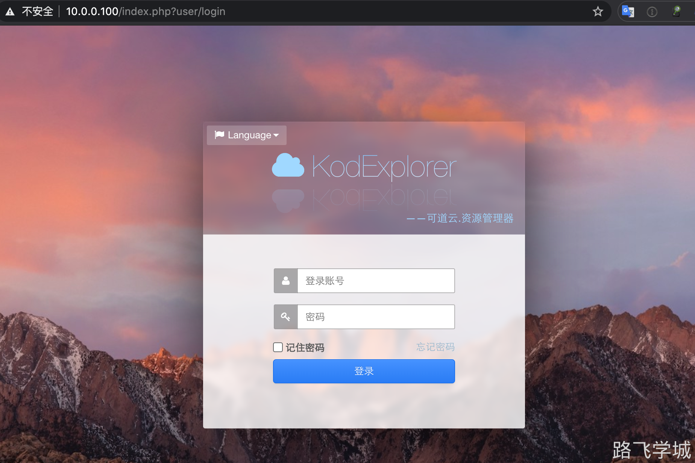

# 第6章 Ubuntu演示案例-java博客

## 1.安装java环境

```plain
sudo apt install openjdk-8-jre-headless -y
sudo java -version
```

## 2.下载博客代码

```plain
sudo wget https://dl.halo.run/release/halo-1.4.2.jar
```

## 3.运行博客

```plain
sudo java -jar halo-1.4.2.jar
```

## 4.访问测试

```plain
http://10.0.0.100:8090/
```

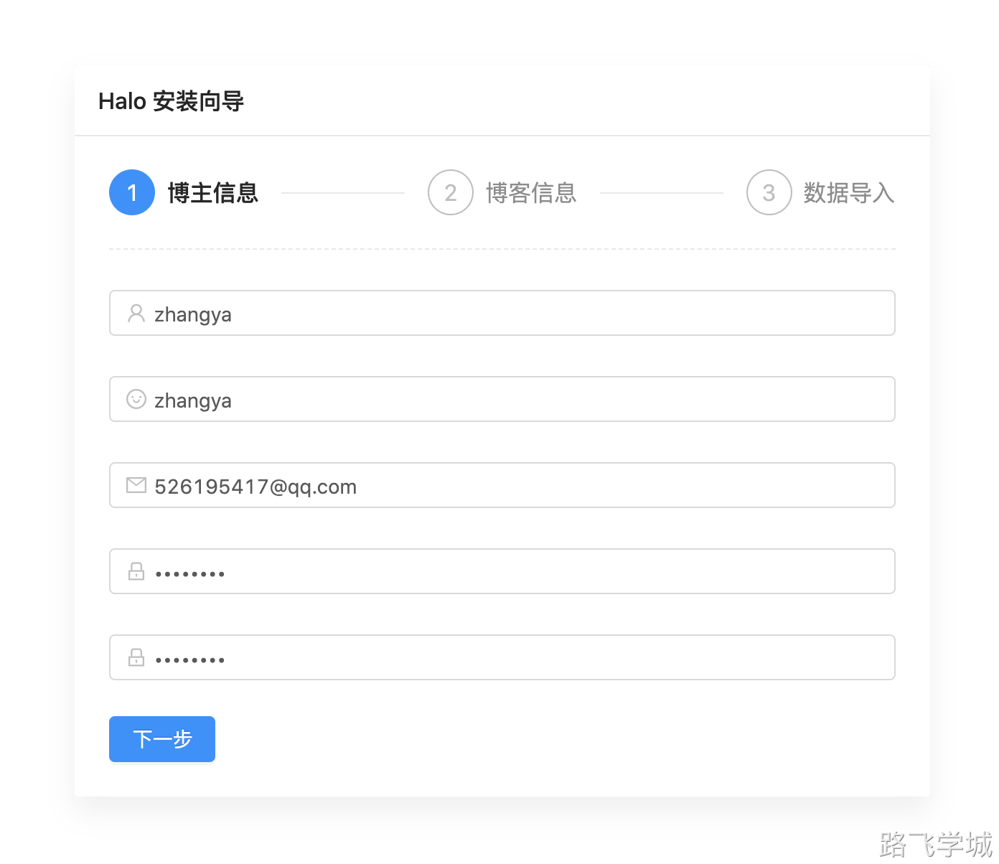

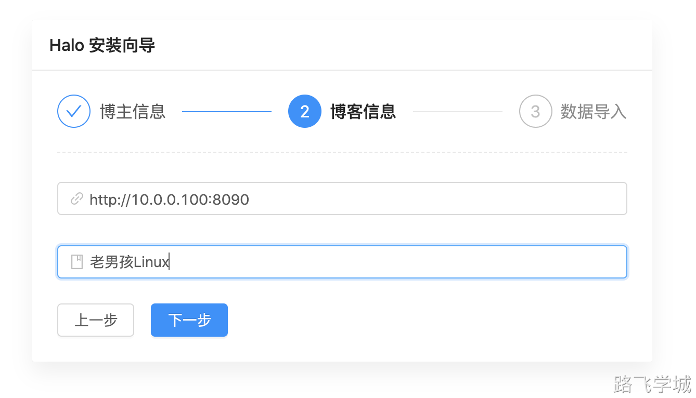


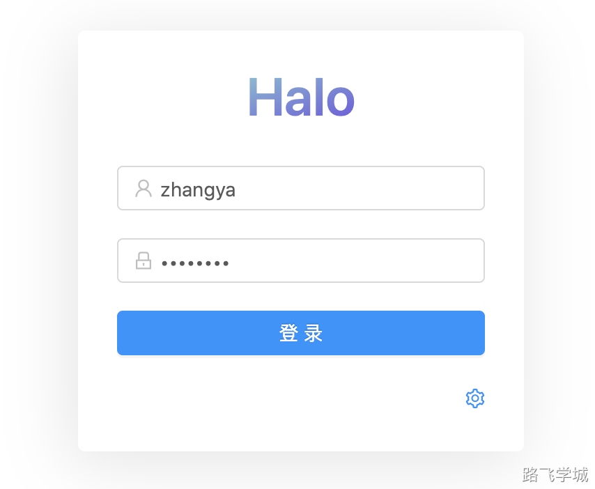