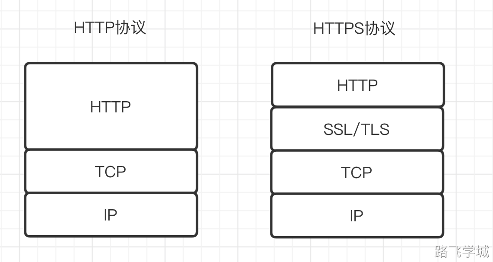
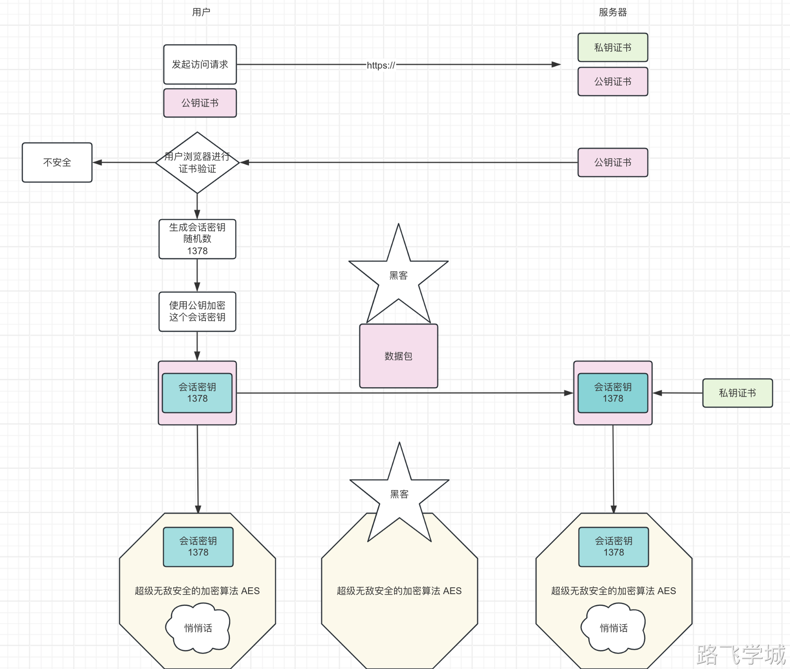
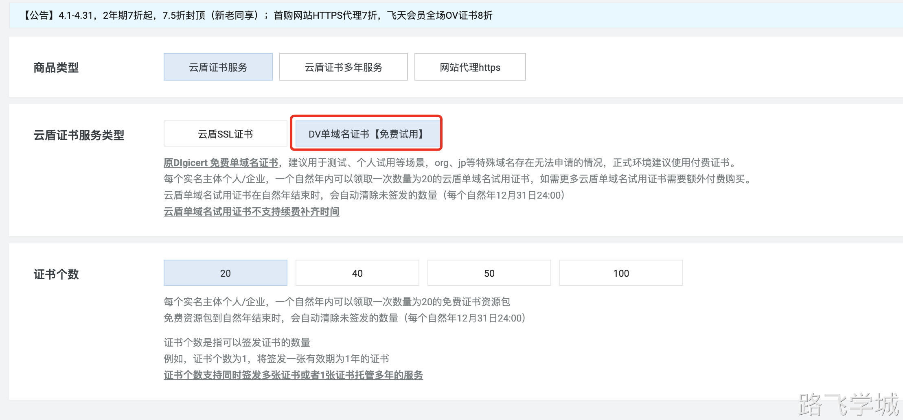
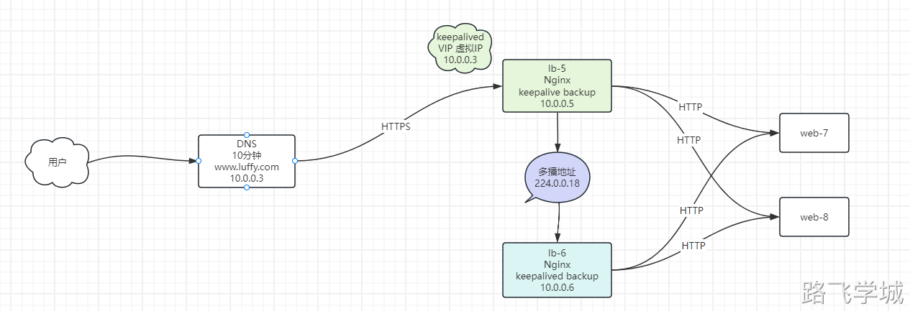

---
tags:
  - Http
---
> [!info]- 什么是HTTPS协议
> 
> 
> HTTPS协议不是一个独立的协议，而是HTTP+SSL(安全传输层协议)或HTTP+TLS(安全套接层)协议的组合。
> 简单来说就是使用SSL或TLS协议对HTTP协议发送的文本进行加密。
> 
> 示意图：
> 
> 
> 
> 
> 
 
> [!info]- 为什么需要HTTPS
> 
> 
> ```plain
> 为什么需要使用HTTPS, 因为HTTP不安全。当我们使用http网站时，经常会遇到包遭到劫持和篡改，如果采用https协议，那么数据在传输过程中是加密的，所以黑客无法窃取或者篡改数据报文信息。
> ```
> 
> 非https提交表单数据可以被抓取到
> 
> html代码:
> 
> ```html
> cat > /code/http/index.html << 'EOF'
> < html>
> < body>
> <!-- 这一行method 对应的值改为post --->
> < form action="user.php" method="post">
>     <input type="text" name="username"/>
>     <input type="password" name="pwd"/>
>     <input type="submit" name="提交"/>
> </form>
> </body>
> </html>
> EOF
> ```
> 
> php代码:
> 
> ```php
> cat > /code/http/user.php << 'EOF'
> < ?php
>   header('Content-type:text/html;charset=utf-8');
>   //$_POST[‘username’]，将username作为字符串放在中括号里面，就得到了表单里面的<input type=”text”name=”username”/>的值
>   $user = $_POST['username'];
>   //$_POST[‘pwd’]，将pwd作为字符串放在中括号里面，就得到了表单里面的<input type=”text”name=”pwd”/>的值
>   $passwd = $_POST['pwd'];
>   echo '用户名:'.$user.'<br>';
>   echo '密码:'.$passwd.'<br>';
> ?>
> EOF
> ```
> 
> nginx配置文件
> 
> ```plain
> cat > /etc/nginx/conf.d/http.conf << 'EOF'
> server {
>     server_name user.abc.com;
>     listen 80;
>     root /code/http;
>     index index.php index.html;
> 
>     location ~ \.php$ {
>         root /code/http;
>         fastcgi_pass 127.0.0.1:9000;
>         fastcgi_index index.php;
>         fastcgi_param SCRIPT_FILENAME $document_root$fastcgi_script_name;
>         include fastcgi_params;
>     }
> }
> EOF
> ```
> 

> [!info]- HTTPS加密流程
> 
> 
> 文字描述：
> 
> 1.服务端配置有一对数字证书，包含了私钥和公钥，也称为CA证书，CA证书有专门的颁发机构，也可以自己创建，但是自己创建的证书会被浏览器认为不合法。
> 2.客户端发起HTTPS请求,请求的端口是443
> 3.服务端接收到请求后会自动将自己的CA证书分发给客户端
> 4.客户端收到证书后浏览器会做验证，如果是合法的就会显示https图标，如果是不合法的，则会提示连接不安全
> 5.客户端如果证书通过验证，就会生成一个随机数，然后使用公钥对随机数进行加密
> 6.然后客户端会将随机数发给服务端
> 7.服务端收到后使用私钥解密随机数，以后通讯就会使用随机数进行数据加密了
> 
> 流程图：
> 
> 
> 
> 
> 
> 来自ChatGPT的回答：
> 
> HTTPS（Hyper Text Transfer Protocol Secure）是一种通过使用加密传输数据的网络协议，保护数据在浏览器和服务器之间的安全传输。它使用SSL/TLS协议对数据进行加密和解密。下面是简化的HTTPS加密解密流程：
> 
> 客户端请求建立安全连接：
> 当用户在浏览器中输入以“https://”开头的网址时，浏览器会向服务器发出连接请求。
> 
> 服务器发送SSL证书：
> 服务器收到请求后，会将自己的SSL证书（包含公钥）发送给浏览器。SSL证书通常由受信任的第三方机构颁发，用于验证服务器的身份。
> 
> 浏览器验证证书：
> 浏览器收到服务器的SSL证书后，会验证其有效性。这包括检查证书是否由受信任的机构颁发、证书是否过期以及与请求的域名是否匹配等。
> 
> 生成会话密钥：
> 如果证书验证通过，浏览器生成一个用于此会话的随机对称密钥（称为会话密钥），然后使用服务器的公钥对该密钥进行加密，并将其发送给服务器。
> 
> 服务器使用私钥解密会话密钥：
> 服务器收到加密的会话密钥后，使用自己的私钥进行解密，得到会话密钥。
> 
> 建立安全连接：
> 现在，服务器和浏览器都拥有相同的会话密钥，可以使用这个密钥进行加密和解密通信内容。加密的数据从服务器发送到浏览器或从浏览器发送到服务器都会使用会话密钥进行加密和解密。
> 
> 安全数据传输：
> 数据经过加密后在网络上传输，保护了数据的安全性，即使被截获，也很难被解密读取。
> 
> 维持安全连接：
> 通信过程中，如果需要持续通信，会话密钥可能会定期更换以增加安全性。
> 
> 这个过程保证了数据在传输过程中的加密安全性，确保了敏感信息在网络上的安全传输。
> 

> [!info]- HTTPS购买以及注意事项
> 
> 
>  1.购买平台
> 
> 各大云厂商
> 
>  2.国际常见的证书颁发机构
> 
> GlobalSign
> DigiCert
> GeoTrust
> 
>  2.证书类型
> 
> ```plain
> OV
> EV
> DV
> 免费
> ```
> 
>  3.域名类型
> 
> 单域名证书    www.mysun.com 
> 多域名证书    www.mysun.com  bbs.mysun.com blog.mysun.com 
> 通配符域名    *.mysun.com
> 
>  4.域名证书购买注意
> 
> 1.一个通配符证书只支持2级域名
> 2.域名证书最多只能买2年，不支持续费，到期只能买新的
> 3.域名证书到期后浏览器会提示不安全警告
> 4.微信小程序必须要求配置https，不然审核不通过
> 5.提前买
> 
>  5.工作中选择域名的过程
> 
> 1.先收集好所有的域名
> 2.过滤分析一共有几种类型的域名
>   *.www.mysun.com
>   *.mysun.com
> 
>  6.如何监控域名过期时间
> 
> out_time=$(echo | openssl s_client -connect www.abcedu.com:443 2>/dev/null | openssl x509 -noout -dates|awk -F"=" '/notAfter/{print $2}')
> out_time_unix=$(date +%s -d "${out_time}")
> today=$(date +%s)
> let out_day=($out_time_unix-$today)/86400
> echo $out_day
> 

> [!run]- 简单nginx配置https
> 
> 
> https://help.aliyun.com/zh/ssl-certificate/user-guide/install-ssl-certificates-on-nginx-servers-or-tengine-servers?spm=0.2020520163.help.dexternal.765421a8bLZ0U9
> 
> 检查Nginx是否有SSL模块
> 
> ```plain
> nginx -V 
> --with-http_ssl_module
> ```
> 
>  2.创建证书目录并生成证书
> 
> ```plain
> mkdir /etc/nginx/ssl_key 
> cd /etc/nginx/ssl_key
> openssl genrsa -idea -out server.key 2048
> ```
> 
>  3.生成自签证书，同时去掉私钥的密码
> 
> ```plain
> openssl req -days 36500 -x509 -sha256 -nodes -newkey rsa:2048 -keyout server.key -out server.crt
> CN
> SH
> SH 
> mysun
> SA
> mysun
> mysun@qq.com
> ```
> 
>  4.创建nginx配置文件
> 
> ```plain
> cat >/etc/nginx/conf.d/ssl.conf << EOF
> server {
>     listen 443 ssl;
>     server_name ssl.mysun.com;
>     ssl_certificate ssl_key/server.crt;
>     ssl_certificate_key ssl_key/server.key;
>     location / {
>         root /code;
>         index index.html;
>     }
> }
> EOF
> ```
> 
>  5.测试重启Nginx
> 
> ```plain
> nginx -t 
> systemctl restart nginx
> ```
> 
>  6.写入测试文件
> 
> ```plain
> echo "$(hostname) SSL" > /code/index.html
> ```
> 
>  7.访问测试
> 
> ```plain
> [root@web-7 /etc/nginx/conf.d] cat ssl.conf 
> server {
>     listen 80;
>     server_name ssl.mysun.com;
>     rewrite ^(.*) https://$server_name$1 redirect;
> }
> 
> server {
>     listen 443 ssl;
>     server_name ssl.mysun.com;
>     ssl_certificate ssl_key/server.crt;
>     ssl_certificate_key ssl_key/server.key;
>     location / {
>         root /code;
>         index index.html;
>     }
> }
> ```

> [!run]- 强制http跳转到https
> 
> 
>  1.配置nginx配置文件
> 
> ```plain
> [root@web-7 /etc/nginx/conf.d] cat ssl.conf 
> server {
>     listen 80;
>     server_name ssl.mysun.com;
>     rewrite ^(.*) https://$server_name$1 redirect;
> }
> 
> server {
>     listen 443 ssl;
>     server_name ssl.mysun.com;
>     ssl_certificate ssl_key/server.crt;
>     ssl_certificate_key ssl_key/server.key;
>     location / {
>         root /code;
>         index index.html;
>     }
> }
> ```
> 

> [!run]- Nginx反向代理配置https
> 
> 
>  1.复制已经创建好的证书到其他的web服务器
> 
> ```plain
> cd /etc/nginx/ 
> scp -r ssl_key 10.0.0.8:/etc/nginx/
> scp -r conf.d/ssl.conf 10.0.0.8:/etc/nginx/conf.d/
> echo "$(hostname) SSL" > /code/index.html
> ```
> 
>  2.复制已经创建好的证书到lb服务器
> 
> ```plain
> cd /etc/nginx/ 
> scp -r ssl_key 10.0.0.5:/etc/nginx/
> ```
> 
>  3.第一种情况：lb服务器http强制跳转https
> 
> lb服务器配置：
> 
> ```plain
> [root@lb-5 /etc/nginx/conf.d] cat ssl.conf 
> upstream ssl_pools {
>    server 172.16.1.7:443;
>    server 172.16.1.8:443;
> }
> 
> server {
>    listen 80;
>    server_name  ssl.abc.com ;
>    rewrite ^(.*) https://$server_name$1 redirect;
> }
> 
> server {
>     listen 443 ssl;
>     server_name ssl.abc.com;
>     ssl_certificate ssl_key/server.crt;
>     ssl_certificate_key ssl_key/server.key;
>     location / {
>       proxy_pass  https://ssl_pools;
>       include proxy_params;
>     }
> }
> ```
> 
> web服务器配置：
> 
> ```plain
> [root@web-8 /etc/nginx/conf.d] cat ssl.conf 
> server {
>     listen 443 ssl;
>     server_name ssl.abc.com;
>     ssl_certificate ssl_key/server.crt;
>     ssl_certificate_key ssl_key/server.key;
>     location / {
>         root /code;
>         index index.html;
>     }
> }
> ```
> 
>  4.第二种情况：lb服务器负责https加解密，后端web服务器还是http的80端口
> 
> lb服务器配置：
> 
> ```plain
> [root@lb-5 ~] cat /etc/nginx/conf.d/ssl.conf 
> upstream ssl_pools {
>    server 172.16.1.7;
>    server 172.16.1.8;
> }
> 
> server {
>    listen 80;
>    server_name  ssl.abc.com ;
>    rewrite ^(.*) https://$server_name$1 redirect;
> }
> 
> server {
>     listen 443 ssl;
>     server_name ssl.abc.com;
>     ssl_certificate ssl_key/server.crt;
>     ssl_certificate_key ssl_key/server.key;
>     location / {
>       proxy_pass  http://ssl_pools;
>       include proxy_params;
>     }
> }
> ```
> 
> web服务器配置：
> 
> ```plain
> [root@web-7 /etc/nginx/conf.d] cat ssl.conf 
> server {
>     listen 80;
>     server_name ssl.abc.com;
>     location / {
>         root /code;
>         index index.html;
>     }
> }
> ```
> 

> [!info]- 阿里云配置HTTPS
>  
> 
>  1.阿里云https申请流程
> 
> 阿里云的https证书可以申请个人免费版
> 
> 
> 
> 
> 
>  第x章 验证ok的
> 
> ```plain
> [root@lb-5 ~] cat /etc/nginx/conf.d/proxy.conf
> upstream backend {
>     server 10.0.0.7;
>     server 10.0.0.8;
> }
> 
> upstream tomcat {
>     server 10.0.0.7:8080;
>     server 10.0.0.8:8080;
> }
> 
> server {
>     listen 80;
>     server_name nginx.abc.com tomcat.abc.com;
>     rewrite ^(.*) https://$http_host$1 redirect;
> }
> 
> 
> server {
>     listen 443 ssl;
>     server_name nginx.abc.com;
>     ssl_certificate ssl_key/server.crt;
>     ssl_certificate_key ssl_key/server.key;
>     location / {
>         proxy_pass http://backend;
>         proxy_set_header Host $http_host;
>         proxy_set_header X-Forwarded-For $proxy_add_x_forwarded_for;
>         proxy_set_header X-Forwarded-Proto $scheme;
>     }
> }
> 
> server {
>     listen 443 ssl;
>     server_name tomcat.abc.com;
>     ssl_certificate ssl_key/server.crt;
>     ssl_certificate_key ssl_key/server.key;
>     location / {
>         proxy_pass http://tomcat;
>         proxy_set_header Host $http_host;
>         proxy_set_header X-Forwarded-For $proxy_add_x_forwarded_for;
>         proxy_set_header X-Forwarded-Proto $scheme;
>     }
> }
> ```
> 
> 
> 
> 
> 