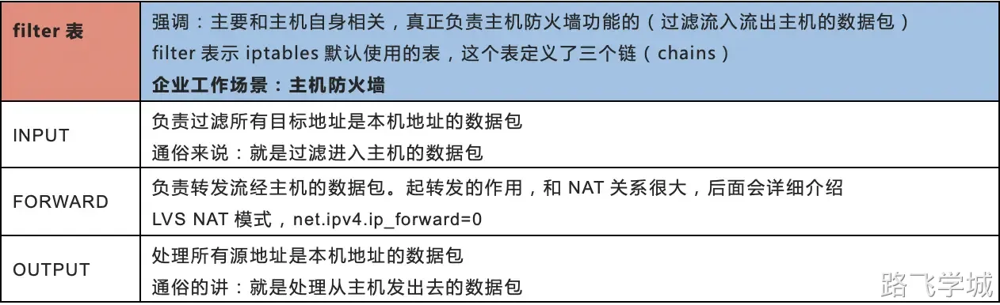
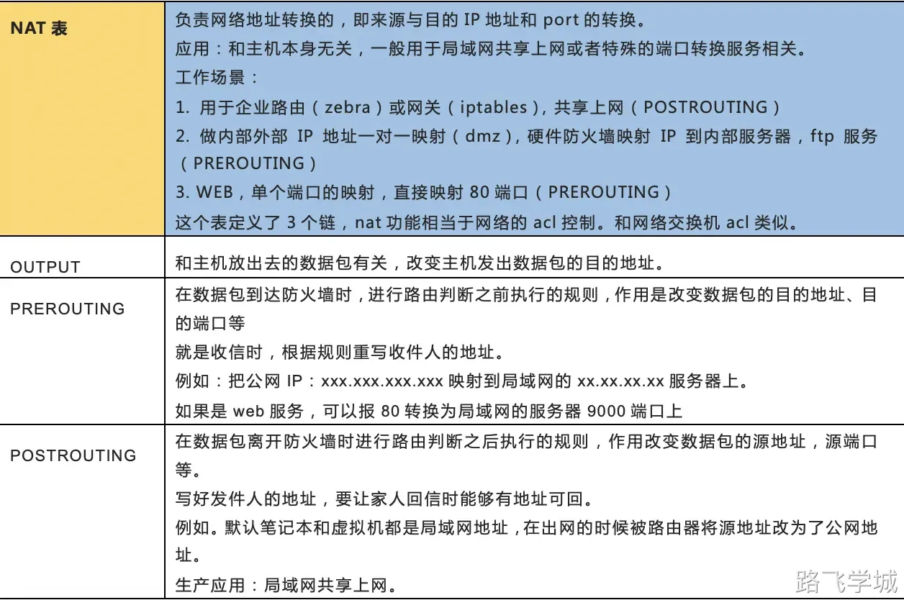
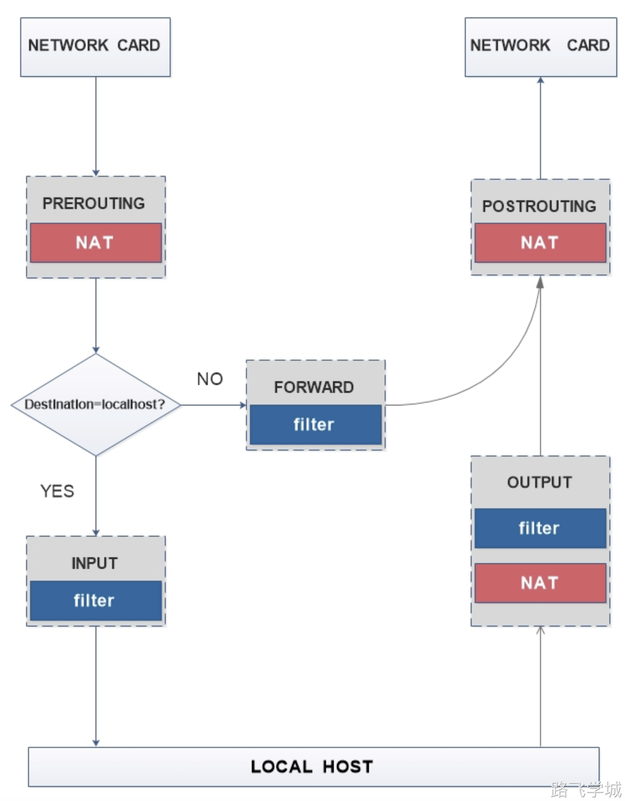
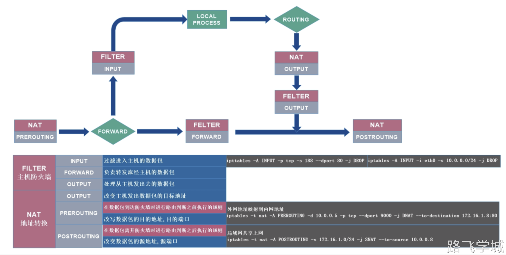

# 第1章 iptables介绍

## 1.iptables是什么？

iptables是开源的基于数据包过滤的防火墙工具。

## 2.iptables企业应用场景

1、主机防火墙（filter表的INPUT链）。

2、局域网共享上网(nat表的POSTROUTING链)，半个路由器，NAT功能。

3、端口及IP映射(nat表的PREROUTING链)，硬防的NAT功能。

4、IP一对一映射。

## 3.商用防火墙品牌

华为深信服思科H3CJuniper天融信飞塔网康绿盟科技金盾

# 第2章 iptables工作流程

iptables是采用数据包过滤机制工作的，所以它会对请求的数据包的包头数据进行分析，并根据我们预先设定的规则进行匹配来决定是否可以进入主机。

1.防火墙是一层层过滤的。实际是按照配置规则的顺序从上到下，从前到后进行过滤的。

2.如果匹配上了规则，即明确表明是阻止还是通过，此时数据包就不在向下匹配新规则了。

3.如果所有规则中没有明确表明是阻止还是通过这个数据包，也就是没有匹配上规则，向下进行匹配，直到匹配默认规则得到明确的阻止还是通过。

4.防火墙的默认规则是对应链的所有的规则执行完以后才会执行的（最后执行的规则）。

# 第3章 iptables四表五链 

## 1.表与链对应关系

实际iptables包含4张表和五个链，但主要记住两张表即可filter和nat表即可。

## 2.FILTER表



## 3.NAT表



# 第4章 iptables工作原理示意图



# 第5章 iptables环境准备

## 1.安装iptables管理命令

```bash
 [root@m01 ~]# yum install iptables-services -y
```

## 2.加载防火墙的内核模块

```bash
modprobe ip_tables
modprobe iptable_filter
modprobe iptable_nat
modprobe ip_conntrack
modprobe ip_conntrack_ftp
modprobe ip_nat_ftp
modprobe ipt_state
```

查看已加载的模块

```bash
[root@m01 ~]# lsmod |egrep 'filter|nat|ipt'
 ipt_REJECT             12541  0 
 nf_nat_ftp             12770  0 
 nf_conntrack_ftp       18638  1 nf_nat_ftp
 iptable_filter         12810  0 
 xt_nat                 12681  3 
 iptable_nat            12875  1 
 nf_nat_ipv4            14115  1 iptable_nat
 nf_nat                 26146  3 nf_nat_ftp,nf_nat_ipv4,xt_nat
 nf_conntrack          105745  7 nf_nat_ftp,nf_nat,xt_state,nf_nat_ipv4,xt_conntrack,nf_conntrack_ftp,nf_conntrack_ipv4
 ip_tables              27240  2 iptable_filter,iptable_nat
```

## 3.启动防火墙

首先停止firewalld

```bash
systemctl stop firewalld
systemctl disable firewalld
```

开启iptables

```bash
systemctl start iptables.service
systemctl enable iptables.service
```

# 第6章 iptables基本操作命令

## 1.查看防火墙规则 

```bash
[root@m01 ~]# iptables -nL
 Chain INPUT (policy ACCEPT)
 target     prot opt source               destination         
 
 Chain FORWARD (policy ACCEPT)
 target     prot opt source               destination         
 
 Chain OUTPUT (policy ACCEPT)
 target     prot opt source               destination
```

## 2.清除防火墙规则

iptables -F		<- 清除所有规则，不会处理默认的规则

iptables -X		<- 删除用户自定义的链

iptables -Z		<- 链的计数器清零（数据包计数器与数据包字节计数器）

## 3.添加防火墙规则

iptables -t		<-指定表d(efault: `filter')

iptables -A		<-把规则添加到指定的链上，默认添加到最后一行。

iptables -I		<-插入规则，默认插入到第一行(封IP)。

iptables -D		<-删除链上的规则

## 4.网络连接状态

NEW：已经或将启动新的连接

ESTABLISHED：已建立的连接

RELATED：正在启动的新连接

INVALID：非法或无法识别的

## 4.删除某个规则

iptables -nL --line-numbers 查看规则号码iptables -D INPUT 1 删除指定链上的指定序号

```bash
iptables A INPUT -p tcp -m state --dport 22 -j DROP
iptables -nL
iptables -nL --line-numbers
iptables -D INPUT 1
```

# 第7章 iptables实战

## 1.禁止某个端口访问

```
 iptables -t filter -A INPUT -p tcp --dport 80 -j DROP
```

规则解释：

```bash
-p       #<==指定过滤的协议-p（tcp,udp,icmp,all）
--dport  #<==指定目标端口（用户请求的端口）。
-j       #<==对规则的具体处理方法（ACCEPT,DROP,REJECT,SNAT/DNAT)
--sport  #<==指定源端口。
```

## 2.禁止某个IP访问

```bash
iptables -I INPUT -p tcp -s 10.0.0.253 -i eth0 -j DROP
iptables -A INPUT -p tcp ! -s 10.0.0.1 -i eth0 -j DROP
iptables -A INPUT -p tcp ! -s 10.0.0.0/24 -i eth0 -j DROP
```

规则解释：

```bash
-s       #<==指定源地址或网段（192.168.1.0/24）。 ! 取反。
-d       #<==指定目的地址（nat表prerouting）。
-i       #<==进入的网络接口（eth0,eth1）。
-o       #<==出去的网络接口（eth0,eth1）。
```

## 3.禁止除跳板机以外的IP访问 

 iptables -I INPUT -p tcp ! -s 10.0.0.1 -j DROP

## 4.匹配端口范围

```bash
iptables -I INPUT -p tcp -m multiport --dport 21,22,23,24 -j DROP
iptables -I INPUT -p tcp --dport 3306:8809 -j ACCEPT
iptables -I INPUT -p tcp --dport 18:80 -j DROP  #<==最佳
```

## 5.匹配ICMP类型

```bash
iptables -A INPUT -p icmp --icmp-type 8
例：iptables -A INPUT -p icmp --icmp-type 8 -j DROP
iptables -A INPUT -p icmp -m icmp --icmp-type any -j ACCEPT
iptables -A FORWARD -s 192.168.1.0/24 -p icmp -m icmp --icmp-type any -j ACCEPT
```

## 6.练习题

1、封掉10.0.0.7

 iptables -I INPUT -s 10.0.0.7 -j DROP

2、让10.0.0.7和SSH客户端（10.0.0.1）服务器可以Ping，其它的不能Ping

```bash
iptables -I INPUT -p icmp --icmp-type 8 -s 10.0.0.7 -j ACCEPT
iptables -I INPUT 2 -p icmp ! -s 10.0.0.1 --icmp-type 8 -j DROP
```

3、封掉3306端口

 iptables -I INPUT -p tcp --dport 3306 -j DROP

# 第8章 iptables企业案例

## 1.部署一个安全的防火墙

两种思想：针对默认规则而言。 逛公园：黑名单 1、默认规则默认是允许的状态。 看电影：白名单 2、默认规则默认是不允许的状态。更安全。看电影的思想更安全。实战部署：

```bash
 [root@m01 ~]# iptables -F
 [root@m01 ~]# iptables -X
 [root@m01 ~]# iptables -Z
 [root@m01 ~]# iptables -A INPUT -p tcp -m multiport --dport 80,443 -j ACCEPT
 [root@m01 ~]# iptables -A INPUT -p tcp --dport 22 -j ACCEPT
 [root@m01 ~]# iptables -A INPUT -s 10.0.0.0/24 -j ACCEPT
 [root@m01 ~]# iptables -A INPUT -s 172.16.1.0/24 -j ACCEPT
 [root@m01 ~]# iptables -A INPUT -i lo -j ACCEPT
 [root@m01 ~]# iptables -P INPUT DROP
 [root@m01 ~]# iptables -P FORWARD DROP
 [root@m01 ~]# iptables -P OUTPUT ACCEPT
 [root@m01 ~]# iptables -nL
 Chain INPUT (policy DROP)
 target     prot opt source               destination         
 ACCEPT     tcp  --  0.0.0.0/0            0.0.0.0/0            multiport dports 80,443
 ACCEPT     tcp  --  0.0.0.0/0            0.0.0.0/0            tcp dpt:22
 ACCEPT     all  --  10.0.0.0/24          0.0.0.0/0           
 ACCEPT     all  --  172.16.1.0/24        0.0.0.0/0           
 ACCEPT     all  --  0.0.0.0/0            0.0.0.0/0           
 
 Chain FORWARD (policy DROP)
 target     prot opt source               destination         
 
 Chain OUTPUT (policy ACCEPT)
 target     prot opt source               destination
```

命令集合：

```bash
 iptables -F
 iptables -X
 iptables -Z
 iptables -A INPUT -p tcp -m multiport --dport 80,443 -j ACCEPT
 iptables -A INPUT -p tcp --dport 22 -j ACCEPT
 iptables -A INPUT -s 10.0.0.0/24 -j ACCEPT
 iptables -A INPUT -s 172.16.1.0/24 -j ACCEPT
 iptables -A INPUT -i lo -j ACCEPT
 iptables -P INPUT DROP
 iptables -P FORWARD DROP
 iptables -P OUTPUT ACCEPT
 iptables -nL
```

## 2.局域网共享上网

实验环境：m01: 共享上网网关出口web01: 只有内网地址，网关指向m01实验步骤：m01操作

```bash
 iptables -t nat -A POSTROUTING -s 172.16.1.0/24 -j SNAT --to-source 10.0.0.11
 echo 'net.ipv4.ip_forward = 1' >> /etc/sysctl.conf
 sysctl -p
 iptables -F
 iptables -X
 iptables -Z
 iptables -A INPUT -p tcp -m multiport --dport 80,443 -j ACCEPT
 iptables -A INPUT -p tcp --dport 22 -j ACCEPT
 iptables -A INPUT -s 10.0.0.0/24 -j ACCEPT
 iptables -A INPUT -s 172.16.1.0/24 -j ACCEPT
 iptables -A INPUT -i lo -j ACCEPT
 iptables -P INPUT DROP
 iptables -P FORWARD DROP
 iptables -P OUTPUT ACCEPT
 iptables -A FORWARD -i eth1 -s 172.16.1.0/24 -j ACCEPT
 iptables -A FORWARD -o eth0 -s 172.16.1.0/24 -j ACCEPT
 iptables -A FORWARD -i eth0 -d 172.16.1.0/24 -j ACCEPT
 iptables -A FORWARD -o eth1 -d 172.16.1.0/24 -j ACCEPT
```

web01操作：

```bash
[root@web01 ~]# cat /etc/sysconfig/network-scripts/ifcfg-eth0
 TYPE=Ethernet
 BOOTPROTO=none
 DEFROUTE=yes
 NAME=eth0
 DEVICE=eth0
 ONBOOT=no
 IPADDR=10.0.0.7
 PREFIX=24
 GATEWAY=10.0.0.2
 DNS1=10.0.0.2
 
 [root@web01 ~]# cat /etc/sysconfig/network-scripts/ifcfg-eth1
 TYPE=Ethernet
 BOOTPROTO=none
 DEFROUTE=yes
 NAME=eth1
 DEVICE=eth1
 ONBOOT=yes
 IPADDR=172.16.1.7
 GATEWAY=172.16.1.61
 PREFIX=24
 DNS1=10.0.0.2
 
 [root@web01 ~]# systemctl restart network 
 
 [root@web01 ~]# ip r
 default via 172.16.1.61 dev eth1  proto static  metric 100 
 172.16.1.0/24 dev eth1  proto kernel  scope link  src 172.16.1.7  metric 100 
 
 [root@web01 ~]# cat /etc/resolv.conf    
 nameserver 10.0.0.2
```

web01测试访问外网：

```bash
[root@web01 ~]# ping www.baidu.com
 PING www.a.shifen.com (14.215.177.39) 56(84) bytes of data.
 64 bytes from 14.215.177.39: icmp_seq=1 ttl=127 time=7.70 ms
 64 bytes from 14.215.177.39: icmp_seq=2 ttl=127 time=8.92 ms
```

## 3.端口映射

m01操作：

 iptables -t nat -A PREROUTING -d 10.0.0.11 -p tcp --dport 9000 -j DNAT --to-destination 172.16.1.7:22

命令拆解：

```bash
 表：nat
 链：PREROUTING
 目标IP：10.0.0.11
 目标端口：9000
 协议：tcp
 动作：DNAT
 目标IP：172.16.1.7
 目标端口：22
```

访问测试:

```bash
 zhangyadeMacBook-Pro:~ zhangya$ ssh root@10.0.0.61 -p 9000
 root@10.0.0.61's password:
 Last login: Tue Aug 20 09:38:42 2019 from 172.16.1.51
 [root@web01 ~]#
```

## 4.IP映射

```bash
[root@m01 ~]# ip a add 10.0.0.62/24 dev eth0 label eth0:0
[root@m01 ~]# iptables -t nat -A PREROUTING -d 10.0.0.62 -j DNAT --to-destination 172.16.1.7
[root@m01 ~]# iptables -nL -t nat
Chain PREROUTING (policy ACCEPT)
target     prot opt source               destination         
DNAT       tcp  --  0.0.0.0/0            10.0.0.61            tcp dpt:9000 to:172.16.1.7:22
DNAT       all  --  0.0.0.0/0            10.0.0.62            to:172.16.1.7

Chain INPUT (policy ACCEPT)
target     prot opt source               destination         

Chain OUTPUT (policy ACCEPT)
target     prot opt source               destination         

Chain POSTROUTING (policy ACCEPT)
target     prot opt source               destination         
SNAT       all  --  172.16.1.0/24        0.0.0.0/0            to:10.0.0.61
```

测试访问：

```bash
zhangyadeMacBook-Pro:~ zhangya$ ssh root@10.0.0.62
 root@10.0.0.62's password:
 Last login: Wed Aug 21 13:30:04 2019 from 10.0.0.1
 [root@web01 ~]# hostname
 web01
 [root@web01 ~]#
```

# 第9章 iptables规则保存

```
iptables-save > 20190821 #将防火墙规则保存到文件中

iptables-save #将防火墙规则保存到配置文件中，防止重启后失效

iptables-restore < 20190821 #从配置文件里载入防火墙配置

```
# 第10章 iptables防坑指南

1.修改之前先导出备份一份

2.修改的时候小心别把自己关在外面

3.可以现在定时任务里添加一条定时清空的规则，等测试没问题再取消定时任务