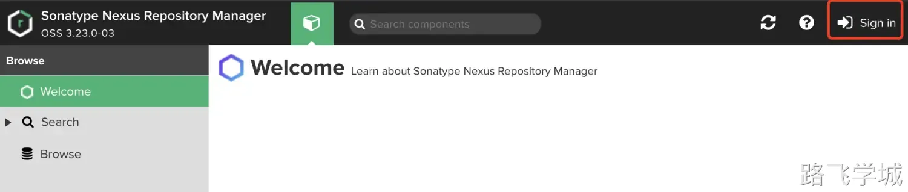
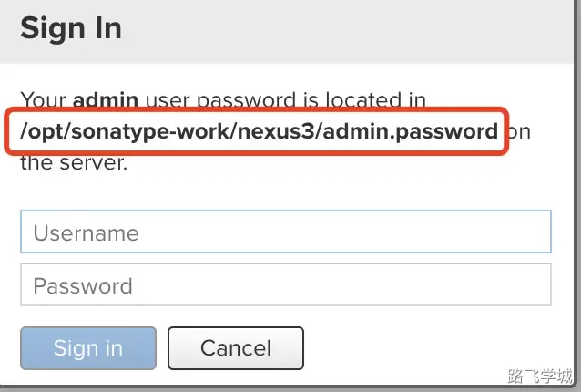
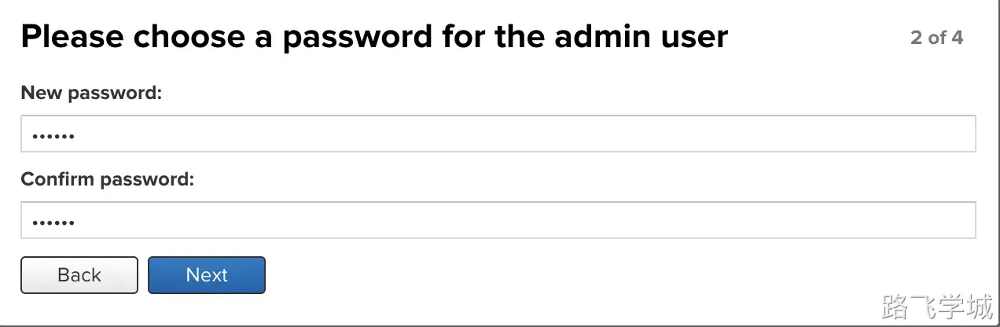
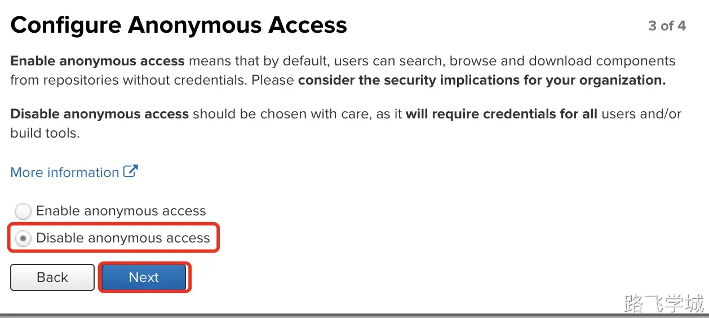
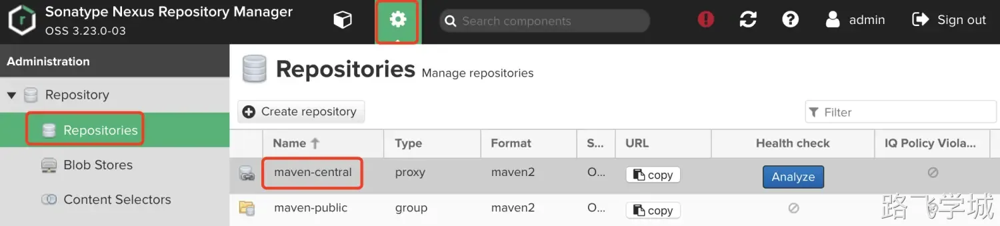
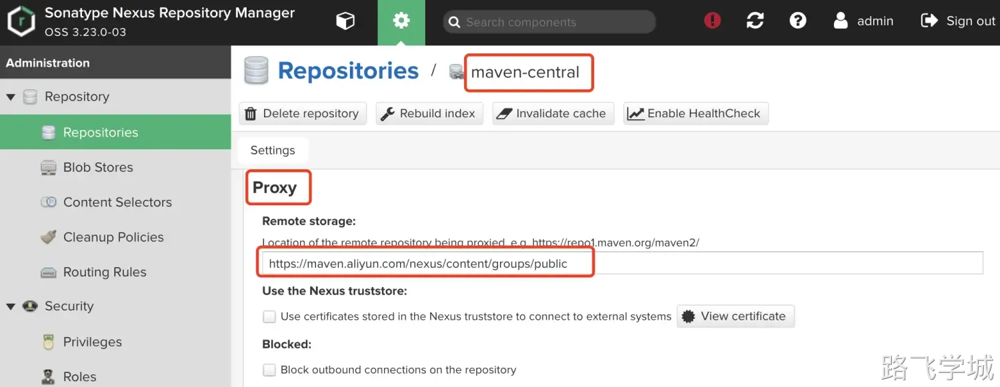
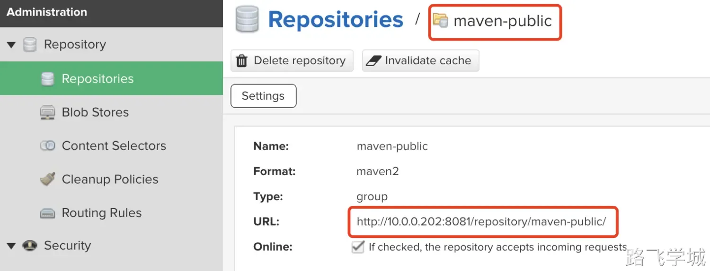
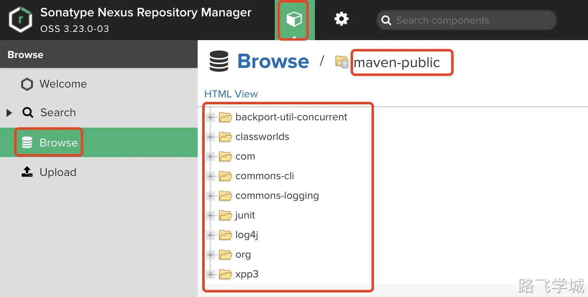

---
tags:
  - java微架构
---

> [!info]- 什么是Nexus？
> 
> 
> Nexus是一个强大的仓库管理器，主要用于存储、管理和部署软件构件。
> 
> 它是由Sonatype开发的，旨在帮助开发团队管理依赖关系和构件的存储。
> 
> Nexus可以存储各种格式的构件，包括Maven、npm、NuGet、Docker等，使得开发者可以更高效地管理和共享构件。

> [!info]- Nexus解决了什么问题？
> 
> 
> Nexus解决了软件开发过程中关于构件管理的多个问题，包括但不限于：
> 
> **依赖管理复杂性**：在大型项目中，手动管理依赖关系和构件版本是非常困难且容易出错的。Nexus通过自动化依赖管理和构件版本控制，简化了这一过程。
> 
> **构件存储分散**：在没有集中管理的情况下，构件可能分散在不同的开发人员机器和服务器上。Nexus提供了一个集中化的存储位置，确保构件的一致性和可访问性。
> 
> **重复下载和存储**：通过缓存远程仓库中的构件，Nexus减少了重复下载的需求，节省了带宽和存储空间。
> 
> **安全性和合规性**：Nexus通过访问控制和审计日志，确保只有授权用户可以访问和操作构件，满足安全性和合规性的要求。

> [!info]- Maven和Nexus的关系是什么？
> 
> 
> Maven是一个用于Java项目的构建工具，而Nexus则是一个用于存储和管理Maven构件的仓库管理器。两者之间的关系可以总结如下：
> 
> **依赖管理**：Maven通过POM文件定义项目的依赖关系，而Nexus则存储这些依赖项并提供访问。Maven可以配置使用Nexus作为其依赖项仓库，从而下载和上传构件。
> 
> **版本控制**：Maven构建过程中的构件（如JAR包）可以上传到Nexus，Nexus负责管理这些构件的版本。
> 
> **自动化构建和部署**：Maven与CI/CD工具（如Jenkins）结合使用，可以实现自动化构建和部署，而Nexus作为构件仓库，存储构建结果并为后续部署提供支持。
> 
> 通过Nexus和Maven的结合，开发团队可以实现高效的依赖管理、版本控制和自动化构建部署流程，提高项目的开发和交付效率。
> 

> [!install]- 安装Nexus私服
> 
> 
> 二进制安装JDK
> 
> [📎jdk-8u351-linux-x64.tar.gz](https://www.yuque.com/attachments/yuque/0/2024/gz/830385/1719133844706-a58d99ce-f879-469c-9f7a-8118de5bbe3e.gz)
> 
> ```plain
> tar zxf jdk-8u351-linux-x64.tar.gz -C /opt/
> ln -s /opt/jdk1.8.0_351 /opt/jdk
> cp /etc/profile /etc/profile.bak
> cat >> /etc/profile << 'EOF'
> export JAVA_HOME=/opt/jdk
> export JRE_HOME=${JAVA_HOME}/jre
> export CLASSPATH=.:${JAVA_HOME}/lib:${JRE_HOME}/lib
> export PATH=$PATH:${JAVA_HOME}/bin
> EOF
> source /etc/profile
> java -version
> echo $JAVA_HOME
> echo $JRE_HOME
> ```

> [!install]- 下载并安装Nexus
> 
> 
> [📎nexus-3.23.0-03-unix.tar.gz](https://www.yuque.com/attachments/yuque/0/2024/gz/830385/1719132704872-ac9d2ee8-e4a9-47ab-a44c-bea960fb2ed4.gz)
> 
> 安装命令：
> 
> ```plain
> tar zxf nexus-3.23.0-03-unix.tar.gz -C /opt/
> cd /opt/
> ln -s nexus-3.23.0-03 nexus
> ```

> [!info]- 创建普通用户并更改权限
> 
> 
> ```plain
> useradd nexus -s /sbin/nologin
> chown -R nexus:nexus /opt/nexus*
> chown -R nexus:nexus sonatype-work
> ```
> 

> [!systemd]- 创建systemd启动服务
> 
> 
> ```plain
> cat >/usr/lib/systemd/system/nexus.service<< EOF
> [Unit]
> Description=nexus
> 
> [Service]
> Environment=JAVA_HOME=/opt/jdk
> ExecStart=/opt/nexus/bin/nexus start
> ExecStop=/opt/nexus/bin/nexus stop
> Type=forking
> User=nexus
> Group=nexus
> 
> [Install]
> WantedBy=multi-user.target
> EOF
> ```

> [!info]- 修改jvm内存使用大小
> 
> 
> 默认2G内存，我们修改为1G
> 
> ```plain
> vim /opt/nexus/bin/nexus.vmoptions
> -Xms1024m
> -Xmx1024m
> -XX:MaxDirectMemorySize=1024m
> ```
> 

> [!systemd]- 启动并检查
> 
> 
> ```plain
> systemctl daemon-reload 
> systemctl start nexus
> netstat -lntup|grep 8081
> ps -ef|grep nexus
> ```
> 

> [!info]- 配置账户密码
> 
> 
> 打开浏览器并登陆
> 
> http://10.0.0.202:8081/
> 
> 默认账号为admin,初始密码保存在文件里：
> 
> cat /opt/sonatype-work/nexus3/admin.password
> 
> 
> 
> 
> 

> [!info]- 初始化操作
> 
> 
> 登录后需要我们修改密码:
> 
> 
> 
> 然后禁用匿名用户访问：
> 
> 
> 

- 配置Nexus仓库代理地址为国内源

> [!info]- 默认仓库说明
> 
> 
> ```plain
> maven-central：maven中央库，默认从https://repo1.maven.org/maven2/拉取jar
> maven-releases：私库发行版，稳定版本
> maven-snapshots：私库快照，还在调试的版本，未准备好对外发布
> maven-public：仓库分组，把上面三个仓库组合在一起对外提供服务，在本地maven基础配置settings.xml或项目pom.xml中使用
> ```
> 

> [!info]- 仓库类型
> 
> 
> ```plain
> Group：这是一个仓库聚合的概念，用户仓库地址选择Group的地址，即可访问Group中配置的，用于方便开发人员自己设定的仓库。
> Snapshots：本地项目的快照仓库
> Releases： 本地项目发布的正式版本
> Proxy：代理类型，从远程中央仓库中寻找数据的仓库（可以点击对应的仓库的Configuration页签下Remote Storage属性的值即被代理的远程仓库的路径），如可配置阿里云maven仓库
> Central：中央仓库
> ```

> [!info]- 修改maven仓库地址
> 
> 
> 
> 
> 
> 
> 
> 将代理地址修改为阿里源：
> 
> https://maven.aliyun.com/nexus/content/groups/public


> [!info]- 复制maven-public地址
> 
> 
> 
> 

- ~ 配置Maven使用Nexus仓库

> [!ifno]- 修改Maven配置文件
> 
> 
> ```plain
> cat > /opt/maven/conf/settings.xml << 'EOF'
> <?xml version="1.0" encoding="UTF-8"?>
> <settings xmlns="http://maven.apache.org/SETTINGS/1.0.0"
>           xmlns:xsi="http://www.w3.org/2001/XMLSchema-instance"
>           xsi:schemaLocation="http://maven.apache.org/SETTINGS/1.0.0 http://maven.apache.org/xsd/settings-1.0.0.xsd">
>   <pluginGroups>
>   </pluginGroups>
> 
>   <proxies>
>   </proxies>
> 
>   <servers>
>     <server>   
>       <id>snapshots</id>   
>       <username>admin</username>   
>       <password>admin</password>   
>     </server>   
>     <server>   
>       <id>releases</id>   
>       <username>admin</username>   
>       <password>admin</password>   
>     </server>   
>     <server>   
>       <id>public</id>   
>       <username>admin</username>   
>       <password>admin</password>   
>     </server>   
>   </servers>
> 
>   <mirrors>
>     <mirror>
>       <id>public</id>
>       <mirrorOf>*</mirrorOf>
>       <url>http://10.0.0.202:8081/repository/maven-public/</url>
>     </mirror>
>   </mirrors>
> 
>   <profiles>
>     <profile>
>       <id>public</id>
>       <repositories>
>         <repository>
>           <id>public</id>
>           <url>http://10.0.0.202:8081/repository/maven-public/</url>
>           <releases><enabled>true</enabled></releases>
>           <snapshots><enabled>true</enabled></snapshots>
>         </repository>
>       </repositories>
>       <pluginRepositories>
>         <pluginRepository>
>           <id>public</id>
>           <url>http://10.0.0.202:8081/repository/maven-public/</url>
>           <releases><enabled>true</enabled></releases>
>           <snapshots><enabled>true</enabled></snapshots>
>         </pluginRepository>
>       </pluginRepositories>
>     </profile>
>   </profiles>
> 
>   <activeProfiles>
>     <activeProfile>public</activeProfile>
>   </activeProfiles>
> 
> </settings>
> EOF
> ```
> 

> [!info]
> maven重新构建
> 
> ```plain
> rm -rf ~/.m2
> mvn clean package
> ```
> 

> [!info]- 检查结果
> 
> 
> 
> 