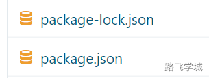

---
tags:
  - java微架构
---
- ~ 开发常见的几种模式

> [!info]- 前端与后端
> 
> 
> **前端**：前端开发主要涉及用户界面和用户体验相关的部分。前端开发者负责设计和实现网页或应用的外观和交互功能。常见的前端技术包括HTML、CSS和JavaScript。前端框架和库，如React、Angular和Vue.js，也被广泛使用，以提高开发效率和代码的可维护性。
> 
> **后端**：后端开发涉及服务器端的逻辑和数据库管理。后端开发者负责处理用户请求、数据存储和业务逻辑实现。常见的后端技术包括编程语言（如Python、Java、Node.js、PHP等）、数据库（如MySQL、PostgreSQL、MongoDB等）以及Web框架（如Django、Spring Boot、Express等）。
> 

> [!info]- 前后端不分离项目
> 
> 
> 在这种开发模式中，**前端**和**后端**代码通常**混合在一起**，通常由同一团队或开发人员负责。典型的实现方式是传统的服务器端渲染（Server-Side Rendering, SSR），即服务器在接收到请求后，生成完整的HTML页面并发送给客户端浏览器。常见的技术栈包括：
> 
> - 后端模板引擎（如JSP、Thymeleaf、EJS等）与后端框架（如Spring MVC、Express等）的结合。
> - 前端代码嵌入在后端项目中，通过后端渲染页面。
> 
> 这种模式的优点是开发和部署相对简单，适用于小型项目或团队规模较小的项目。然而，它也存在一些缺点，例如前后端耦合度高，开发效率低，前端代码复用性差等。
> 

> [!info]- 前后端分离项目
> 
> 
> 在这种开发模式中，**前端**和**后端**开发是**独立进行**的，前端通过API与后端进行数据交互。前端应用通常是一个单独的项目，使用现代前端框架和工具进行开发和构建。后端负责提供RESTful API或GraphQL接口，供前端调用。常见的实现方式包括：
> 
> - 前端使用框架（如React、Angular、Vue.js等）构建单页应用（Single Page Application, SPA）。
> - 后端提供API接口，使用框架（如Express、Django、Spring Boot等）处理业务逻辑和数据存储。
> 
> 这种模式的优点包括：
> 
> - 前后端解耦，开发流程更加灵活和高效。
> - 前端和后端可以独立部署和扩展，提高系统的可维护性和可扩展性。
> - 前端代码复用性和测试性更强。
> 
> 缺点包括需要更多的协调工作和更高的开发复杂度，尤其是在接口设计和版本控制方面。
> 

- ~ 前端Node环境

> [!info]- Node下载地址
> 
> 
> https://nodejs.org/zh-cn/download/prebuilt-binaries
> 

> [!systemd]- 安装部署
> 
> 
> [📎node-v14.21.3-linux-x64.tar.zip](https://www.yuque.com/attachments/yuque/0/2024/zip/830385/1719207548861-8b2a8224-23d5-4852-81e5-eaeec9f86bff.zip)
> 
> ```shell
> tar xf  node-v14.21.3-linux-x64.tar.xz -C /opt/node
> ln -s node-v14.21.3-linux-x64 node
> echo 'export PATH=/opt/node/bin:$PATH' >> /etc/profile
> source /etc/profile
> npm -v
> node -v
> ```
> 

> [!info]- Node常用编译命令
> 
> 
> ```plain
> npm -v
> node -v
> npm cache clean --force
> npm install --registry https://registry.npmmirror.com
> npm config set registry https://registry.npmmirror.com
> npm run < script-name>
> ```


> [!info]- 如何识别一个项目是使用了Node.js
> 
> 
> 在项目的根目录下查找是否存在以下两个文件，如果存在则表明这是使用了Node.js的项目
> 
> 
> 
> package.json  
> 
> package-lock.json
> 

- ~ 前后端分离项目

> [!info]- 进入源码目录
> 
> 
> ```plain
> unzip xzs-mysql-master.zip
> cd xzs-mysql-master/source/vue/xzs-admin/
> ```

> [!install]- 安装依赖
> 
> 
> ```plain
> npm install --unsafe-perm --registry https://registry.npmmirror.com
> ```

> [!test]- 测试启动
> 
> 
> ```plain
> npm run serve -- --host 0.0.0.0
> ```
> 

> [!run]- 编译成静态文件
> 
> 
> ```plain
> npm run build
> ```

> [!run]- 发送前端代码到nginx
> 
> 
> ```plain
> scp -r student admin 10.0.0.7:/code/www/
> ```

> [!run]- 编写Nginx配置文件
> 
> 
> ```plain
> [root@web-7 /code/www]# cat /etc/nginx/conf.d/xzs.conf
> server {
>     listen 80;
>     server_name localhost;
> 
>     location / {
>        root /code/www;
>        index index.html;
>     }
> 
>     location /api/ {
>        proxy_pass  http://localhost:8000;
>     }
> }
> ```

> [!run]- 测试访问
> 
> 
> ```plain
> 10.0.0.7/admin/
> 10.0.0.7/student/
> ```
> 