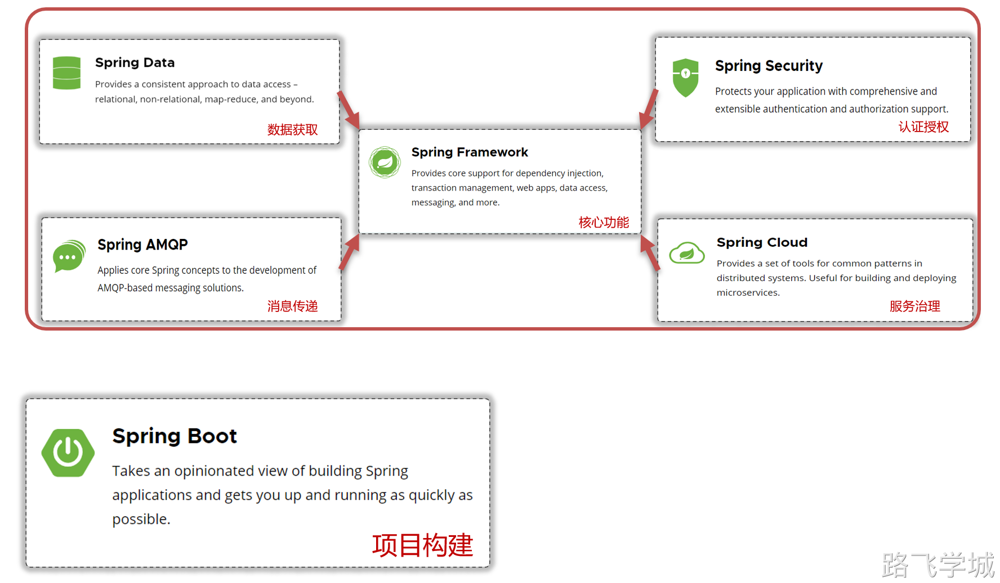

---
tags:
  - java微架构
---

- ~ Spring框架介绍

> [!info]- 什么是SpringBoot框架
> 
> 
> 
> 

> [!info]- 站在运维工程师的角度看什么是SpringBoot
> 
> 
> 从运维工程师的角度来看，Spring Boot 是一个基于 Java 的开源框架，旨在简化新Spring应用的初始搭建以及开发过程。它允许开发者快速创建独立的、生产级别的基于 Spring 的应用程序。以下是一些关键特点，特别从运维的视角来看：
> 
> 1. **简化配置**：Spring Boot 旨在尽可能自动配置Spring应用程序，减少开发和运维人员需要手动配置的工作量。例如，它可以根据类路径下的jar包自动配置Spring框架和第三方库。
> 2. **独立运行**：Spring Boot 应用是独立的，包含内嵌的Web服务器（如Tomcat、Jetty或Undertow），这意味着你可以直接运行应用而无需部署到Web服务器。这简化了部署流程，降低了与服务器配置相关的问题。
> 3. **生产就绪**：Spring Boot 提供了一系列生产级别的特性，如健康检查、度量信息收集、外部配置等，帮助运维人员监控和管理应用。
> 4. **无代码生成和XML配置**：Spring Boot 旨在通过约定大于配置的原则减少配置文件的使用，提高开发效率。这对运维人员而言意味着应用的配置更加直观、易于管理。
> 5. **易于理解的项目结构**：Spring Boot 鼓励使用一种直观且易于理解的项目结构，这使得即使是不熟悉Java编程的运维工程师也能够理解和维护应用程序。
> 6. **强大的社区支持**：由于Spring Boot是Spring框架的一部分，它享有强大的社区支持和丰富的文档资源，对于解决运行时问题非常有帮助。
> 7. **微服务友好**：Spring Boot 非常适合微服务架构，它支持服务的自动注册和发现、配置中心集成等微服务必需的功能。这意味着从运维角度，可以更容易地管理和扩展微服务架构。
> 
> 总的来说，作为运维工程师，你可能不需要深入了解Spring Boot的所有编程细节，但理解其核心特性和优势对于高效管理和运维基于Spring Boot的应用至关重要。
> 

- ~ 如何识别项目是不是基于SpringBoot开发

> [!info]- 查看项目的依赖管理文件
> 
> 1. **查看项目的依赖管理文件**：对于Maven项目，可以查看pom.xml文件；对于Gradle项目，则查看build.gradle文件。如果项目中包含了Spring Boot的依赖，那么这个项目很可能是基于Spring Boot开发的。Spring Boot的依赖通常看起来像这样：
> 
> Maven (pom.xml)中的依赖示例：
> 
> ```plain
> < parent>
>   <groupId>org.springframework.boot</groupId>
>   <artifactId>spring-boot-starter-parent</artifactId>
>   <version>2.x.x.RELEASE</version>
> </parent>
> ```
> 
> 或者包含如下依赖：
> 
> ```plain
> < dependency>
>   <groupId>org.springframework.boot</groupId>
>   <artifactId>spring-boot-starter</artifactId>
> </dependency>
> ```
> 

> [!info]- 检查项目的启动类
> 
> 1. **检查项目的启动类**：Spring Boot项目通常有一个主启动类，该类使用@SpringBootApplication注解。你可以在项目的源代码中查找这个注解。这个类通常还包含public static void main(String[] args)方法，该方法中会调用SpringApplication.run()来启动Spring Boot应用。示例代码如下：
> 
> ```plain
> @SpringBootApplication
> public class Application {
>     public static void main(String[] args) {
>         SpringApplication.run(Application.class, args);
>     }
> }
> ```
> 
> 1. **查看项目的配置文件**：Spring Boot项目通常会有application.properties或application.yml文件，用于配置应用的各种参数。这些文件通常位于src/main/resources目录下。虽然这些配置文件不是Spring Boot专有的，但它们的存在和位置是Spring Boot项目的常见特征。
> 2. **项目的目录结构**：虽然目录结构不能完全证明一个项目是Spring Boot的，但Spring Boot项目通常遵循特定的目录结构，例如，将应用程序的主代码放在src/main/java下，资源文件放在src/main/resources下，这与Spring Boot的推荐做法一致。
> 3. **内置服务器**：Spring Boot项目通常包含内嵌的Web服务器（如Tomcat、Jetty或Undertow），因此不需要单独的Web服务器来运行。如果你发现项目被打包为一个可以直接运行的JAR文件（包含内嵌服务器），这也是一个强烈的指示。
> 
> 通过上述方法，即使没有深入的Java编程能力，也可以较为容易地识别出一个项目是否是基于Spring Boot开发的。
> 


