---
tags:
  - java微架构
---

> [!info]- 软件合集
> 
> 
> 1.后端软件
> 
> [📎jdk-8u172-windows-x64.zip](https://www.yuque.com/attachments/yuque/0/2024/zip/830385/1719190804447-60fb32cb-d412-4530-9d6f-c9d29a5cef0c.zip)
> 
> [📎apache-maven-3.9.6-bin.tar.gz](https://www.yuque.com/attachments/yuque/0/2024/gz/830385/1719190896034-99b53d48-cf52-4644-b6b0-00196545da17.gz)
> 
> 2.前端软件
> 
> [📎VSCodeSetup-x64-1.73.1.zip](https://www.yuque.com/attachments/yuque/0/2024/zip/830385/1719190874056-d1a0ec4d-6b96-4237-9071-1909db10d865.zip)
> 
> [📎node-v16.16.0-x64.zip](https://www.yuque.com/attachments/yuque/0/2024/zip/830385/1719190895020-226f76b4-2f3a-40f0-b118-bd2d5b77c831.zip)
> 

- ~ Windows下Java开发环境搭建部署

> [!install]- 安装JDK环境
> 
> 
> 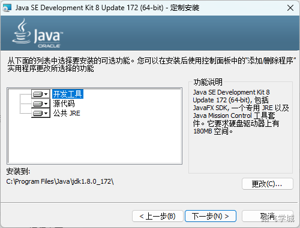
> 
> 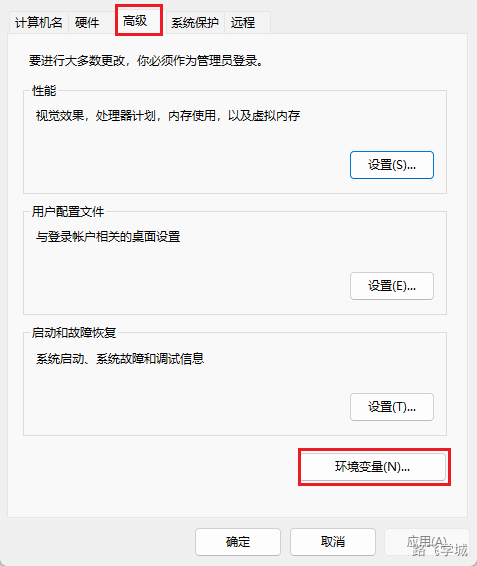
> 
> 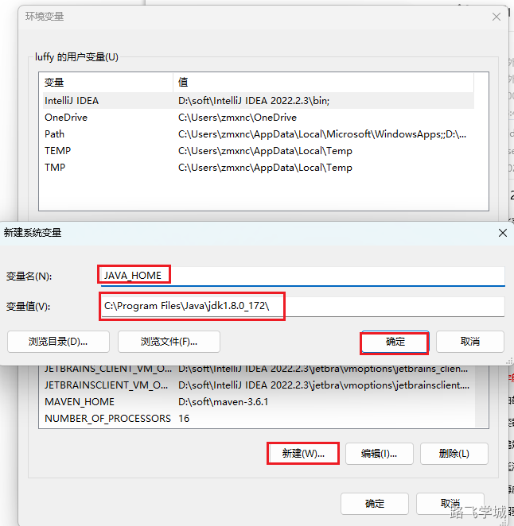
> 
> 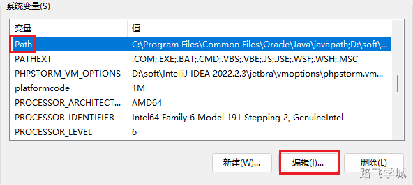
> 
> 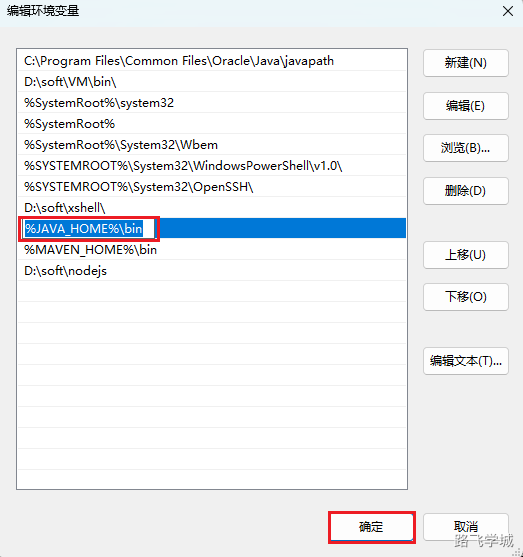
> 
> 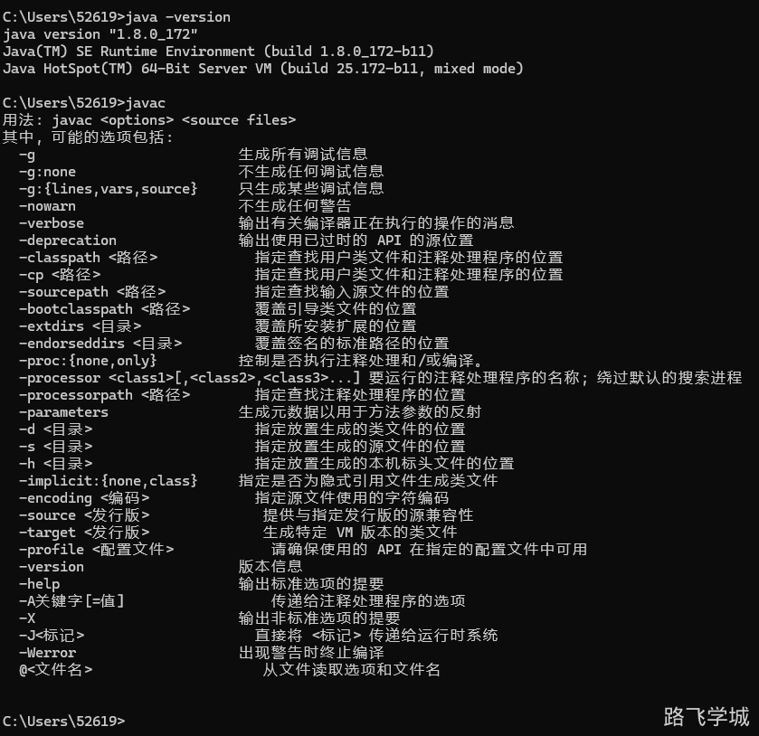
> 

> [!install]- 安装Maven
> 
> 
> 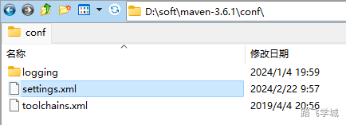
> 
> ```xml
> <localRepository>D:/soft/Repository</localRepository>
>   
>   <mirrors>
>    <mirror>
>       <id>alimaven</id>
>       <name>aliyun maven</name>
>   　　<url>http://maven.aliyun.com/nexus/content/groups/public/</url>
>       <mirrorOf>central</mirrorOf>        
>     </mirror>  
>   </mirrors>
> ```
> 
> 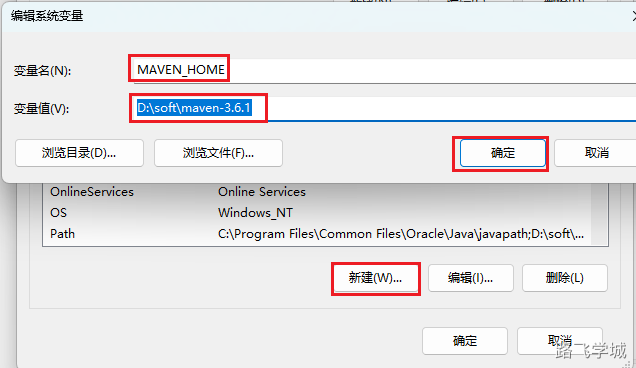
> 
> 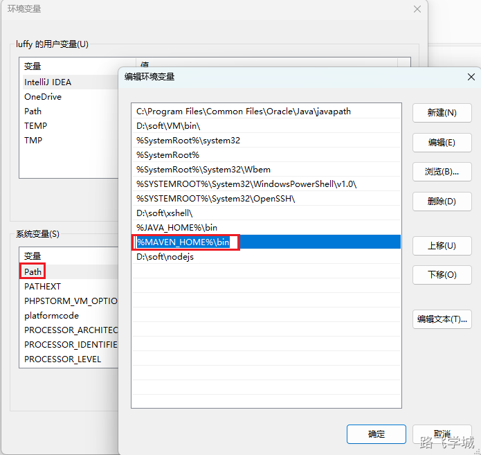
> 
> 
> 
> ```plain
> <mirror>
>     <id>aliyunmaven</id>
>     <mirrorOf>*</mirrorOf>
>     <name>阿里云公共仓库</name>
>     <url>https://maven.aliyun.com/repository/public</url>
> </mirror>
> ```
> 

> [!install]
> 安装IDEA
> 
> 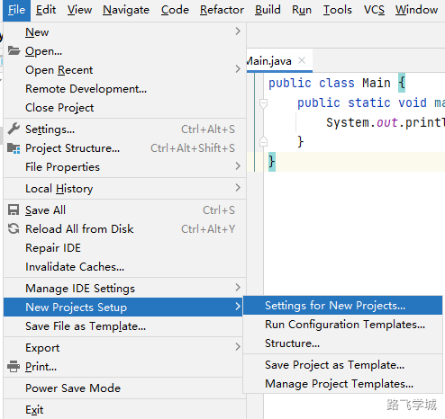
> 
> 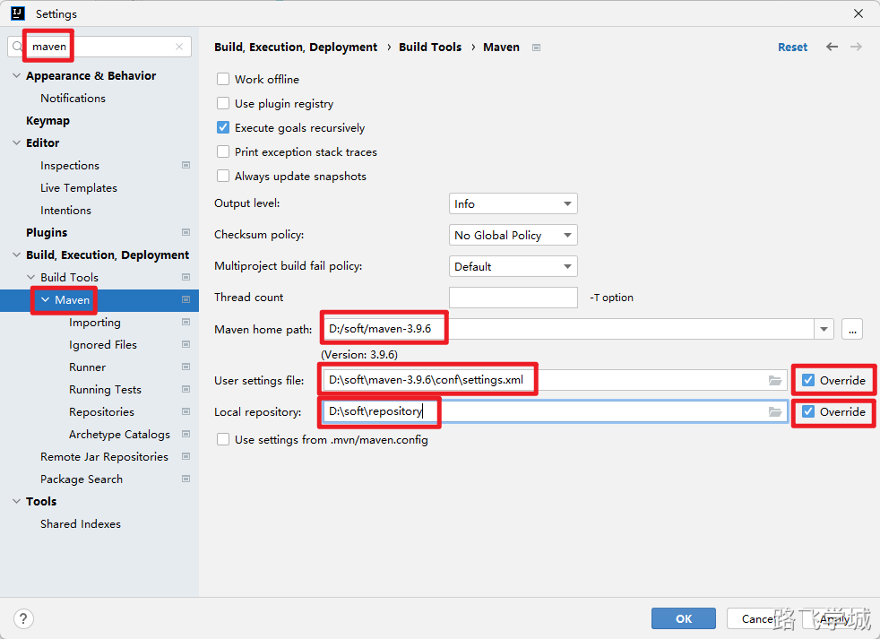
> 

> [!install]
> 安装Node环境
> 
> [📎node-v14.21.3-x64.zip](https://www.yuque.com/attachments/yuque/0/2024/zip/830385/1719296682551-a01f2873-c241-463d-9214-c8e98d3055de.zip)
> 
> 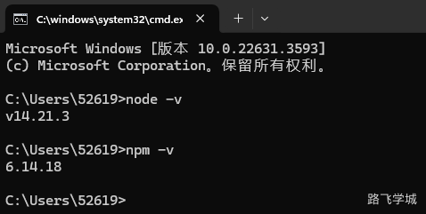
> 

5.


