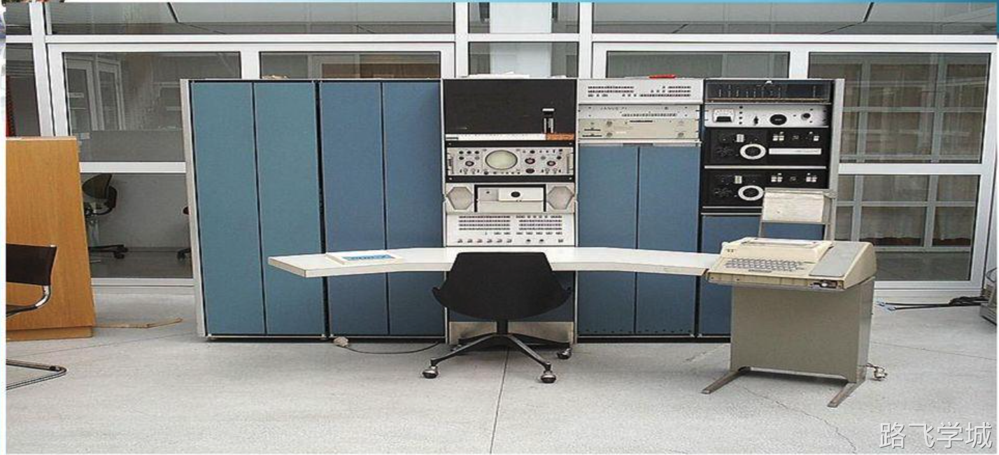
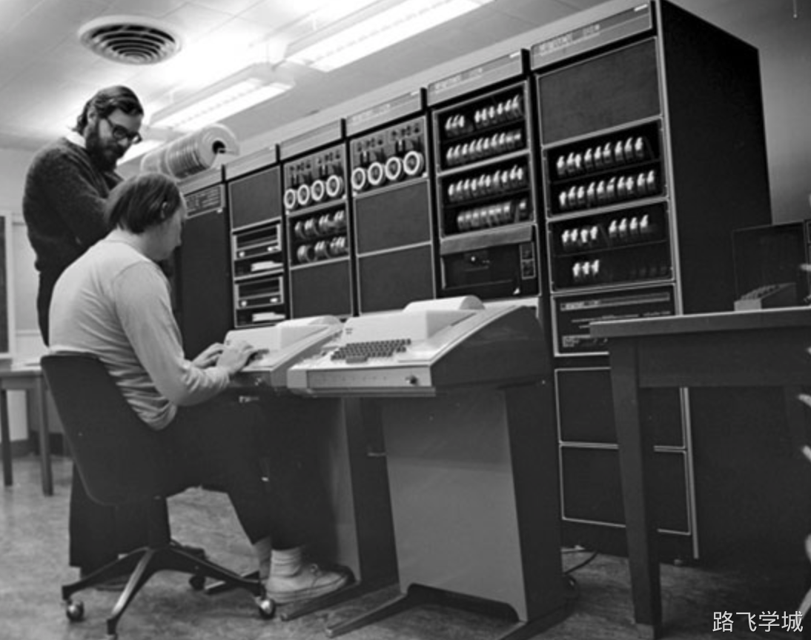
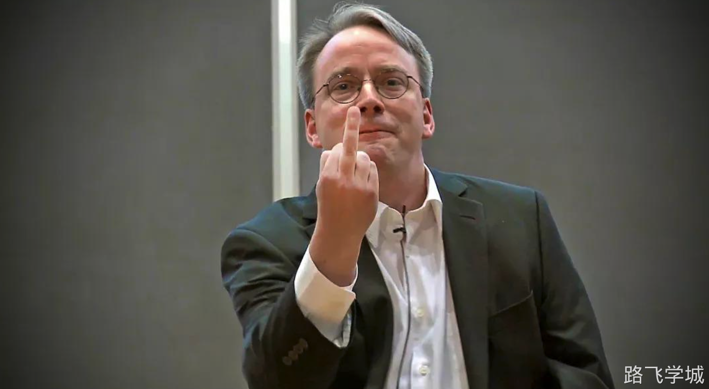
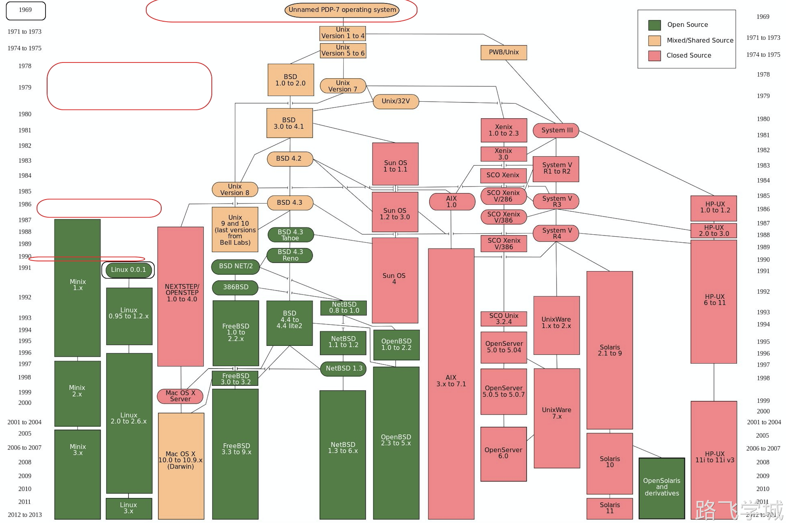
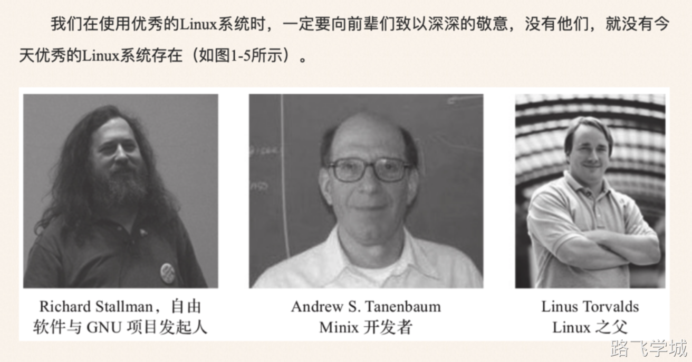

> [!info]- Linux简介
> 
> ```plain
> 1.与Windows不同，Linux是一套开放源代码并且可以自由传播的类Unix操作系统
> 2.Linux系统支持多用户，多任务，多线程和多CPU的操作系统
> 3.现在大家所用的Linux并不是一个人完成的，而是由世界各地成千上万的程序员参与设计开发的
> 4.互联网公司绝大多数都用Linux做为服务器操作系统。
> ```

> [!info]- Linux起源
> 
> 
> 优秀文章推荐：
> 
> ```plain
> Unix历史
> https://coolshell.cn/articles/2322.html
> https://mp.weixin.qq.com/s/NMEBNoF-gRpVPZQTNSBEUQ
> 
> Linux起源
> https://mp.weixin.qq.com/s/2d35XHInOUi-3IFd-Me8yQ
> ```
> 

> [!info]- Unix的历史
> 
> 
> ```plain
> 再说Linux之前首先需要了解Unix的历史。Unix系统于1969年在AT&T的贝尔实验室诞生，20世纪70年代逐步盛行。
> 起初麻省理工大学希望对当时的「兼容分时系统」CTSS进行升级，做一套面向大众使用的操作系统MULTICS，他们希望可以同时有很多人可以连接使用，贝尔实验室也参与了这个宏伟的大项目。
> 
> 结果什么功能都想往上加，结果这个系统越来越复杂，最后变成了一个四不像。后来因为进展缓慢加上资金紧张，贝尔实验室还是选择了退出项目组。
> 贝尔实验室就这样退出了项目组，当时实验室里有六七个研究员参加了MULTICS项目，其中就包括了 肯·汤普森 和 丹尼斯·里奇。
> 
> 肯·汤普森参加项目的时候基于MULTICS系统开发了[太空旅行]的游戏，但是因为贝尔实验室退出了MULTICS项目，那也就意味着 肯·汤普森 再也没机会玩他的星战游戏了，而且实验室也不愿意给他预算用来购买硬件。
> 
> 面对这个情景，肯·汤普森的创造本性就显露了出来，他找来了一台废弃很久的老式PDP-7计算机，这款机器是1964年生产的，距离当时已经过了5年，早就过时了，而且内存只有16KB。但是...肯·汤普森在这个过时的计算机上重写了个[太空旅行]游戏。
> 跟今天小巧的电脑不一样，PDP-7十分巨大，上面高耸着磁盘驱动器，里面是高速运转的磁盘，一不小心飞出来，可以把人瞬间KO。汤普森想这也太危险了，于是他写了个磁盘调度算法；为了测试这个算法，他还需要写一个批量写数据的程序。
> 
> 这个程序包含三个部分：
> a）用来创建代码的编辑器；
> b）将代码转化为机器语言的汇编器；
> c）再加上内核的外层。
> 
> 要是一周写一个，三周就能写完。一个操作系统的雏形基本就实现了。
> 巧的是，这个时候汤普森的老婆正好休假，要带着儿子去加州看公婆，来回正好三周。
> 
> 1969年末，第一版有明确UNIX特征的系统已可以运行，UNIX正式诞生。
> 
> 另外，大家熟知的C语言，也是这个时期由丹尼斯·里奇发明的，原因是因为B语言不好用。
> ```
> 
> 
> 
> 
> 

> [!info]- Unix操作系统的革命
> 
> 
> ```plain
> 20世纪70年代中后期，由于各厂商及商业公司开发的Unix及内置软件都是针对自己公司的特定硬件而进行的，因此在其他公司的硬件上基本上无法直接运行，而且当时没有人对开发基于x86架构CPU的系统感兴趣。另外，20世纪70年代末，Unix又面临了突如其来的被AT&T回收版权的重大问题，特别是要求禁止对学生群体提供Unix系统源代码，这样的问题一度引起了当时Unx业界的恐慌，也因此产生了种种商业纠纷。
> 
> 由于Unix面临版权回收问题，以及代码不开源等问题，这直接或间接地导致了新的类Unix系统的诞生以及自由软件运动的建立和发展。
> 
> 1984年，Richard Stallman发起了开发自由软件的运动，并成立了自由软件基金会(Free Software Foundation, FSF) 和GNU项目。当时发起这个自由软件运动和创建GNU项目的目的其实很简单，就是想开发一个类似于Unix系统、并且是自由软件的完整操作系统，也就是要解决
> 20世纪70年代末Unix版权问题以及软件源代码面临闭源的问题，这个系统称为GNU操作系统。
> 
> 也是在20世纪80年代初期，同样是由于之前的Unix系统版权和源代码限制等问题，使得当时大学里教学Unix系统的束缚很大。因此，当时的一-个大学的教授，名为Andrew Tanenbaum(谭邦宁)，于1984年(大概)开始着手编写新的用于教学的Unix系统，目标是开发新的类Unix系统应尽可能地与原有的Unix系统兼容，并且可以运行于x86 PC平台，这个系统的名字为Minix。
> 
> 不过，由于谭邦宁开发这个Minix系统的目的只是用于教学，因此，Minix 系统的功能无法满足商用的需求，但是Minix的产生对于Linux的诞生又是至关重要的一个关键成因，且看下文。
> ```

> [!info]- Linux系统的诞生
> 
> 
> Linux系统的诞生开始于芬兰赫尔辛基大学的一位计算机系的学生，其名字为Linus TorvaldS。在大学期间，他接触到了学校的Unix系统，但是，当时的Unix系统仅为一台主机，且对应了多个终端，使用时存在操作等待时间很长等一些体验极差的问题，无法满足年轻的Linus Torvalds的使用需求。因此他就萌生了自己开发一个Unix的想法，不久之后，他就找到了前文提到的谭邦宁教授开发的用于教学的Minix操作系统，与我们现在一样，他将Minix安装到了他的I386个人计算机上。此后，Torvalds又 开始陆续阅读了Minix系统的源代码，从Minix系统中学到了很多重要的系统核心程序设计理念和设计思想，从而逐步开始了Linux系统雏形的设计和开发。
> 
> 
> 
> 
> 

> [!info]- Linux系统的发展历程
> 
> 
> 
> 

> [!info]- Linux发展历程重要的人物
> 
> 
> 
> 

> [!info]- Linux系统组成
> 
> 
> ```plain
> Linux操作系统的核心为Linus Torvalds开发的Kernel, Linux内核之上的组件可分为如下几部分:一部分是GNU组件，如Emacs,gcc,bash,gawk等;
> 另-些重要组成部分则来自加利福尼亚大学Berkeley分校的BSD Unix项目和麻省理工学院的X Windows系统项目，以及在这之后成千上万的程序员开发的应用程序等。
> 正是基于Linux内核与GNU项目、BSD Unix以及MIT的X11 (X Windows)的结合，才使得整个Linux操作系统得以很快形成，并得到了发展，进而组成了今天优秀的Linux系统。
> Linux操作系统 = Linux内核 + GNU软件及系统软件 + 必要的应用程序
> ```
> 
> | **Linux内核**         | **GNU组件（gcc,bash)**             | **其他必要应用程序**   |
> | --------------------- | ---------------------------------- | ---------------------- |
> | 开发者 Linus Torvalds | 项目发起人Richard Stallman(斯托曼) | 全世界成千上万的程序员 |
> 

> [!info]- 如何选择Linux的发行版
> 
> 
> ```plain
> 国内的互联网公司来说用的最多的是两个系列：
> Redhat --> CentOS
> Debian --> Ubuntu
> ```
> 

> [!info]- 系统时间表
> 
> 
> ```plain
> 1)1984年，Andrew S.Tanenbaum开发了用于教学的Unix系统，命名为MINIX。
> 2)1989年，Andrew S.Tanenbaum将MINIX系统运行于x86的PC计算机平台。
> 3)1990年，芬兰赫尔辛基大学学生Linus Torvalds首次接触MINIX系统。
> 4)1991年，Linus Torvalds开始在MINIX上编写各种驱动程序等操作系统内核组件。
> 5)1991年底，Linus Torvalds 公开了Linux内核源码0.02版（http://www.kernel.org），注意，这里公开的Linux内核源码并不是我们现在使用的Linux系统的全部，而仅仅是Linux内核kernel部分的代码。
> 6) 1993年，Linux 1.0版发行，Linux转向GPL版权协议。
> 7) 1994年，Linux的第一个商业发行版Slackware问世。
> 8) 1996年，美国国家标准技术局的计算机系统实验室确认Linux 版本1.2.13 （由Open Linux公司打包）符合POSIX标准。
> 9) 1999年，Linux的简体中文发行版问世。
> 10) 2000年后，Linux系统日趋成熟，涌现大量基于Linux服务器平台的应用，并广泛应用于基于ARM技术的嵌入式系统中。
> ```
> 
