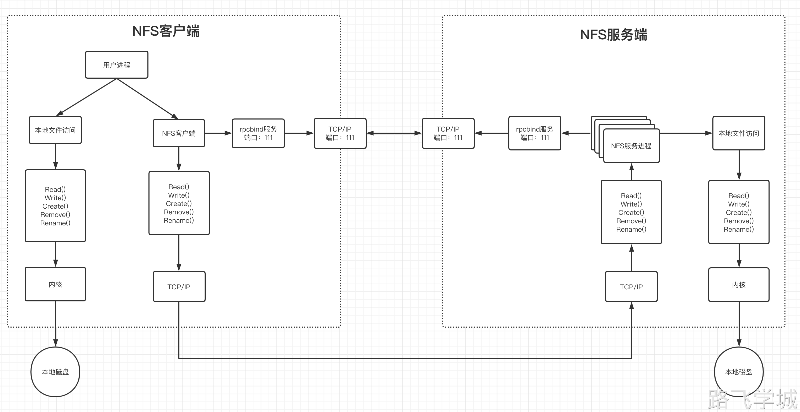

---
tags:
  - NFS
---

> [!info]- 什么是共享存储
> 
> 
>  一句话说就是多台服务器的数据保存在同一个存储服务器上。这样无论用户请求在哪一台服务器上看到的数据都是一样的。
> 

> [!info]- 什么是NFS
> 
> 
> NFS Network File System 网络文件系统。 
> NFS 主要功能是通过局域网络让不同的主机系统之间可以共享文件或目录
> NFS 系统和 Windows 网络共享、网络驱动器类似, 只不过 windows用于局域网, NF 用于企业集群架构中, 如果是大型网站, 会用到更复杂的分布式文件系统 glusterfs，Ceph等
> 

> [!info]- NFS应用场景
> 
> 
> 多台web服务器的图片和视频数据都保存在NFS服务器上
> 
> 多台服务器的备份数据都保存在NFS服务器上
> 

> [!info]- NFS通讯原理
> 
> 
> 1.服务端启动后将自己的端口信息注册到rpcbind
> 
> 2.NFS客户端通过TCP/IP的方式连接NFS服务端的rpcbind并获得真实的端口信息
> 
> 3.NFS客户端获得真实的端口后，将自己需要的操作函数通过网络发送给NFS服务端对应的端口
> 
> 4.NFS服务端接收到请求后，由rpc.nfsd进程判断NFS客户端是否拥有连接权限
> 
> 5.NFS服务端的rpc.mount进程判断客户端是否有对应的操作权限
> 
> 6.最后NFS服务端会将对应请求的函数转换为本地能识别的命令，传递至内核，由内核驱动硬件
> 
> 注意: rpc 是一个远程过程调用，那么使用 nfs 必须有 rpc 服务
> 
> 
> 