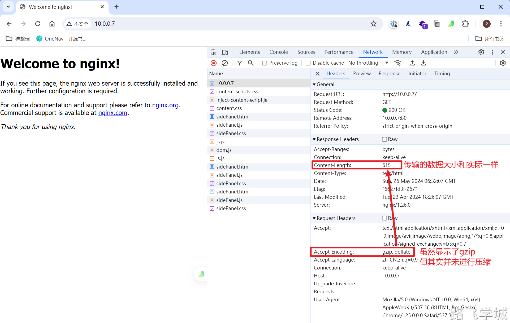
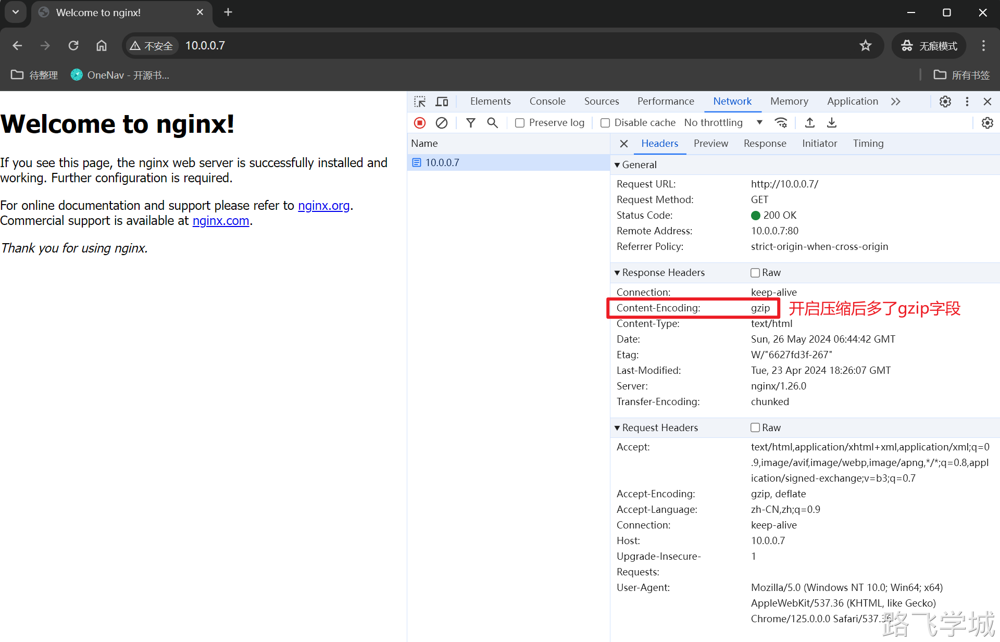

---
tags:
  - Nginx/模块
---
>官方文档

https://nginx.org/en/docs/http/ngx_http_gzip_module.html

>指令语法

Syntax:	**gzip on | off**;

Default:	gzip off;

Context:	http, server, location, if in location

Syntax:	**gzip_buffers** number size;

Default:	gzip_buffers 32 4k|16 8k;

Context:	http, server, location

Syntax:	**gzip_comp_level** level;

Default:	gzip_comp_level 1;

Context:	http, server, location

Syntax:	**gzip_disable** regex ...;

Default:	—

Context:	http, server, location

This directive appeared in version 0.6.23.

Syntax:	**gzip_http_version** 1.0 | 1.1;

Default:	gzip_http_version 1.1;

Context:	http, server, location

Syntax:	**gzip_min_length** length;

Default:	gzip_min_length 20;

Context:	http, server, location

Syntax:	**gzip_proxied** off | expired | no-cache | no-store | private | no_last_modified | no_etag | auth | any ...;

Default:	gzip_proxied off;

Context:	http, server, location

Syntax:	**gzip_types** mime-type ...;

Default:	gzip_types text/html;

Context:	http, server, location

Syntax:	**gzip_vary** on | off;

Default:	gzip_vary off;

Context:	http, server, location

>指令解释

**gzip on;**   启用或禁用 gzip 压缩。

**gzip_min_length 1000;**   响应体超过1000字节时压缩。

**gzip_types text/plain text/css application/json;**  压缩文本、CSS 和 JSON 类型的数据

**gzip_comp_level 6;**  设置压缩级别为6，数值越大压缩比越高，但处理时间也越长。

**gzip_buffers 16 8k;**  使用16个8kB的缓冲区进行压缩。

**gzip_proxied any;**    无论请求是直接的还是经过代理的，都进行压缩。

**gzip_disable "MSIE [1-6]\.";**   对 IE6 及以下版本不压缩。

>参考配置

http {
    gzip on;
    gzip_min_length 1000;
    gzip_types text/plain text/css application/json application/javascript;
    gzip_comp_level 6;
    gzip_buffers 16 8k;
    gzip_proxied any;
    gzip_disable "MSIE [1-6]\.";

​    server {
​        listen 80;
​        server_name example.com;
​        location / {
​            root /usr/share/nginx/html;
​            index index.html index.htm;
​        }
​    }
}

>实验测试

>未开启压缩时

Linux上使用curl测试

[root@web-7 ~]# curl -I -H "Accept-Encoding: gzip, deflate" http://10.0.0.7

HTTP/1.1 200 OK

Server: nginx/1.26.0

Date: Sun, 26 May 2024 06:34:45 GMT

Content-Type: text/html

Content-Length: 615

Last-Modified: Tue, 23 Apr 2024 18:26:07 GMT

Connection: keep-alive

ETag: "6627fd3f-267"

Accept-Ranges: bytes

页面访问

>开启压缩后

Linux上使用curl测试

[root@web-7 /usr/share/nginx/html]# curl -I -H "Accept-Encoding: gzip, deflate" http://10.0.0.7

HTTP/1.1 200 OK

Server: nginx/1.26.0

Date: Sun, 26 May 2024 06:36:26 GMT

Content-Type: text/html

Last-Modified: Tue, 23 Apr 2024 18:26:07 GMT

Connection: keep-alive

ETag: W/"6627fd3f-267"

Content-Encoding: gzip

页面访问

>为什么对低版本的浏览器禁用压缩？

对于旧版的 Internet Explorer 浏览器（尤其是6及以下版本）禁用 gzip 压缩的主要原因是这些浏览器在处理压缩内容时存在兼容性问题和已知的 bug。这些问题可能导致页面内容在浏览器中显示不正确或根本不显示，给用户体验带来负面影响。以下是一些具体的原因：

1. **压缩缺陷**: 旧版 IE 浏览器（特别是 IE6）存在一个缺陷，即当这些浏览器从代理服务器接收经过 gzip 压缩的内容时，可能无法正确解压缩这些内容。这可能导致页面无法加载或显示错误。
2. **Vary 响应头问题**: IE6 在处理包含 "Vary" 响应头的 HTTP 响应时存在问题。如果服务器响应中包含了如 **Vary: Accept-Encoding** 的头部（这在使用内容编码时是常见的做法），IE6 可能不会缓存这些响应，导致每次请求都从服务器重新加载内容，影响效率和性能。
3. **缓存和性能问题**: 由于上述的缓存处理问题，即使内容已经通过 gzip 压缩减少了传输的数据量，IE6 用户的实际体验可能会因为频繁的完整页面加载而受到影响。

因此，为了确保网站对所有用户提供一致的访问体验，网站开发者和管理员通常会在服务器配置中特别禁用对旧版 IE 浏览器的内容压缩。这样可以避免兼容性问题，确保旧版浏览器用户能够正常浏览网页。

测试访问

[root@web-7 /code/www]# curl -H "Accept-Encoding: gzip" -A "MSIE 6." -I 10.0.0.7/

HTTP/1.1 200 OK

Server: nginx/1.26.0

Date: Tue, 28 May 2024 06:53:38 GMT

Content-Type: text/html

Content-Length: 407425

Last-Modified: Tue, 28 May 2024 06:41:45 GMT

Connection: keep-alive

ETag: "66557ca9-63781"

Accept-Ranges: bytes