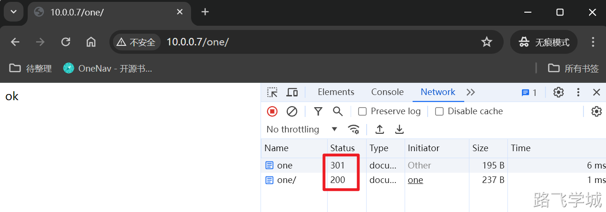

---
tags:
  - Nginx/模块
---

- ~ 1.模块介绍

https://nginx.org/en/docs/http/ngx_http_core_module.html

- ~ 2.重要指令

```shell
Syntax:	http { ... }

Default:	—

Context:	main

\---------------------------------------------

Syntax:	 **listen address**[:port] [default_server] [ssl] 

​                 **listen port** [default_server] [ssl] 

​                 **listen unix**:path [default_server] [ssl]

Default:	listen *:80 | *:8000;

Context:	server

\---------------------------------------------

Syntax:	**server_name name** ...;

Default:	

server_name "";

Context:	server

\---------------------------------------------

Syntax:	**location** [ = | ~ | ~* | ^~ ] uri { ... }

location @name { ... }

Default:	—

Context:	server, location

\---------------------------------------------

Syntax:	**root** path;

Default:	

root html;

Context:	http, server, location, if in location
```

- ~ 3.listen指令

监听IP+端口

listen 127.0.0.1:8000;
listen 127.0.0.1;
listen 8000;
listen *:8000;
listen localhost:8000;

监听sock

listen unix:/var/run/nginx.sock;

- ~ 4.server_name指令

匹配多个域名

server {
    server_name example.com www.example.com;
}

通配符匹配域名

server {
    server_name example.com *.example.com www.example.*;
}

合并域名

server {
    server_name .example.com;
}

正则表达式域名

server {
    server_name www.example.com ~^www\d+\.example\.com$;
}

禁止直接使用IP地址访问

server {

​    listen 80 default_server;

​    server_name _;

​    return 444;

}

- ~ 5.location指令

> location指令介绍

Nginx 的 **location** 指令属于 **ngx_http_core_module** 模块。这个模块是 Nginx 的核心模块之一。

> location语法介绍

http://nginx.org/en/docs/http/ngx_http_core_module.html#location

Syntax:	location [ = | ~ | ~* | ^~ ] uri { ... }

location @name { ... }

Default:	—

Context:	server, location

> location举例

URL与URI

http://nginx.org   /en/docs/http/ngx_http_core_module.html#location

URL                      URI


http://www.abccity.com  /python/index.html

server_name		         location

鱼塘					 钓鱼


server_name 鱼塘;

location /草鱼 {

   切;

   蒸;

   红烧;

}


http://老张鱼塘/草鱼.html

http://鱼塘/鲤鱼.html

http://鱼塘/草鱼.html

> location语法优先级

| 匹配符 | 匹配规则                     | 优先级 |

| ------ | ---------------------------- | ------ |

| =      | 精确匹配                           | 1      |

| ^~     | 以某个字符串开头             | 2      |

| ~      | 区分大小写的正则匹配         | 3      |

| ~*     | 不区分大小写的正则匹配       | 4      |

| !~     | 区分大小写不匹配的正则       | 5      |

| !~*    | 不区分大小写不匹配的正则     | 6      |

| /      | 通用匹配，任何请求都会匹配到 | 7      |

> location实验

```shell
cat >/etc/nginx/conf.d/01-www.conf << 'EOF'
server {
    listen       80;
    server_name  www.abc.com;
    root   /usr/share/nginx/html/www;
	
    location / {
       return 200  "location / \n";
    }
	
    location = / {
        return 200 "location = \n";
    }

​    location /documents {
​        return 200 "location /documents \n";
​    }

​    location /documents/ {
​        return 200 "location /documents/ \n";
​    }
​	
​    location ^~ /images/ {
​        return 200 "location ^~ /images/ \n";
​    
​    }
​	
​    location ~* \.(gif|jpg|jpeg)$ {
​        return 200 "location ~* \.(gif|jpg|jpeg) \n";
​    }
​    access_log off;
}
EOF
```

> location末尾有/和没有/的区别

在 Nginx 的 **location** 配置中，路径的结尾是否有斜杠（**/**）对匹配行为有影响

1. **结尾有斜杠（****/****）**：

- - 当 **location** 匹配规则以斜杠结尾时，通常意味着它指定了一个目录。Nginx 会匹配以此目录为前缀的所有请求路径，这包括目录本身和其下的任何子目录或文件。例如，**location /images/** 会匹配 **/images/**、**/images/photo.jpg**、**/images/subdir/** 等。
  - 这种匹配是递归的，即它匹配所有在指定目录下的路径。

1. **结尾没有斜杠**：

- - 当 **location** 匹配规则没有以斜杠结尾时，它将匹配以该路径为前缀的任何请求。这意味着它不仅匹配目录本身，还匹配以该路径开头的任何扩展路径。例如，**location /image** 将会匹配 **/image**、**/image123** 和 **/images**。
  - 这种匹配不是基于目录的，而是基于前缀的。它不关心路径的结构是否符合目录或文件的逻辑，只要求请求的 URI 以指定的字符串开始。

> 实际应用：

- 如果你的目的是严格匹配一个目录及其子目录和文件，建议在 **location** 规则中加上尾部斜杠。
- 如果你想要匹配以某个字符串开头的所有路径，不论其后是否还有其他字符，就不要在 **location** 规则中加斜杠。

实验：

```shell
[root@web-7 /etc/nginx/conf.d]# cat default.conf

server {

​    listen       80;

​    server_name  www.abc.com;

​    root   /usr/share/nginx/html/www;


​    location /one {

​      root /code/www/;

​      index index.html;

​    }

}

```


[root@web-7 /etc/nginx]# curl 10.0.0.7/one/

ok

[root@web-7 /etc/nginx]# curl 10.0.0.7/one

<html>

<head><title>301 Moved Permanently</title></head>

<body>

<center><h1>301 Moved Permanently</h1></center>

<hr><center>nginx/1.26.0</center>

</body>

</html>


[root@web-7 /etc/nginx/conf.d]# curl -IL 10.0.0.7/one

HTTP/1.1 301 Moved Permanently

Server: nginx/1.26.0

Date: Tue, 28 May 2024 06:08:23 GMT

Content-Type: text/html

Content-Length: 169

Location: http://10.0.0.7/one/

Connection: keep-alive


HTTP/1.1 200 OK

Server: nginx/1.26.0

Date: Tue, 28 May 2024 06:08:23 GMT

Content-Type: text/html

Content-Length: 4

Last-Modified: Tue, 28 May 2024 06:05:07 GMT

Connection: keep-alive

ETag: "66557413-4"

Accept-Ranges: bytes



结论：

这个现象是典型的 Nginx 对于目录访问的处理行为。当你尝试访问一个目录（在这种情况下是 **/one**），但 URL 不以斜杠（**/**）结尾时，Nginx 会自动向客户端发送一个 301 重定向响应，以将 URL 重定向到以斜杠结尾的 URL（即 **/one/**）。这种行为的主要原因包括：

1. **目录斜杠规范**：这是一个 HTTP 标准实践，以确保目录 URL 的标准化。这样做的好处包括能够正确处理相对 URL 路径。例如，如果服务器返回一个相对链接 **index.html**，浏览器会基于当前 URL 来解析它。如果当前 URL 是 **/one**（没有斜杠），浏览器会将其解析为 **/index.html**，这是不正确的。如果 URL 是 **/one/**，则会正确解析为 **/one/index.html**。
2. **Nginx 配置**：在你的配置中，**location /one** 块设置了特定的根目录和索引文件。当你访问 **/one** 时，Nginx 查找的是 **/code/www/one** 目录下的 **index.html** 文件。由于 **/one** 实际上是一个目录，Nginx 将会自动添加斜杠并重定向到 **/one/** 来正确地处理请求。

这种自动添加斜杠并执行重定向的行为是 Nginx 默认的行为，用以确保目录访问的统一性和资源的正确访问。如果你想避免这种自动重定向，一个常见的方法是通过在配置文件中添加斜杠，直接在 **location** 块中指定目录路径，例如使用 **location /one/** 而不是 **location /one**。这样，访问 **/one** 就不会被视为对目录的请求，从而不会触发 301 重定向。

添加/后的实验效果：
此时访问10.0.0.7/one会被认为是访问的one文件，只有访问10.0.0.7/one/才会被认为访问的是one目录

```shell
[root@web-7 /etc/nginx/conf.d]# cat default.conf

server {

​    listen       80;

​    server_name  www.abc.com;

​    root   /usr/share/nginx/html/www;


​    location /one/ {

​      root /code/www/;

​      index index.html;

​    }

}
```


[root@web-7 /etc/nginx/conf.d]# curl 10.0.0.7/one

<html>

<head><title>404 Not Found</title></head>

<body>

<center><h1>404 Not Found</h1></center>

<hr><center>nginx/1.26.0</center>

</body>

</html>


[root@web-7 /etc/nginx/conf.d]# curl 10.0.0.7/one/

ok

[root@web-7 /etc/nginx/conf.d]#

> location小结

1.location可以写多个，从上往下依次匹配

2.location匹配完一个就不再匹配其他的location

3.如果有多个location，应该把匹配范围最大的放最下面

4.如果所有的location都匹配不上，最后会匹配location /

5.如果location匹配末尾没有/，访问地址最后也没有/，nginx会尝试以目录形式访问，会自动发送客户端301跳转补全最后/

