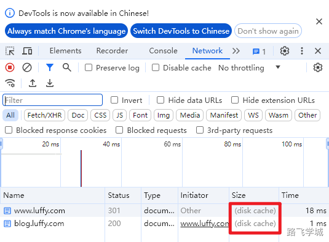

---
tags:
  - Nginx/模块
---


- ~ 1.模块介绍

**ngx_http_rewrite_module** 模块提供了几个重要的指令，用于控制 URI 的重写和重定向，包括 **rewrite**、**return** 和 **set** 等。

**rewrite** 指令通常用于根据正则表达式匹配并修改 URI。

- ~ 2.重要指令

```shell
break				#中断配置

if					#请求判断

set					#设置变量

return				#返回状态或URL

rewrite				#对用户请求的URL或URI进行重写

```
- ~ 3.跳转情景

不同域名之间跳转：

http://www.360buy.com/ 301

http://www.jd.com/     302

https://www.jd.com/    200

同域名的http跳转到https

http://www.abccity.com/  301

https://www.abccity.com/ 200

http跳转https

http://www.abccity.com/  80

https://www.abccity.com/ 443

不同终端看到的页面不一样:

https://www.abccity.com/ 301

https://m.abccity.com/   200

- ~ 4.if 指令

> 4.1 使用场景

if指令可以根据Nginx内置的变量来做判断，以下是Nginx常用内置变量：

$remote_addr

$remote_user 

$time_local

$request

$status 

$body_bytes_sent

$http_referer

$http_user_agent

$http_x_forwarded_for

> 4.2 使用位置

if可以配置在server或location中。

> 4.3 语法格式

if (内置变量 匹配条件 匹配的值) {

​    执行的动作;

}

> 4.4 匹配规则
```shell

=				#比较变量和字符串是否相等，相等则为true，不相等则为false

!=				#比较变量和字符串是否不相等，不相等则为true，不相等则为false


~				#区分大小写的正则匹配，匹配上则为true，不匹配则为false

!~				#区分大小写的正则匹配，不匹配则为true，匹配则为false


~*				#不区分大小写的正则匹配，匹配上则为true，不匹配则为false

!~*				#不区分大小写的正则匹配，不匹配则为true，匹配则为false
```

> 4.5 实验配置 

```shell
cat >/etc/nginx/conf.d/if.conf << 'EOF'

server {

​    listen       80;

​    server_name  localhost;


​    location /mall {

​        \# 判断用户IP

​        if ($remote_addr = 10.0.0.8){

​           return 555 "nonono! \n";

​        }


​        \# 判断请求方法

​        if ($request_method != GET){

​           return 444 "method is not GET \n";

​        }


​        \# 判断用户浏览器类型 精确匹配

​        if ($http_user_agent = iphone) {

​           return 200 "agent is iphone \n";

​        }


​        \# 判断用户浏览器类型 区分大小写

​        if ($http_user_agent ~ Android) {

​           return 200 "agent is Android \n";

​        }


​        \# 判断用户浏览器类型 不区分大小写

​        if ($http_user_agent ~* Chrome) {

​           return 200 "agent is Chrome \n";

​        }


​        \# 判断用户浏览器类型 不区分大小写

​        if ($http_user_agent ~* IE){

​           return 444 "get out! \n";

​        }

 

​         return 200 "PC Chrome! \n";

​    }


​    location / {

​       return 200 "location / \n";

​    }

}
EOF
```

- ~ 5.return 指令

> 5.1 指令作用

return的作用是当匹配上之后直接返回响应状态码或者重写URL或者返回状态码的同时显示文本。

return可以跳转到替他的域名

return后的指令不会在执行。

> 5.2 实验配置

```shell
cat >/etc/nginx/conf.d/if.conf << 'EOF'
server {
    listen       80;
    server_name  localhost;
    root   /usr/share/nginx/html/www;
    
    \#如果不是GET则输出
    if ($request_method != GET){
       return 200 "method is not GET \n";
    }

​    \#如果是Edg浏览器，直接跳转到chrome下载地址
​    if ($http_user_agent ~* Edg){
​       return 301 https://www.google.cn/chrome/index.html;
​    }

​    location /mall {
​        \#客户端类型完全匹配iphone
​        if ($http_user_agent = iphone) {
​           return 200 "agent is iphone \n";
​        }
​        
​        \#客户端类型区分大小写匹配
​        if ($http_user_agent ~* Android) {
​           return 200 "agent is Android \n";
​        }
​        
​        \#客户端类型不区分大小写匹配
​        if ($http_user_agent ~* Chrome) {
​           return 200 "agent is Chrome \n";
​        }

​        return 200 "PC \n";
​    }

​    location / {
​        return 200 "PC \n";
​    }
}
EOF
```

- ~ 6.set 指令

> 6.1 官方地址

https://nginx.org/en/docs/http/ngx_http_rewrite_module.html#set

> 6.2 语法格式

set $variable value;

set 变量名 值

> 6.3 实验配置

```shell
server {
    listen       80;
    server_name  localhost;
	
    \#如果是Edg浏览器，直接跳转到chrome下载地址
	set $ikun_agent $http_user_agent;
	
    if ($ikun_agent ~* Edg){
       return 301 https://www.google.cn/chrome/index.html;
    }
}
EOF
```

- ~ 7.break 指令

> 7.1 官网地址

https://nginx.org/en/docs/http/ngx_http_rewrite_module.html#break

> 7.2 实验配置

```shell
server {
    listen       80;
    server_name  localhost;
	
	set $name kun;
	break;
	set $name jian;
	return 200 "no! \n";
	
	location / {
	   return 200 "ok! \n"
	}
}
```

- ~ 8.rewrite指令--重点掌握

> 8.1 官方文档

https://nginx.org/en/docs/http/ngx_http_rewrite_module.html#rewrite

> 8.2 指令说明

1）rewrite指令可以基于用户请求的RUI通过正则表达式的匹配来进行改写。

2）rewrite指令可以存在多条，并且按照次序依次执行

3）rewrite指令可以根据flag标志符对指令进一步处理

4）如果替换字符串以"http://"、"https://"或"$scheme"开头，则处理将停止，并将重定向返回到客户端。

> 8.3 语法格式

Syntax:	rewrite regex replacement [flag];

Default:	—

Context:	server, location, if


rewrite指令可以作用于server, location, if

rewrite regex replacement [flag];

rewrite 匹配规则 重写指令 [标志符];

> 8.4 标识符

permanent	返回301永久重定向，浏览器地址会显示跳转后的URL地址，浏览器会缓存DNS记录

redirect	        返回302临时重定向，浏览器地址会显示跳转后的URL地址，浏览器不会缓存DNS记录


last	       浏览器显示的还是原来的URL，本条规则匹配完成后，继续向下匹配新的location URI规则

break      浏览器显示的还是原来的URL，本条规则匹配完成即终止，不再匹配后面的任何规则


使用场景区分：

使用redirect和permanent参数，浏览器会显示跳转后的URL，服务端将改写后的URL返回给客户端，由客户端重新发起新的请求。

使用last和break，浏览器显示的还是原来的URL，由服务器内部完成跳转。

> 8.5 实验-permanent 301 永久跳转

需求：

访问 http://www.abc.com --> http://blog.abc.com

实验环境：

```shell
cat > /etc/nginx/conf.d/www.conf << 'EOF'
server {

  listen 80 ;

  server_name www.abc.com;

  access_log /var/log/nginx/www.log;

   location / {

​     rewrite / http://blog.abc.com permanent;

   }

}
EOF
```

```shell
cat > /etc/nginx/conf.d/blog.conf << 'EOF'

server {

  listen 80 default_server;

  server_name blog.abc.com;

  access_log /var/log/nginx/blog.log;

  location / {

​    root /code/blog/;

​    index index.html;

  }

}
EOF
```

```shell
mkdir /code/blog -p
echo blog > /code/blog/index.html

nginx -t 
systemctl restart nginx
```

浏览器记录状态：

DNS: www.abc.com --> blog.abc.com

页面缓存：

blog.abc.com --> index.html



> 8.6 实验-redirect 302 临时跳转

需求：

访问 www.abc.com --> blog.abc.com

实验环境：

```shell
cat > /etc/nginx/conf.d/www.conf << 'EOF'
server   {
    listen       80;
    server_name  www.abc.com;
	
    location / {
        rewrite / http://blog.abc.com redirect;
    }
}
EOF
```

```shell
cat > /etc/nginx/conf.d/blog.conf << 'EOF'
server   {
    listen       80;
    server_name  blog.abc.com;
    location / {
        root   /code/blog;
        index  index.html;
    }
}
EOF
```

```shell
mkdir /code/{www,blog} -p
echo www > /code/www/index.html
echo blog > /code/blog/index.html

nginx -t 
systemctl restart nginx
```

浏览器记录状态：

DNS 不记录

页面缓存：

blog.abc.com --> index.html


> 8.7 实验-反复横跳

需求：模仿京东跳转

http://www.abc.com/ 	301

http://blog.abc.com/     302

https://blog.abc.com/    200

配置https证书

```shell
mkdir /opt/nginx/ssl_key 
cd /opt/nginx/ssl_key
openssl genrsa -idea -out server.key 2048
```
输入密码：1234
```shell
openssl req -days 36500 -x509 -sha256 -nodes -newkey rsa:2048 -keyout server.key -out server.crt
```

www配置文件：

```shell
cat > /etc/nginx/conf.d/www.conf << 'EOF'
server   {
    listen       80;
    server_name  www.abc.com;
    access_log  /var/log/nginx/www.log  main;
    location / {
        \#rewrite / http://blog.abc.com redirect;
        rewrite / http://blog.abc.com permanent;
    }
}
EOF
```

blog配置文件：

```shell
cat > /etc/nginx/conf.d/blog.conf << 'EOF'
server   {
    listen       80;
    server_name  blog.abc.com;
    access_log  /var/log/nginx/blog.log  main;
    rewrite / https://blog.abc.com redirect;
}

server   {
    listen       443 ssl;
    server_name  blog.abc.com;
    access_log  /var/log/nginx/blog.log  main;
    ssl_certificate /etc/nginx/ssl_key/server.crt;
    ssl_certificate_key /etc/nginx/ssl_key/server.key;

​    location / {
​        root   /code/blog;
​        index  index.html;
​    }
}
EOF
```

> 8.8 实验-带上原来的地址反复横跳

> 需求：跳转后还带上原来的地址

http://pro.jd.com/mall/active/36yPbWm4JqFrmTgABydz6GkWNkca/index.html  	302

https://pro.jd.com/mall/active/36yPbWm4JqFrmTgABydz6GkWNkca/index.html 	200

我们现在的状况：

http://blog.abc.com/123.html		302

https://blog.abc.com/				200

修改后的blog配置文件

```shell
cat > /etc/nginx/conf.d/blog.conf << 'EOF'
server   {
    listen       80;
    server_name  blog.abc.com;
    access_log  /var/log/nginx/blog.log  main;
    rewrite /(.*) https://blog.abc.com/$1 redirect;
}

server   {
    listen       443 ssl;
    server_name  blog.abc.com;
    access_log  /var/log/nginx/blog.log  main;
    ssl_certificate /etc/nginx/ssl_key/server.crt;
    ssl_certificate_key /etc/nginx/ssl_key/server.key;

​    location / {
​        root   /code/blog;
​        index  index.html;
​    }
}
EOF
```

> 8.9 实验-last实验

需求：

访问  bbs.abc.com/AAA

跳转到 bbs.abc.com/BBB

然后再跳转到  bbs.abc.com/CCC


跳转流程：

bbs.abc.com/AAA/(123.html) --> bbs.abc.com/BBB/123.html

bbs.abc.com/BBB/(123.html) --> bbs.abc.com/CCC/123.html

实验配置：

```shell
cat > /etc/nginx/conf.d/bbs.conf << 'EOF'
server   {
    listen       80;
    server_name  bbs.abc.com;
	access_log  /var/log/nginx/bbs.log  main;
	
    location /CCC {
        root   /code/bbs;
        index  index.html;
    } 

​    location /BBB {
​        rewrite ^/BBB/(.*)$ /CCC/$1 last;
​    }
​    
​    location /AAA {
​        rewrite ^/AAA/(.*)$ /BBB/$1 last;
​    }
}
EOF

mkdir /code/bbs/CCC -p
echo bbs > /code/bbs/CCC/index.html

nginx -t 
systemctl restart nginx
```

跳转效果：

用户只请求一次

Nginx内部处理了3次

用户看到的页面是CCC的内容，但是浏览器里的地址栏还是原来的AAA

> 8.10 实验-break实验

```shell
cat > /etc/nginx/conf.d/bbs.conf << 'EOF'
server   {
    listen       80;
    server_name  bbs.abc.com;
    access_log  /var/log/nginx/bbs.log  main;
	
    location /CCC {
		root   /code/bbs;
        index  index.html;
    }	
	
    location /BBB {
        rewrite ^/BBB/(.*)$ /CCC/$1 last;
    }

​    location /AAA {								        #bbs.abc.com/AAA/index.html
​        rewrite ^/AAA/(.*)$ /BBB/$1 break;				#bbs.abc.com/BBB/index.html
​		root   /code/bbs;							#/code/bbs/BBB/index.html
​        index  index.html;
​        return 444 "AAA!";
​    }
}
EOF
```

总结: last和break区别

last标记在本条规则匹配完成后，对其所在的server标签重新发起修改后的URL请求，再次匹配location。

break标记则会在本条规则匹配完成后，终止匹配，不会在匹配后面的规则。

> 8.11 实验-带参数跳转

需求1：

访问 	www.abc.com/img/2024/05/26/linux.jpg

跳转到      img.abc.com/index.php?name=2024-05-26-linux.jpg

配置文件：

```shell
cat > /etc/nginx/conf.d/www.conf << 'EOF'
server   {
    listen       80;
    server_name  www.abc.com;
    access_log  /var/log/nginx/www.log  main;
    location /img {
        rewrite ^/img/([0-9]+)/([0-9]+)/([0-9]+)/(.*)$ http://img.abc.com/index.php?name=$1-$2-$3-$4 permanent;
    }
}
EOF
```

需求2：

访问  	www.abc.com/index.php?name=2021-05-10-linux.jpg

跳转到 	img.abc.com/img/2021/05/10/linux.jpg

配置文件:

```shell
server   {
    listen       80;
    server_name  www.abc.com;
    access_log  /var/log/nginx/www.log  main;
    location / {
        if ($query_string ~* "name=(\d+)-(\d+)-(\d+)-(.*)") {
           set $y $1;
           set $m $2;
           set $d $3;
           set $name $4;
           rewrite ^/index.php http://img.abc.com/img/$y/$m/$d/$name? permanent;
        }
    }
}
```

注意：

https://nginx.org/en/docs/http/ngx_http_rewrite_module.html#rewrite


rewrite不能直接使用?name=xxx的内容，需要先使用内置变量提取出参数后的内容，然后再赋值给自定义变量

跳转后添加?就可以避免参数再次追加

If a replacement string includes the new request arguments, the previous request arguments are appended after them. If this is undesired, putting a question mark at the end of a replacement string avoids having them appended, for example:

rewrite ^/users/(.*)$ /show?user=$1? last;
