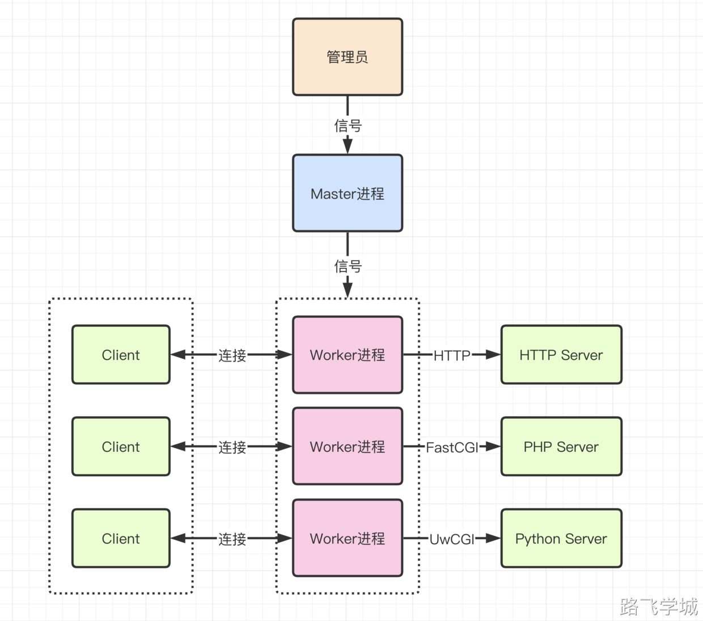
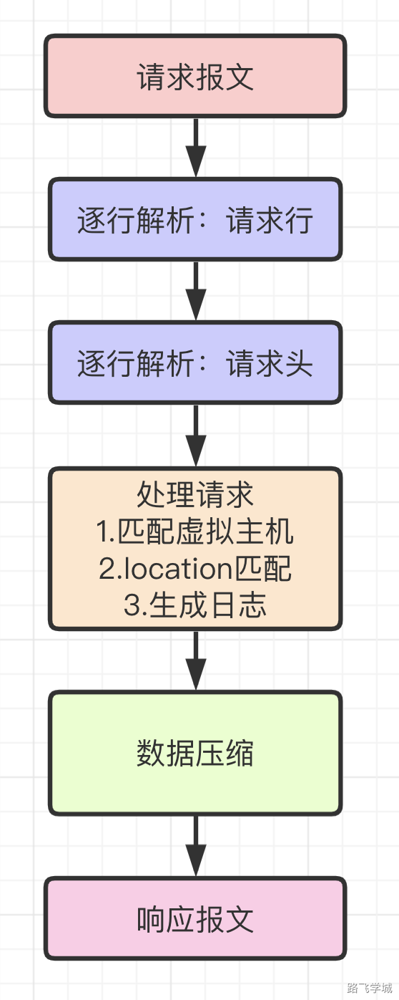

---
tags:
  - Nginx
---
- ~ Nginx是多进程架构,当我们启动时会使用root用户创建一个Master进程，然后再由Master进程创建出多个Worker进程。

> [!info]- master 主进程功能
> 
> 
> 1.启动时读取并检查Nginx配置文件是否有语法或拼写错误  
> 2.根据配置文件里的参数创建和监控worker进程状态  
> 3.监听本地的socekt，接收用户发起的请求，然后worker进程竞争连接，获胜的处理并响应用户请求  
> 4.接收管理员发送的管理Nginx操作信号并将接收的管理信号发送给worker进程  
> 5.如果管理员发送了平滑重启的命令，则会读取配置文件并创建新的worker进程，然后结束旧的worker进程  

> [!info]- worker 工作进程功能
> 
> 
> 1.实际处理网络请求的进程是worker进程  
> 2.master进程根据配置文件的参数决定创建多少个worker进程  
> 3.当有用户请求的事件产生时，worker进程会向master进程竞争，获胜的工作进程和用户建立连接，并处理用户的请求  
> 4.接收用户请求后，与后端服务器进行通信，后端处理完后接收处理结果  
> 5.接收并处理master进程发送的信号，例如启动/重启/结束等信号  
> 

> [!info]- Nginx进程间架构图
> 
> 
> 
> 

> [!info]- Nginx处理HTTP请求
> 
> 
> 

> [!info]- Nginx模块
> 
> 
> Nginx一个非常重要的特性就是拥有丰富的模块，有核心的模块，拓展的模块和第三方拓展模块。
> 
> Nginx模块主要可以分为以下几类：
> 
> 核心模块：
> HTTP 模块：用来发布http web服务网站的模块。
> event模块：用来处理nginx 访问请求，并进行回复。
>  
> 基本模块：
> HTTP Access模块: 用来进行虚拟主机发布访问模块，起到记录访问日志。
> HTTP FastCGI模块：用于和PHP程序进行交互的模块，负责将来访问nginx 的PHP请求转发到后端的PHP上。
> HTTP Proxy模块：配置反向代理转发的模块，负责向后端传递参数。
> HTTP Rewrite模块：支持Rewrite 规则重写，支持域名跳转。

