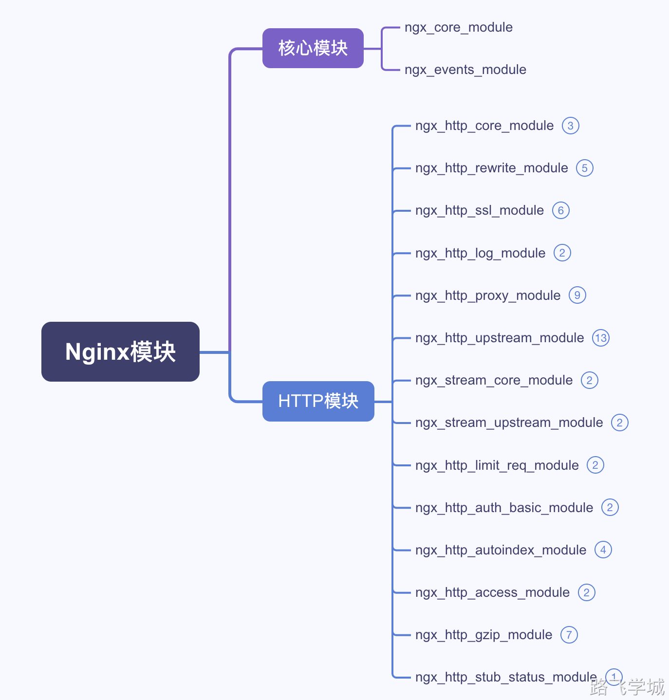

---
tags:
  - Nginx/模块
---
Nginx模块介绍

Nginx 是一个高性能的 HTTP 服务器和反向代理服务器，它采用模块化架构，这使得它具有高度的可扩展性和灵活性。

Nginx 的模块可以分为核心模块、标准 HTTP 模块和第三方模块。

以下是一些重要的 Nginx 模块及其功能简介：

- ~ 1.核心模块

**ngx_core_module**：提供了 Nginx 的核心配置指令，如 **worker_processes**、**error_log** 等。

**ngx_events_module**：负责处理事件驱动机制，包括设置连接数、事件模型等指令，如 **worker_connections**。

- ~ 2.HTTP 模块

**ngx_http_core_module**：Nginx 的核心 HTTP 模块，提供了基本的 HTTP 请求处理功能，包括 **server**、**location**、**if** 等指令。

**ngx_http_rewrite_module**：用于重写和重定向 URI，指令包括 **rewrite**、**return** 和 **set**。

**ngx_http_access_module**：用于基于 IP 地址限制访问权限，指令包括 **allow** 和 **deny**。

**ngx_http_auth_basic_module**：提供 HTTP 基本认证功能，指令包括 **auth_basic** 和 **auth_basic_user_file**。

**ngx_http_proxy_module**：实现反向代理功能，指令包括 **proxy_pass**、**proxy_set_header** 等。

**ngx_http_upstream_module**：实现负载均衡

**ngx_http_fastcgi_module**：用于与 FastCGI 服务器通信，指令包括 **fastcgi_pass**、**fastcgi_param** 等。

**ngx_http_gzip_module**：提供 Gzip 压缩功能，指令包括 **gzip**、**gzip_types** 等。

**ngx_http_log_module**：用于配置日志记录，指令包括 **access_log** 和 **log_format**。

**ngx_http_ssl_module**：用于配置 SSL/TLS，指令包括 **ssl_certificate**、**ssl_certificate_key** 等。

**ngx_http_autoindex_module：**用于自动创建目录列表页面，提供简单下载页面功能。指令包括 autoindex on/off

**ngx_http_stub_status_module：**提供了简单的服务器状态监控页面，包含连接数、接受和处理的请求数等基本信息

**ngx_http_limit_req_module：**用于限制客户端的请求速率，可以有效防止恶意用户进行DDoS攻击或者暴力破解

- ~ 3.第三方模块

**ngx_http_lua_module**：允许使用 Lua 脚本编写 Nginx 配置。

- ~ 4.思维导图梳理

