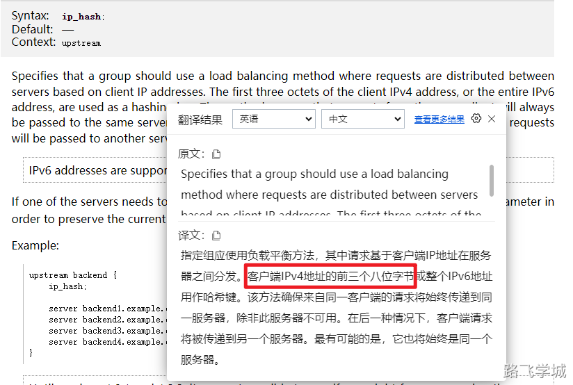

---
tags:
  - Nginx/模块
  - nginx/负载均衡
---
- ~ 1.官网地址

https://nginx.org/en/docs/http/ngx_http_upstream_module.html

- ~ 2.**upstream** 关键指令

**upstream** - 定义一个服务器组，可以在其中列出多个服务器地址及其相关配置。

**server** - 在 location 块中使用，指向 upstream 定义的服务器组。  

**ip_hash** - 启用会话持久化，使来自同一客户端IP的请求总是被转发到同一服务器。

**hash** -   对指定的键值进行哈希运算来决定请求应该被转发到哪个服务器。 

**least_conn**：将请求路由到连接数最少的服务器，帮助实现负载平衡。

- ~ 3.实验-反向代理到多台服务器实现负载均衡

> 3.1 web-8部署实验环境

```plain
cat > /etc/nginx/conf.d/proxy.conf << 'EOF'
server {
    listen       80;
    server_name  proxy.abc.com;
    
    location / {
        root  /code/proxy;
        index index.html;
    }
}
EOF

mkdir /code/proxy -p
echo web-8 > /code/proxy/index.html
chown -R www:www /code/
systemctl restart nginx
```

> 3.2 lb-5编写反向代理负载均衡配置

```plain
cat > /etc/nginx/conf.d/proxy.conf << 'EOF'
upstream web_pool {
    server 10.0.0.7;
    server 10.0.0.8;
}

server {
    listen       80;
    server_name  proxy.abc.com;
    
    location / {
        proxy_pass http://web_pool;
        proxy_set_header Host $http_host;
	      proxy_set_header X-Forwarded-For $proxy_add_x_forwarded_for;
    }
}
EOF

systemctl restart nginx
```

- ~ 4.负载均衡调度算法

> 轮询（Round Robin）：

默认采用轮询调度算法，即平均将请求分发到upstream定义的服务器IP地址池里。

> **权重（Weighted）**：

```plain
cat > /etc/nginx/conf.d/proxy.conf << 'EOF'
upstream web_pool {
    server 10.0.0.7 weight=1;
    server 10.0.0.8 weight=2;
}

server {
    listen       80;
    server_name  proxy.abc.com;
    
    location / {
        proxy_pass http://web_pool;
        proxy_set_header Host $http_host;
	      proxy_set_header X-Forwarded-For $proxy_add_x_forwarded_for;
    }
}
EOF
systemctl restart nginx
```

测试

```bash
[root@lb-5 /etc/nginx/conf.d]# for i in {1..100};do curl -s 10.0.0.5;done|sort|uniq -c|sort -rn
     66 web-8
     34 web-7

[root@lb-5 /etc/nginx/conf.d]# for i in {1..1000};do curl -s 10.0.0.5;done|sort|uniq -c|sort -rn
    667 web-8
    333 web-7
```

> **IP 哈希（IP Hash）**：

```plain
cat > /etc/nginx/conf.d/proxy.conf << 'EOF'
upstream web_pool {
    ip_hash;
	  server 10.0.0.7 ;
    server 10.0.0.8 ;
}

server {
    listen       80;
    server_name  proxy.abc.com;
    
    location / {
        proxy_pass http://web_pool;
        proxy_set_header Host $http_host;
	      proxy_set_header X-Forwarded-For $proxy_add_x_forwarded_for;
    }
}
EOF

systemctl restart nginx
```



> **URI 哈希（URI Hash）**：

```plain
cat > /etc/nginx/conf.d/proxy.conf << 'EOF'
upstream web_pool {
    hash   $request_uri;  
	  server 10.0.0.7 ;
    server 10.0.0.8 ;
}

server {
    listen       80;
    server_name  proxy.abc.com;
    
    location / {
        proxy_pass http://web_pool;
        proxy_set_header Host $http_host;
	      proxy_set_header X-Forwarded-For $proxy_add_x_forwarded_for;
    }
}
EOF

systemctl restart nginx
```

> 最少连接（Least Connections）

```plain
cat > /etc/nginx/conf.d/proxy.conf << 'EOF'
upstream web_pool {
    least_conn; 
	  server 10.0.0.7;
    server 10.0.0.8;
}

server {
    listen       80;
    server_name  proxy.abc.com;
    
    location / {
        proxy_pass http://web_pool;
        proxy_set_header Host $http_host;
	      proxy_set_header X-Forwarded-For $proxy_add_x_forwarded_for;
    }
}
EOF

systemctl restart nginx
```

>  最少响应时间（ Least Time  ）

```plain
cat > /etc/nginx/conf.d/proxy.conf << 'EOF'
upstream web_pool {
    least_time last_byte;  # 完整响应最快的服务器
    #least_time header;    # 响应头最快的服务器
    #least_time last_byte inflight;  # 考虑在途请求的完整响应时间

    server 10.0.0.7;
    server 10.0.0.8;
}

server {
    listen       80;
    server_name  proxy.abc.com;

    location / {
        proxy_pass http://web_pool;
        proxy_set_header Host $http_host;
        proxy_set_header X-Forwarded-For $proxy_add_x_forwarded_for;
    }
}
EOF

systemctl restart nginx
```

- ~ 5.server指令参数

> backup 备用

```plain
cat > /etc/nginx/conf.d/proxy.conf << 'EOF'
upstream web_pool {
	  server 10.0.0.7 backup;
    server 10.0.0.8 ;
}

server {
    listen       80;
    server_name  proxy.abc.com;
    
    location / {
        proxy_pass http://web_pool;
        proxy_set_header Host $http_host;
	      proxy_set_header X-Forwarded-For $proxy_add_x_forwarded_for;
    }
}
EOF
systemctl restart nginx
```

> down 停用

```plain
cat > /etc/nginx/conf.d/proxy.conf << 'EOF'
upstream web_pool {
	  server 10.0.0.7 down;
    server 10.0.0.8 ;
}

server {
    listen       80;
    server_name  proxy.abc.com;
    
    location / {
        proxy_pass http://web_pool;
        proxy_set_header Host $http_host;
	      proxy_set_header X-Forwarded-For $proxy_add_x_forwarded_for;
    }
}
EOF
systemctl restart nginx
```

> max_conns 最大连接数

```plain
cat > /etc/nginx/conf.d/proxy.conf << 'EOF'
upstream web_pool {
	  server 10.0.0.7 max_conns=10;
    server 10.0.0.8 ;
}

server {
    listen       80;
    server_name  proxy.abc.com;
    
    location / {
        proxy_pass http://web_pool;
        proxy_set_header Host $http_host;
	      proxy_set_header X-Forwarded-For $proxy_add_x_forwarded_for;
    }
}
EOF
systemctl restart nginx
```

> max_fails 最大失败数

```plain
cat > /etc/nginx/conf.d/proxy.conf << 'EOF'
upstream web_pool {
	  server 10.0.0.7 max_fails=3;
    server 10.0.0.8 ;
}

server {
    listen       80;
    server_name  proxy.abc.com;
    
    location / {
        proxy_pass http://web_pool;
        proxy_set_header Host $http_host;
	      proxy_set_header X-Forwarded-For $proxy_add_x_forwarded_for;
    }
}
EOF
systemctl restart nginx
```

> fail_timeout 失败超时时间

```plain
cat > /etc/nginx/conf.d/proxy.conf << 'EOF'
upstream web_pool {
	  server 10.0.0.7 max_fails=3 fail_timeout=5 ;
    server 10.0.0.8 ;
}

server {
    listen       80;
    server_name  proxy.abc.com;
    
    location / {
        proxy_pass http://web_pool;
        proxy_set_header Host $http_host;
	      proxy_set_header X-Forwarded-For $proxy_add_x_forwarded_for;
    }
}
EOF
systemctl restart nginx
```

