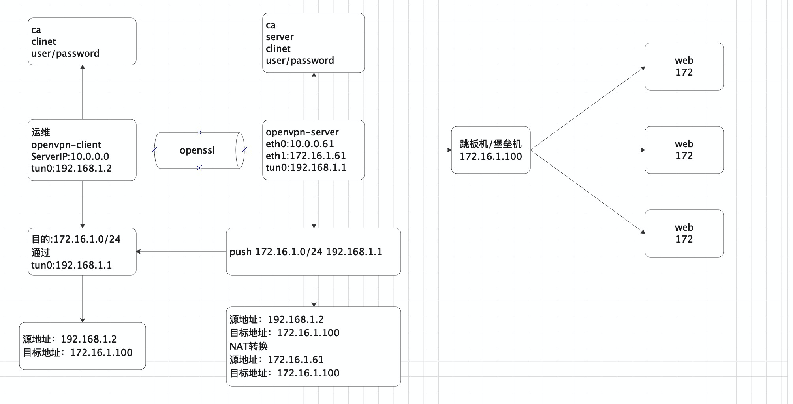

# 相关资料


# openvpn实战





# 第1章 openvpn服务端安装

## 1.安装密钥生成工具

```plain
yum install easy-rsa -y
```

## 2.准备var文件

```plain
mkdir /opt/easy-rsa
cp -a /usr/share/easy-rsa/3.0.7/* /opt/easy-rsa/
cat >>/opt/easy-rsa/vars<<EOF
export KEY_COUNTRY="CN"								#所在国家
export KEY_PROVINCE="BJ"							#所在省份
export KEY_CITY="Beijing"							#所在城市
export KEY_ORG="man"								#所在组织
export KEY_EMAIL="2956371090@qq.com"		#邮箱地址
EOF
```

## 3.生成初始化证书

```plain
#1.初始化,在当前目录创建PKI目录,用于存储证书
cd /opt/easy-rsa/
./easyrsa init-pki

#2.创建根证书,会提示设置密码,用于ca对之后生成的server和client证书签名时使用,其他可默认
./easyrsa build-ca

#3.创建server端证书和私钥文件,nopass表示不加密私钥文件,其他可默认
./easyrsa gen-req server nopass

#4.给server端证书签名,首先是对一些信息的确认,可以输入yes,然后创建ca根证书时设置的密码
./easyrsa sign server server

#5.创建Diffie-Hellman文件,秘钥交换时的Diffie-Hellman算法
./easyrsa gen-dh

#6.创建client端证书和私钥文件,nopass表示不加密私钥文件,其他可默认
./easyrsa gen-req client nopass

#7.给client端证书签名 首先是对一些信息的确认,可以输入yes,然后创建ca根证书时设置的密码
./easyrsa sign client client
```

### 初始化证书目录

```plain
./easyrsa init-pki
```

### 生成ca证书

```plain
[root@db01 /opt/easy-rsa]# ./easyrsa build-ca
......
Enter New CA Key Passphrase: 		 #输入密码
Re-Enter New CA Key Passphrase:  	#确认输入密码
.......
Common Name (eg: your user, host, or server name) [Easy-RSA CA]:		#回车
```

### 生成server证书

```plain
[root@db01 /opt/easy-rsa]# ./easyrsa gen-req server nopass
...
Common Name (eg: your user, host, or server name) [server]:  #回车
...
```

### 使用ca给server证书签名

```plain
[root@db01 /opt/easy-rsa]# ./easyrsa sign server server
...
Confirm request details: #输入yes
...
Enter pass phrase for /opt/easy-rsa/pki/private/ca.key:  #输入ca证书密码123456
```

### 创建Diffie-Hellman文件

```plain
./easyrsa gen-dh
```

### 创建client端证书和私钥文件

```plain
[root@db01 /opt/easy-rsa]# ./easyrsa gen-req client nopass 
...
Common Name (eg: your user, host, or server name) [client]:  #回车
...
```

### 使用ca给client证书签名

```plain
[root@db01 /opt/easy-rsa]# ./easyrsa sign client client
...
Confirm request details: #输入yes   
...
Enter pass phrase for /opt/easy-rsa/pki/private/ca.key:  #输入ca的密码
```

### 检查生成的文件

```plain
ll /opt/easy-rsa/pki/ca.crt
ll /opt/easy-rsa/pki/reqs/server.req
ll /opt/easy-rsa/pki/private/server.key
ll /opt/easy-rsa/pki/issued/server.crt
ll /opt/easy-rsa/pki/dh.pem
ll /opt/easy-rsa/pki/reqs/client.req
ll /opt/easy-rsa/pki/private/client.key
ll /opt/easy-rsa/pki/issued/client.crt
```

## 4.安装openvpn服务端

```plain
yum install openvpn -y
```

## 5.编写服务端配置文件

```plain
cat >/etc/openvpn/server.conf <<EOF
port 1194                       #端口
proto tcp                       #协议
dev tun                         #采用路由隧道模式tun
ca /etc/openvpn/server/ca.crt                       #ca证书位置
cert /etc/openvpn/server/server.crt                 #服务端公钥名称
key  /etc/openvpn/server/server.key                 #服务端私钥名称
dh  /etc/openvpn/server/dh.pem                      #交换证书
server 10.8.0.0 255.255.255.0   #给客户端分配地址,注意:不能和vpn内网网段有相同
push "route 172.16.1.0 255.255.255.0" #允许客户端访问呢内网172.16.1.0网段
ifconfig-pool-persist /etc/openvpn/logs/ipp.txt   #地址池记录文件位置
keepalive 10 120                #存活时间,10秒ping一次,120如未收到响应则视为断线
max-clients 100                 #最多允许100个客户端连接
status /etc/openvpn/logs/openvpn-status.log       #日志记录位置
verb 3                          #openvpn版本
client-to-client                #客户端与客户端之间支持通信
log /etc/openvpn/logs/openvpn.log        #openvpn日志记录位置
persist-key                     #通过keepalive检测超时后,重新启动vpn,不重新读取keys,保留第一次的keys
persist-tun                     #检测超时后,重新启动vpn,一直保持tun是linkup的,否则网络会先linkdown然后再linkup
duplicate-cn										#因此一个证书可以由多个连接/用户使用
EOF
```

## 6.创建日志目录和密钥目录

```plain
mkdir /etc/openvpn/logs -p
```

## 7.拷贝证书到openvpn目录

server证书

```plain
\cp /opt/easy-rsa/pki/ca.crt /etc/openvpn/server/
\cp /opt/easy-rsa/pki/issued/server.crt /etc/openvpn/server/
\cp /opt/easy-rsa/pki/private/server.key /etc/openvpn/server/
\cp /opt/easy-rsa/pki/dh.pem /etc/openvpn/server/
```

client证书

```plain
\cp /opt/easy-rsa/pki/ca.crt  /etc/openvpn/client/
\cp /opt/easy-rsa/pki/private/client.key  /etc/openvpn/client/
\cp /opt/easy-rsa/pki/issued/client.crt  /etc/openvpn/client/
```

## 8.开启内核转发

```plain
echo "net.ipv4.ip_forward = 1" >>/etc/sysctl.conf
sysctl -p
systemctl restart  network
```

## 9.设置防火墙

```plain
iptables -t nat -A POSTROUTING -s 10.8.0.0/24 -d 172.16.1.0/24 -j SNAT --to-source 172.16.1.61
```

## 10.启动服务端

```plain
systemctl enable openvpn@server.service
systemctl start  openvpn@server.service
```

# 第2章 客户端安装

## 1.创建客户端文件

```plain
cat >/etc/openvpn/client.conf<<EOF
client										#指定当前vpn是客户端
dev tun										#使用tun隧道传输协议
proto tcp									#使用tcp协议传输数据									
remote 10.0.0.61 1194		#openvpn服务端IP地址端口号
resolv-retry infinite		  #断线自动重新连接,在网络不稳定的情况下非常有用
nobind										#不绑定本地特定的端口号
ca ca.crt									#指定ca证书的文件路径
cert client.crt						#指定当前客户端的证书文件路径
key	 client.key						#指定当前客户端的私钥文件路径
verb 3										#指定日志文件的记录详细级别,可选0-9,等级越高内容越详细
persist-key								#通过keepalive检测超时后,重新启动vpn,不重新读取keys,保留第一次的keys
persist-tun								#检测超时后,重新启动vpn,一直保持tun是linkup的,否则网络会先linkdown然后再linkup
EOF
```

## 2.windows下客户端安装

我是mac，所以安装步骤略

```plain
1.下载安装openvpn软件
2.将配置文件放到软件的安装目录下的config目录下
3.点击连接按钮
```

# 第3章 设置账号密码

## 1.服务端创建密码认证脚本

```plain
cat > /etc/openvpn/checkpsw.sh <<'EOF'
#!/bin/sh
###########################################################
# checkpsw.sh (C) 2004 Mathias Sundman <mathias@openvpn.se>
#
# This script will authenticate OpenVPN users against
# a plain text file. The passfile should simply contain
# one row per user with the username first followed by
# one or more space(s) or tab(s) and then the password.

PASSFILE="/etc/openvpn/psw-file"
LOG_FILE="/etc/openvpn/logs/openvpn-password.log"
TIME_STAMP=`date "+%Y-%m-%d %T"`
###########################################################
if [ ! -r "${PASSFILE}" ]; then
  echo "${TIME_STAMP}: Could not open password file \"${PASSFILE}\" for reading." >>  ${LOG_FILE}
  exit 1
fi
CORRECT_PASSWORD=`awk '!/^;/&&!/^#/&&$1=="'${username}'"{print $2;exit}' ${PASSFILE}`
if [ "${CORRECT_PASSWORD}" = "" ]; then
  echo "${TIME_STAMP}: User does not exist: username="${username}", password=

"${password}"." >> ${LOG_FILE}
  exit 1
fi
if [ "${password}" = "${CORRECT_PASSWORD}" ]; then
  echo "${TIME_STAMP}: Successful authentication: username="${username}"." >> ${LOG_FILE}
  exit 0
fi

echo "${TIME_STAMP}: Incorrect password: username="${username}", password=

"${password}"." >> ${LOG_FILE}
exit 1
EOF
```

## 2.服务端创建密码文件

```plain
cat >/etc/openvpn/psw-file <<EOF
zhangya 123456
EOF
```

## 3.创建用户指定的IP地址

```plain
mkdir /etc/openvpn/ccd/ -p
cat >/etc/openvpn/ccd/zhangya <<EOF    
ifconfig-push 10.8.0.9 10.8.0.10
EOF
```

## 4.可用IP列表

```plain
[ 1, 2] [ 5, 6] [ 9, 10] [ 13, 14] [ 17, 18]
[ 21, 22] [ 25, 26] [ 29, 30] [ 33, 34] [ 37, 38]
[ 41, 42] [ 45, 46] [ 49, 50] [ 53, 54] [ 57, 58]
[ 61, 62] [ 65, 66] [ 69, 70] [ 73, 74] [ 77, 78]
[ 81, 82] [ 85, 86] [ 89, 90] [ 93, 94] [ 97, 98]
[101,102] [105,106] [109,110] [113,114] [117,118]
[121,122] [125,126] [129,130] [133,134] [137,138]
[141,142] [145,146] [149,150] [153,154] [157,158]
[161,162] [165,166] [169,170] [173,174] [177,178]
[181,182] [185,186] [189,190] [193,194] [197,198]
[201,202] [205,206] [209,210] [213,214] [217,218]
[221,222] [225,226] [229,230] [233,234] [237,238]
[241,242] [245,246] [249,250] [253,254]
```

## 5.修改服务端配置以支持密码认证

```plain
cat >/etc/openvpn/server.conf<<EOF
port 1194
proto tcp
dev tun
ca /etc/openvpn/server/ca.crt
cert /etc/openvpn/server/server.crt
key  /etc/openvpn/server/server.key
dh  /etc/openvpn/server/dh.pem

server 10.8.0.0 255.255.255.0

push "route 172.16.1.0 255.255.255.0"

keepalive 10 120
max-clients 100
verb 3
client-to-client
persist-key
persist-tun
duplicate-cn
ifconfig-pool-persist /etc/openvpn/logs/ipp.txt
log /etc/openvpn/logs/openvpn.log
status /etc/openvpn/logs/openvpn-status.log

client-config-dir ccd
auth-user-pass-verify /etc/openvpn/checkpsw.sh via-env
client-cert-not-required
username-as-common-name
script-security 3
EOF
systemctl restart openvpn@server.service
```

## 6.客户端配置

```plain
cat >client.open<<EOF
client
dev tun
proto tcp
remote 10.0.0.61 1194
resolv-retry infinite
nobind
ca ca.crt
cert client.crt
key	 client.key
verb 3
persist-key
persist-tun
auth-user-pass pass.txt
EOF
```

## 7.创建密码

```plain
cat > pass.txt <<EOF
zhangya
123456
EOF
```


# 第4章 实战-按部门划分角色

## 1.任务要求

| 账户 | 密码   | 部门 | 网段       | 权限                            |
| ---- | ------ | ---- | ---------- | ------------------------------- |
| ops  | 123456 | 运维 | 172.16.2.0 | 可以访问所有服务器的所有端口    |
| dev  | 123456 | 开发 | 172.16.3.0 | 只允许访问测试服务器的redis服务 |
| qa   | 123456 | 测试 | 172.16.4.0 | 只允许访问测试服务器的80端口    |

## 2.运维人员设置

### 指定IP地址

```plain
cat >/etc/openvpn/ccd/ops<<EOF
ifconfig-push 172.16.2.5 172.16.2.6
EOF
```

### 创建密码文件

```plain
echo "ops ops20200420" >> /etc/openvpn/psw-file
```

## 3.开发人员设置

### 指定IP地址

```plain
cat >/etc/openvpn/ccd/dev<<EOF
ifconfig-push 172.16.3.5 172.16.3.6
EOF
```

### 创建密码文件

```plain
echo "dev dev20200420" >> /etc/openvpn/psw-file
```

## 4.测试人员设置

### 指定IP地址

```plain
cat >/etc/openvpn/ccd/qa<<EOF
ifconfig-push 172.16.4.5 172.16.4.6
EOF
```

### 创建密码文件

```plain
echo "qa qa20200420" >> /etc/openvpn/psw-file
```

## 5.编写OpenverServer配置文件

```plain
cp /etc/openvpn/server.conf{,.bak} 
cat >/etc/openvpn/server.conf <<EOF            
port 1194
proto tcp
dev tun
ca /etc/openvpn/server/ca.crt
cert /etc/openvpn/server/server.crt
key  /etc/openvpn/server/server.key
dh  /etc/openvpn/server/dh.pem

server 172.16.2.0 255.255.255.0
route 172.16.3.0 255.255.255.0
route 172.16.4.0 255.255.255.0

push "route 172.16.1.0 255.255.255.0"

keepalive 10 120
max-clients 100
verb 3
client-to-client
persist-key
persist-tun
duplicate-cn
ifconfig-pool-persist /etc/openvpn/logs/ipp.txt
log /etc/openvpn/logs/openvpn.log
status /etc/openvpn/logs/openvpn-status.log

client-config-dir ccd
auth-user-pass-verify /etc/openvpn/checkpsw.sh via-env
client-cert-not-required
username-as-common-name
script-security 3
EOF
```

## 6.运维的客户端配置以及密码文件

### 客户端

```plain
cat >ops.open<<EOF
client
dev tun
proto tcp
remote 10.0.0.61 1194
resolv-retry infinite
nobind
ca ca.crt
cert client.crt
key	 client.key
verb 3
persist-key
persist-tun
auth-user-pass ops_passwd.txt
EOF
```

### 密码

```plain
cat >ops_passwd.txt<<EOF
ops
ops20200420
EOF
```

## 7.防火墙配置

```plain
iptables -t nat -A POSTROUTING -s 172.16.2.0/24 -d 172.16.1.0/24 -j SNAT --to-source 172.16.1.61
iptables -t nat -A POSTROUTING -s 172.16.3.0/24 -d 172.16.1.0/24 -j SNAT --to-source 172.16.1.61
iptables -t nat -A POSTROUTING -s 172.16.4.0/24 -d 172.16.1.0/24 -j SNAT --to-source 172.16.1.61

iptables -A INPUT -p tcp -m tcp --dport 1194 -j ACCEPT
iptables -A INPUT -p tcp -m tcp --dport 22 -j ACCEPT
iptables -A INPUT -s 172.16.1.0/24 -j ACCEPT
iptables -A INPUT -s 172.16.2.0/16 -j ACCEPT
iptables -A INPUT -s 172.16.3.0/16 -p tcp -m tcp --dport 3306 -j ACCEPT
iptables -A INPUT -s 172.16.4.0/16 -p tcp -m tcp --dport 80 -j ACCEPT
iptables -P INPUT DROP
```

# 第5章 黑科技一键安装


