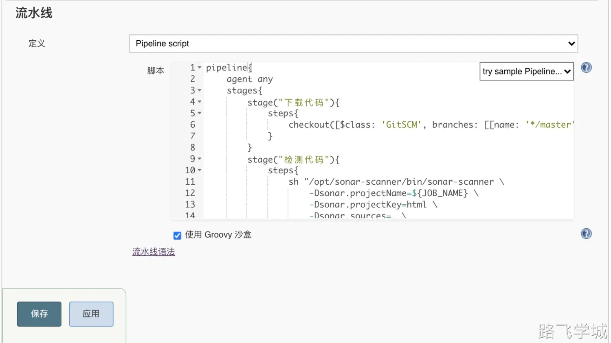
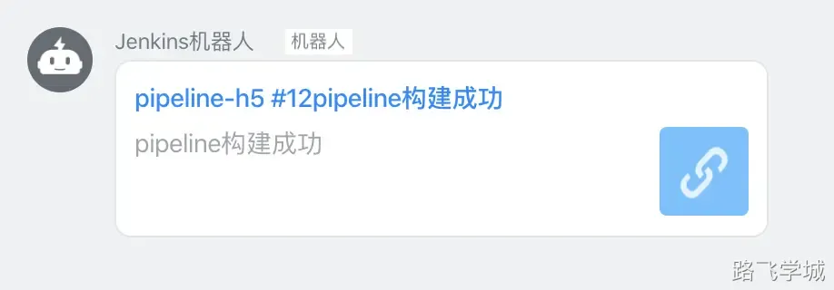

# 第1章 CI/CD介绍

## 1.什么是持续集成/持续部署

持续集成(Continuous integration)是一种软件开发实践，即团队开发成员经常集成它们的工作，通过每个成员 每天至少集成一次，也就意味着每天可能会发生多次集成。每次集成都通过自动化的构建(包括编译，发布，自动 化测试)来验证，从而尽早地发现集成错误。 

持续部署(continuous deployment)是通过自动化的构建、测试和部署循环来快速交付高质量的产品。某种程度 上代表了一个开发团队工程化的程度，毕竟快速运转的互联网公司人力成本会高于机器，投资机器优化开发流程化 相对也提高了人的效率。 

# 第2章 Jenkins pipeline

## 1.什么是pipeline

简单来说，就是将多个任务连接起来，组成流水线

## 2.pipeline概念

```bash
Agent 节点
Stage 阶段
Steps 动作
```

## 3.Jenkins语法介绍

```plain
pipeline {                                #所有代码都在pipeline{}内
    agent any                             #agent{}定义任务运行在哪台主机上，可以是any,node等
    environment {                         #定义环境变量，变量名称=变量值，比如PATH路径等
        host='man.com'          
    }
    stages {                              #一个项目的集合，主要用来包含所有stage子项目
        stage('code'){                    #一个项目中的单个任务，主要用来包含step
            steps {                       #steps主要用来实现具体执行的动作
                 echo "code for host $host"
            }
        }
    }
    stage('build'){
        steps {
            sh "echo $host"
        }
    }
}
```

# 第3章 体验pipeline项目

## 1.创建流水线项目


## 2.填写代码

代码如下：

```plain
pipeline{ 
    agent any 
    stages{
        stage("下载代码"){ 
            steps{
                echo "get code OK" 
            }
        } 
        stage("编译代码"){
            steps{
                echo "packge code OK"
            } 
        }
        stage("部署代码"){ 
            steps{
                echo "deploy code OK" 
            }
        } 
    }
}
```

执行效果：


## 3.执行效果


# 第4章 SCM形式执行pipeline代码

除了在流水线项目里直接配置pipeline代码外，我们还可以将pipeline代码保存成文件存放在代码仓库里，然后配置jenkins直接从代码仓库拉取pipeline file并执行流水线作业.下面我们演示一下。

## 1.在gitlab上创建新项目


## 2.填写项目信息


## 3.编写Jenkins file


## 4.配置部署密钥


## 5.jenkins配置pipeline从gitlab拉取


## 6.构建测试


# 第4章 pipeline改造h5项目

## 1.创建pipeline项目


## 2.jenkins生成拉取代码的pipeline语法


## 3.编写pipeline file

Pipeline代码如下：

```plain
pipeline{ 
    agent any 
    environment {
        PATH=$PATH:/opt/node/bin
    }
    stages{
        stage("下载代码"){ 
            steps{
                checkout([$class: 'GitSCM', branches: [[name: '*/master']], doGenerateSubmoduleConfigurations: false, extensions: [], submoduleCfg: [], userRemoteConfigs: [[credentialsId: 'b8c1f793-47ed-4903-995d-2273673d8f87', url: 'git@10.0.0.200:dev/h5game.git']]])
            }
        } 
        stage("检测代码"){
            steps{
                sh "/opt/sonar-scanner/bin/sonar-scanner  \
                    -Dsonar.projectName=${JOB_NAME} \
                    -Dsonar.projectKey=html \
                    -Dsonar.sources=. \
                    -Dsonar.host.url=http://10.0.0.203:9000 \
                    -Dsonar.login=4f57dfb332463fa8220be49856a0f1d27c88a142"
            } 
        }
        stage("编译代码"){
            steps{
                echo "packge code OK"
            } 
        }
        stage("部署代码"){ 
            steps{
                sh "sh -x /scripts/jenkins/deploy.sh" 
            }
        } 
    }
}
```

部署脚本如下：

```plain
#!/bin/bash

PATH_CODE=/var/lib/jenkins/workspace/${JOB_NAME}
PATH_WEB=/usr/share/nginx
TIME=$(date +%Y%m%d-%H%M)
IP=10.0.0.7

#打包代码
cd ${PATH_CODE} 
tar zcf /opt/${TIME}-web.tar.gz ./*

#拷贝打包好的代码发送到web服务器代码目录
ssh ${IP} "mkdir ${PATH_WEB}/${TIME}-web -p"
scp /opt/${TIME}-web.tar.gz ${IP}:${PATH_WEB}/${TIME}-web

#web服务器解压代码
ssh ${IP} "cd ${PATH_WEB}/${TIME}-web && tar xf ${TIME}-web.tar.gz && rm -rf ${TIME}-web.tar.gz"
ssh ${IP} "cd ${PATH_WEB} && rm -rf html && ln -s ${TIME}-web html"
```

jenkins配置如下：



## 4.构建


## 5.增加确认环节

生成交互确认的pipeline代码


增加相关代码片段:

```plain
pipeline{ 
    agent any 
    stages{
        stage("下载代码"){ 
            steps{
                checkout([$class: 'GitSCM', branches: [[name: '*/master']], doGenerateSubmoduleConfigurations: false, extensions: [], submoduleCfg: [], userRemoteConfigs: [[credentialsId: 'b8c1f793-47ed-4903-995d-2273673d8f87', url: 'git@10.0.0.200:dev/h5game.git']]])
            }
        } 
        stage("检测代码"){
            steps{
                sh "/opt/sonar-scanner/bin/sonar-scanner  \
                    -Dsonar.projectName=${JOB_NAME} \
                    -Dsonar.projectKey=html \
                    -Dsonar.sources=. \
                    -Dsonar.host.url=http://10.0.0.203:9000 \
                    -Dsonar.login=4f57dfb332463fa8220be49856a0f1d27c88a142"
            } 
        }
        stage("编译代码"){
            steps{
                echo "packge code OK"
            } 
        }
        stage("是否部署"){
            steps{
                input message: '确定要部署吗？', ok: 'ok'
            }

        }
        stage("部署代码"){ 
            steps{
                sh "sh -x /scripts/jenkins/deploy.sh" 
            }
        } 
    }
}
```

## 6.构建测试


此时会提示我们是否ok，点击ok之后部署成功


## 7.增加构建结果通知动作

查询通知语法


修改pipeleine增加相关代码

```plain
pipeline{ 
    agent any 
    stages{
        stage("下载代码"){ 
            steps{
                checkout([$class: 'GitSCM', branches: [[name: '*/master']], doGenerateSubmoduleConfigurations: false, extensions: [], submoduleCfg: [], userRemoteConfigs: [[credentialsId: 'b8c1f793-47ed-4903-995d-2273673d8f87', url: 'git@10.0.0.200:dev/h5game.git']]])
            }
        } 
        stage("检测代码"){
            steps{
                sh "/opt/sonar-scanner/bin/sonar-scanner  \
                    -Dsonar.projectName=${JOB_NAME} \
                    -Dsonar.projectKey=html \
                    -Dsonar.sources=. \
                    -Dsonar.host.url=http://10.0.0.203:9000 \
                    -Dsonar.login=4f57dfb332463fa8220be49856a0f1d27c88a142"
            } 
        }
        stage("编译代码"){
            steps{
                echo "packge code OK"
            } 
        }
        stage("是否部署"){
            steps{
                input message: '确定要部署吗？', ok: 'ok'
            }

        }
        stage("部署代码"){ 
            steps{
                sh "sh -x /scripts/jenkins/deploy.sh" 
            }
        } 
    }
    
    post {
        success {
            dingTalk accessToken: '878146e038041b550825b079049cafdf2db77b88221a81a75c9c684b42c80cc8', imageUrl: '', jenkinsUrl: '', message: 'pipeline构建成功', notifyPeople: ''
        }

        failure {
            dingTalk accessToken: '878146e038041b550825b079049cafdf2db77b88221a81a75c9c684b42c80cc8', imageUrl: '', jenkinsUrl: '', message: 'pipeline构建失败', notifyPeople: ''
        }
    }
}
```

## 8.构建测试


## 9.钉钉查看通知



# 第5章 pipeline改造java项目

## 1.git parameter官方地址

https://plugins.jenkins.io/git-parameter/

## 2.发布脚本

```plain
#!/bin/bash

PATH_CODE=/var/lib/jenkins/workspace/${JOB_NAME}
PATH_WEB=/opt/tomcat/webapps
IP=10.0.0.7

#拷贝war包发送到web服务器代码目录
code_scp(){
        ssh ${IP} "mkdir ${PATH_WEB}/java-${git_version} -p"
        scp ${PATH_CODE}/target/*.war ${IP}:${PATH_WEB}/java-${git_version}
}

#web服务器解压代码
code_unzip(){
        ssh ${IP} "cd ${PATH_WEB}/java-${git_version} && unzip *.war && rm -rf *.war"
}

#创建代码软链接
code_ln(){
        ssh ${IP} "cd ${PATH_WEB} && rm -rf ROOT && ln -s java-${git_version} ROOT"
}

#重启tomcat
restart_tomcat(){
        ssh ${IP} "cd /opt/tomcat/bin && ./shutdown.sh && ./startup.sh"
}

main(){
        code_scp
        code_unzip
        code_ln
}

#选择发布还是回滚
if [ "${deploy_env}" == "deploy" ]
then
        ssh ${IP} "ls ${PATH_WEB}/java-${git_version}" >/dev/null 2>&1
        if [ $? == 0 -a ${GIT_COMMIT} == ${GIT_PREVIOUS_SUCCESSFUL_COMMIT} ]
        then
                echo "java-${git_version} 已部署,不允许重复构建"
                exit
        else 
                main
                restart_tomcat
        fi
elif [ "${deploy_env}" == "rollback" ]
then
        code_ln
        restart_tomcat
fi
```

## 3.pipeline脚本

```plain
pipeline{ 
    agent any 
    parameters {
        gitParameter name: 'git_version', 
                     branchFilter: 'origin/(.*)',
                     type: 'PT_TAG',
                     defaultValue: 'v1.0',
                     description: '发布新版本'
        choice(name: 'deploy_env', choices: ['deploy','rollback'],description: 'deploy: 发布版本\nrollback: 回滚版本')               
    }
    stages{
        stage("下载代码"){ 
            steps{
                checkout([$class: 'GitSCM', 
                         branches: [[name: '${git_version}']], 
                         doGenerateSubmoduleConfigurations: false, 
                         userRemoteConfigs: [[credentialsId: 'b8c1f793-47ed-4903-995d-2273673d8f87', 
                         url: 'git@10.0.0.200:dev/java-helloworld.git']]])
            }
        } 
        stage("检测代码"){
            steps{
                sh "/opt/sonar-scanner/bin/sonar-scanner  \
                    -Dsonar.projectName=${JOB_NAME} \
                    -Dsonar.projectKey=${JOB_NAME} \
                    -Dsonar.sources=. \
                    -Dsonar.host.url=http://10.0.0.203:9000 \
                    -Dsonar.login=4f57dfb332463fa8220be49856a0f1d27c88a142"
            } 
        }
        stage("编译代码"){
            steps{
                sh "/opt/maven/bin/mvn package"
            } 
        }
        stage("是否部署"){
            steps{
                input message: '确定要部署吗？', ok: 'ok'
            }

        }
        stage("部署代码"){ 
            steps{
                sh "sh -x /scripts/jenkins/java_deploy.sh" 
            }
        } 
    }

    post {
        success {
            dingTalk accessToken: '878146e038041b550825b079049cafdf2db77b88221a81a75c9c684b42c80cc8', imageUrl: '', jenkinsUrl: '', message: 'pipeline构建成功', notifyPeople: ''
        }

        failure {
            dingTalk accessToken: '878146e038041b550825b079049cafdf2db77b88221a81a75c9c684b42c80cc8', imageUrl: '', jenkinsUrl: '', message: 'pipeline构建失败', notifyPeople: ''
        }
    }
}
```

## 4.构建效果


# 第6章 jenkins分布式构建

## 1.分布式构建介绍


## 2.node节点安装软件

```plain
git
jdk
mvn
sonar-scanner
部署脚本
```

## 3.配置jenkins


## 4.node节点查看

```plain
[root@jenkins-204 ~]# ll /home/jenkins/
总用量 852
drwxr-xr-x 4 root root     34 8月  22 23:21 remoting
-rw-r--r-- 1 root root 872440 8月  22 23:21 remoting.jar

[root@jenkins-204 ~]# ps -ef|grep java
root       1521   1475  0 23:21 ?        00:00:00 bash -c cd "/home/jenkins" && java  -jar remoting.jar -workDir /home/jenkins
root       1528   1521  1 23:21 ?        00:00:05 java -jar remoting.jar -workDir /home/jenkins
root       1655   1175  0 23:28 pts/0    00:00:00 grep --color=auto java
```

## 5.构建测试-指定在node节点构建

以h5项目举例，修改pipeline代码，指定在node节点构建

```plain
pipeline{ 
    agent { label 'node1' }
    stages{
        stage("下载代码"){ 
            steps{
                checkout([$class: 'GitSCM', branches: [[name: '*/master']], doGenerateSubmoduleConfigurations: false, extensions: [], submoduleCfg: [], userRemoteConfigs: [[credentialsId: 'b8c1f793-47ed-4903-995d-2273673d8f87', url: 'git@10.0.0.200:dev/h5game.git']]])
            }
        } 
        stage("检测代码"){
            steps{
                sh "/opt/sonar-scanner/bin/sonar-scanner  \
                    -Dsonar.projectName=${JOB_NAME} \
                    -Dsonar.projectKey=html \
                    -Dsonar.sources=. \
                    -Dsonar.host.url=http://10.0.0.203:9000 \
                    -Dsonar.login=4f57dfb332463fa8220be49856a0f1d27c88a142"
            } 
        }
        stage("编译代码"){
            steps{
                echo "packge code OK"
            } 
        }
        stage("是否部署"){
            steps{
                input message: '确定要部署吗？', ok: 'ok'
            }

        }
        stage("部署代码"){ 
            steps{
                sh "sh -x /scripts/jenkins/deploy.sh" 
            }
        } 
    }
    
    post {
        success {
            dingTalk accessToken: '878146e038041b550825b079049cafdf2db77b88221a81a75c9c684b42c80cc8', imageUrl: '', jenkinsUrl: '', message: 'pipeline构建成功', notifyPeople: ''
        }

        failure {
            dingTalk accessToken: '878146e038041b550825b079049cafdf2db77b88221a81a75c9c684b42c80cc8', imageUrl: '', jenkinsUrl: '', message: 'pipeline构建失败', notifyPeople: ''
        }
    }
}
```

执行效果如下：

