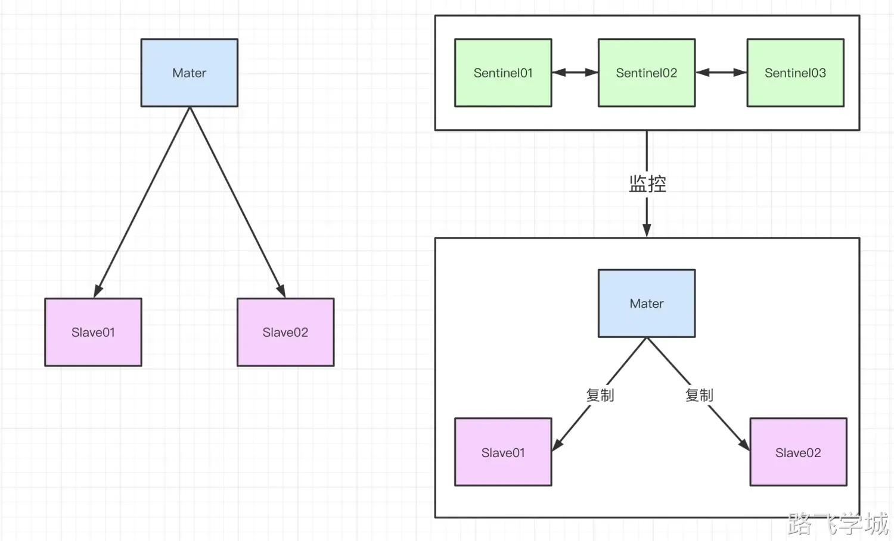
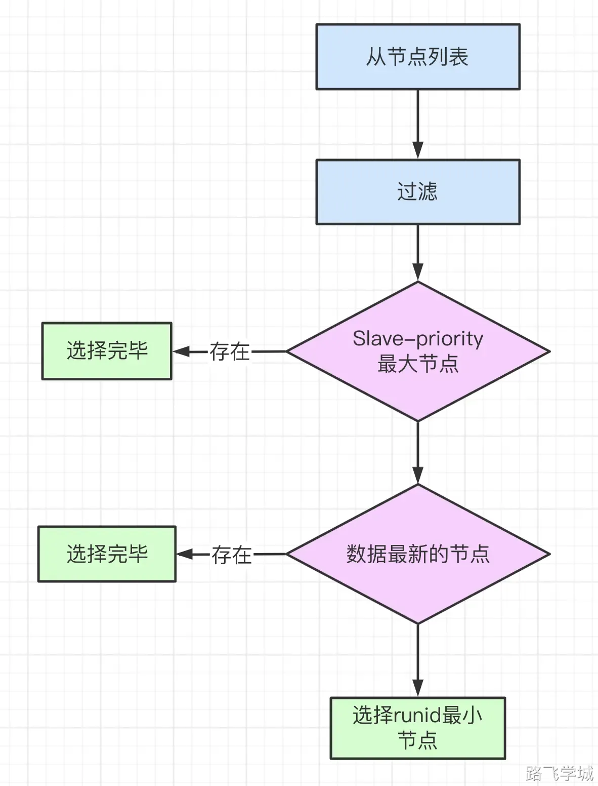

# 第6章 Redis Sentinel

## 1.哨兵的介绍

前面我们已经介绍了主从模式的部署，安装配置非常的简单，但是主从架构的缺点也很明显。主节点发生故障需要人工的将从节点升为主节点，同时代码还需要修改连接地址，这在生产环境维护起来还是有点麻烦的。

针对主从复制的缺点，官方推出了Sentinel哨兵架构，哨兵架构很好的解决了主从复制故障需要人为干预的问题。

Redis Sentinel(哨兵)也是一个Redis节点，只不过是特殊的节点，因为它实际并不参与数据的存储和处理。哨兵采用分布式架构，可以运行多个节点，成员之间的信息可以互相感知到，即使某个哨兵节点发生故障了，其他哨兵节点也可以正常提供服务。


哨兵的主要功能如下：

**1.****监控功能**

哨兵可以监控到Redis主从中的Master节点是否工作正常，并且哨兵之间可以互相感知并共享集群信息。

**2.****自动故障转移功能**

假如哨兵监控的Master节点发生故障不能提供服务了，哨兵会根据选举算法，在剩余的Slave节点中选出一个新的Master并替我们自动执行故障转移的命令，整个过程我们无需人工介入。

**3.****配置中心功能**

哨兵也充当着客户端服务发现的来源，对于代码而言，连接的地址就不再是单独Redis节点的IP地址了，而是哨兵的地址列表，当需要访问的时候，先询问哨兵当前最新的Master节点的IP是多少，然后哨兵会查询并返回给代码当前的Master节点的IP地址，代码拿到最新的Master地址后就可以直接去访问真实的Master了。这样，即使Redis的复制关系发生了变化，我们的代码也不需要修改Redis的连接地址，依然可以访问到Master节点。


哨兵架构图：



## 2.目录和端口规划

因为哨兵只是负责监控和故障转移，真正提供服务的还是主从节点，这里我们需要使用3台机器，分别安装redis节点和哨兵节点，IP端口规划如下表：

| IP地址    | 端口号   | 角色   |
| --------- | -------- | ------ |
| 10.0.0.51 | 6379     | 主节点 |
| 26379     | 哨兵节点 |        |
| 10.0.0.52 | 6379     | 从节点 |
| 26379     | 哨兵节点 |        |
| 10.0.0.53 | 6379     | 从节点 |
| 26379     | 哨兵节点 |        |

## 3.部署3台redis单节点主从关系

这里只给出db-51的操作，db-52和db-53节点的哨兵配置文件只需要更改IP即可。

db-51的操作命令：

```bash
cd /opt/
wget http://download.redis.io/releases/redis-5.0.7.tar.gz
tar zxf redis-5.0.7.tar.gz -C /opt/
ln -s /opt/redis-5.0.7 /opt/redis
cd /opt/redis 
make  #如果报错可以执行 make MALLOC=libc 
make install

mkdir -p /opt/redis_6379/{conf,logs,pid} 
mkdir -p /data/redis_6379
cat >/opt/redis_6379/conf/redis_6379.conf<<EOF
daemonize yes
bind 127.0.0.1 10.0.0.51	#修改为每台主机的IP
port 6379
pidfile "/opt/redis_6379/pid/redis_6379.pid"
logfile "/opt/redis_6379/logs/redis_6379.log"
dbfilename "redis.rdb"
dir "/data/redis_6379"
appendonly yes
appendfilename "redis.aof"
appendfsync everysec
EOF

groupadd redis -g 1000
useradd redis -u 1000 -g 1000 -M -s /sbin/nologin
chown -R redis:redis /opt/redis*
chown -R redis:redis /data/redis*
cat >/usr/lib/systemd/system/redis.service<<EOF
[Unit]
Description=Redis persistent key-value database
After=network.target
After=network-online.target
Wants=network-online.target

[Service]
ExecStart=/usr/local/bin/redis-server /opt/redis_6379/conf/redis_6379.conf --supervised systemd
ExecStop=/usr/local/bin/redis-cli shutdown
Type=notify
User=redis
Group=redis
RuntimeDirectory=redis
RuntimeDirectoryMode=0755

[Install]
WantedBy=multi-user.target
EOF

systemctl daemon-reload 
systemctl start redis
```

## 4.配置主从复制

```bash
redis-cli -h 10.0.0.52 slaveof 10.0.0.51 6379
redis-cli -h 10.0.0.53 slaveof 10.0.0.51 6379
redis-cli -h 10.0.0.51 info replication
```

## 5.部署哨兵节点-3台机器都操作

```bash
mkdir -p /data/redis_26379
mkdir -p /opt/redis_26379/{conf,pid,logs}
cat >/opt/redis_26379/conf/redis_26379.conf << EOF
bind $(ifconfig eth0|awk 'NR==2{print $2}')
port 26379
daemonize yes
pidfile /opt/redis_26379/pid/redis_26379.pid
logfile /opt/redis_26379/logs/redis_26379.log
dir /data/redis_26379
sentinel monitor myredis 10.0.0.51 6379 2
sentinel down-after-milliseconds myredis 3000
sentinel parallel-syncs myredis 1
sentinel failover-timeout myredis 18000
EOF
chown -R redis:redis  /data/redis*
chown -R redis:redis  /opt/redis*
cat >/usr/lib/systemd/system/redis-sentinel.service<<EOF
[Unit]
Description=Redis persistent key-value database
After=network.target
After=network-online.target
Wants=network-online.target

[Service]
ExecStart=/usr/local/bin/redis-sentinel /opt/redis_26379/conf/redis_26379.conf --supervised systemd
ExecStop=/usr/local/bin/redis-cli -h $(ifconfig eth0|awk 'NR==2{print $2}') -p 26379 shutdown
Type=notify
User=redis
Group=redis
RuntimeDirectory=redis
RuntimeDirectoryMode=0755

[Install]
WantedBy=multi-user.target
EOF
systemctl daemon-reload 
systemctl start redis-sentinel
redis-cli -h $(ifconfig eth0|awk 'NR==2{print $2}') -p 26379
```

关键配置解释:

```bash
sentinel monitor myredis 10.0.0.51 6379 2     
# myredis主节点别名  主节点IP 端口  需要2个哨兵节点同意

sentinel down-after-milliseconds myredis 3000
# 认定服务器已经断线所需要的毫秒数

sentinel parallel-syncs myredis 1
# 向主节点发给复制操作的从节点个数，1表示轮训发起复制

sentinel failover-timeout myredis 18000
# 故障转移超时时间
```

## 6.哨兵注意

1.哨兵发起故障转移的条件是master节点失去联系，从节点挂掉不会发起故障转移
2.哨兵会自己维护配置文件，不需要手动修改
3.如果主从的结构发生变化，哨兵之间会自动同步最新的消息并且自动更新配置文件
4.哨兵启动完成之后，以后不要再自己去设置主从关系

## 7.验证主机点

```bash
redis-cli -h 10.0.0.51 -p 26379 SENTINEL get-master-addr-by-name myredis
```

## 8.哨兵的常用命令

哨兵拥有属于自己的一些指令，主要用来查看Redis节点的各种信息，命令整理如下：

| 哨兵命令                                 | 命令解释                             |
| ---------------------------------------- | ------------------------------------ |
| sentinel masters                         | 打印出主节点的详细信息               |
| sentinel master myredis                  | 同上一条命令，打印出主节点的详细信息 |
| sentinel slaves myredis                  | 打印出所有从节点的详细信息           |
| sentinel get-master-addr-by-name myredis | 打印出当然主节点的IP和端口信息       |
| sentinel failover myredis                | 主动发起重新选举                     |
| sentinel ckquorum myredis                | 检查当前的哨兵节点是否达到选举的要求 |

## 9.模拟故障转移

模拟方法：

关闭redis当前的主节点
观察其他2个节点会不会发生选举
查看哨兵配置文件会不会更新
查看从节点配置文件会不会更新
查看主节点能不能写入
查看从节点是否同步正常

流程：

1）在从节点列表中选出一个节点作为新的主节点，选择方法如下：
a）过滤：“不健康”（主观下线、断线）、5秒内没有回复过Sentinel节点ping响应、与主节点失联超过down-after-milliseconds*10秒。
b）选择slave-priority（从节点优先级）最高的从节点列表，如果存在则返回，不存在则继续。
c）选择复制偏移量最大的从节点（复制的最完整），如果存在则返回，不存在则继续。
d）选择runid最小的从节点

流程图：



结论：

主节点挂掉，哨兵会选举新的主节点
在新主节点上执行slaveof no one
在从节点执行slave of 新主节点
自动更新哨兵配置
自动更新从节点配置

## 10.故障修复重新上线

启动单节点
检查是否变成从库

## 11.哨兵加权选举

查看权重

```bash
redis-cli -h 10.0.0.51 -p 6379 CONFIG GET slave-priority
redis-cli -h 10.0.0.52 -p 6379 CONFIG GET slave-priority
redis-cli -h 10.0.0.53 -p 6379 CONFIG GET slave-priority
```

暗箱操作：假如选中53作为最新的master

```bash
redis-cli -h 10.0.0.51 -p 6379 CONFIG SET slave-priority 0
redis-cli -h 10.0.0.52 -p 6379 CONFIG SET slave-priority 0
```

检查：

```bash
redis-cli -h 10.0.0.51 -p 6379 CONFIG GET slave-priority  
redis-cli -h 10.0.0.52 -p 6379 CONFIG GET slave-priority  
redis-cli -h 10.0.0.51 -p 26379 sentinel get-master-addr-by-name myredis
```

主动发生选举

```bash
redis-cli -h 10.0.0.51 -p 26379 sentinel failover myredis 
redis-cli -h 10.0.0.51 -p 26379 sentinel get-master-addr-by-name myredi
```