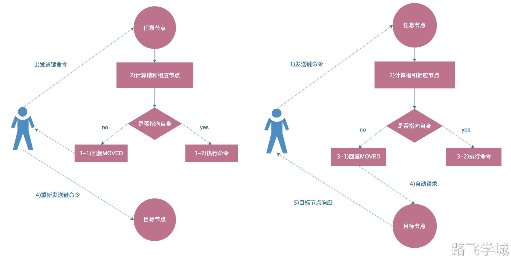
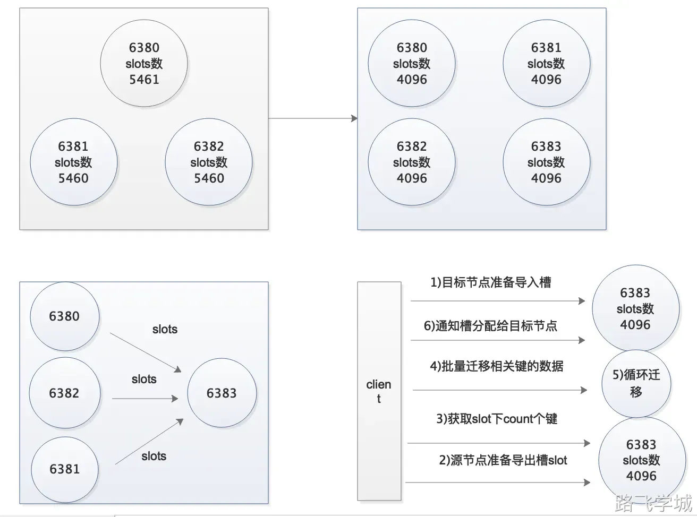
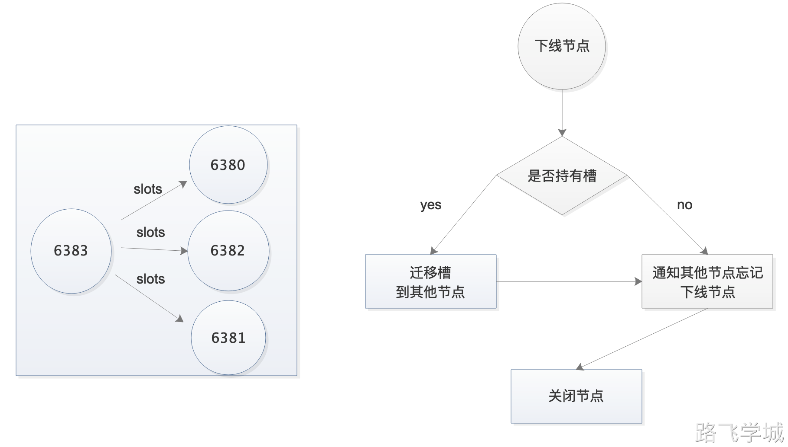

# 第7章 Redis Cluster

## 1.集群介绍

我们前面已经学习了主从复制和哨兵两种高可用架构，哨兵解决了主从模式需要人为介入的问题，但是依然有一些不足的地方，整理如下：

1.资源利用率不高，哨兵集群可用内存大小取决于主库有多少内存。

2.主库压力大，因为读写操作都在主库上，所以从库不能分担写的压力。

3.代码连接过程繁琐，需要先询问哨兵，然后再去访问主节点。

针对哨兵的不足，Redis在3.0之后推出了官方的集集群解决方案:Redis Cluster。它很好的解决了哨兵资源利用率不高和读写不均的问题，所以理解和掌握Redis Cluster对我们在工作中非常有帮助，可以让我们更方便更高效的使用好Redis。

## 2.集群分片

在搭建部署Redis Cluster之前，我们必须要先了解关于集群数据分配的规则。对于分布式数据库来说，首先要解决的就是如何将数据平均分配到各个节点，这里有2个概念需要我们了解：

1.slot虚拟槽

2.hash分片规则

### 2.1 hash分片规则

为了保证所有的键能平均分配到各个节点，Redis Cluster使用了hash分片规则，即所有对集群的键操作，都会经过hash规则运算，然后得出一串hash值。hash算法可以保证每一个键计算出来的hash值足够随机，足够平均。

### 2.1 slot虚拟槽

hash分片规则计算出来键的hash值之后，如何决定这个键应该分配到哪个集群呢？Redis Cluster划分出了0-16383号虚拟槽位，也就是16384个虚拟槽(slot)，然后每个槽都负责一定范围的hash值所对应的键。这里将槽位的一些特点整理如下：

1.只需要给主节点分配槽位即可，从节点会同步主节点的数据。

2.16384个槽的数量是固定的，它们被集群中所有主节点平均分配。

3.因为每个槽被分配到数据的概率大致是一样的，所以槽的序号没有意义，重要的是每个节点被分配的槽的个数。

4.所有的槽都必须被分配完毕，哪怕有一个槽没有被分配，整个集群都不可用。

## 3.集群端口与目录规划

因为Redis Cluster的高可用也是依赖于主从复制，所以我们这里使用3台机器，每台机器部署一个主节点和从节点。

| IP地址    | 端口号 | 角色   |
| --------- | ------ | ------ |
| 10.0.0.51 | 6380   | master |
| 6381      | slave  |        |
| 10.0.0.52 | 6380   | master |
| 6381      | slave  |        |
| 10.0.0.53 | 6380   | master |
| 6381      | slave  |        |

## 4.集群架构图

由于Redis Cluster是一个分布式解决方案，所以我们必须保证所有的槽都被分配完毕并且正常工作才是一个完整的集群。因此我们必须保证每一个主节点都有一个从节点同步数据，这样当主节点停止工作的时候，从节点可以完整的接管主节点上的所有槽。

但同时我们也需要注意一个问题，那就是如果从节点和同步的主节点都在一台机器上，那么如果这个机器故障了，这台机器的主节点负责的槽位还是丢失了，集群依然会故障。

所以如果是3节点的集群架构，需要保证每台机器的从节点同步的主节点必须是其他机器的，如下图所示：

## 5.集群安装部署

```bash
#创建数据目录
pkill redis
mkdir -p /opt/redis_{6380,6381}/{conf,logs,pid}
mkdir -p /data/redis_{6380,6381}

#写入主节点配置文件
cat >/opt/redis_6380/conf/redis_6380.conf << EOF
bind $(ifconfig eth0|awk 'NR==2{print $2}')
port 6380
daemonize yes
pidfile "/opt/redis_6380/pid/redis_6380.pid"
logfile "/opt/redis_6380/logs/redis_6380.log"
dbfilename "redis_6380.rdb"
dir "/data/redis_6380/"
appendonly yes
appendfilename "redis.aof"
appendfsync everysec
cluster-enabled yes
cluster-config-file nodes_6380.conf
cluster-node-timeout 15000
EOF

#复制并修改从节点配置文件
cp /opt/redis_6380/conf/redis_6380.conf /opt/redis_6381/conf/redis_6381.conf
sed -i 's#6380#6381#g' /opt/redis_6381/conf/redis_6381.conf 

#更改所属用户
chown -R redis:redis /opt/redis_*
chown -R redis:redis /data/redis_*

#写入主节点启动文件
cat >/usr/lib/systemd/system/redis-master.service << EOF
[Unit]
Description=Redis persistent key-value database
After=network.target
After=network-online.target
Wants=network-online.target

[Service]
ExecStart=/usr/local/bin/redis-server /opt/redis_6380/conf/redis_6380.conf --supervised systemd
ExecStop=/usr/local/bin/redis-cli -h $(ifconfig eth0|awk 'NR==2{print $2}') -p 6380 shutdown
Type=notify
User=redis
Group=redis
RuntimeDirectory=redis
RuntimeDirectoryMode=0755

[Install]
WantedBy=multi-user.target
EOF

#写入从节点启动文件
cd /usr/lib/systemd/system/
cp redis-master.service redis-slave.service
sed -i 's#6380#6381#g' redis-slave.service

#启动服务
systemctl daemon-reload 
systemctl start redis-master
systemctl start redis-slave
ps -ef|grep redis
```

## 6.集群手动发现节点

```bash
redis-cli -h 10.0.0.51 -p 6380 CLUSTER MEET 10.0.0.52 6380
redis-cli -h 10.0.0.51 -p 6380 CLUSTER MEET 10.0.0.53 6380
redis-cli -h 10.0.0.51 -p 6380 CLUSTER MEET 10.0.0.51 6381
redis-cli -h 10.0.0.51 -p 6380 CLUSTER MEET 10.0.0.52 6381
redis-cli -h 10.0.0.51 -p 6380 CLUSTER MEET 10.0.0.53 6381
redis-cli -h 10.0.0.51 -p 6380 CLUSTER NODES
```

## 7.集群手动分配槽位

1）槽位规划

```bash
db-51:6380  5461	 0-5460
db-52:6380  5461   5461-10921
db-53:6380  5462   10922-16383
```

2）分配槽位

```bash
redis-cli -h 10.0.0.51 -p 6380 CLUSTER ADDSLOTS {0..5460}
redis-cli -h 10.0.0.52 -p 6380 CLUSTER ADDSLOTS {5461..10921}
redis-cli -h 10.0.0.53 -p 6380 CLUSTER ADDSLOTS {10922..16383}
```

3）查看集群状态

```bash
redis-cli -h 10.0.0.51 -p 6380 CLUSTER NODES
redis-cli -h 10.0.0.51 -p 6380 CLUSTER INFO
```

## 8.手动分配复制关系

1）先获取集群节点信息

```bash
 redis-cli -h 10.0.0.52 -p 6381 CLUSTER nodes
```

2）过滤删除不必要的信息

```bash
6380的ID 10.0.0.51
6380的ID 10.0.0.53
6380的ID 10.0.0.52
```

3）画图


4）配置复制关系

```bash
redis-cli -h 10.0.0.51 -p 6381 CLUSTER REPLICATE db02的6380的ID 
 redis-cli -h 10.0.0.52 -p 6381 CLUSTER REPLICATE db03的6380的ID 
 redis-cli -h 10.0.0.53 -p 6381 CLUSTER REPLICATE db01的6380的ID
```

5）检查复制关系

```bash
 redis-cli -h 10.0.0.51 -p 6381 CLUSTER NODES
```

## 9.集群写入测试数据

1）尝试插入一条数据

```bash
[root@db01 ~]# redis-cli -h 10.0.0.51 -p 6380
 10.0.0.51:6380> set k1 v1
 (error) MOVED 12706 10.0.0.53:6380
 
[root@db01 ~]# redis-cli -c -h 10.0.0.51 -p 6380
10.0.0.51:6380> 
10.0.0.51:6380> set k4 v4
-> Redirected to slot [8455] located at 10.0.0.52:6380
OK
10.0.0.52:6380> keys *
1) "k4"
10.0.0.52:6380> get k4
"v4"
```

2）目前的现象

```bash
1.在db01的6380上插入数据提示错误
2.报错提示应该移动到db03的6380上
3.根据提示在db03的6380上执行相同的命令可以写入成功
4.db01的6380有的数据可以写入，有的不行
5.使用-c参数后，可以正常写入命令，并且由目标节点返回信息
```

3）问题原因

因为集群模式有ASK规则，加入-c参数后，会自动跳转到目标节点处理并由目标节点返回信息。

4）ASK路由流程图


 

## 10.验证集群hash算法是否足够随机足够平均

1）写入测试命令

```bash
for i in {1..1000};do redis-cli -c -h 10.0.0.51 -p 6380 set k_${i} v_${i} && echo "${i} is ok";done
```

2）验证足够平均

```bash
[root@db-51 ~]# redis-cli  -c -h 10.0.0.51 -p 6380 DBSIZE
(integer) 339
[root@db-51 ~]# redis-cli  -c -h 10.0.0.52 -p 6380 DBSIZE 
(integer) 326
[root@db-51 ~]# redis-cli  -c -h 10.0.0.53 -p 6380 DBSIZE 
(integer) 335
```

3）验证足够随机

```bash
redis-cli -c -h 10.0.0.51 -p 6380 keys \* > keys.txt
cat keys.txt |awk -F "_" '{print $2}'|sort -rn
```

4）允许节点的槽个数误差在2%以内的依据

```bash
[root@db-51 ~]# redis-cli --cluster rebalance 10.0.0.51:6380
>>> Performing Cluster Check (using node 10.0.0.51:6380)
[OK] All nodes agree about slots configuration.
>>> Check for open slots...
>>> Check slots coverage...
[OK] All 16384 slots covered.
*** No rebalancing needed! All nodes are within the 2.00% threshold.
```

5）检查集群健康状态

```bash
[root@db-51 ~]# redis-cli --cluster info 10.0.0.51:6380
10.0.0.51:6380 (f765d849...) -> 3343 keys | 5461 slots | 1 slaves.
10.0.0.52:6380 (5ff2b711...) -> 3314 keys | 5461 slots | 1 slaves.
10.0.0.53:6380 (de167d13...) -> 3343 keys | 5462 slots | 1 slaves.
[OK] 10000 keys in 3 masters.
0.61 keys per slot on average.
```

## 11.使用redis-cli一键部署集群

1）还原集群状态

```bash
redis-cli -c -h 10.0.0.51 -p 6380 flushall
redis-cli -c -h 10.0.0.52 -p 6380 flushall
redis-cli -c -h 10.0.0.53 -p 6380 flushall
redis-cli -h 10.0.0.51 -p 6380 CLUSTER RESET
redis-cli -h 10.0.0.52 -p 6380 CLUSTER RESET
redis-cli -h 10.0.0.53 -p 6380 CLUSTER RESET
redis-cli -h 10.0.0.51 -p 6381 CLUSTER RESET
redis-cli -h 10.0.0.52 -p 6381 CLUSTER RESET
redis-cli -h 10.0.0.53 -p 6381 CLUSTER RESET
```

2）一键部署Redis集群

```bash
redis-cli --cluster create 10.0.0.51:6380 10.0.0.52:6380 10.0.0.53:6380 10.0.0.51:6381 10.0.0.52:6381 10.0.0.53:6381 --cluster-replicas 1
```

3）检查集群

```bash
redis-cli --cluster info 10.0.0.51:6380
```

## 12.Redis集群节点扩容



1）需要考虑的问题

1.迁移时槽的数据会不会迁过去

2.迁移过程集群读写受影响吗

3.需要限速吗

4.如何确保迁移后的完整性

2）如何设计实验验证迁移过程是否受影响

1.迁移过程中，一个窗口读数据，一个窗口写数据

2.观察是否会中断

3）创建新节点

```bash
mkdir -p /opt/redis_{6390,6391}/{conf,logs,pid}
mkdir -p /data/redis_{6390,6391}
cd /opt/
cp redis_6380/conf/redis_6380.conf redis_6390/conf/redis_6390.conf
cp redis_6380/conf/redis_6380.conf redis_6391/conf/redis_6391.conf
sed -i 's#6380#6390#g' redis_6390/conf/redis_6390.conf
sed -i 's#6380#6391#g' redis_6391/conf/redis_6391.conf
redis-server /opt/redis_6390/conf/redis_6390.conf
redis-server /opt/redis_6391/conf/redis_6391.conf
ps -ef|grep redis
redis-cli -c -h 10.0.0.51 -p 6380 cluster meet 10.0.0.51 6390
redis-cli -c -h 10.0.0.51 -p 6380 cluster meet 10.0.0.51 6391
redis-cli -c -h 10.0.0.51 -p 6380 cluster nodes
```

4）扩容步骤

```bash
#重新分配槽位
redis-cli --cluster reshard 10.0.0.51:6380

#第一次交互：每个节点最终分配多少个槽
How many slots do you want to move (from 1 to 16384)? 4096

#第二次交互：接受节点的ID
What is the receiving node ID? 6390的ID

#第三次交互：哪些节点需要导出 
Please enter all the source node IDs.
  Type 'all' to use all the nodes as source nodes for the hash slots.
  Type 'done' once you entered all the source nodes IDs.
Source node #1:all

#第四次交互:确认信息
Do you want to proceed with the proposed reshard plan (yes/no)? yes
```

5）验证命令

写命令

```bash
 for i in {1..1000};do redis-cli -c -h 10.0.0.51 -p 6380 set k_${i} v_${i} && echo ${i} is ok;sleep 0.5;done
```

读命令

```bash
 for i in {1..1000};do redis-cli -c -h 10.0.0.51 -p 6380 get k_${i};sleep 0.5;done 
```

## 13.Redis集群节点缩容



1）缩容命令

```bash
#重新分配槽
redis-cli --cluster reshard 10.0.0.51:6380

#第一次交互：需要迁移多少个槽
How many slots do you want to move (from 1 to 16384)? 1365

#第三次交互：接受节点ID是多少
What is the receiving node ID? db01的6380的ID

#第三次交互：哪些节点需要导出
Please enter all the source node IDs.
  Type 'all' to use all the nodes as source nodes for the hash slots.
  Type 'done' once you entered all the source nodes IDs.
Source node #1: 6390的ID
Source node #2: done

#第四次交互:确认信息
Do you want to proceed with the proposed reshard plan (yes/no)? yes

重复上述操作，知道6390所有的槽都被分配完毕
```

2）检查命令

```bash
redis-cli --cluster info 10.0.0.51:6380
```

## 14.Redis集群免交互自动化操作

1）免交互初始化集群

```bash
echo "yes"|redis-cli --cluster create 10.0.0.51:6380 10.0.0.52:6380 10.0.0.53:6380 10.0.0.51:6381 10.0.0.52:6381 10.0.0.53:6381 --cluster-replicas 1
```

2）免交互扩容

添加主节点

```bash
redis-cli --cluster add-node 10.0.0.51:6390 10.0.0.51:6380
```

添加从节点

```bash
redis-cli --cluster add-node 10.0.0.51:6391 10.0.0.51:6380 --cluster-slave --cluster-master-id $(redis-cli -c -h 10.0.0.51 -p 6380 cluster nodes|awk '/51:6390/{print $1}')
```

重新分配槽

```bash
redis-cli --cluster reshard 10.0.0.51:6380  --cluster-from all --cluster-to $(redis-cli -c -h 10.0.0.51 -p 6380 cluster nodes|awk '/51:6390/{print $1}') --cluster-slots 4096 --cluster-yes
```

3）免交互收缩

迁移槽

```bash
 redis-cli --cluster rebalance 10.0.0.51:6380 --cluster-weight $(redis-cli -c -h 10.0.0.51 -p 6390 cluster nodes|awk '/51:6390/{print $1}')=0
```

下线节点

```bash
redis-cli --cluster del-node 10.0.0.51:6391 $(redis-cli -c -h 10.0.0.51 -p 6380 cluster nodes|awk '/51:6391/{print $1}')  
redis-cli --cluster del-node 10.0.0.51:6390 $(redis-cli -c -h 10.0.0.51 -p 6380 cluster nodes|awk '/51:6390/{print $1}')
```

## 15.Redis集群数据迁移

4.x之后可以直接使用redis-cli命令自带的迁移功能

不加copy参数相当于mv,老数据迁移完成后就删掉了

```bash
redis-cli --cluster import 10.0.0.51:6380 --cluster-from 10.0.0.51:6379
```

加了copy参数相当于cp,老数据迁移完成后会保留

```bash
redis-cli --cluster import 10.0.0.51:6380 --cluster-from 10.0.0.51:6379 --cluster-copy
```

添加replace参数会覆盖掉同名的数据，如果不添加遇到同名的key会提示冲突，对新集群新增加的数据不受影响

```bash
redis-cli --cluster import 10.0.0.51:6380 --cluster-from 10.0.0.51:6379 --cluster-copy --cluster-replace
```

验证迁移期间边写边导会不会影响: 同时开2个终端，一个写入key，

```bash
for i in {1..1000};do redis-cli set k_${i} v_${i};sleep 0.2;echo ${i};done
```

一个执行导入命令

```bash
redis-cli --cluster import 10.0.0.51:6380 --cluster-copy --cluster-replace --cluster-from  10.0.0.51:6379
```

得出结论：

只会导入当你执行导入命令那一刻时，当前被导入节点的所有数据，类似于快照，对于后面再写入的数据不会更新

## 16.Redis分析BigKey

4.x之后可以直接使用redis-cli分析

```bash
redis-cli --bigkeys 
redis-cli --memkeys
```

## 17.Redis性能测试

```bash
redis-benchmark -n 10000 -q
```

## 18.Redis内存管理策略

1）生产上一定要配置Redis内存限制

 maxmemory xxG

2）内存回收机制

1.noevicition       默认策略，不会删除任务数据，拒绝所有写入操作并返回客户端错误信息，此时只响应读操作
2.volatile-lru      根据LRU算法删除设置了超时属性的key，指导腾出足够空间为止，如果没有可删除的key，则退回到noevicition策略
3.allkeys-lru       根据LRU算法删除key，不管数据有没有设置超时属性
4.allkeys-random    随机删除所有key
5.volatile-random   随机删除过期key
5.volatile-ttl      根据key的ttl，删除最近要过期的key

3）生产上redis限制多大内存

先空出来系统一半内存
48G 一共 
24G 系统
24G redis 
redis先给8G内存 满了之后，分析结果告诉老大和开发，让他们排查一下是否所有的key都是必须的
redis再给到12G内存 满了之后，分析结果告诉老大和开发，让他们排查一下是否所有的key都是必须的
redis再给到16G内存 满了之后，分析结果告诉老大和开发，让他们排查一下是否所有的key都是必须的
等到24G都用完了之后，汇报领导，要考虑买内存了。
等到35G的时候，就要考虑是加内存，还是扩容机器。

4）优化建议

1.专机专用，不要跑其他的服务
2.内存给够，限制内存使用大小
3.使用SSD硬盘
4.网络带宽够大
5.定期分析BigKey