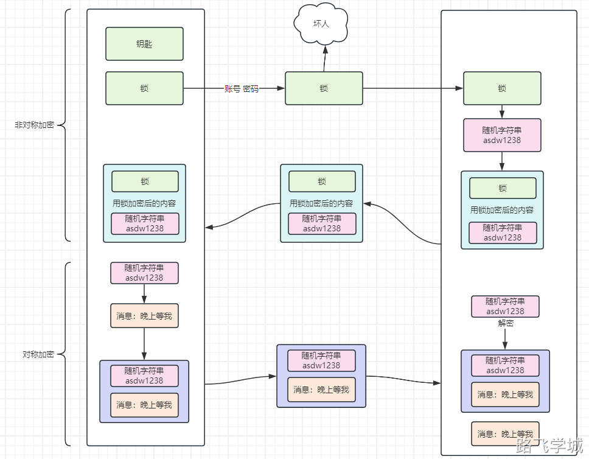

---
tags:
  - ssh
---

- ~ SSH密钥对认证原理

1. **生成密钥对**：

- - 客户端在本地生成一个RSA或ECDSA类型的密钥对。这通常通过运行命令 ssh-keygen 完成。
  - 此过程会产生一个私钥（通常保存在 ~/.ssh/id_rsa）和一个公钥（保存在 ~/.ssh/id_rsa.pub）。

1. **复制公钥到服务器**：

- - 客户端使用 ssh-copy-id 命令或者手动将公钥内容追加到服务器上对应用户的 ~/.ssh/authorized_keys 文件中。
  - 这一步骤使得服务器能够识别并信任客户端的公钥。

1. **客户端发起连接请求**：

- - 客户端尝试通过SSH连接到服务器，发送请求时包含了客户端的用户名。

1. **服务器验证客户端**：

- - 服务器接收到连接请求后，查找 ~/.ssh/authorized_keys 文件中与客户端提供的用户名对应的公钥。

1. **密钥交换与认证**：

- - 服务器生成一个随机数，并使用客户端的公钥对其加密，然后发送给客户端。
  - 客户端用私钥解密这个随机数，并使用这个随机数对会话密钥进行加密并发送回服务器。

1. **客户端响应**：

- - 客户端使用私钥解密服务器发送的数据，处理其中的认证信息。
  - 客户端可能需要使用会话密钥来加密一些响应信息回传给服务器，证明自己能够解密并处理了服务器的挑战。

1. **建立连接**：

- - 一旦服务器验证了客户端的响应正确无误，表明客户端确实持有与授权公钥匹配的私钥，认证成功。
  - 双方随后使用协商好的会话密钥来加密后续的所有通信，确保通信的安全性。

1. **交互式操作**：认证成功后，客户端即可开始与服务器进行安全的交互式操作或执行远程命令。

这个过程确保了即使网络数据被截获，没有私钥的第三方也无法解密通信内容，提高了连接的安全性。

1. 客户端 - 服务端   请求建立ssh远程连接 
2. 服务端 - 客户端   请求确认公钥信息
3. 客户端 - 服务端   确认接收公钥信息，保存到~/.ssh/authorized_keys文件中  
4. 服务端 - 客户端   询问用户密码信息
5. 客户端 - 服务端   用户密码信息
6. 服务端 - 客户端   确认密码信息正确 远程连接建立

1之后：不用反复确认公钥信息

6之后：所有传输的数据信息会进行加密处理
