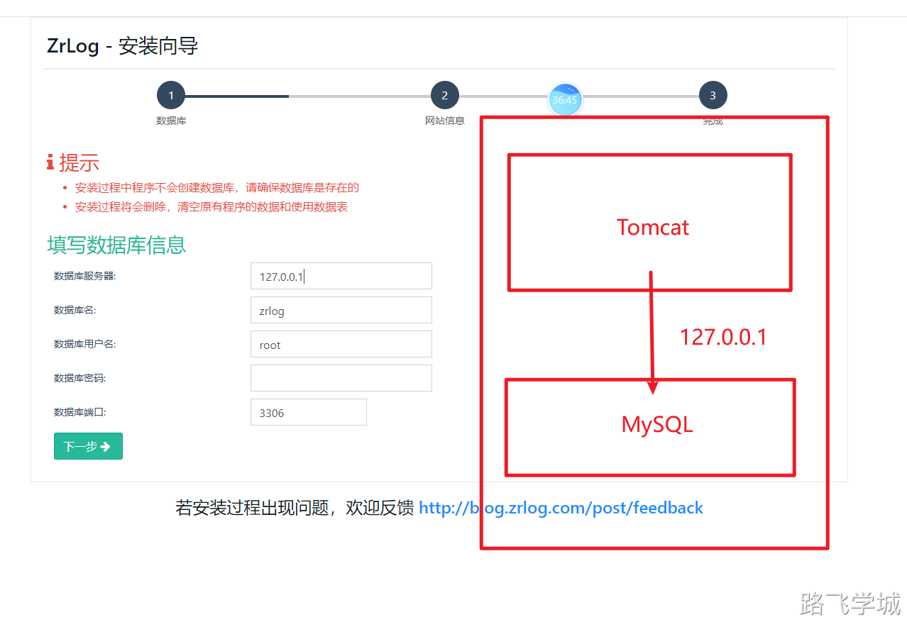
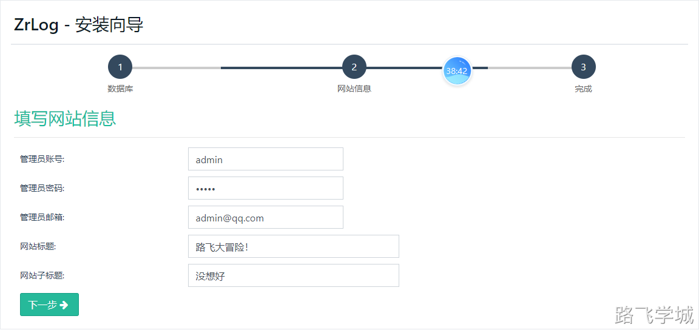
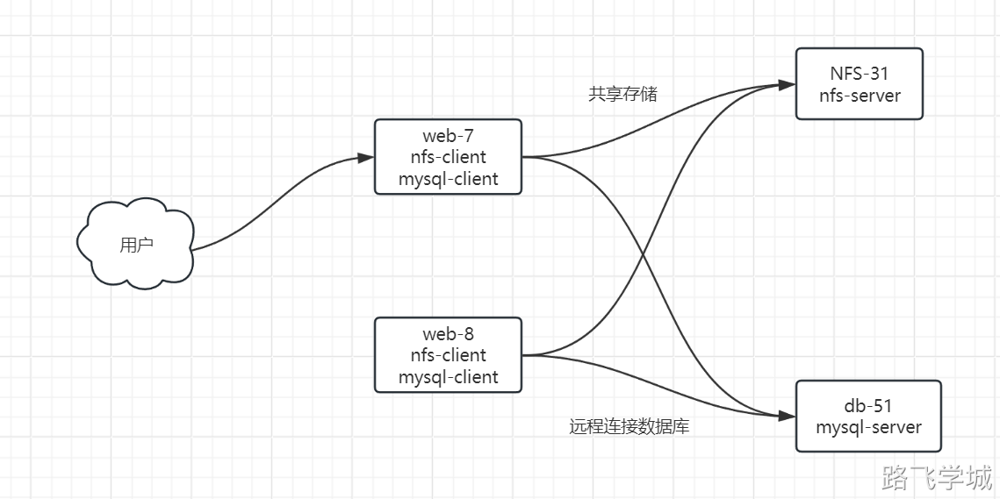

---
tags:
  - Tomcat
---


> [!info]- 什么是Tomcat
> 
> 
> TTomcat 是一款由 Apache 软件基金会开发的开源 Java Web 应用服务器，属于 Jakarta 项目中的一个核心组件。它最初由 Sun Microsystems、Apache 以及其他公司和个人合作开发，旨在提供一个免费、稳定的平台来部署和运行 Java Web 应用程序。以下是 Tomcat 的几个关键特点和功能：
> 
> 1. **支持Java Web标准**：Tomcat 支持最新的 Servlet 和 JavaServer Pages (JSP) 规范，使得开发者能够基于这些技术构建动态网页和Web服务。例如，它支持Servlet 2.4 和 JSP 2.0 规范（具体版本随Tomcat版本更新而不同）。
> 2. **轻量级与高性能**：作为一款轻量级应用服务器，Tomcat 在资源消耗和启动速度上表现优秀，特别适合中小规模的应用场景和开发测试环境。
> 3. **Web 应用管理**：Tomcat 提供了一系列管理工具，允许用户轻松部署、启动、停止、重新加载和卸载 Web 应用程序，这些操作可以通过图形界面或者命令行工具完成。
> 4. **HTTP/HTTPS 协议支持**：它内置了对 HTTP 协议的支持，可以处理客户端的 HTTP 请求和响应，并且支持 HTTPS 加密连接，保障数据传输的安全性。
> 5. **可扩展性与模块化**：Tomcat 具有良好的可扩展性，支持多种插件和扩展模块，可以根据需要添加额外功能，如连接池、SSL 加密、日志记录等。
> 6. **跨平台**：由于 Tomcat 是基于 Java 构建的，因此可以在任何支持 Java 虚拟机（JVM）的操作系统上运行，包括 Windows、Linux、macOS 等。
> 7. **开源与社区支持**：作为开源软件，Tomcat 拥有活跃的开发者社区和丰富的在线资源，用户可以获取技术支持、插件和解决方案。
> 8. **易于部署**：部署 Web 应用非常简单，通常只需要将应用的WAR文件或者应用目录放置到Tomcat的webapps目录下即可自动部署。
> 
> 综上所述，Tomcat 是一个成熟、稳定且广泛使用的 Java Web 应用服务器，特别适合那些寻求高效、低成本解决方案的开发团队和企业。

> [!info]- JVM/JRE/JDK的关系
> 
> 
> 1. **JVM (Java Virtual Machine)**:
> 
> - - **作用**: JVM是Java平台的核心组成部分，它是一个抽象化的计算机，能够执行Java字节码。JVM为Java程序提供了一个跨平台运行的环境，通过将字节码转换为特定操作系统下的机器码来实现“一次编写，到处运行”的特性。
>   - **功能包括**：内存管理、垃圾回收、线程管理以及安全机制等。
> 
> 1. **JRE (Java Runtime Environment)**:
> 
> - - **包含内容**: JRE是运行Java程序所必需的环境集合，它包含了JVM以及Java类库、运行时库等，但不包含开发工具（如编译器）。
>   - **用途**: 如果用户仅需运行Java应用程序，而不需要进行开发工作，安装JRE就足够了。
> 
> 1. **JDK (Java Development Kit)**:
> 
> - - **包含内容**: JDK是面向开发者的完整工具包，它不仅包含了JRE（意味着也包含了JVM和运行时库），还包含了开发工具，比如Java编译器（javac）、打包工具（jar）、调试器（jdb）以及各种其他工具和文档。
>   - **用途**: 开发者使用JDK来编写、编译、调试和执行Java程序。它是进行Java开发的必备环境。
> 
> **三者之间的关系总结**:
> 
> - **层次结构**: JDK > JRE > JVM。JDK是最全面的，包含了开发和运行Java程序所需的一切；JRE专注于运行已编译的Java程序；JVM是底层执行引擎，负责解释执行字节码。
> - **依赖关系**: JDK中包含了JRE，JRE中则包含了JVM。开发人员需要JDK来创建Java应用，最终用户只需JRE来运行这些应用。
> - **实际部署**: 在开发阶段，开发者主要与JDK打交道；应用程序发布后，最终用户计算机上只需安装JRE即可运行该程序。

> [!info]- 什么是LNMP架构
> 
> 
> LNMT 架构是一种流行的网络服务架构，由 Linux, Nginx, MySQL 和 Tomcat 四个主要组件组成。这种架构经常用于部署动态网站和应用程序。下面是这些组件的具体作用和它们如何协同工作：
> 
> >名词解释：
> 
> **Linux**：
> 
> - Linux 是整个架构的操作系统层。它是一个强大的开源操作系统，广泛用于服务器环境，因为它的稳定性、安全性和灵活性。Linux 提供了运行其他三个组件的平台。
> 
> **Nginx**：
> 
> - Nginx 是一个高性能的HTTP和反向代理服务器，也可以作为负载均衡器和HTTP缓存。在 LNMT 架构中，Nginx 通常用来处理客户端的HTTP请求，通过其反向代理功能将请求转发到后端的Tomcat服务器。Nginx 以其高效的资源利用和能够处理大量并发连接而闻名。
> 
> **MySQL**：
> 
> - MySQL 是一个流行的开源关系数据库管理系统，用于存储网站或应用程序的数据。在 LNMT 架构中，MySQL 负责数据存储和查询处理，为应用程序提供数据持久化的支持。
> 
> **Tomcat**：
> 
> - Tomcat 是一个开源的Java Servlet 容器和Web服务器，它能够提供一个运行Java Web应用程序的环境。Tomcat 负责处理应用程序逻辑，执行由客户端（通过Nginx转发）发来的请求，并与 MySQL 数据库交互以获取或存储数据。
> 
> >如何工作：
> 
> **请求处理流程**：
> 
> - 客户端发送HTTP请求到服务器，首先被 Nginx 接收。
> - Nginx 根据配置作为反向代理，将请求转发到 Tomcat 服务器。
> - Tomcat 处理请求，执行必要的业务逻辑，可能会与 MySQL 数据库交互以查询或更新数据。
> - 处理完成后，Tomcat 将响应返回给 Nginx。
> - Nginx 最终将响应结果返回给客户端。
> 
> **性能优化**：
> 
> - Nginx 可以配置为缓存静态资源和优化SSL终端，减轻后端Tomcat的负担。
> - Tomcat 可以优化Java虚拟机和连接池设置，提高处理效率。
> 
> LNMT 架构以其高性能、可靠性和易于扩展的特点，适用于需要处理高并发请求的大型动态Web应用。这种架构也支持高度自定义和优化，可以根据具体需求进行调整。
> 


> [!info]- Tomcat主配置文件Server.xml详解
> 
> 
> 组件结构
> ```xml
> <server>
> 
> ​     <service>
> 
> ​     <connector />
> 
> ​     <engine>
> 
> ​     <host>
> 
> ​     <context></context>
> 
> ​     </host>
> 
> ​     <host>
> 
> ​     <context></context>
> 
> ​     </host>
> 
> ​     </engine>
> 
> ​     </service>
> 
> </server>
> ```
> 
> 配置解释
> 
> ```xml
> <?xml version="1.0" encoding="UTF-8"?>
> <!-- 版权和许可信息 -->
> <!-- 注意：Server元素自身不是Container，因此不能直接定义如Valves之类的子组件 -->
> <Server port="8005" shutdown="SHUTDOWN"> <!-- Tomcat服务器监听的shutdown端口为8005，使用"SHUTDOWN"命令可关闭 -->
>   <!-- 监听器，记录版本信息 -->
>   <Listener className="org.apache.catalina.startup.VersionLoggerListener" />
> 
>   <!-- 安全监听器，用于安全相关的初始化操作，此处被注释掉 -->
>   <!--
>   <Listener className="org.apache.catalina.security.SecurityListener" />
>   -->
> 
>   <!-- APR库加载器，用于启用Apache Portable Runtime，提升性能 -->
>   <Listener className="org.apache.catalina.core.AprLifecycleListener" SSLEngine="on" /> <!-- 开启SSL支持 -->
> 
>   <!-- 防止特定Java/Javax API使用导致的内存泄漏 -->
>   <Listener className="org.apache.catalina.core.JreMemoryLeakPreventionListener" />
> 
>   <!-- 全局资源生命周期监听器 -->
>   <Listener className="org.apache.catalina.mbeans.GlobalResourcesLifecycleListener" />
> 
>   <!-- 防止ThreadLocal变量导致的内存泄漏 -->
>   <Listener className="org.apache.catalina.core.ThreadLocalLeakPreventionListener" />
> 
>   <!-- 全局JNDI资源定义 -->
>   <GlobalNamingResources>
>     <!-- 用户数据库资源，可用于用户认证 -->
>     <Resource name="UserDatabase" auth="Container" 
>       type="org.apache.catalina.UserDatabase"
>       description="可更新和保存的用户数据库"
>       factory="org.apache.catalina.users.MemoryUserDatabaseFactory"
>       pathname="conf/tomcat-users.xml" />
>   </GlobalNamingResources>
> 
>   <!-- Service定义，包含一个或多个共享相同Container的Connectors -->
>   <Service name="Catalina">
> 
>     <!-- 可以定义共享线程池，这里示例被注释 -->
>     <!--
>     <Executor name="tomcatThreadPool" namePrefix="catalina-exec-" maxThreads="150" minSpareThreads="4"/>
>     -->
> 
>     <!-- 非SSL HTTP/1.1连接器，监听8080端口 -->
>     <Connector port="8080" protocol="HTTP/1.1"
>       connectionTimeout="20000" <!-- 连接超时时间 -->
>       redirectPort="8443" <!-- SSL请求重定向端口 -->
>       maxParameterCount="1000" <!-- 最大参数数量 -->
>       />
> 
>       <!-- 示例使用共享线程池的连接器，注释状态 -->
>       <!--
>       <Connector executor="tomcatThreadPool"
>       port="8080" protocol="HTTP/1.1"
>       connectionTimeout="20000"
>       redirectPort="8443"
>       maxParameterCount="1000"
>       />
>       -->
> 
>       <!-- 示例SSL配置，未启用 -->
>       <!--
>       <Connector ... SSL相关配置 ...>
>       <SSLHostConfig>...</SSLHostConfig>
>     </Connector>
>       -->
> 
>       <!-- 示例HTTP/2与SSL配置，同样被注释 -->
>       <!--
>       <Connector ... HTTP/2与SSL相关配置 ...>
>       <UpgradeProtocol className="org.apache.coyote.http2.Http2Protocol" />
>       <SSLHostConfig>...</SSLHostConfig>
>     </Connector>
>       -->
> 
>       <!-- AJP 1.3连接器示例配置，注释状态 -->
>       <!--
>       <Connector protocol="AJP/1.3" address="::1" port="8009" redirectPort="8443" maxParameterCount="1000"/>
>       -->
> 
>       <!-- Engine配置，处理所有请求的入口点 -->
>       <Engine name="Catalina" defaultHost="localhost">
> 
>         <!-- 集群配置示例，未启用 -->
>         <!--
>         <Cluster className="org.apache.catalina.ha.tcp.SimpleTcpCluster"/>
>         -->
> 
>         <!-- 使用LockOutRealm防止密码暴力破解 -->
>         <Realm className="org.apache.catalina.realm.LockOutRealm">
>           <!-- 基于UserDatabaseRealm，使用JNDI资源中的UserDatabase -->
>         <Realm className="org.apache.catalina.realm.UserDatabaseRealm"
>                resourceName="UserDatabase"/>
>       </Realm>
>       
>       <!-- 主机配置，定义了名为localhost的虚拟主机 -->
>       <Host name="localhost" appBase="webapps" 
>             unpackWARs="false" <!-- 是否解压WAR文件 -->
>             autoDeploy="false"> <!-- 是否自动部署 -->
>         
>         <!-- 单点登录配置示例，未启用 -->
>         <!--
>         <Valve className="org.apache.catalina.authenticator.SingleSignOn" />
>         -->
>         
>         <!-- 访问日志配置 -->
>         <Valve className="org.apache.catalina.valves.AccessLogValve" 
>                directory="logs" 
>                prefix="localhost_access_log" 
>                suffix=".txt"
>                pattern="%h %l %u %t &quot;%r&quot; %s %b" /> <!-- 日志格式 -->
>       </Host>
>     </Engine>
>   </Service>
> </Server>
> ```
> 

> [!info]- Tomcat有关MySQL数据库光速入门
> 
> 
> 什么是数据库
> 
> 专门用来存放用户数据的软件，主要存放的是文本信息，而不是文件。例如帐号，密码，余额，订单信息等。
> 
> 一般分为关系型数据库和非关系数据库，其中适用范围最广的关系型数据库就是MySQL。
> 
> 相关概念
> 
> 库
> 
> 表
> 
> 字段
> 
> 主机
> 
> 用户
> 
> 版本选择
> 
> MySQL 5.7
> 
> MySQL 8.0
> 
> 安装部署
> 
> yum安装mariadb
> 
> yum install mariadb-server -y
> 
> systemctl start mariadb
> 
> 二进制安装MySQL
> 
> 0.下载软件
> 
> https://downloads.mysql.com/archives/get/p/23/file/mysql-5.7.28-linux-glibc2.12-x86_64.tar.gz
> 
> 
> 
> 1.解压并创建软链接
> 
> ```shell 
> tar zxvf mysql-5.7.28-linux-glibc2.12-x86_64.tar.gz -C /opt/
> 
> cd /opt/
> 
> mv mysql-5.7.28-linux-glibc2.12-x86_64 mysql-5.7.28
> 
> ln -s mysql-5.7.28 mysql
> ```
> 
> 
> 
> 2.配置环境变量
> 
> ```shell
> echo 'export PATH=$PATH:/opt/mysql/bin' >> /etc/profile
> 
> source /etc/profile
> 
> mysql -V
> ```
> 
> 
> 
> 3.清理历史遗留环境
> 
> ```shell
> rpm -qa|grep mariadb
> 
> yum remove mariadb-libs -y
> 
> rm -rf /etc/my.cnf
> ```
> 
> 
> 
> 4.安装mysql依赖包
> ```shell
> yum install -y libaio-devel
> ```
> 
> 
> 
> 5.创建mysql普通用户并授权
> 
> ```shell
> groupadd -g 2000 mysql
> 
> useradd -u 2000 -g 2000 -s /sbin/nologin -M mysql
> 
> mkdir -p /data/mysql_3306/
> 
> chown -R mysql.mysql /data/
> 
> chown -R mysql.mysql /opt/mysql*
> 
> ```
> 
> 
> 6.初始化数据库(不用记)
> 
> ```shell
> mysqld --initialize-insecure \
> --user=mysql \
> --basedir=/opt/mysql \
> --datadir=/data/mysql_3306/
> ```
> 
> 
> 
> 7.编辑mysql配置文件
> 
> ```shell
> cat> /etc/my.cnf <<EOF
> 
> [mysqld]
> 
> port=3306
> 
> user=mysql
> 
> basedir=/opt/mysql
> 
> datadir=/data/mysql_3306
> 
> EOF
> ```
> 
> 
> 
> 8.准备启动脚本并启动数据库
> 
> ```shell
> cp /opt/mysql/support-files/mysql.server  /etc/init.d/mysqld
> 
> chkconfig --add mysqld
> 
> systemctl start mysqld
> 
> netstat -lntup|grep 3306
> 
> ```
> 
> 
> 9.登录测试
> 
> mysql
> 
> 连接数据库
> 
> 连接本机
> 
> mysql -uroot -p123
> 
> 连接远程服务器
> 
> mysql -uroot -p123 -h 10.0.0.51
> 
> 用户管理
> 
> 修改初始root密码
> 
> mysqladmin password
> 
> 创建远程用户
> 
> grant all privileges on 库.表 to '用户名'@'10.0.0.%' identified by '密码';
> 
> grant all privileges on *.* to 'abc'@'%' identified by '123';
> 
> 查看当前用户
> 
> select user,host from mysql.user;
> 
> 数据库和表管理
> 
> 查看所有数据库
> 
> show databases;
> 
> 创建数据库
> 
> create database abc;
> 
> 切换数据库
> 
> use abc;
> show tables;
> 
> 查看某个库下的表
> 
> use abc;
> show tables;
> 
> 或者
> 
> show tables from abc;
> 
> 查看数据内容
> 
> use 库名;
> 
> select * from 表名;
> 

> [!info]- Tomcat部署网站
> 
> 
> Zrlog介绍
> 
> 准备数据库环境
> 
> 创建root密码
> 
> 创建数据库
> 
> 部署zrlog代码
> 
> 检查服务是否启动
> 
> 浏览器访问测试
> 
> 
> 
> 
> 
> Tomcat高可用架构
> 
> 
> 
> Nginx+Tomcat实现动静分离
> 
> ```shell
> http {
> 
> ​    \# 其他全局配置...
> 
> 
> 
> ​    server {
> 
> ​        listen 80;
> 
> ​        server_name example.com;
> 
> 
> 
> ​        \# 静态资源处理
> 
> ​        location ~* \.(gif|jpg|jpeg|png|bmp|swf|css|js)$ {
> 
> ​            root /path/to/your/static/files;
> 
> ​            expires 30d;      # 设置浏览器缓存30天
> 
> ​            access_log off;  # 关闭访问日志记录  
> 
> ​        }
> 
> 
> 
> ​        \# 动态请求转发
> 
> ​        location / {
> 
> ​            proxy_pass  http://localhost:8080; 
> 
> ​            proxy_set_header Host $host;
> 
> ​            proxy_set_header X-Real-IP $remote_addr;
> 
> ​            proxy_set_header X-Forwarded-For $proxy_add_x_forwarded_for;
> 
> ​        }
> 
> ​    }
> 
> }
> 
> ```
> 

> [!info]- Tomcat安全及优化
> 
> 
> 1. **JVM调优**：
> 
> - - 分配适当的堆内存，通常设置 **-Xms** 和 **-Xmx** 为相同的值，以避免运行时动态扩展。
>   - 使用并行垃圾回收器，例如 **-XX:+UseParallelGC**。
> 
> 1. **连接器优化**：
> 
> - - 针对 **Connector** 标签的 **maxThreads** 和 **acceptCount** 属性进行调整，以处理并发请求。
>   - 使用NIO或NIO2连接器，以提高非阻塞操作的效率。
> 
> 1. **会话管理**：
> 
> - - 减少会话超时时间，以便更快释放资源。
>   - 对于不需要会话的应用，关闭会话管理。
> 
> 1. **静态资源优化**：
> 
> - - 启用静态资源的压缩，设置 **compression="on"**。
>   - 使用CDN或其他缓存策略优化内容的分发。
> 
> 1. **应用部署**：
> 
> - - 避免在同一Tomcat实例上部署过多应用。
>   - 使用并行部署特性减少停机时间。
> 


