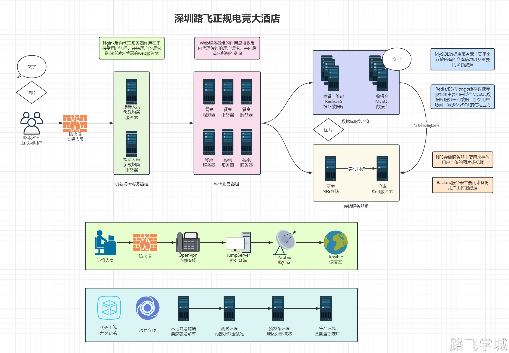

# 1.中小规模网站架构组成

1) 顾客--用户

​    访问网站的人员

2) 保安--防火墙 (iptables)

​    进行访问策略控制

3) 迎宾服务员--负载均衡服务器  (nginx) ^9fa939

​    对用户的访问请求进行调度处理

4) 点餐服务员---web服务器    (nginx)

​    处理用户的请求

5) 结账前台---数据库服务器   (mysql)

​    存储的字符数据 

6) 厨师---存储服务器     (nfs)

​    存储图片 音频 视频 附件等数据信息

7) 食材仓库---备份服务器    (rsync+crond-定时备份 rsync+lsyncd--实时备份)

​    存储网站所有服务器的重要数据

8) 自助点菜系统---缓存服务器     (redis elasticsearch mongodb) 

​    a 将数据信息存储到内存中 

​    b 减缓服务器的压力      

9) 调度总台---批量管理服务器 (ansible)

​    批量管理多台服务器主机

# 2.主机名称和IP地址规划

服务器作用      主机名            外网地址      内网地址         运行软件

 管理服务器      m-61           10.0.0.61    172.16.1.61    Ansible/zabbix/jumpserver/openvpn
 反向代理服务器  lb-5             10.0.0.5    172.16.1.5      nginx/keepalived
 反向代理服务器  lb-6             10.0.0.6    172.16.1.6      nginx/keepalived
 web服务器      web-7             10.0.0.7    172.16.1.7      nginx/tomcat
 web服务器      web-8             10.0.0.8    172.16.1.8      nginx/tomcat
 存储服务器     nfs-31            10.0.0.31    172.16.1.31    nfs/rsyncd/lsyncd
 备份服务器     backup-41         10.0.0.41    172.16.1.41    nfs/rsyncd/lsyncd
 数据库服务器   db-51             10.0.0.51    172.16.1.51    mysql/redis
